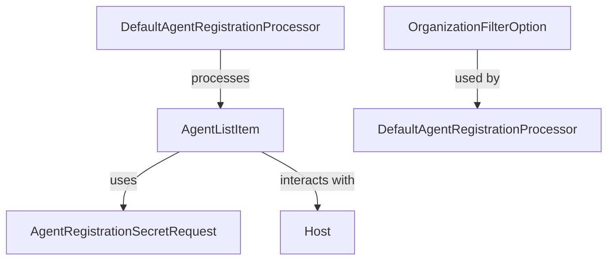

# Module 5 Documentation

## Introduction
Module 5 is responsible for managing agent-related functionalities within the Tactical RMM and Fleet MDM systems. It provides models for agent registration and host management, facilitating communication between the client and server components of the system.

## Architecture Overview

### Core Components
1. **AgentListItem**: Represents an item in the agent list, containing details such as ID, agent ID, hostname, site, and client. See [AgentListItem Documentation](AgentListItem.md).
2. **AgentRegistrationSecretRequest**: Contains the parameters required for agent registration, including installation method, client, site, and various configuration options. See [AgentRegistrationSecretRequest Documentation](./AgentRegistrationSecretRequest.md).
3. **Host**: Represents a host in the Fleet MDM system, encapsulating various attributes related to the host's status and configuration. See [Host Documentation](./Host.md).
4. **OrganizationFilterOption**: Represents an organization filter option used in audit logs. See [OrganizationFilterOption Documentation](./OrganizationFilterOption.md).
5. **DefaultAgentRegistrationProcessor**: The default implementation for processing agent registrations, providing a no-op method that can be overridden. See [DefaultAgentRegistrationProcessor Documentation](./DefaultAgentRegistrationProcessor.md).

## High-Level Functionality
- **Agent Management**: Handles the listing and registration of agents through the `AgentListItem` and `AgentRegistrationSecretRequest` models.
- **Host Management**: Manages host information and status through the `Host` model.
- **Audit Filtering**: Provides filtering options for organizations in audit logs using the `OrganizationFilterOption` model.
- **Agent Registration Processing**: Implements the default behavior for agent registration processing through `DefaultAgentRegistrationProcessor`.