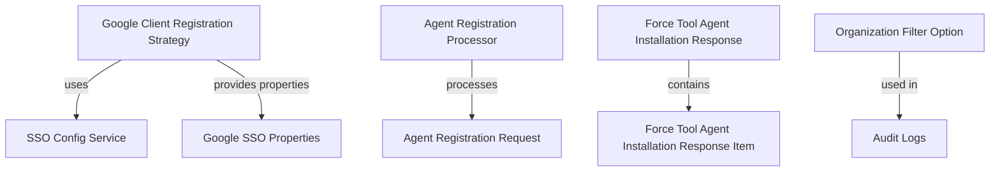

# Module 5 Documentation

## Introduction
Module 5 is responsible for handling agent registration and authorization strategies within the system. It integrates with various components to facilitate the registration of agents and manage their associated configurations.

## Architecture Overview

## High-Level Functionality
- **GoogleClientRegistrationStrategy**: Implements the OIDC client registration strategy for Google, providing necessary properties and configurations. See [GoogleClientRegistrationStrategy](openframe-authorization-service-core/src.main.java.com.openframe.authz.service.auth.strategy.GoogleClientRegistrationStrategy.GoogleClientRegistrationStrategy.md).
- **CountedGenericQueryResult**: Extends the generic query result to include a filtered count, useful for paginated responses. See [CountedGenericQueryResult](openframe-api-lib/src.main.java.com.openframe.api.dto.CountedGenericQueryResult.CountedGenericQueryResult.md).
- **AgentRegistrationProcessor**: Interface for processing agent registrations, allowing for post-processing hooks. See [AgentRegistrationProcessor](openframe-client-core/src.main.java.com.openframe.client.service.agentregistration.processor.AgentRegistrationProcessor.AgentRegistrationProcessor.md).
- **ForceToolAgentInstallationResponse**: Represents the response structure for force tool agent installations, containing a list of items. See [ForceToolAgentInstallationResponse](openframe-api-service-core/src.main.java.com.openframe.api.dto.force.response.ForceToolAgentInstallationResponse.ForceToolAgentInstallationResponse.md).
- **OrganizationFilterOption**: Represents filter options for organizations, used in audit logs. See [OrganizationFilterOption](openframe-api-lib/src.main.java.com.openframe.api.dto.audit.OrganizationFilterOption.OrganizationFilterOption.md).
