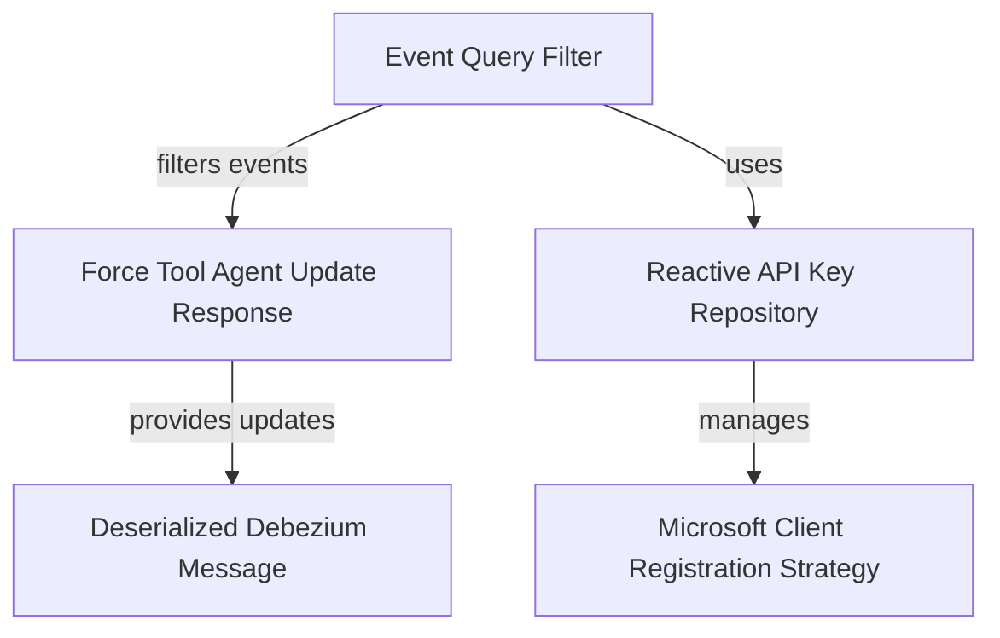

# Module 6 Documentation

## Introduction
Module 6 is responsible for handling various functionalities related to event filtering, client registration strategies, and reactive API key management. It integrates with other modules to provide a cohesive service for managing events and user authentication.

## Architecture Overview

## High-Level Functionality
- **Event Query Filter**: Defined in [EventQueryFilter.md](EventQueryFilter.md), this component allows filtering events based on user IDs, event types, and date ranges.
- **Microsoft Client Registration Strategy**: Implemented in [MicrosoftClientRegistrationStrategy.md](MicrosoftClientRegistrationStrategy.md), this component manages the registration of Microsoft clients for authentication.
- **Reactive API Key Repository**: Found in [ReactiveApiKeyRepository.md](ReactiveApiKeyRepository.md), this repository handles the storage and retrieval of API keys in a reactive manner.
- **Force Tool Agent Update Response**: This component, located in [ForceToolAgentUpdateResponse.md](ForceToolAgentUpdateResponse.md), encapsulates the response structure for tool agent updates.
- **Deserialized Debezium Message**: Defined in [DeserializedDebeziumMessage.md](DeserializedDebeziumMessage.md), this component represents messages deserialized from Debezium events.
- **Event Query Filter**: Defined in [EventQueryFilter.java](openframe-data-mongo/src/main/java/com/openframe/data/document/event/filter/EventQueryFilter.java), this component allows filtering events based on user IDs, event types, and date ranges.
- **Microsoft Client Registration Strategy**: Implemented in [MicrosoftClientRegistrationStrategy.java](openframe-authorization-service-core/src/main/java/com/openframe/authz/service/auth/strategy/MicrosoftClientRegistrationStrategy.java), this component manages the registration of Microsoft clients for authentication.
- **Reactive API Key Repository**: Found in [ReactiveApiKeyRepository.java](openframe-data-mongo/src/main/java/com/openframe/data/reactive/repository/apikey/ReactiveApiKeyRepository.java), this repository handles the storage and retrieval of API keys in a reactive manner.
- **Force Tool Agent Update Response**: This component, located in [ForceToolAgentUpdateResponse.java](openframe-api-service-core/src/main/java/com/openframe/api/dto/force/response/ForceToolAgentUpdateResponse.java), encapsulates the response structure for tool agent updates.
- **Deserialized Debezium Message**: Defined in [DeserializedDebeziumMessage.java](openframe-stream-service-core/src/main/java/com/openframe/stream/model/fleet/debezium/DeserializedDebeziumMessage.java), this component represents messages deserialized from Debezium events.

## Conclusion
Module 6 plays a crucial role in the overall system by providing essential functionalities for event management and client registration. For more details on each component, please refer to their respective documentation.