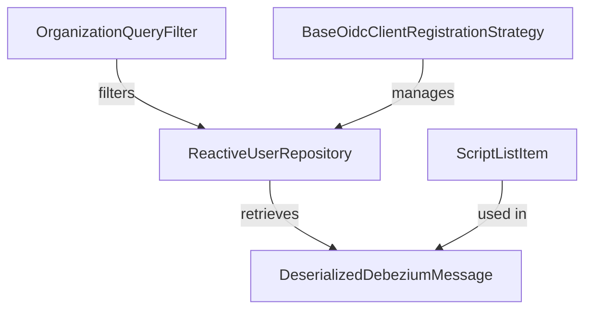

### References to Other Modules
- For more information on user management, see [Module 5](module_5.md).
- For details on event processing, refer to [Module 3](module_3.md).
- For organization filtering, check [Module 1](module_1.md).
- For OIDC client registration strategies, see [Module 4](module_4.md).
# Module 6 Documentation

## Introduction
Module 6 is designed to handle various functionalities related to user management, organization filtering, and event processing within the system. It integrates with MongoDB for data storage and utilizes reactive programming principles to enhance performance and scalability.

## Architecture Overview
The architecture of Module 6 consists of several core components that interact with each other to provide the necessary functionalities. Below is a diagram illustrating the relationships between the components:

## Core Components
### 1. OrganizationQueryFilter
- **Path**: `openframe-data-mongo/src/main/java/com/openframe/data/document/organization/filter/OrganizationQueryFilter.java`
- **Functionality**: This component defines the filter criteria for organization queries, allowing for the construction of MongoDB queries with specific filtering options.

### 2. DeserializedDebeziumMessage
- **Path**: `openframe-stream-service-core/src/main/java/com/openframe/stream/model/fleet/debezium/DeserializedDebeziumMessage.java`
- **Functionality**: Represents a deserialized message from Debezium, containing various fields related to events and tools.

### 3. ReactiveUserRepository
- **Path**: `openframe-data-mongo/src/main/java/com/openframe/data/reactive/repository/user/ReactiveUserRepository.java`
- **Functionality**: A reactive repository for managing user data, providing methods to find users by email and check their existence.

### 4. BaseOidcClientRegistrationStrategy
- **Path**: `openframe-authorization-service-core/src/main/java/com/openframe/authz/service/auth/strategy/BaseOidcClientRegistrationStrategy.java`
- **Functionality**: Abstract class for managing OIDC client registration strategies, providing a method to build client registrations based on tenant configurations.

### 5. ScriptListItem
- **Path**: `sdk/tacticalrmm/src/main/java/com/openframe/sdk/tacticalrmm/model/ScriptListItem.java`
- **Functionality**: Represents a script item in the Tactical RMM API responses, containing an ID and name for each script.

## Conclusion
Module 6 plays a crucial role in the overall system by providing essential functionalities for user management and event processing. For more detailed information on each component, please refer to their respective documentation files.