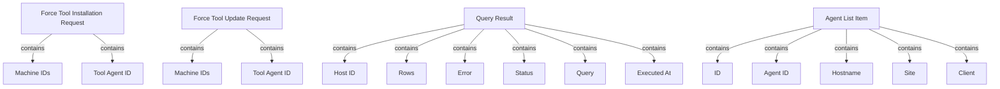

# Module 6 Documentation

## Introduction
Module 6 is responsible for handling requests related to tool installations and updates within the Fleet Management and Tactical RMM systems. It provides the necessary data structures to facilitate these operations, ensuring that the correct tools are installed or updated on specified machines.

## Architecture Overview

## High-Level Functionality of Sub-Modules
- **ForceToolInstallationRequest**: This component encapsulates the data required to request the installation of a tool on specified machines. It includes a list of machine IDs and the tool agent ID.
  - [ForceToolInstallationRequest Documentation](openframe-api-service-core/src/main/java/com/openframe/api/dto/force/request/ForceToolInstallationRequest.java)

- **ForceToolUpdateRequest**: Similar to the installation request, this component is used to request updates for tools on specified machines, containing the same fields as the installation request.
  - [ForceToolUpdateRequest Documentation](openframe-api-service-core/src/main/java/com/openframe/api/dto/force/request/ForceToolUpdateRequest.java)

- **QueryResult**: This component represents the result of a query executed via the Fleet MDM system. It includes details such as the host ID, rows returned, any errors, and the status of the query.
  - [QueryResult Documentation](sdk/fleetmdm/src/main/java/com/openframe/sdk/fleetmdm/model/QueryResult.java)

- **AgentListItem**: This component models an agent item in the Tactical RMM API responses, providing details such as agent ID, hostname, site, and client information.
  - [AgentListItem Documentation](sdk/tacticalrmm/src/main/java/com/openframe/sdk/tacticalrmm/model/AgentListItem.java)

## Conclusion
Module 6 plays a crucial role in managing tool installations and updates, leveraging the defined data structures to facilitate communication between the client and server components of the Fleet Management and Tactical RMM systems.