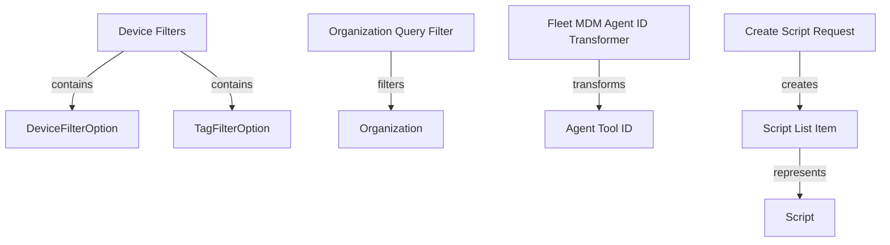

# Module 7 Documentation
## Sub-module Documentation

### DeviceFilters
- **Location**: [openframe-api-lib/src/main/java/com/openframe/api/dto/device/DeviceFilters.java](openframe-api-lib/src.main.java.com.openframe.api.dto.device.DeviceFilters.DeviceFilters)
- **Description**: This class encapsulates various filters for devices, including statuses, types, OS types, organization IDs, and tags. It also maintains a count of filtered results.

### OrganizationQueryFilter
- **Location**: [openframe-data-mongo/src/main/java/com/openframe/data/document/organization/filter/OrganizationQueryFilter.java](openframe-data-mongo.src.main.java.com.openframe.data.document.organization.filter.OrganizationQueryFilter.OrganizationQueryFilter)
- **Description**: This class defines the criteria for querying organizations, including category, employee count, and contract status.

### FleetMdmAgentIdTransformer
- **Location**: [openframe-client-core/src/main/java/com/openframe/client/service/agentregistration/transformer/FleetMdmAgentIdTransformer.java](openframe-client-core.src.main.java.com.openframe.client.service.agentregistration.transformer.FleetMdmAgentIdTransformer.FleetMdmAgentIdTransformer)
- **Description**: This transformer is responsible for converting agent tool IDs into a format suitable for Fleet MDM, handling the retrieval of host information and logging.

### ScriptListItem
- **Location**: [sdk/tacticalrmm/src/main/java/com/openframe/sdk/tacticalrmm/model/ScriptListItem.java](sdk.tacticalrmm.src.main.java.com.openframe.sdk.tacticalrmm.model.ScriptListItem.ScriptListItem)
- **Description**: Represents a script item in the Tactical RMM API, containing an ID and name.

### CreateScriptRequest
- **Location**: [sdk/tacticalrmm/src/main/java/com/openframe/sdk/tacticalrmm/model/CreateScriptRequest.java](sdk.tacticalrmm.src.main.java.com.openframe.sdk.tacticalrmm.model.CreateScriptRequest.CreateScriptRequest)
- **Description**: This class is used to create new scripts in Tactical RMM, encapsulating all necessary parameters such as name, shell, arguments, and environment variables.

## Introduction
Module 7 is designed to handle various functionalities related to device and organization filtering, as well as agent registration transformations. It provides a structured way to manage device filters, organization queries, and script management for Tactical RMM.

## Architecture Overview

## High-Level Functionality
### 1. DeviceFilters
- **Location**: [openframe-api-lib/src/main/java/com/openframe/api/dto/device/DeviceFilters.java](openframe-api-lib/src.main.java.com.openframe.api.dto.device.DeviceFilters.DeviceFilters)
- **Description**: This class encapsulates various filters for devices, including statuses, types, OS types, organization IDs, and tags. It also maintains a count of filtered results.

### 2. OrganizationQueryFilter
- **Location**: [openframe-data-mongo/src/main/java/com/openframe/data/document/organization/filter/OrganizationQueryFilter.java](openframe-data-mongo.src.main.java.com.openframe.data.document.organization.filter.OrganizationQueryFilter.OrganizationQueryFilter)
- **Description**: This class defines the criteria for querying organizations, including category, employee count, and contract status.

### 3. FleetMdmAgentIdTransformer
- **Location**: [openframe-client-core/src/main/java/com/openframe/client/service/agentregistration/transformer/FleetMdmAgentIdTransformer.java](openframe-client-core.src.main.java.com.openframe.client.service.agentregistration.transformer.FleetMdmAgentIdTransformer.FleetMdmAgentIdTransformer)
- **Description**: This transformer is responsible for converting agent tool IDs into a format suitable for Fleet MDM, handling the retrieval of host information and logging.

### 4. ScriptListItem
- **Location**: [sdk/tacticalrmm/src/main/java/com/openframe/sdk/tacticalrmm/model/ScriptListItem.java](sdk.tacticalrmm.src.main.java.com.openframe.sdk.tacticalrmm.model.ScriptListItem.ScriptListItem)
- **Description**: Represents a script item in the Tactical RMM API, containing an ID and name.

### 5. CreateScriptRequest
- **Location**: [sdk/tacticalrmm/src/main/java/com/openframe/sdk/tacticalrmm/model/CreateScriptRequest.java](sdk.tacticalrmm.src.main.java.com.openframe.sdk.tacticalrmm.model.CreateScriptRequest.CreateScriptRequest)
- **Description**: This class is used to create new scripts in Tactical RMM, encapsulating all necessary parameters such as name, shell, arguments, and environment variables.

## Conclusion
Module 7 integrates various components to facilitate device management, organization filtering, and script handling in the Tactical RMM ecosystem. For further details, refer to the respective module documentation.