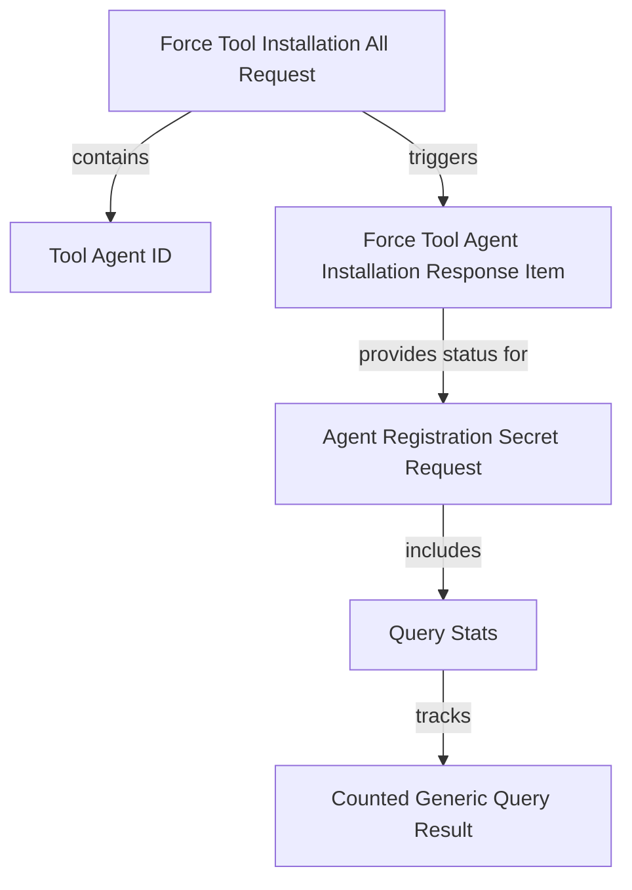

# Module 7 Documentation

## Introduction
Module 7 is responsible for handling various requests and responses related to tool installations and agent registrations within the system. It provides a structured way to manage the installation of tools across different agents and platforms.

## Architecture Overview

## High-Level Functionality
- **CountedGenericQueryResult**: Extends the GenericQueryResult to include a filtered count of results. See [CountedGenericQueryResult](CountedGenericQueryResult.md).
- **ForceToolAgentInstallationResponseItem**: Represents the response item for tool agent installations, including machine ID and installation status. See [ForceToolAgentInstallationResponseItem](ForceToolAgentInstallationResponseItem.md).
- **ForceToolInstallationAllRequest**: Represents a request to install a tool across all agents identified by the tool agent ID. See [ForceToolInstallationAllRequest](ForceToolInstallationAllRequest.md).
- **AgentRegistrationSecretRequest**: Contains details for agent registration, including installation method and client information. See [AgentRegistrationSecretRequest](AgentRegistrationSecretRequest.md).
- **QueryStats**: Represents statistics related to queries in the Fleet MDM context. See [Query](sdk/fleetmdm/src/main/java/com/openframe/sdk/fleetmdm/model/Query.md).

## Conclusion
Module 7 plays a crucial role in managing tool installations and agent registrations, ensuring that the system can effectively deploy and manage tools across various agents.