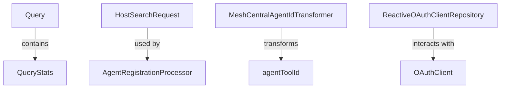

# Module 7 Documentation

## Introduction
Module 7 is a part of the OpenFrame system, focusing on agent registration and management within the Fleet MDM (Mobile Device Management) framework. It provides functionalities for querying hosts, transforming agent IDs, and processing agent registrations.

## Architecture Overview
The architecture of Module 7 consists of several core components that interact with each other to provide the necessary functionalities. Below is a diagram illustrating the relationships between the components:

## Core Components
### 1. Query
- **Documentation**: [Query Documentation](./Query.md)
- **Location**: `sdk.fleetmdm.src.main.java.com.openframe.sdk.fleetmdm.model.Query`
- **Description**: Represents a saved or scheduled query in the Fleet MDM system. It includes metadata such as creation date, author information, and query statistics. For more details, refer to [Query Documentation](./Query.md).

### 2. QueryStats
- **Documentation**: [QueryStats Documentation](./QueryStats.md)
- **Location**: Nested within `Query`
- **Description**: Contains statistical data related to the execution of the query, such as execution times and total executions. For more details, refer to [QueryStats Documentation](./QueryStats.md).

### 3. HostSearchRequest
- **Documentation**: [HostSearchRequest Documentation](./HostSearchRequest.md)
- **Location**: `sdk.fleetmdm.src.main.java.com.openframe.sdk.fleetmdm.model.HostSearchRequest`
- **Description**: Represents the parameters for searching hosts within the Fleet MDM system. It includes fields for pagination and sorting. For more details, refer to [HostSearchRequest Documentation](./HostSearchRequest.md).

### 4. MeshCentralAgentIdTransformer
- **Documentation**: [MeshCentralAgentIdTransformer Documentation](./MeshCentralAgentIdTransformer.md)
- **Location**: `openframe-client-core.src.main.java.com.openframe.client.service.agentregistration.transformer.MeshCentralAgentIdTransformer`
- **Description**: Transforms agent tool IDs for MeshCentral, ensuring they are formatted correctly for processing. For more details, refer to [MeshCentralAgentIdTransformer Documentation](./MeshCentralAgentIdTransformer.md).

### 5. AgentRegistrationProcessor
- **Documentation**: [AgentRegistrationProcessor Documentation](./AgentRegistrationProcessor.md)
- **Location**: `openframe-client-core.src.main.java.com.openframe.client.service.agentregistration.processor.AgentRegistrationProcessor`
- **Description**: Interface for processing agent registrations, allowing for post-processing hooks. For more details, refer to [AgentRegistrationProcessor Documentation](./AgentRegistrationProcessor.md).

### 6. ReactiveOAuthClientRepository
- **Documentation**: [ReactiveOAuthClientRepository Documentation](./ReactiveOAuthClientRepository.md)
- **Location**: `openframe-data-mongo.src.main.java.com.openframe.data.reactive.repository.oauth.ReactiveOAuthClientRepository`
- **Description**: Reactive repository for managing OAuth clients in a MongoDB database. For more details, refer to [ReactiveOAuthClientRepository Documentation](./ReactiveOAuthClientRepository.md).

## Conclusion
Module 7 plays a crucial role in the OpenFrame system by managing agent registrations and queries. It interacts with various components across the system to ensure seamless operations.