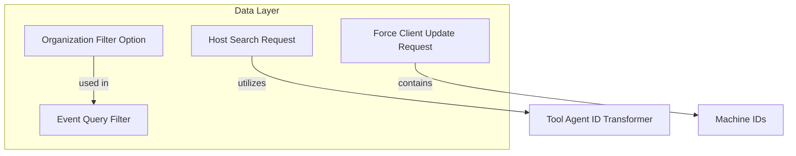

# Module 8 Documentation

## Introduction
Module 8 is responsible for handling various operations related to organization filtering and host search requests. It provides the necessary data structures and interfaces to facilitate these operations within the larger system.

## Architecture Overview

## High-Level Functionality
### 1. Organization Filter Option
- **Documentation**: [OrganizationFilterOption](OrganizationFilterOption.md)
- **Component**: [OrganizationFilterOption](openframe-api-lib/src/main/java/com/openframe/api/dto/audit/OrganizationFilterOption.java)
- **Functionality**: Represents an organization filter option with ID and name, used for organization dropdown in log filters.

### 2. Host Search Request
- **Documentation**: [HostSearchRequest](HostSearchRequest.md)
- **Component**: [HostSearchRequest](sdk/fleetmdm/src/main/java/com/openframe/sdk/fleetmdm/model/HostSearchRequest.java)
- **Functionality**: Contains parameters for searching hosts, including query, pagination, and ordering options.

### 3. Event Query Filter
- **Documentation**: [EventQueryFilter](EventQueryFilter.md)
- **Component**: [EventQueryFilter](openframe-data-mongo/src/main/java/com/openframe/data/document/event/filter/EventQueryFilter.java)
- **Functionality**: Provides filtering options for events based on user IDs, event types, and date range.

### 4. Tool Agent ID Transformer
- **Documentation**: [ToolAgentIdTransformer](ToolAgentIdTransformer.md)
- **Component**: [ToolAgentIdTransformer](openframe-client-core/src/main/java/com/openframe/client/service/agentregistration/transformer/ToolAgentIdTransformer.java)
- **Functionality**: Interface for transforming agent tool IDs into a specific format based on the tool type.

### 5. Force Client Update Request
- **Documentation**: [ForceClientUpdateRequest](ForceClientUpdateRequest.md)
- **Component**: [ForceClientUpdateRequest](openframe-api-service-core/src/main/java/com/openframe/api/dto/force/request/ForceClientUpdateRequest.java)
- **Functionality**: Represents a request to update clients based on a list of machine IDs.

## Conclusion
Module 8 plays a crucial role in managing organization filters and host search functionalities, integrating seamlessly with other modules in the system.