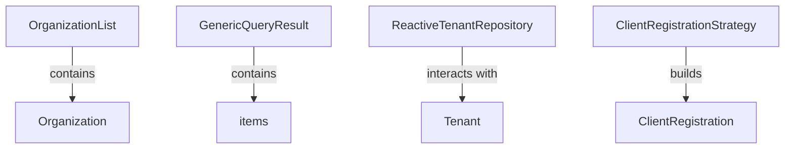

# Module 8 Documentation

## Introduction
Module 8 is responsible for managing organization-related data and operations within the system. It provides data transfer objects (DTOs) for organization lists and handles tenant-related operations through reactive repositories.

## Architecture Overview

## Core Components

- [OrganizationList Documentation](OrganizationList.md)
- [GenericQueryResult Documentation](GenericQueryResult.md)
- [ReactiveTenantRepository Documentation](ReactiveTenantRepository.md)
- [ClientRegistrationStrategy Documentation](ClientRegistrationStrategy.md)
- [ForceToolInstallationRequest Documentation](ForceToolInstallationRequest.md)
### 1. OrganizationList
- **Location**: [openframe-api-lib/src/main/java/com/openframe/api/dto/organization/OrganizationList.java](openframe-api-lib/src/main/java/com/openframe/api/dto/organization/OrganizationList.java)
- **Functionality**: This DTO represents a list of organizations and is used to encapsulate the response for organization-related queries.

### 2. GenericQueryResult
- **Location**: [openframe-api-lib/src/main/java/com/openframe/api/dto/GenericQueryResult.java](openframe-api-lib/src/main/java/com/openframe/api/dto/GenericQueryResult.java)
- **Functionality**: A generic DTO that encapsulates a list of items along with pagination information, allowing for flexible querying of various data types.

### 3. ReactiveTenantRepository
- **Location**: [openframe-data-mongo/src/main/java/com/openframe/data/reactive/repository/tenant/ReactiveTenantRepository.java](openframe-data-mongo/src/main/java/com/openframe/data/reactive/repository/tenant/ReactiveTenantRepository.java)
- **Functionality**: This repository provides reactive access to tenant data, allowing for asynchronous operations on tenant entities.

### 4. ClientRegistrationStrategy
- **Location**: [openframe-authorization-service-core/src/main/java/com/openframe/authz/service/auth/strategy/ClientRegistrationStrategy.java](openframe-authorization-service-core/src/main/java/com/openframe/authz/service/auth/strategy/ClientRegistrationStrategy.java)
- **Functionality**: An interface that defines the strategy for client registration, allowing for different implementations based on the provider.

### 5. ForceToolInstallationRequest
- **Location**: [openframe-api-service-core/src/main/java/com/openframe/api/dto/force/request/ForceToolInstallationRequest.java](openframe-api-service-core/src/main/java/com/openframe/api/dto/force/request/ForceToolInstallationRequest.java)
- **Functionality**: This DTO is used to encapsulate requests for installing tools on specified machines.

## Conclusion
Module 8 plays a crucial role in managing organization and tenant data, providing essential DTOs and reactive repository interfaces that facilitate efficient data handling and operations.