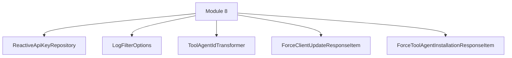

# Module 8 Documentation

## Introduction
Module 8 is responsible for managing API keys, logging filter options, and transforming tool agent IDs within the system. It provides reactive repositories for API key management and defines data transfer objects for logging and tool agent transformations.

## Architecture Overview

### Core Components
1. **ReactiveApiKeyRepository**: This component is a reactive MongoDB repository for managing API keys. It extends the base repository and provides methods to find API keys by user ID and to find expired keys.
   - [Documentation](openframe-data-mongo/src/main/java/com/openframe/data/reactive/repository/apikey/ReactiveApiKeyRepository.java)

2. **LogFilterOptions**: This class defines the options for filtering logs based on various criteria such as date range, event types, and severities.
   - [Documentation](openframe-api-lib/src/main/java/com/openframe/api/dto/audit/LogFilterOptions.java)

3. **ToolAgentIdTransformer**: An interface for transforming tool agent IDs, providing a method to get the tool type and transform the agent tool ID.
   - [Documentation](openframe-client-core/src/main/java/com/openframe/client/service/agentregistration/transformer/ToolAgentIdTransformer.java)

4. **ForceClientUpdateResponseItem**: A data transfer object representing the response item for client updates, containing the machine ID and status.
   - [Documentation](openframe-api-service-core/src/main/java/com/openframe/api/dto/force/response/ForceClientUpdateResponseItem.java)

5. **ForceToolAgentInstallationResponseItem**: A data transfer object representing the response item for tool agent installations, including the machine ID, tool agent ID, and status.
   - [Documentation](openframe-api-service-core/src/main/java/com/openframe/api/dto/force/response/ForceToolAgentInstallationResponseItem.java)

## Conclusion
Module 8 plays a crucial role in the overall system by providing essential functionalities for API key management, logging, and tool agent transformations. For more details on the interactions and dependencies with other modules, refer to their respective documentation.