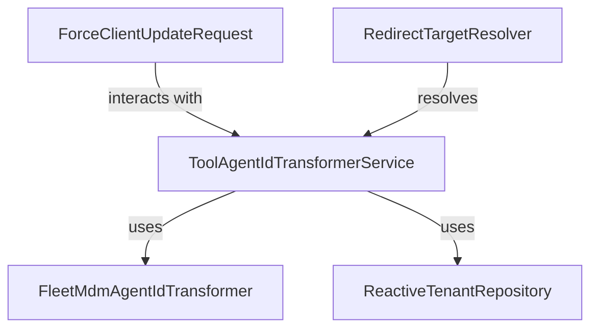

# Module 9 Documentation

## Introduction
Module 9 is responsible for managing agent registration transformations and handling client update requests within the system. It integrates various components to facilitate the transformation of agent IDs and the resolution of redirect targets for OAuth services.

## Architecture Overview

### Core Components
1. **ToolAgentIdTransformerService**: This service is responsible for transforming agent tool IDs based on the tool type. It utilizes a list of transformers to perform the transformation.
   - [ToolAgentIdTransformerService Documentation](openframe-client-core.src.main.java.com.openframe.client.service.agentregistration.transformer.ToolAgentIdTransformerService.ToolAgentIdTransformerService.md)

2. **ForceClientUpdateRequest**: This class represents a request to update client information based on a list of machine IDs.
   - [ForceClientUpdateRequest Documentation](openframe-api-service-core.src.main.java.com.openframe.api.dto.force.request.ForceClientUpdateRequest.ForceClientUpdateRequest.md)

3. **RedirectTargetResolver**: An interface for resolving redirect targets in OAuth services.
   - [RedirectTargetResolver Documentation](openframe-security-oauth.src.main.java.com.openframe.security.oauth.service.redirect.RedirectTargetResolver.RedirectTargetResolver.md)

4. **FleetMdmAgentIdTransformer**: This transformer specifically handles the transformation of agent IDs for the Fleet MDM tool.
   - [FleetMdmAgentIdTransformer Documentation](openframe-client-core.src.main.java.com.openframe.client.service.agentregistration.transformer.FleetMdmAgentIdTransformer.FleetMdmAgentIdTransformer.md)

5. **ReactiveTenantRepository**: A reactive repository for managing tenant data in a MongoDB database.
   - [ReactiveTenantRepository Documentation](openframe-data-mongo.src.main.java.com.openframe.data.reactive.repository.tenant.ReactiveTenantRepository.ReactiveTenantRepository.md): This service is responsible for transforming agent tool IDs based on the tool type. It utilizes a list of transformers to perform the transformation.
   - [ToolAgentIdTransformerService Documentation](openframe-client-core/src.main.java.com.openframe.client.service.agentregistration.transformer.ToolAgentIdTransformerService.ToolAgentIdTransformerService.md)

2. **ForceClientUpdateRequest**: This class represents a request to update client information based on a list of machine IDs.
   - [ForceClientUpdateRequest Documentation](openframe-api-service-core/src.main.java.com.openframe.api.dto.force.request.ForceClientUpdateRequest.ForceClientUpdateRequest.md)

3. **RedirectTargetResolver**: An interface for resolving redirect targets in OAuth services.
   - [RedirectTargetResolver Documentation](openframe-security-oauth/src.main.java.com.openframe.security.oauth.service.redirect.RedirectTargetResolver.RedirectTargetResolver.md)

4. **FleetMdmAgentIdTransformer**: This transformer specifically handles the transformation of agent IDs for the Fleet MDM tool.
   - [FleetMdmAgentIdTransformer Documentation](openframe-client-core/src.main.java.com.openframe.client.service.agentregistration.transformer.FleetMdmAgentIdTransformer.FleetMdmAgentIdTransformer.md)

5. **ReactiveTenantRepository**: A reactive repository for managing tenant data in a MongoDB database.
   - [ReactiveTenantRepository Documentation](openframe-data-mongo/src.main.java.com.openframe.data.reactive.repository.tenant.ReactiveTenantRepository.ReactiveTenantRepository.md)

## Conclusion
Module 9 plays a crucial role in the overall system by providing essential services for agent registration and client updates. For more detailed information on each component, please refer to the respective documentation files.