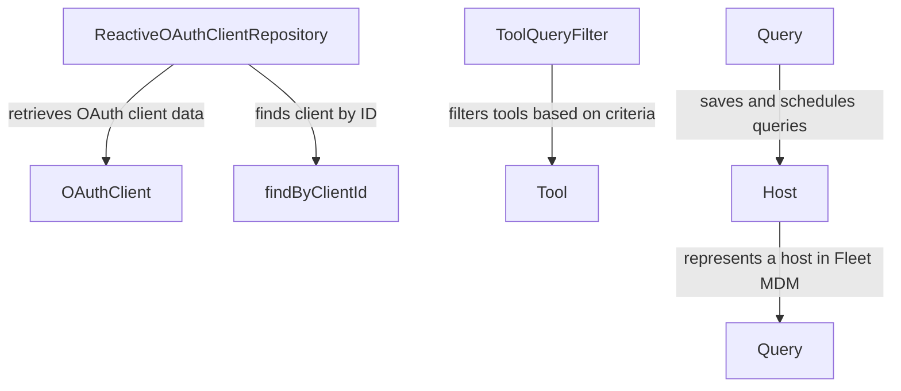

# Module 9 Documentation

## Introduction
Module 9 is responsible for managing OAuth client data and filtering tools within the system. It provides reactive repositories for OAuth clients and defines query filters for tools, facilitating efficient data retrieval and management.

## Architecture Overview

## High-Level Functionality
### 1. ReactiveOAuthClientRepository
- **Purpose**: Provides reactive access to OAuth client data.
- **Core Methods**:
  - `findByClientId(String clientId)`: Retrieves an OAuth client by its client ID.
- **Documentation**: See [ReactiveOAuthClientRepository](openframe-data-mongo/src/main/java/com/openframe/data/reactive/repository/oauth/ReactiveOAuthClientRepository.java)

### 2. ToolQueryFilter
- **Purpose**: Defines filters for querying tools based on various attributes.
- **Core Attributes**:
  - `enabled`: Indicates if the tool is enabled.
  - `type`: Specifies the type of tool.
  - `category`: Categorizes the tool.
- **Documentation**: See [ToolQueryFilter](openframe-data-mongo/src/main/java/com/openframe/data/document/tool/filter/ToolQueryFilter.java)

### 3. Host
- **Purpose**: Represents a host in the Fleet MDM system.
- **Core Attributes**:
  - `id`: Unique identifier for the host.
  - `hostname`: The name of the host.
- **Documentation**: See [Host](sdk/fleetmdm/src/main/java/com/openframe/sdk/fleetmdm/model/Host.java)

### 4. Query
- **Purpose**: Represents a saved or scheduled query in the Fleet MDM system.
- **Core Attributes**:
  - `id`: Unique identifier for the query.
  - `name`: The name of the query.
- **Documentation**: See [Query](sdk/fleetmdm/src/main/java/com/openframe/sdk/fleetmdm/model/Query.java)

### 5. DeviceFilterOptions
- **Purpose**: Provides options for filtering devices based on various criteria.
- **Core Attributes**:
  - `statuses`: List of device statuses.
  - `deviceTypes`: List of device types.
- **Documentation**: See [DeviceFilterOptions](openframe-api-lib/src/main/java/com/openframe/api/dto/device/DeviceFilterOptions.java)

## Conclusion
Module 9 plays a crucial role in managing OAuth clients and filtering tools, ensuring efficient data handling and retrieval within the system.