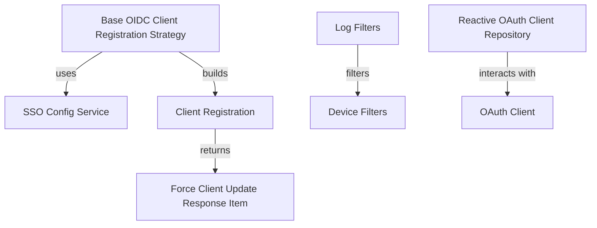

# Module 9 Documentation
## Sub-module Documentation

### 1. Base OIDC Client Registration Strategy
- **Package**: `com.openframe.authz.service.auth.strategy`
- **Description**: This abstract class provides the foundation for creating client registrations with various OAuth providers. It retrieves configurations from the SSOConfigService and constructs a ClientRegistration object based on the provider's specifications.

### 2. Force Client Update Response Item
- **Package**: `com.openframe.api.dto.force.response`
- **Description**: Represents the response item for client updates, containing the machine ID and the status of the agent.

### 3. Log Filters
- **Package**: `com.openframe.api.dto.audit`
- **Description**: Provides a structure for filtering logs based on tool types, event types, severities, and organizations.

### 4. Device Filters
- **Package**: `com.openframe.api.dto.device`
- **Description**: Contains various filters for managing device statuses, types, OS types, organization IDs, and tags.

### 5. Reactive OAuth Client Repository
- **Package**: `com.openframe.data.reactive.repository.oauth`
- **Description**: A reactive repository interface for managing OAuth client entities in a MongoDB database.

## Introduction
Module 9 is responsible for handling OAuth client registration strategies and managing client update responses. It provides a framework for integrating with various OAuth providers and facilitates the management of client configurations and filters for logging and device management.

## Architecture Overview

## High-Level Functionality
### 1. Base OIDC Client Registration Strategy
- **Component**: [BaseOidcClientRegistrationStrategy](openframe-authorization-service-core/src/main/java/com/openframe/authz/service/auth/strategy/BaseOidcClientRegistrationStrategy.java)
- **Functionality**: This abstract class defines the structure for building client registrations with various OAuth providers. It retrieves the necessary configuration from the SSOConfigService and constructs a ClientRegistration object based on the provider's specifications.

### 2. Force Client Update Response Item
- **Component**: [ForceClientUpdateResponseItem](openframe-api-service-core/src/main/java/com/openframe/api/dto/force/response/ForceClientUpdateResponseItem.java)
- **Functionality**: Represents the response item for client updates, containing the machine ID and the status of the agent.

### 3. Log Filters
- **Component**: [LogFilters](openframe-api-lib/src/main/java/com/openframe/api/dto/audit/LogFilters.java)
- **Functionality**: Provides a structure for filtering logs based on tool types, event types, severities, and organizations.

### 4. Device Filters
- **Component**: [DeviceFilters](openframe-api-lib/src/main/java/com/openframe/api/dto/device/DeviceFilters.java)
- **Functionality**: Contains various filters for managing device statuses, types, OS types, organization IDs, and tags.

### 5. Reactive OAuth Client Repository
- **Component**: [ReactiveOAuthClientRepository](openframe-data-mongo/src/main/java/com/openframe/data/reactive/repository/oauth/ReactiveOAuthClientRepository.java)
- **Functionality**: A reactive repository interface for managing OAuth client entities in a MongoDB database.