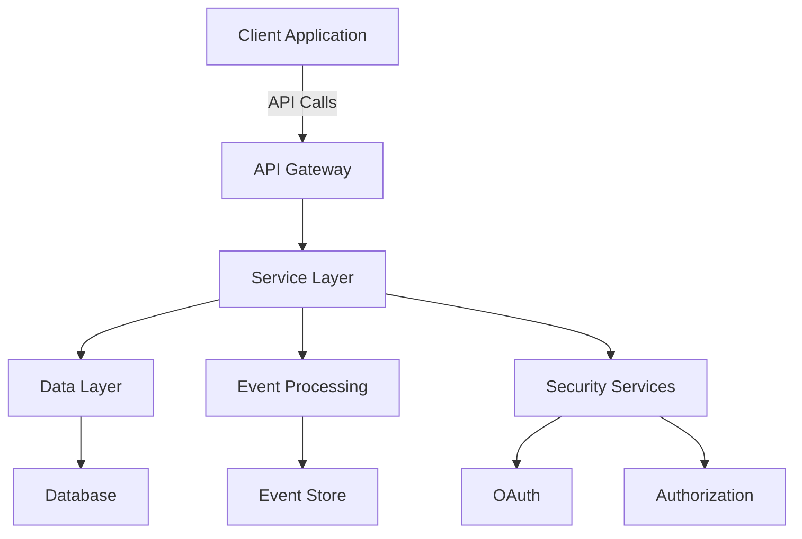

# Overview of the openframe-oss-lib Repository

## Purpose
The `openframe-oss-lib` repository is designed to provide a comprehensive set of libraries and modules that facilitate the development of applications within the OpenFrame ecosystem. It encompasses various functionalities, including device management, event handling, security, and API services, enabling developers to build robust and scalable applications efficiently.

## End-to-End Architecture
The architecture of the `openframe-oss-lib` repository can be visualized using the following Mermaid diagram:

## Repository Structure
The repository is organized into several core modules, each containing various components and functionalities. Below is the structure of the repository along with its core modules:

- **Module 1: module_1**
  - Components:
    - HostSearchRequest
    - CustomEventRepositoryImpl
    - LogDetails
    - DeviceFilterOption
    - ReactiveTenantRepository

- **Module 2: module_2**
  - Components:
    - DefaultRedirectTargetResolver
    - MicrosoftClientRegistrationStrategy
    - ForceClientUpdateRequest
    - TagFilterOption
    - ForceClientUpdateResponseItem

- **Module 3: module_3**
  - Components:
    - DeviceFilterOptions
    - LogFilterOptions
    - FleetMdmAgentIdTransformer
    - GoogleClientRegistrationStrategy
    - MachineQueryFilter

- **Module 4: module_4**
  - Components:
    - QueryResult
    - OrganizationResponse
    - ReactiveApiKeyRepository
    - GenericQueryResult
    - CreateScriptRequest

- **Module 5: module_5**
  - Components:
    - ToolAgentIdTransformerService
    - HostSearchResponse
    - RedirectTargetResolver
    - IntegratedToolEnrichedData
    - ForceClientUpdateResponse

- **Module 6: module_6**
  - Components:
    - EventFilters
    - BaseOidcClientRegistrationStrategy
    - AgentListItem
    - ForceToolInstallationAllRequest
    - ReactiveUserRepository

- **Module 7: module_7**
  - Components:
    - CountedGenericQueryResult
    - OrganizationList
    - ReactiveIntegratedToolRepository
    - ForceToolAgentInstallationResponseItem
    - Host

- **Module 8: module_8**
  - Components:
    - EventFilterOptions
    - ScriptListItem
    - Query
    - CommandResult
    - OrganizationFilterOption

- **Module 9: module_9**
  - Components:
    - ForceToolInstallationRequest
    - LogEvent
    - ForceToolReinstallationRequest
    - MeshCentralAgentIdTransformer
    - QueryStats

- **Module 10: module_10**
  - Components:
    - AgentInfo
    - OrganizationFilterOptions
    - ForceToolAgentUpdateResponseItem
    - DeviceFilters
    - ForceToolAgentUpdateResponse

- **Module 11: module_11**
  - Components:
    - ToolAgentIdTransformer
    - ReactiveOAuthClientRepository
    - ClientRegistrationStrategy
    - AgentRegistrationSecretRequest
    - OrganizationQueryFilter

- **Module 12: module_12**
  - Components:
    - LogFilters
    - ForceToolAgentInstallationResponse
    - AgentRegistrationProcessor
    - ForceToolUpdateRequest
    - ToolQueryFilter

- **Module 13: module_13**
  - Components:
    - EventQueryFilter
    - DefaultAgentRegistrationProcessor
    - DeserializedDebeziumMessage

## Core Modules Documentation
For detailed documentation on each core module, please refer to the respective module documentation within the repository. Each module contains specific guidelines, usage examples, and API references to assist developers in leveraging the functionalities provided by the `openframe-oss-lib`.