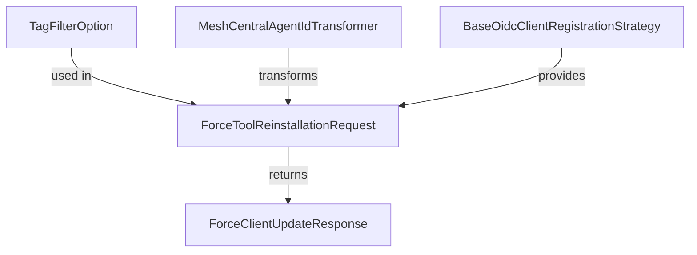
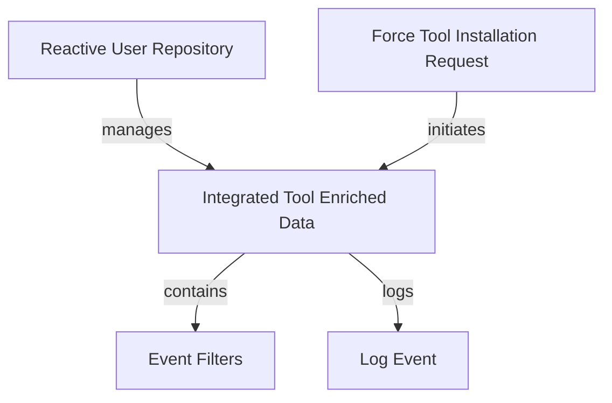
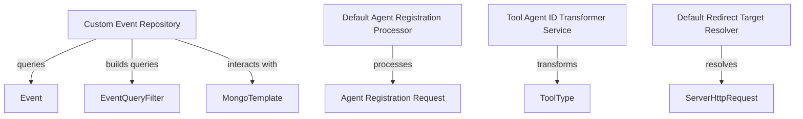
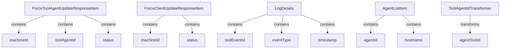

# Overview of the openframe-oss-lib Repository

## Purpose of the Repository
The `openframe-oss-lib` repository is designed to provide a comprehensive set of libraries and modules for managing device operations, agent registrations, event handling, and tool updates within the OpenFrame ecosystem. It integrates various components to facilitate communication, data management, and operational efficiency across different services.

## End-to-End Architecture
The architecture of the `openframe-oss-lib` repository can be visualized through the following mermaid diagrams representing the core modules:

### Module 1 Architecture

### Module 2 Architecture

### Module 3 Architecture

### Module 4 Architecture

## Core Modules Documentation
The repository consists of several core modules, each with its own functionality and components. Below is a brief overview of each module along with references to their documentation:

1. **Module 1**: [Device Management and Force Tool Requests](module_1.md)
2. **Module 2**: [Event Management and User Data](module_2.md)
3. **Module 3**: [Agent Registration and Event Management](module_3.md)
4. **Module 4**: [Agent and Client Updates](module_4.md)
5. **Module 5**: [Agent Registration and Authorization Strategies](module_5.md)
6. **Module 6**: [Event Filtering and Client Registration](module_6.md)
7. **Module 7**: [Device and Organization Filtering](module_7.md)
8. **Module 8**: [Organization Management](module_8.md)
9. **Module 9**: [OAuth Client Management and Tool Filtering](module_9.md)
10. **Module 10**: [Command Results and Log Management](module_10.md)
11. **Module 11**: [Client Update Requests and Host Search](module_11.md)
12. **Module 12**: [Event and Organization Filtering](module_12.md)
13. **Module 13**: [Tool Updates and Machine Querying](module_13.md)

## Conclusion
The `openframe-oss-lib` repository serves as a foundational library for the OpenFrame ecosystem, providing essential functionalities for device management, event handling, and agent registration. For detailed information on each module, please refer to the respective documentation links provided above.