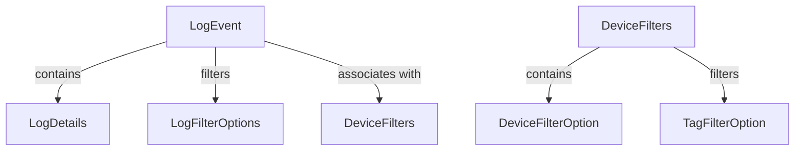
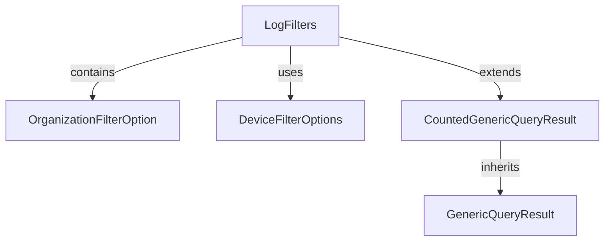

# OpenFrame OSS Library Overview

## Purpose of the Repository
The `openframe-oss-lib` repository is designed to provide a set of data transfer objects (DTOs) and filtering mechanisms for managing audit logs and device information within the OpenFrame API. It aims to enhance the data retrieval and management capabilities by offering structured ways to filter logs and devices based on specific criteria.

## End-to-End Architecture
The architecture of the `openframe-oss-lib` repository can be visualized through the following mermaid diagrams:

### Module 1 Architecture

### Module 2 Architecture

## Core Modules Documentation
The repository consists of the following core modules, each with its own documentation:

### Module 1
- **LogEvent**: Represents an event logged by the system. [Documentation](LogEvent.md)
- **LogDetails**: Provides detailed information about a specific log event. [Documentation](LogDetails.md)
- **LogFilterOptions**: Contains options for filtering log events. [Documentation](LogFilterOptions.md)
- **DeviceFilters**: Represents a collection of filters for devices. [Documentation](DeviceFilters.md)
- **DeviceFilterOption**: Represents an individual filter option for devices. [Documentation](DeviceFilterOption.md)

### Module 2
- **LogFilters**: Encapsulates various filtering options for logs. [Documentation](LogFilters.md)
- **OrganizationFilterOption**: Represents an organization filter option. [Documentation](OrganizationFilterOption.md)
- **DeviceFilterOptions**: Provides filtering options for devices. [Documentation](DeviceFilterOptions.md)
- **CountedGenericQueryResult**: Extends the `GenericQueryResult` to include a filtered count of items. [Documentation](CountedGenericQueryResult.md)
- **GenericQueryResult**: A generic class for query results. [Documentation](GenericQueryResult.md)

## Conclusion
The `openframe-oss-lib` repository plays a crucial role in managing audit logs and device filtering, providing essential DTOs for the OpenFrame API. Its structured approach to data management enhances the overall functionality and usability of the system.