# Overview of the openframe-oss-lib Repository

## Purpose of the Repository
The `openframe-oss-lib` repository is designed to provide a comprehensive set of libraries and modules for managing agent registrations, tool installations, updates, and various data processing tasks within the OpenFrame ecosystem. It facilitates communication between different services, ensuring efficient data flow and management across the system.

## End-to-End Architecture
The architecture of the `openframe-oss-lib` repository can be visualized through the following mermaid diagrams representing the core modules and their interactions:

### Module 1 Architecture
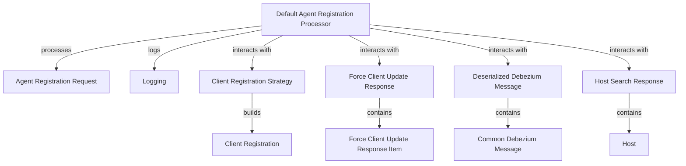

### Module 2 Architecture
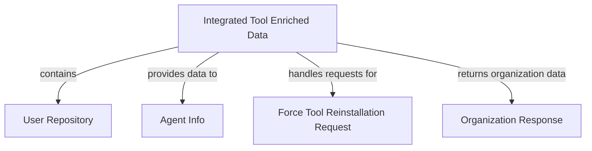

### Module 3 Architecture
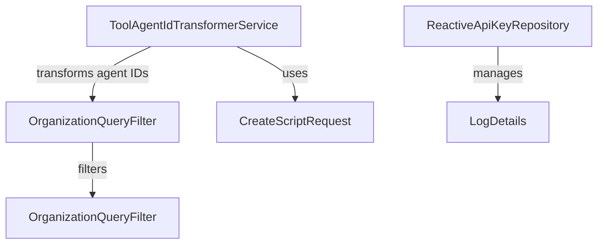

### Module 4 Architecture
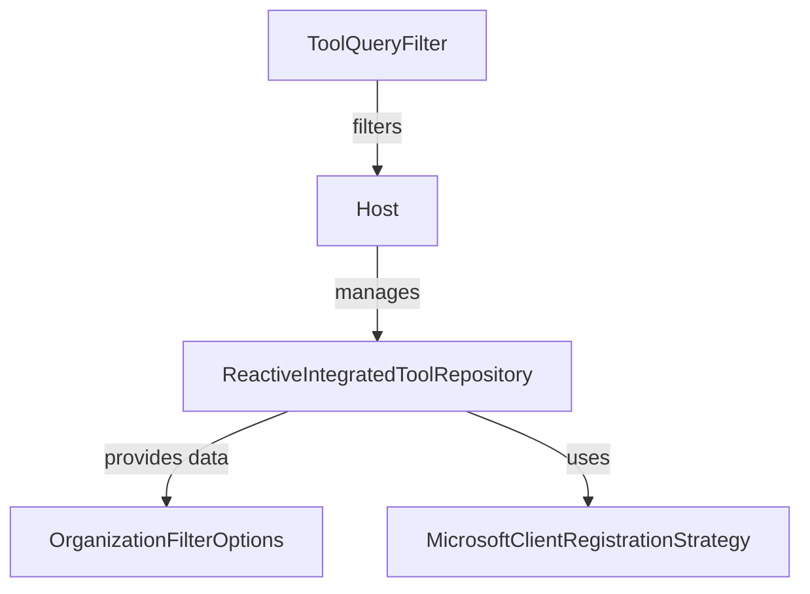

### Module 5 Architecture
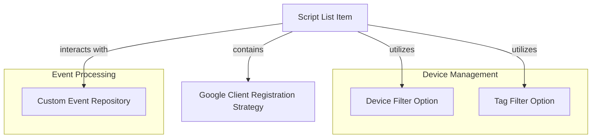

### Module 6 Architecture
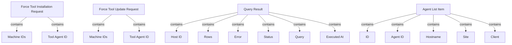

### Module 7 Architecture
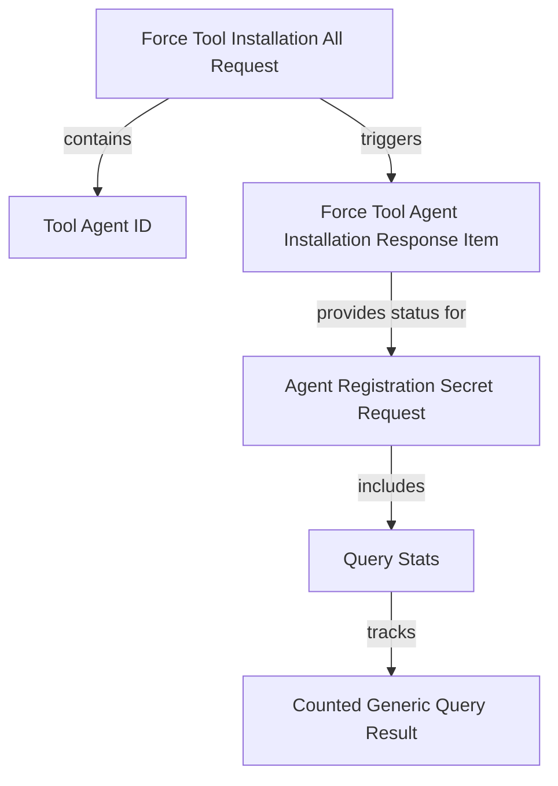

### Module 8 Architecture
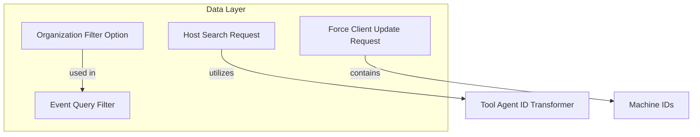

### Module 9 Architecture
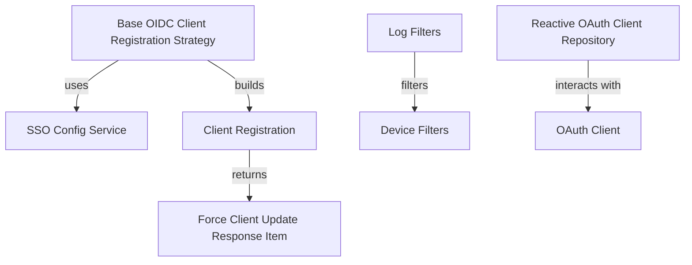

### Module 10 Architecture
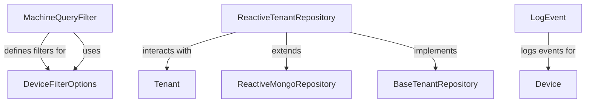

### Module 11 Architecture
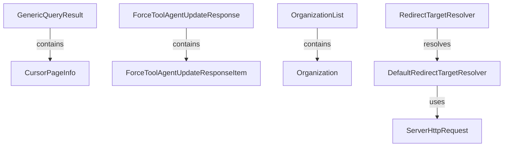

### Module 12 Architecture
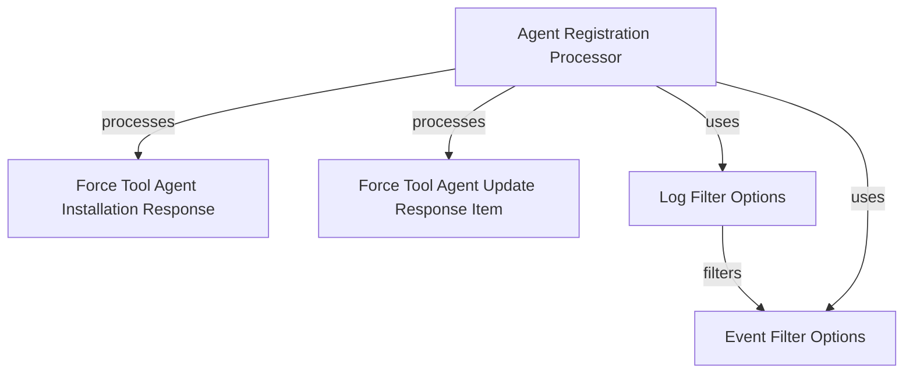

### Module 13 Architecture
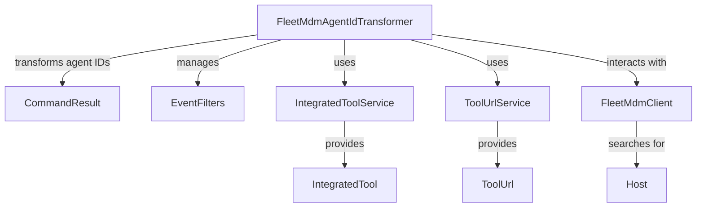

## Core Modules Documentation
The repository consists of several core modules, each with its own documentation. Below are the references to the documentation for each module:

- **Module 1**: [Module 1 Documentation](module_1.md)
- **Module 2**: [Module 2 Documentation](module_2.md)
- **Module 3**: [Module 3 Documentation](module_3.md)
- **Module 4**: [Module 4 Documentation](module_4.md)
- **Module 5**: [Module 5 Documentation](module_5.md)
- **Module 6**: [Module 6 Documentation](module_6.md)
- **Module 7**: [Module 7 Documentation](module_7.md)
- **Module 8**: [Module 8 Documentation](module_8.md)
- **Module 9**: [Module 9 Documentation](module_9.md)
- **Module 10**: [Module 10 Documentation](module_10.md)
- **Module 11**: [Module 11 Documentation](module_11.md)
- **Module 12**: [Module 12 Documentation](module_12.md)
- **Module 13**: [Module 13 Documentation](module_13.md)

## Conclusion
The `openframe-oss-lib` repository serves as a foundational library for the OpenFrame ecosystem, providing essential functionalities for agent management, tool installations, and data processing. Each module is designed to work cohesively, ensuring a robust and efficient system architecture.