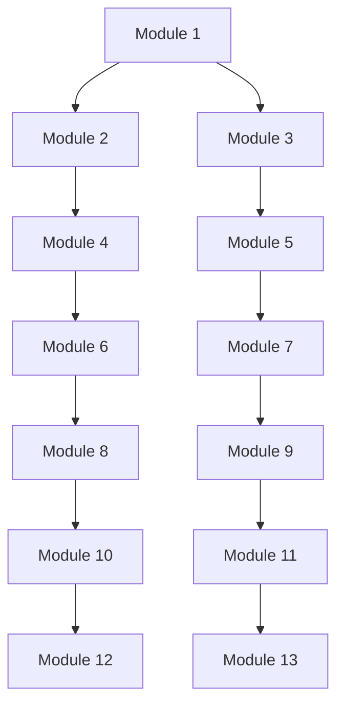

# Overview of the openframe-oss-lib Repository

## Purpose of the Repository
The `openframe-oss-lib` repository is designed to provide a comprehensive set of libraries and modules for managing various functionalities within the OpenFrame ecosystem. It encompasses features related to device management, user authentication, event processing, and tool installations, facilitating seamless integration and interaction between different components of the system.

## End-to-End Architecture
The architecture of the `openframe-oss-lib` repository is modular, consisting of several interconnected modules that work together to provide the necessary functionalities. Below is a high-level visualization of the architecture using mermaid diagrams:

## Core Modules Documentation
The repository consists of the following core modules, each with its own specific functionalities:

1. **Module 1**: [Module 1 Documentation](module_1.md)
   - Focuses on Fleet MDM interactions, including host search responses and tool installation requests.

2. **Module 2**: [Module 2 Documentation](module_2.md)
   - Handles data transfer and processing tasks related to organizations and scripts.

3. **Module 3**: [Module 3 Documentation](module_3.md)
   - Manages tool updates and enriched data related to machines.

4. **Module 4**: [Module 4 Documentation](module_4.md)
   - Responsible for client registration strategies and handling client updates.

5. **Module 5**: [Module 5 Documentation](module_5.md)
   - Manages agent-related functionalities within Tactical RMM and Fleet MDM systems.

6. **Module 6**: [Module 6 Documentation](module_6.md)
   - Handles user management, organization filtering, and event processing.

7. **Module 7**: [Module 7 Documentation](module_7.md)
   - Focuses on agent registration and management within Fleet MDM.

8. **Module 8**: [Module 8 Documentation](module_8.md)
   - Manages API keys, logging filter options, and tool agent ID transformations.

9. **Module 9**: [Module 9 Documentation](module_9.md)
   - Handles agent registration transformations and client update requests.

10. **Module 10**: [Module 10 Documentation](module_10.md)
    - Manages responses related to tool agent updates and installations.

11. **Module 11**: [Module 11 Documentation](module_11.md)
    - Responsible for managing queries and tool installation requests.

12. **Module 12**: [Module 12 Documentation](module_12.md)
    - Handles audit logs and event filtering.

13. **Module 13**: [Module 13 Documentation](module_13.md)
    - Manages agent information and event filtering within Tactical RMM.

For detailed information on each module, please refer to the respective documentation links provided above.