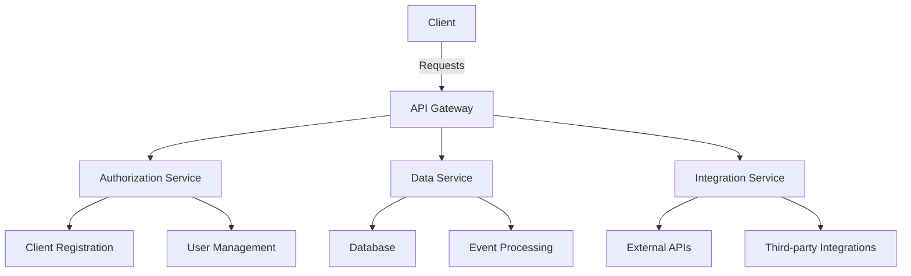

# Overview of the openframe-oss-lib Repository

## Purpose
The `openframe-oss-lib` repository is designed to provide a comprehensive set of libraries and services for building and managing applications within the OpenFrame ecosystem. It encompasses various modules that facilitate authorization, data management, API services, and integration with external systems, ensuring a robust and scalable architecture for developers.

## End-to-End Architecture
The architecture of the `openframe-oss-lib` repository can be visualized using the following Mermaid diagram:

## Core Modules Documentation
The repository is structured into several core modules, each containing specific components and functionalities. Below is a summary of the modules and their components:

1. **Module 1: Authorization Services**
   - Components:
     - Client Registration Strategies
     - Agent Information Models
     - Transformers for Agent IDs

2. **Module 2: Data Management**
   - Components:
     - Reactive User Repository
     - Device Query Filters
     - Organization and Event Filter Options

3. **Module 3: API Services**
   - Components:
     - Audit Log Details
     - Force Tool Installation Requests
     - Agent Registration Processors

4. **Module 4: Tenant Management**
   - Components:
     - Reactive Tenant Repository
     - Host Search Responses
     - Organization Responses

5. **Module 5: API Key Management**
   - Components:
     - Reactive API Key Repository
     - Filter Options for Organizations and Devices

6. **Module 6: Client Update Services**
   - Components:
     - Force Client Update Requests
     - Host Models
     - Event Filters

7. **Module 7: Tool Agent Management**
   - Components:
     - Force Tool Agent Installation Responses
     - Event Query Filters

8. **Module 8: Device Management**
   - Components:
     - Device Filter Options
     - Query Statistics

9. **Module 9: Tool Management**
   - Components:
     - Tool Query Filters
     - Audit Log Events

10. **Module 10: Organization Management**
    - Components:
      - Organization Query Filters
      - Redirect Target Resolvers

11. **Module 11: Integrated Tool Management**
    - Components:
      - Reactive Integrated Tool Repository
      - Force Tool Agent Update Responses

12. **Module 12: Event Management**
    - Components:
      - Custom Event Repository
      - Integrated Tool Enriched Data

13. **Module 13: Organization List Management**
    - Components:
      - Organization List DTOs
      - Agent Registration Secret Requests

This modular structure allows for easy maintenance and scalability, enabling developers to extend functionalities as needed.