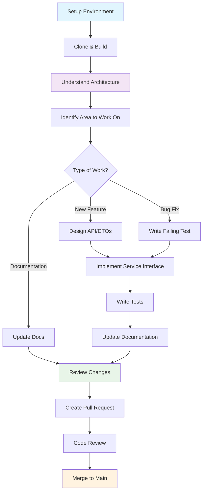

# Development Documentation

Welcome to the OpenFrame OSS Library development documentation! This section contains comprehensive guides for developers who want to contribute to, extend, or deeply integrate with the OpenFrame platform.

## 📚 Documentation Structure

This development documentation is organized into focused sections that build upon each other:

### 🛠️ Setup Guides
Get your development environment ready and running smoothly:

| Guide | Purpose | Time Required |
|-------|---------|---------------|
| **[Environment Setup](setup/environment.md)** | IDE configuration, tools, and development workflow | 15 minutes |
| **[Local Development](setup/local-development.md)** | Clone, build, and run OpenFrame locally with all services | 30 minutes |

### 🏗️ Architecture Documentation  
Understand the system design and make informed development decisions:

| Guide | Purpose | Audience |
|-------|---------|----------|
| **[Architecture Overview](architecture/overview.md)** | High-level system design, data flow, and module relationships | All developers |

### 🧪 Testing & Quality
Maintain high code quality and reliability:

| Guide | Purpose | Coverage |
|-------|---------|----------|
| **[Testing Overview](testing/overview.md)** | Test structure, running tests, and writing new tests | Unit, Integration, E2E |

### 🤝 Contributing
Join the OpenFrame development community:

| Guide | Purpose | For |
|-------|---------|-----|
| **[Contributing Guidelines](contributing/guidelines.md)** | Code standards, PR process, and review guidelines | Contributors |

---

## 🎯 Quick Navigation

### New to OpenFrame Development?
**Start Here → [Environment Setup](setup/environment.md)**

Follow this path for the optimal learning experience:
1. **Environment Setup** - Configure your development tools
2. **Local Development** - Get the full system running
3. **Architecture Overview** - Understand the system design
4. **Testing Overview** - Learn testing patterns
5. **Contributing Guidelines** - Join the community

### Experienced Java Developer?
**Jump to → [Architecture Overview](architecture/overview.md)**

Focus on these key areas:
- System architecture and module relationships
- Data flow patterns and API design
- Service implementation patterns
- Testing strategies

### Ready to Contribute?
**Review → [Contributing Guidelines](contributing/guidelines.md)**

Make sure you understand:
- Code style and conventions
- Git workflow and PR process  
- Review criteria and checklist

---

## 🚀 Development Workflow Overview

Understanding the typical development workflow helps you navigate the codebase efficiently:

## 📦 Module Structure

OpenFrame OSS Library follows a modular architecture with clear separation of concerns:

### Core Modules
- **`openframe-api-lib`** - DTOs and service interfaces
- **`openframe-data-mongo`** - MongoDB models and repositories  
- **`openframe-core`** - Shared utilities and validation
- **`openframe-security-core`** - Authentication and authorization

### Service Modules  
- **`openframe-api-service-core`** - Main API service implementation
- **`openframe-client-core`** - Client/agent communication
- **`openframe-authorization-service-core`** - OAuth2 and SSO
- **`openframe-gateway-service-core`** - API gateway and routing

### Integration Modules
- **`openframe-data-kafka`** - Event streaming and processing
- **`openframe-stream-service-core`** - Real-time data processing
- **`sdk/tacticalrmm`** - TacticalRMM integration SDK
- **`sdk/fleetmdm`** - Fleet MDM integration SDK

## 🎨 Development Principles

### Code Quality Standards
- **Type Safety**: Leverage Java's type system and generics
- **Validation**: Use Jakarta Bean Validation for input validation  
- **Documentation**: Comprehensive JavaDoc for public APIs
- **Testing**: High test coverage with unit and integration tests

### API Design Principles
- **Consistency**: Standardized patterns across all endpoints
- **Pagination**: Cursor-based pagination for all list endpoints
- **Filtering**: Flexible filtering with shared filter DTOs
- **Versioning**: Backward-compatible API evolution

### Architecture Patterns
- **Domain-Driven Design**: Clear domain boundaries and models
- **Service Layer**: Business logic separation from controllers
- **Repository Pattern**: Data access abstraction
- **DTO Pattern**: Clear API contracts and validation

## 🔧 Common Development Tasks

### Adding a New Domain
1. Create DTOs in `openframe-api-lib/src/main/java/com/openframe/api/dto/{domain}/`
2. Define service interface in `openframe-api-lib/src/main/java/com/openframe/api/service/`
3. Create MongoDB models in `openframe-data-mongo/src/main/java/com/openframe/data/document/{domain}/`
4. Implement service in `openframe-api-service-core/src/main/java/com/openframe/api/service/`
5. Add controllers in `openframe-api-service-core/src/main/java/com/openframe/api/controller/`

### Modifying Existing APIs
1. Update DTOs while maintaining backward compatibility
2. Update service interfaces with default methods if needed
3. Implement new functionality in service implementations  
4. Add comprehensive tests
5. Update API documentation

### Adding Tool Integrations
1. Create SDK module under `sdk/{tool-name}/`
2. Define tool-specific DTOs and clients
3. Add integration service in appropriate service module
4. Create data models for tool-specific entities
5. Add monitoring and health checks

## 🚨 Important Development Notes

### Breaking Changes
- **Always avoid breaking changes** in public APIs
- Use **deprecation warnings** for outdated methods  
- Provide **migration paths** for API changes
- Update **version compatibility** documentation

### Security Considerations
- **Never commit secrets** or credentials
- **Validate all inputs** using Jakarta Bean Validation
- **Implement proper authorization** checks in services
- **Follow secure coding practices** for data handling

### Performance Guidelines  
- **Use cursor pagination** for large datasets
- **Implement proper indexing** for MongoDB queries
- **Cache frequently accessed data** appropriately
- **Monitor and optimize** database queries

## 📖 Additional Resources

### Internal Documentation
- **API Reference**: Detailed endpoint documentation in `/docs/reference/`
- **MongoDB Schemas**: Entity relationship diagrams and field definitions
- **Service Contracts**: Interface definitions and expected behaviors

### External Resources
- **Java 17+ Documentation**: [Oracle Java Docs](https://docs.oracle.com/en/java/)
- **Spring Boot**: [Spring Boot Reference](https://spring.io/projects/spring-boot)
- **MongoDB**: [MongoDB Java Driver](https://mongodb.github.io/mongo-java-driver/)
- **Jakarta Bean Validation**: [Bean Validation Spec](https://beanvalidation.org/)

### Community
- **OpenMSP Slack**: [Join the community](https://join.slack.com/t/openmsp/shared_invite/zt-36bl7mx0h-3~U2nFH6nqHqoTPXMaHEHA) for discussions and support
- **OpenFrame Website**: [OpenFrame.ai](https://openframe.ai) for product updates
- **Flamingo Platform**: [Flamingo.run](https://flamingo.run) for company information

---

## 🚀 Ready to Start Developing?

Choose your path based on your current situation:

| I want to... | Start with... | Estimated time |
|--------------|---------------|----------------|
| **Get a local dev environment running** | [Local Development](setup/local-development.md) | 30 minutes |
| **Understand the architecture first** | [Architecture Overview](architecture/overview.md) | 20 minutes |
| **Set up my IDE and tools** | [Environment Setup](setup/environment.md) | 15 minutes |
| **Start contributing immediately** | [Contributing Guidelines](contributing/guidelines.md) | 10 minutes |

---

**Happy coding!** Welcome to the OpenFrame development community. Let's build the future of MSP platforms together! 🎉