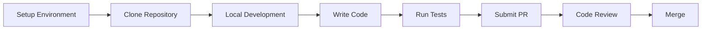
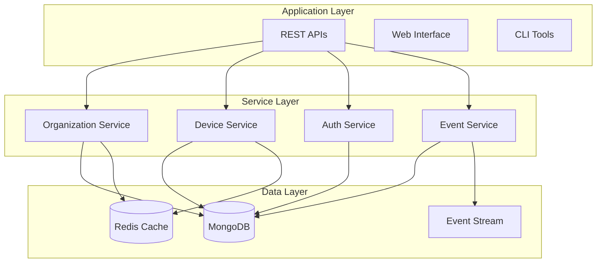
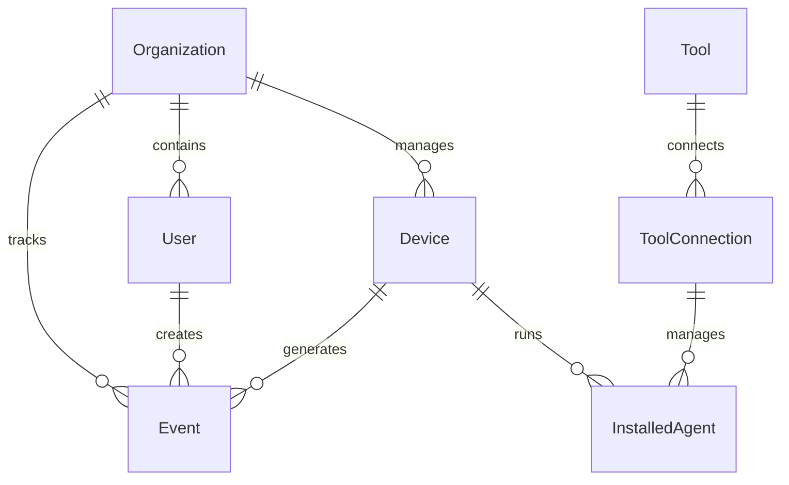
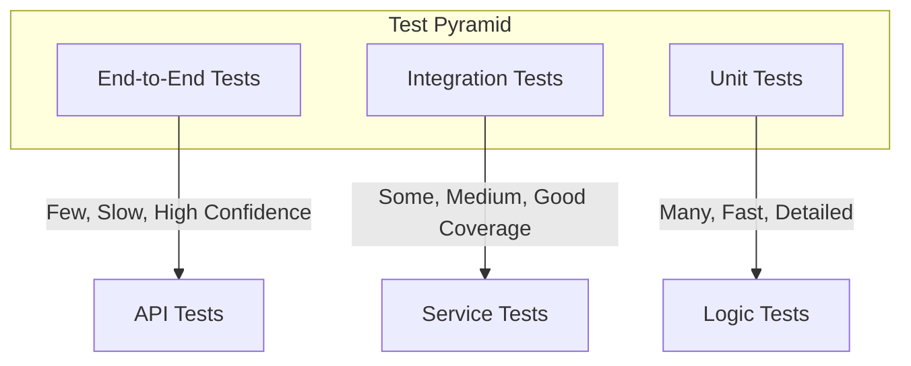
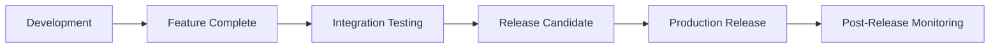
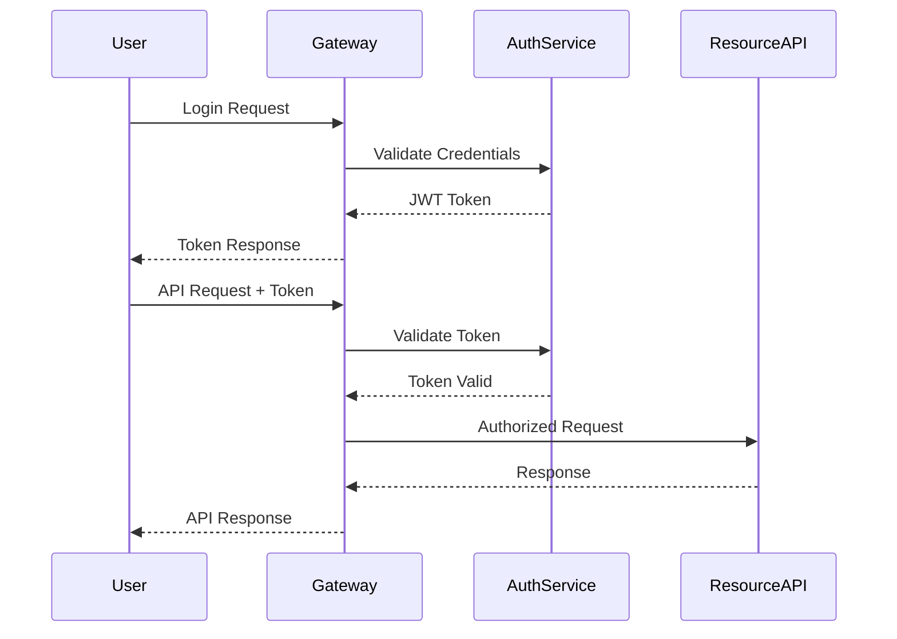

# Development Documentation

Welcome to the OpenFrame OSS Library development documentation! This section provides comprehensive guides for developers building applications and extensions with OpenFrame.

## Quick Navigation

### 🚀 Getting Started
- **[Environment Setup](./setup/environment.md)** - Configure your IDE and development tools
- **[Local Development](./setup/local-development.md)** - Run OpenFrame locally with hot reload

### 🏗️ Architecture & Design
- **[Architecture Overview](./architecture/overview.md)** - System architecture and design patterns
- **[API Design](./architecture/api-design.md)** - RESTful API conventions and standards

### 🧪 Testing & Quality
- **[Testing Overview](./testing/overview.md)** - Testing strategy, tools, and best practices
- **[Code Quality](./testing/code-quality.md)** - Linting, formatting, and quality gates

### 🤝 Contributing
- **[Contributing Guidelines](./contributing/guidelines.md)** - How to contribute to OpenFrame OSS Library
- **[Code Standards](./contributing/code-standards.md)** - Coding conventions and style guide

## Development Workflow



## Core Development Concepts

### Multi-Tenant Architecture

OpenFrame is built with multi-tenancy at its core:



### Data Model Hierarchy

Understanding the data relationships:



## Development Principles

### 1. **Consistency First**
- Standardized DTOs across all APIs
- Consistent error handling and responses
- Unified pagination patterns

### 2. **Security by Design**
- Multi-tenant data isolation
- JWT-based authentication
- Role-based access control

### 3. **Extensible Architecture**
- Plugin-based tool integrations
- Service interface abstractions
- Event-driven communication

### 4. **Developer Experience**
- Comprehensive documentation
- Clear error messages
- Extensive testing coverage

## Key Technologies

| Technology | Purpose | Version |
|------------|---------|---------|
| **Java** | Primary language | 21+ |
| **Spring Boot** | Application framework | 3.2+ |
| **MongoDB** | Primary database | 7.0+ |
| **Redis** | Caching & sessions | 7.0+ |
| **Apache Kafka** | Event streaming | 3.0+ |
| **Maven** | Build & dependency management | 3.6+ |

## Development Environment

### Required Tools

- **IDE**: IntelliJ IDEA, Eclipse, or VS Code
- **Java SDK**: OpenJDK 21 or later
- **Database**: MongoDB 7.0+
- **Cache**: Redis 7.0+ (optional)
- **Container**: Docker & Docker Compose

### Recommended IDE Plugins

**IntelliJ IDEA:**
- Spring Boot Plugin
- MongoDB Plugin  
- SonarLint (code quality)
- GitToolBox (Git integration)

**VS Code:**
- Extension Pack for Java
- Spring Boot Extension Pack
- MongoDB for VS Code
- SonarLint

## Code Organization

### Module Structure

```text
openframe-oss-lib/
├── openframe-api-lib/           # API DTOs and interfaces
├── openframe-api-service-core/   # Main API implementation
├── openframe-authorization-service-core/  # Auth & OAuth services
├── openframe-client-core/       # Client management
├── openframe-data-mongo/        # MongoDB data models
├── openframe-security-core/     # Security framework
├── openframe-core/             # Shared utilities
└── sdk/                        # Integration SDKs
```

### Package Conventions

```text
com.openframe.{module}
├── config/          # Configuration classes
├── controller/      # REST controllers  
├── service/         # Business logic services
├── repository/      # Data access layer
├── dto/            # Data Transfer Objects
├── model/          # Domain models
├── exception/      # Custom exceptions
└── util/           # Utility classes
```

## API Design Guidelines

### RESTful Conventions

- **GET** `/api/devices` - List devices with filtering
- **GET** `/api/devices/{id}` - Get specific device
- **POST** `/api/devices` - Create new device
- **PUT** `/api/devices/{id}` - Update entire device
- **PATCH** `/api/devices/{id}` - Partial device update
- **DELETE** `/api/devices/{id}` - Delete device

### Response Format

```json
{
  "success": true,
  "data": {
    "id": "device-123",
    "name": "Production Server",
    "status": "ACTIVE"
  },
  "pagination": {
    "hasNext": true,
    "cursor": "eyJpZCI6ImRldmljZS0xMjMifQ=="
  },
  "meta": {
    "total": 150,
    "took": 45
  }
}
```

### Error Responses

```json
{
  "success": false,
  "error": {
    "code": "DEVICE_NOT_FOUND",
    "message": "Device with ID 'device-123' not found",
    "details": {
      "field": "id",
      "value": "device-123"
    }
  },
  "meta": {
    "timestamp": "2024-01-15T10:30:00Z",
    "requestId": "req-abc-123"
  }
}
```

## Testing Strategy

### Test Pyramid



### Testing Levels

1. **Unit Tests** - Individual methods and classes
2. **Integration Tests** - Service interactions and database operations
3. **API Tests** - End-to-end HTTP API testing
4. **Contract Tests** - API contract validation

## Code Quality Standards

### Formatting & Style

- **Checkstyle** - Java code style enforcement
- **SpotBugs** - Static code analysis
- **SonarQube** - Code quality metrics
- **EditorConfig** - Consistent formatting

### Quality Gates

- ✅ **Test Coverage** - Minimum 80% line coverage
- ✅ **Code Duplication** - Less than 3% duplication
- ✅ **Complexity** - Cyclomatic complexity under 10
- ✅ **Security** - No high/critical security issues

## Development Workflow

### 1. Feature Development

```bash
# Create feature branch
git checkout -b feature/new-device-api

# Make changes and test
./gradlew test

# Commit with conventional commits
git commit -m "feat: add device filtering API"

# Push and create PR
git push origin feature/new-device-api
```

### 2. Code Review Process

1. **Automated Checks** - CI pipeline runs tests and quality checks
2. **Peer Review** - Team members review code and design
3. **Security Review** - Security-focused review for sensitive changes
4. **Documentation** - Ensure documentation is updated

### 3. Release Process



## Common Development Tasks

### Adding New Entity

1. **Create MongoDB Document**
2. **Define API DTOs**
3. **Implement Repository**
4. **Create Service Layer**
5. **Build REST Controller**
6. **Write Tests**
7. **Update Documentation**

### Implementing New Integration

1. **Define SDK Interface**
2. **Create Configuration**
3. **Implement Client**
4. **Add Authentication**
5. **Build Event Processing**
6. **Integration Testing**

## Performance Considerations

### Database Optimization

- **Indexing Strategy** - Proper compound indexes
- **Query Optimization** - Efficient aggregation pipelines
- **Connection Pooling** - Optimized connection management

### Caching Strategy

- **Application Cache** - Frequently accessed data
- **Session Cache** - User session information
- **Query Cache** - Complex query results

### Monitoring & Observability

- **Application Metrics** - Performance and usage metrics
- **Health Checks** - Service health monitoring
- **Distributed Tracing** - Request flow tracking

## Security Development

### Authentication Flow



### Security Best Practices

- **Input Validation** - Validate all user inputs
- **Output Encoding** - Prevent XSS attacks
- **SQL Injection** - Use parameterized queries
- **CSRF Protection** - Token-based CSRF protection
- **Rate Limiting** - API rate limiting implementation

## Next Steps

Choose your path based on your needs:

### For New Contributors
1. **[Environment Setup](./setup/environment.md)** - Set up development environment
2. **[Contributing Guidelines](./contributing/guidelines.md)** - Learn contribution process

### For Application Developers
1. **[Local Development](./setup/local-development.md)** - Development workflow
2. **[Architecture Overview](./architecture/overview.md)** - Understand system design

### For Platform Developers
1. **[Testing Overview](./testing/overview.md)** - Testing strategies
2. **[Code Quality](./testing/code-quality.md)** - Quality standards

## Resources & Support

- 💬 **Community**: [OpenMSP Slack](https://join.slack.com/t/openmsp/shared_invite/zt-36bl7mx0h-3~U2nFH6nqHqoTPXMaHEHA)
- 📚 **API Reference**: [Architecture Documentation](../reference/architecture/overview.md)
- 🚀 **Platform**: [OpenFrame.ai](https://openframe.ai)
- 🏢 **Company**: [Flamingo.run](https://flamingo.run)

Happy coding with OpenFrame OSS Library! 🚀