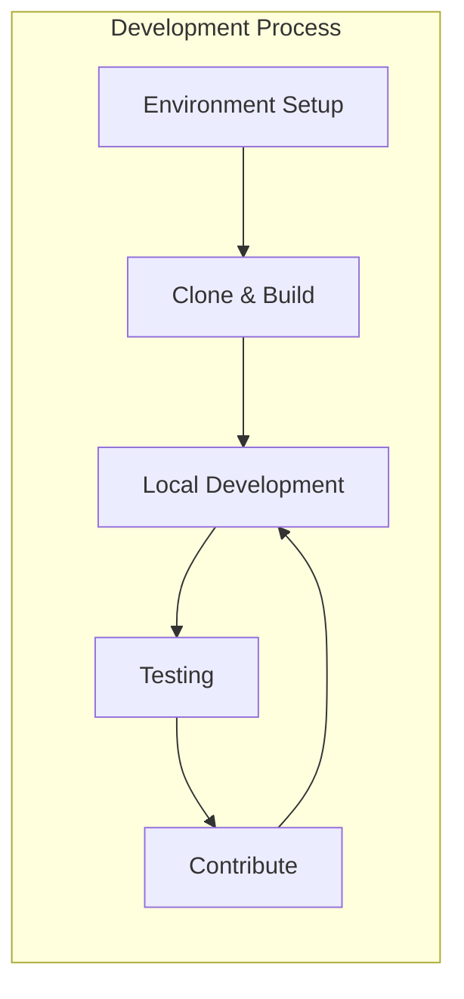

# Development Documentation

Welcome to the OpenFrame OSS Library development documentation. This section provides comprehensive guides for developers who want to contribute to, extend, or build applications with the OpenFrame platform.

## Quick Navigation

### Setup Guides
- **[Environment Setup](setup/environment.md)** - Configure your development environment
- **[Local Development](setup/local-development.md)** - Running and debugging locally

### Architecture
- **[Overview](architecture/overview.md)** - System architecture and design patterns

### Testing
- **[Testing Overview](testing/overview.md)** - Testing strategies and tools

### Contributing
- **[Guidelines](contributing/guidelines.md)** - How to contribute to the project

## Development Sections

### 🛠️ Setup and Configuration

Get your development environment ready:

| Guide | Description | Estimated Time |
|-------|-------------|----------------|
| **[Environment Setup](setup/environment.md)** | IDE setup, tools, and configuration | 30 minutes |
| **[Local Development](setup/local-development.md)** | Clone, build, and run locally | 15 minutes |

### 🏗️ Architecture and Design

Understand the system architecture:

| Guide | Description | Level |
|-------|-------------|-------|
| **[Overview](architecture/overview.md)** | High-level architecture and components | Intermediate |

### 🧪 Testing and Quality

Ensure code quality and reliability:

| Guide | Description | Focus |
|-------|-------------|--------|
| **[Testing Overview](testing/overview.md)** | Testing strategies and best practices | All Levels |

### 🤝 Contributing

Help improve OpenFrame:

| Guide | Description | Audience |
|-------|-------------|----------|
| **[Guidelines](contributing/guidelines.md)** | Contribution process and standards | Contributors |

## Development Workflow



## Key Development Areas

### Core Library Development

Working on the foundational components:

- **DTOs and Mappers** - Data transfer objects and conversions
- **Service Interfaces** - Business logic contracts
- **Data Models** - MongoDB document entities
- **Configuration** - Spring configuration classes
- **Utilities** - Shared utility functions

### Service Development

Building microservices using the library:

- **API Services** - RESTful web services
- **Authorization Services** - Authentication and security
- **Gateway Services** - API gateway and routing
- **Management Services** - Administrative functions
- **Stream Services** - Event processing and messaging

### Integration Development

Connecting external systems:

- **RMM Tools** - Fleet MDM, Tactical RMM, MeshCentral
- **Authentication Providers** - OAuth, OIDC, SAML
- **Monitoring Systems** - Metrics and alerting
- **Data Pipelines** - ETL and analytics

## Technologies and Stack

### Core Technologies

| Technology | Version | Purpose |
|------------|---------|---------|
| **Java** | 17+ | Primary language |
| **Spring Boot** | 3.2+ | Application framework |
| **Spring Data** | 3.2+ | Data access layer |
| **MongoDB** | 7.0+ | Primary database |
| **Redis** | 7.0+ | Caching layer |
| **Kafka** | 3.6+ | Event streaming |

### Development Tools

| Tool | Purpose | Required |
|------|---------|----------|
| **Gradle** | Build system | ✅ Yes |
| **Docker** | Containerization | 🔶 Recommended |
| **IntelliJ IDEA** | IDE | 🔶 Recommended |
| **Postman** | API testing | 🔶 Optional |

### Testing Framework

| Framework | Purpose | Coverage |
|-----------|---------|----------|
| **JUnit 5** | Unit testing | All components |
| **Spring Boot Test** | Integration testing | Service layer |
| **Testcontainers** | Database testing | Data layer |
| **WireMock** | API mocking | External services |

## Code Organization

### Module Structure

```text
openframe-oss-lib/
├── openframe-api-lib/              # Core API DTOs and interfaces
│   └── src/main/java/com/openframe/api/
├── openframe-data-mongo/           # MongoDB data models
│   └── src/main/java/com/openframe/data/
├── openframe-core/                 # Core utilities and common code
│   └── src/main/java/com/openframe/core/
├── openframe-security-core/        # Security components
│   └── src/main/java/com/openframe/security/
└── examples/                       # Example applications
    └── device-management/
```

### Package Conventions

| Package | Purpose | Examples |
|---------|---------|----------|
| `dto` | Data transfer objects | `DeviceResponse`, `OrganizationRequest` |
| `service` | Business logic interfaces | `DeviceService`, `OrganizationService` |
| `repository` | Data access layer | `DeviceRepository`, `EventRepository` |
| `config` | Configuration classes | `MongoConfig`, `SecurityConfig` |
| `exception` | Custom exceptions | `DeviceNotFoundException` |
| `util` | Utility functions | `SlugUtil`, `EncryptionService` |

## Development Standards

### Code Quality

- ✅ **Test Coverage** - Minimum 80% line coverage
- ✅ **Documentation** - Javadoc for public APIs
- ✅ **Static Analysis** - SpotBugs and PMD integration
- ✅ **Code Style** - Google Java Style Guide
- ✅ **Dependencies** - Keep dependencies up-to-date

### API Design

- ✅ **RESTful Design** - Follow REST principles
- ✅ **Consistent DTOs** - Standardized request/response objects
- ✅ **Cursor Pagination** - Use cursor-based pagination
- ✅ **Error Handling** - Standardized error responses
- ✅ **Validation** - Input validation on all endpoints

### Security

- ✅ **Input Validation** - Validate all inputs
- ✅ **SQL Injection** - Use parameterized queries
- ✅ **Authentication** - JWT-based authentication
- ✅ **Authorization** - Role-based access control
- ✅ **Audit Logging** - Log security events

## Performance Guidelines

### Database Optimization

- 🚀 **Indexes** - Proper indexing for query performance
- 🚀 **Aggregation** - Use MongoDB aggregation pipelines
- 🚀 **Connection Pooling** - Optimize database connections
- 🚀 **Caching** - Redis for frequently accessed data

### API Performance

- 🚀 **Pagination** - Always paginate large result sets
- 🚀 **Filtering** - Support server-side filtering
- 🚀 **Compression** - Enable GZIP compression
- 🚀 **Async Processing** - Use async for long-running operations

## Debugging and Troubleshooting

### Common Issues

| Issue | Cause | Solution |
|-------|-------|---------|
| **Build Failures** | Dependency conflicts | `./gradlew clean build` |
| **MongoDB Connection** | Service not running | `docker-compose up mongodb` |
| **Port Conflicts** | Port already in use | Change port or kill process |
| **Memory Issues** | Insufficient heap | Increase `JAVA_OPTS` |

### Debug Configuration

```yaml
# application-debug.yml
logging:
  level:
    com.openframe: DEBUG
    org.springframework.data.mongodb: DEBUG
    org.springframework.security: DEBUG
    
management:
  endpoints:
    web:
      exposure:
        include: "*"
```

### Useful Debug Commands

```bash
# View running processes
jps -v

# MongoDB connection
mongosh --eval "db.adminCommand('ping')"

# Redis connection  
redis-cli ping

# Check application logs
tail -f logs/application.log

# View heap usage
jmap -histo <pid>
```

## Resources and References

### Documentation

- 📖 **[Spring Boot Reference](https://docs.spring.io/spring-boot/docs/current/reference/htmlsingle/)**
- 📖 **[Spring Data MongoDB](https://docs.spring.io/spring-data/mongodb/docs/current/reference/html/)**
- 📖 **[MongoDB Documentation](https://www.mongodb.com/docs/)**
- 📖 **[Redis Documentation](https://redis.io/documentation)**

### Tools and IDEs

- 🛠️ **[IntelliJ IDEA](https://www.jetbrains.com/idea/)**
- 🛠️ **[MongoDB Compass](https://www.mongodb.com/products/compass)**
- 🛠️ **[Redis Desktop Manager](https://resp.app/)**
- 🛠️ **[Postman](https://www.postman.com/)**

### Community

- 💬 **[GitHub Discussions](https://github.com/openframe/openframe-oss-lib/discussions)**
- 🐛 **[GitHub Issues](https://github.com/openframe/openframe-oss-lib/issues)**
- 📧 **[Mailing List](mailto:dev@openframe.io)**
- 💡 **[Feature Requests](https://github.com/openframe/openframe-oss-lib/discussions/categories/ideas)**

## Getting Help

### For Development Issues

1. **Check the documentation** - Most questions are answered here
2. **Search existing issues** - Someone might have faced the same problem
3. **Ask in discussions** - Community support and Q&A
4. **Open an issue** - For bugs or feature requests

### For Enterprise Support

- 📧 **Email**: enterprise@openframe.io
- 📞 **Phone**: Available for enterprise customers
- 🎯 **Dedicated Support**: SLA-backed support available

## What's Next?

Choose your path based on your role:

### New Developers
1. **[Environment Setup](setup/environment.md)** - Get your tools ready
2. **[Local Development](setup/local-development.md)** - Run the project locally
3. **[Architecture Overview](architecture/overview.md)** - Understand the design

### Contributors
1. **[Contributing Guidelines](contributing/guidelines.md)** - Learn the process
2. **[Testing Overview](testing/overview.md)** - Write good tests
3. **[Architecture Overview](architecture/overview.md)** - Understand the codebase

### Architects
1. **[Architecture Overview](architecture/overview.md)** - System design deep dive
2. **[Testing Overview](testing/overview.md)** - Quality and reliability
3. **[Contributing Guidelines](contributing/guidelines.md)** - Best practices

Ready to start developing? Let's build something amazing with OpenFrame! 🚀