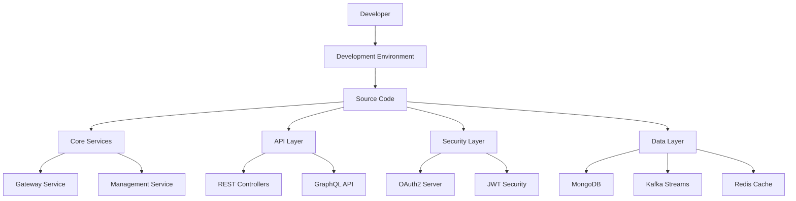

# Development Documentation

Welcome to the OpenFrame OSS Libraries development documentation. This section provides comprehensive guidance for developers working on, with, or extending the OpenFrame backend infrastructure.

## Overview

The development documentation is organized into focused areas covering everything from initial setup to advanced architecture patterns. Whether you're contributing to the core libraries or building integrations, you'll find the information you need here.

## Quick Navigation

### **Getting Started**
- **[Environment Setup](setup/environment.md)** - IDE, tools, and development environment configuration
- **[Local Development](setup/local-development.md)** - Running and debugging the platform locally

### **Understanding the Platform**
- **[Architecture Overview](architecture/README.md)** - System design, patterns, and module relationships
- **[Security Guidelines](security/README.md)** - Authentication, authorization, and security best practices

### **Quality & Testing**
- **[Testing Overview](testing/README.md)** - Testing strategies, tools, and writing effective tests

### **Contributing**
- **[Contributing Guidelines](contributing/guidelines.md)** - Code style, PR process, and contribution workflow

## Architecture at a Glance

OpenFrame OSS Libraries follows a modular, event-driven architecture:



## Development Principles

### **Multi-Tenant by Design**
Every component considers tenant isolation, from data access to security contexts.

### **Event-Driven Architecture**  
Services communicate through well-defined events, enabling scalability and decoupling.

### **Security First**
Authentication and authorization are built into every layer, never bolted on afterward.

### **Observability**
Comprehensive logging, metrics, and tracing for production-ready operations.

### **Extensibility**
Plugin points and processor interfaces allow customization without core changes.

## Key Technologies

| Technology | Version | Purpose |
|------------|---------|---------|
| **Java** | 21 | Runtime platform with modern language features |
| **Spring Boot** | 3.3.0 | Application framework and dependency injection |
| **Spring Security** | 6.x | Authentication and authorization |
| **Spring Authorization Server** | 1.3.1 | OAuth2/OIDC compliance |
| **Netflix DGS** | 9.0.3 | GraphQL implementation |
| **MongoDB** | 5.0+ | Primary operational database |
| **Apache Kafka** | 2.8+ | Event streaming and messaging |
| **Redis** | 6.0+ | Caching and session storage |
| **Maven** | 3.6+ | Build and dependency management |

## Module Structure

The repository is organized into service-core modules:

### **API & Contracts**
```text
openframe-api-lib/                  # Shared DTOs and services
openframe-api-service-core/         # REST + GraphQL orchestration
openframe-external-api-service-core/ # Stable external APIs
```

### **Security & Identity**
```text
openframe-authorization-service-core/ # OAuth2/OIDC server
openframe-security-core/             # JWT and authentication
openframe-gateway-service-core/      # Reactive gateway
```

### **Data & Infrastructure**
```text
openframe-data-mongo/               # MongoDB models and repos
openframe-data/                     # Analytics and time-series
openframe-data-kafka/               # Kafka messaging
openframe-data-redis/               # Caching infrastructure
```

### **Processing & Management**
```text
openframe-stream-service-core/      # Event processing
openframe-management-service-core/  # Automation and scheduling
openframe-client-core/              # Agent management
```

## Development Workflow

### 1. **Environment Setup**
Start with [Environment Setup](setup/environment.md) to configure your IDE and development tools.

### 2. **Local Development**
Follow [Local Development](setup/local-development.md) for running services locally with hot reloading.

### 3. **Understanding Architecture**
Review [Architecture Overview](architecture/README.md) to understand component relationships and data flows.

### 4. **Security Implementation**
Study [Security Guidelines](security/README.md) for implementing secure, tenant-aware features.

### 5. **Testing Strategy**
Use [Testing Overview](testing/README.md) to write comprehensive, reliable tests.

### 6. **Contributing Back**
Follow [Contributing Guidelines](contributing/guidelines.md) for code style and PR processes.

## Common Development Tasks

### **Adding a New REST Endpoint**

```java
@RestController
@RequestMapping("/api/my-feature")
@RequiredArgsConstructor
public class MyFeatureController {
    
    private final MyFeatureService service;
    
    @GetMapping
    public ResponseEntity<List<MyFeature>> list(
        @AuthenticationPrincipal AuthPrincipal principal
    ) {
        List<MyFeature> features = service.findByTenant(principal.getTenantId());
        return ResponseEntity.ok(features);
    }
}
```

### **Creating a GraphQL Data Fetcher**

```java
@DgsComponent
public class MyFeatureDataFetcher {
    
    @DgsQuery
    public Connection<MyFeature> myFeatures(
        @InputArgument Integer first,
        @InputArgument String after,
        @DgsContext DgsRequestData requestData
    ) {
        String tenantId = extractTenantId(requestData);
        // Implement pagination and filtering
    }
}
```

### **Adding Event Processing**

```java
@Component
@RequiredArgsConstructor
public class MyEventHandler {
    
    @EventListener
    public void handleMyEvent(MyCustomEvent event) {
        // Process the event
        log.info("Processing event: {}", event);
    }
    
    @KafkaListener(topics = "my-topic")
    public void handleKafkaMessage(MyMessage message) {
        // Handle Kafka events
    }
}
```

### **Implementing Custom Security**

```java
@Component
public class MySecurityProcessor implements AuthorizationProcessor {
    
    @Override
    public boolean hasPermission(AuthPrincipal principal, String resource, String action) {
        // Custom authorization logic
        return checkCustomPermission(principal, resource, action);
    }
}
```

## Best Practices

### **Code Organization**
- Keep controllers thin - delegate to services
- Use DTOs for API boundaries
- Implement proper exception handling
- Follow REST and GraphQL conventions

### **Security Considerations**
- Always validate tenant access
- Use `@AuthenticationPrincipal` for user context
- Sanitize inputs and validate permissions
- Implement proper CORS policies

### **Performance Optimization**
- Use appropriate caching strategies
- Implement efficient database queries
- Consider async processing for heavy operations
- Monitor and profile critical paths

### **Testing Approach**
- Write unit tests for business logic
- Create integration tests for APIs
- Use test containers for database tests
- Mock external dependencies appropriately

## Debugging and Troubleshooting

### **Common Issues**

**Multi-tenant context not set**
```java
// Ensure tenant context is available
@WithTenantContext
public class MyService {
    // Service methods automatically have tenant context
}
```

**JWT validation failures**
```yaml
# Check issuer configuration
logging:
  level:
    com.openframe.security: DEBUG
```

**Database connection issues**
```bash
# Verify MongoDB connection
mongosh --eval "db.adminCommand('ping')"
```

### **Development Tools**

**Hot Reloading with Spring DevTools**
```xml
<dependency>
    <groupId>org.springframework.boot</groupId>
    <artifactId>spring-boot-devtools</artifactId>
    <scope>runtime</scope>
</dependency>
```

**GraphQL Schema Inspection**
```
http://localhost:8080/graphiql
```

**Actuator Health Endpoints**
```
http://localhost:8080/actuator/health
http://localhost:8080/actuator/info
```

## Learning Resources

### **Spring Boot**
- [Spring Boot Reference](https://docs.spring.io/spring-boot/docs/current/reference/htmlsingle/)
- [Spring Security Reference](https://docs.spring.io/spring-security/reference/)

### **GraphQL**
- [Netflix DGS Documentation](https://netflix.github.io/dgs/)
- [GraphQL Best Practices](https://graphql.org/learn/best-practices/)

### **Event-Driven Architecture**
- [Spring Kafka Reference](https://docs.spring.io/spring-kafka/docs/current/reference/html/)
- [Event Sourcing Patterns](https://microservices.io/patterns/data/event-sourcing.html)

## Getting Help

### **Community Support**
- **OpenMSP Slack**: [Join the community](https://join.slack.com/t/openmsp/shared_invite/zt-36bl7mx0h-3~U2nFH6nqHqoTPXMaHEHA)
- **GitHub Issues**: [Report bugs and request features](https://github.com/flamingo-stack/openframe-oss-lib/issues)

### **Development Team**
For questions specific to development processes, reach out through the OpenMSP Slack community in the `#development` channel.

---

*Ready to contribute to the future of open-source MSP tooling? Start with the [Environment Setup](setup/environment.md) guide and join our growing community of developers.*