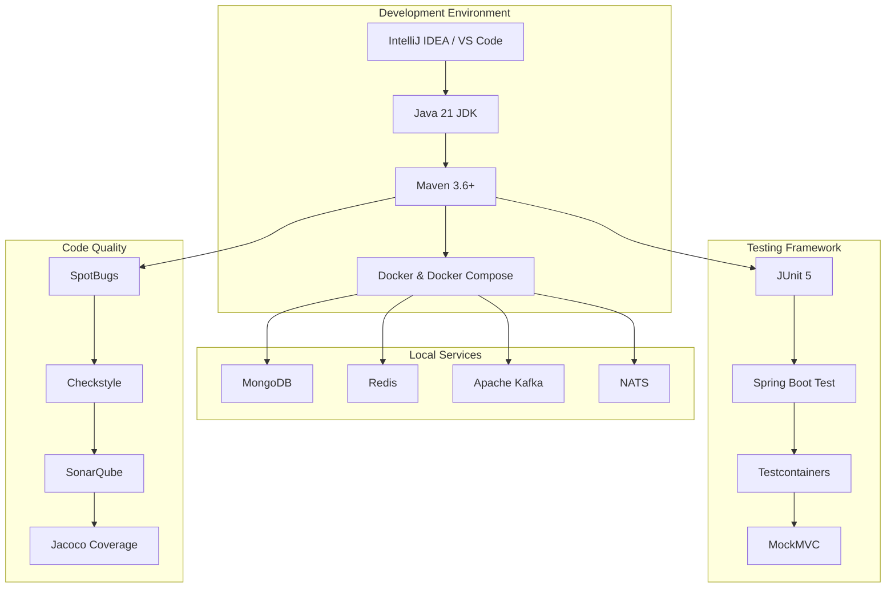
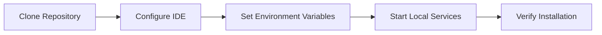
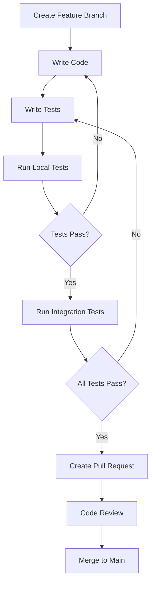

# Development Documentation

Welcome to the OpenFrame OSS Library development documentation. This section provides comprehensive guides for developers working with, extending, or contributing to the OpenFrame ecosystem.

## 📋 Documentation Overview

### Setup & Environment
Get your development environment properly configured for efficient OpenFrame development.

- **[Environment Setup](setup/environment.md)** - IDE configuration, plugins, and tools
- **[Local Development](setup/local-development.md)** - Running services locally, debugging, and hot reload

### Architecture & Design
Understand how OpenFrame is structured and designed for scalability and maintainability.

- **[Architecture Overview](architecture/overview.md)** - High-level system design and component relationships
- **[Module Documentation](../reference/architecture/overview.md)** - Detailed module-by-module reference

### Testing & Quality
Learn testing strategies and maintain code quality across the codebase.

- **[Testing Overview](testing/overview.md)** - Testing patterns, frameworks, and best practices

### Contributing
Guidelines for contributing to the OpenFrame ecosystem.

- **[Contributing Guidelines](contributing/guidelines.md)** - Code style, PR process, and development workflow

## 🚀 Quick Navigation

| I want to... | Go to... |
|--------------|-----------|
| Set up my IDE for OpenFrame development | [Environment Setup](setup/environment.md) |
| Run OpenFrame services locally | [Local Development](setup/local-development.md) |
| Understand the system architecture | [Architecture Overview](architecture/overview.md) |
| Write tests for my code | [Testing Overview](testing/overview.md) |
| Contribute to the project | [Contributing Guidelines](contributing/guidelines.md) |
| Understand specific modules | [Reference Documentation](../reference/) |

## 🏗️ OpenFrame Development Stack



## 🧩 Module Structure

OpenFrame follows a modular architecture with clear separation of concerns:

### Core Libraries
- `openframe-core` - Shared utilities, validation, and common components
- `openframe-security-core` - JWT, OAuth2, and authentication infrastructure
- `openframe-data-mongo` - MongoDB models and repositories

### API Libraries  
- `openframe-api-lib` - DTOs, service interfaces, and API contracts
- `openframe-api-service-core` - Main API implementation
- `openframe-external-api-service-core` - External-facing REST APIs

### Service Components
- `openframe-client-core` - Agent management and client connectivity
- `openframe-gateway-service-core` - API gateway and routing
- `openframe-management-service-core` - Platform administration
- `openframe-stream-service-core` - Event streaming and processing

### Integration SDKs
- `sdk/fleetmdm` - FleetDM integration SDK
- `sdk/tacticalrmm` - Tactical RMM integration SDK

## 🔧 Development Workflow

### 1. Setup Phase


### 2. Development Cycle


## 📊 Performance Considerations

### Scalability Targets
- **Throughput**: 10,000+ requests/second per service
- **Latency**: <100ms for 95% of API calls
- **Concurrent Users**: 10,000+ per tenant
- **Data Volume**: Terabytes of device/event data

### Optimization Areas
- Database query optimization and indexing
- Caching strategies (Redis, application-level)
- Event streaming performance (Kafka partitioning)
- Connection pooling and resource management

## 🛡️ Security Considerations

### Authentication & Authorization
- JWT-based stateless authentication
- OAuth2/OIDC for external integrations  
- Role-based access control (RBAC)
- Multi-tenant data isolation

### Data Protection
- Encryption at rest and in transit
- Secure secrets management
- Audit logging for compliance
- Input validation and sanitization

## 🔍 Debugging & Troubleshooting

### Common Development Issues

| Issue | Symptoms | Solution |
|-------|----------|----------|
| Maven build fails | Compilation errors, dependency conflicts | Check Java version, clear `.m2` cache |
| Service won't start | Connection errors, port conflicts | Verify database connectivity, check ports |
| Tests failing | Assertion errors, timeout issues | Check test data, verify test containers |
| Hot reload not working | Changes not reflected | Restart development server, check IDE config |

### Debug Configuration

The development setup includes comprehensive logging and debugging capabilities:

```yaml
# application-dev.yml
logging:
  level:
    com.openframe: DEBUG
    org.springframework.security: DEBUG
    org.mongodb.driver: DEBUG
    
spring:
  profiles:
    active: dev
    
management:
  endpoints:
    web:
      exposure:
        include: "*"
  endpoint:
    health:
      show-details: always
```

## 🚀 Getting Started Checklist

- [ ] Read the [Environment Setup](setup/environment.md) guide
- [ ] Configure your IDE with recommended plugins
- [ ] Set up local development services (MongoDB, Redis, etc.)
- [ ] Run the test suite to verify everything works
- [ ] Explore the [Architecture Overview](architecture/overview.md)
- [ ] Try building a simple feature using the examples
- [ ] Read the [Contributing Guidelines](contributing/guidelines.md)

## 📚 Additional Resources

### External Documentation
- [Spring Boot Reference](https://docs.spring.io/spring-boot/docs/current/reference/html/)
- [Spring Security Documentation](https://docs.spring.io/spring-security/reference/)
- [MongoDB Java Driver](https://mongodb.github.io/mongo-java-driver/)
- [Apache Kafka Documentation](https://kafka.apache.org/documentation/)

### OpenFrame Resources
- [API Reference Documentation](../reference/)
- [Example Applications](https://github.com/flamingo-stack/openframe-examples)
- [Community Forums](https://community.openframe.ai)
- [Issue Tracker](https://github.com/flamingo-stack/openframe-oss-lib/issues)

## 💬 Community & Support

- **GitHub Discussions**: For general questions and community support
- **Issue Tracker**: For bug reports and feature requests  
- **Discord/Slack**: Real-time developer chat and collaboration
- **Monthly Dev Calls**: Regular community meetings and roadmap discussions

---

Ready to start developing with OpenFrame? Begin with the [Environment Setup](setup/environment.md) guide and join our growing community of developers building the future of open-source MSP platforms! 🚀