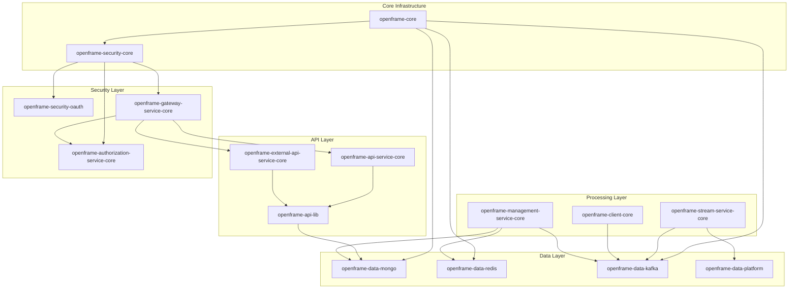

# Development Documentation

Welcome to the **OpenFrame OSS Lib development documentation**. This section provides comprehensive guides for developing, extending, and contributing to the OpenFrame platform foundation.

## 📚 Documentation Structure

This development documentation is organized into focused sections:

| Section | Purpose | Audience |
|---------|---------|----------|
| **[Setup](setup/)** | Development environment configuration | All developers |
| **[Architecture](architecture/)** | System design and component relationships | Platform engineers, contributors |
| **[Security](security/)** | Authentication, authorization, and security patterns | Security-focused developers |
| **[Testing](testing/)** | Testing strategies, tools, and best practices | All developers |
| **[Contributing](contributing/)** | Code standards and contribution workflow | Contributors |

## 🚀 Quick Navigation

### New to OpenFrame Development?
1. **[Environment Setup](setup/environment.md)** - Configure your IDE and development tools
2. **[Local Development](setup/local-development.md)** - Run the full stack locally
3. **[Architecture Overview](architecture/README.md)** - Understand the system design

### Ready to Contribute?
1. **[Contributing Guidelines](contributing/guidelines.md)** - Code standards and workflow
2. **[Security Guide](security/README.md)** - Security best practices
3. **[Testing Guide](testing/README.md)** - Testing strategies and tools

### Platform Engineering?
1. **[Architecture Deep Dive](architecture/README.md)** - Detailed system design
2. **[Security Architecture](security/README.md)** - Multi-tenant security model
3. **[Environment Configuration](setup/environment.md)** - Production deployment patterns

## 🏗️ Development Philosophy

OpenFrame OSS Lib is built with these core principles:

### **Multi-Tenant by Design**
Every component assumes multi-tenant architecture from day one:
- Tenant-scoped data access
- Isolated security contexts  
- Per-tenant configuration
- Scalable resource isolation

### **Event-Driven Architecture**
Communication between components uses events:
- Kafka for inter-service messaging
- NATS for real-time agent communication
- Debezium for data change streams
- Reactive programming patterns

### **API-First Development**
All functionality exposed via well-defined APIs:
- GraphQL for complex queries with cursor pagination
- REST for command operations and external integrations
- OpenAPI documentation for all endpoints
- SDK patterns for tool integrations

### **Security as Foundation**
Security is embedded at every layer:
- Asymmetric JWT (RS256) for token validation
- OAuth2 Authorization Server with OIDC support
- API key management with rate limiting
- Multi-tenant key isolation

## 📋 Development Checklist

### Before You Start

- [ ] **Java 21** installed and configured
- [ ] **Maven 3.8+** for build management
- [ ] **Docker** for development dependencies
- [ ] **Git** configured with your identity
- [ ] **IDE** set up with required plugins

### Development Environment

- [ ] **Local database** (MongoDB, Redis) running
- [ ] **Message queue** (Kafka) configured for event testing
- [ ] **Environment variables** set for local development
- [ ] **Test data** generated using provided utilities
- [ ] **Integration tests** passing for core modules

### Code Quality Standards

- [ ] **Lombok** used for reducing boilerplate
- [ ] **Spring Boot conventions** followed
- [ ] **Multi-tenant patterns** implemented correctly
- [ ] **Error handling** using standardized responses
- [ ] **Documentation** updated for new features

## 🔧 Common Development Tasks

### Adding a New Module

```bash
# 1. Create module structure following existing patterns
mkdir openframe-new-module
cd openframe-new-module

# 2. Create pom.xml inheriting from parent
# 3. Implement core functionality with Spring Boot
# 4. Add integration tests
# 5. Update parent pom.xml modules section
# 6. Document in architecture section
```

### Integrating External Tools

```bash
# 1. Create SDK in sdk/ directory
mkdir sdk/newtool

# 2. Implement client interface
# 3. Add event deserializers in stream-processing-core
# 4. Update enrichment services
# 5. Register tool type in data-platform-core
```

### Extending API Endpoints

```bash
# For internal APIs (GraphQL + REST)
cd openframe-api-service-core

# For external APIs (REST only)
cd openframe-external-api-service-core

# Add controllers, services, DTOs, and tests
```

## 📊 Module Dependency Graph



## 🎯 Development Patterns

### Repository Pattern
```java
// Follow the established repository pattern
public interface CustomRepository extends MongoRepository<Entity, String> {
    // Custom query methods
    Page<Entity> findByTenantIdAndStatus(String tenantId, Status status, Pageable pageable);
    
    // Use @Query for complex operations
    @Query("{ 'tenantId': ?0, 'metadata.type': ?1 }")
    List<Entity> findByTenantAndType(String tenantId, String type);
}
```

### Service Layer Pattern
```java
@Service
@RequiredArgsConstructor
@Slf4j
public class CustomService {
    private final CustomRepository repository;
    private final EventPublisher eventPublisher;
    
    @Transactional
    public CustomEntity create(CreateRequest request, String tenantId) {
        // Validation
        // Business logic
        // Persistence
        // Event publishing
        return entity;
    }
}
```

### Controller Pattern
```java
@RestController
@RequestMapping("/api/v1/custom")
@RequiredArgsConstructor
@Validated
public class CustomController {
    private final CustomService customService;
    
    @PostMapping
    public ResponseEntity<CustomResponse> create(
        @Valid @RequestBody CreateRequest request,
        @AuthenticationPrincipal AuthPrincipal principal
    ) {
        // Use AuthPrincipal for tenant context
        return ResponseEntity.ok(customService.create(request, principal.getTenantId()));
    }
}
```

## 📈 Performance Guidelines

### Database Optimization
- **Use cursor pagination** instead of offset-based pagination
- **Index tenant fields** for multi-tenant queries
- **Implement caching** for frequently accessed data
- **Use projections** to limit data transfer

### Event Processing
- **Batch events** when possible to reduce overhead
- **Use async processing** for non-critical operations
- **Implement retry logic** with exponential backoff
- **Monitor lag** in event stream processing

### Security Performance
- **Cache JWT validation** to avoid repeated cryptographic operations
- **Use connection pooling** for database and Redis connections
- **Implement rate limiting** to prevent abuse
- **Monitor authentication metrics**

## 🐛 Debugging and Troubleshooting

### Common Issues

#### Multi-tenant Context Issues
```bash
# Check tenant context in logs
grep "tenantId" application.log

# Verify JWT token claims
echo "<jwt-token>" | base64 -d | jq .
```

#### Database Connection Issues
```bash
# Test MongoDB connection
mongosh --eval "db.adminCommand('ping')"

# Test Redis connection
redis-cli ping

# Check connection pool status
# Add logging to application.yml
```

#### Event Processing Delays
```bash
# Check Kafka consumer lag
kafka-consumer-groups.sh --bootstrap-server localhost:9092 --describe --group openframe-streams

# Monitor processing metrics
# Check stream-processing-core logs
```

## 📚 Additional Resources

### External Documentation
- **Spring Boot**: [spring.io/projects/spring-boot](https://spring.io/projects/spring-boot)
- **MongoDB**: [docs.mongodb.com](https://docs.mongodb.com)
- **Apache Kafka**: [kafka.apache.org/documentation](https://kafka.apache.org/documentation)
- **Spring Security OAuth2**: [spring.io/projects/spring-security-oauth](https://spring.io/projects/spring-security-oauth)

### Community Resources
- **OpenMSP Slack**: [Join Community](https://join.slack.com/t/openmsp/shared_invite/zt-36bl7mx0h-3~U2nFH6nqHqoTPXMaHEHA)
- **OpenFrame Platform**: [openframe.ai](https://openframe.ai)
- **Flamingo Website**: [flamingo.run](https://flamingo.run)

---

**Ready to start developing?** Begin with the [Environment Setup Guide](setup/environment.md) to configure your development workspace.