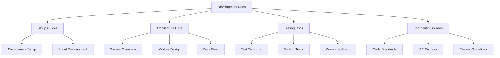
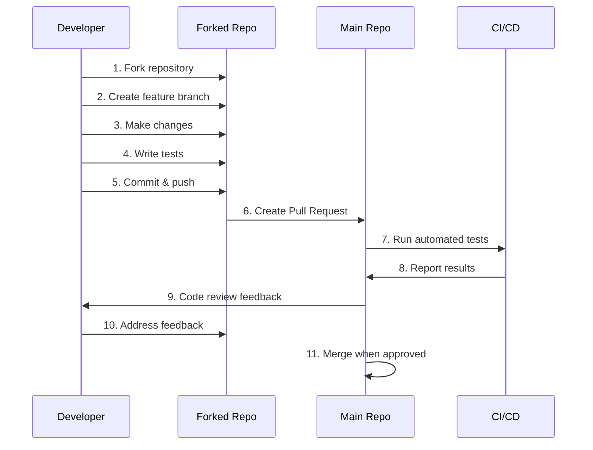

# Development Documentation

Welcome to the development documentation for the OpenFrame OSS Library. This section provides comprehensive guidance for developers who want to contribute to, extend, or deeply understand the library's implementation.

## 📚 Documentation Structure

This development documentation is organized into focused sections to help you find exactly what you need:



## 🛠️ Setup & Environment

Get your development environment ready for contributing to the OpenFrame OSS Library.

| Guide | Purpose | Estimated Time |
|-------|---------|----------------|
| **[Environment Setup](setup/environment.md)** | Configure IDE, tools, and plugins | 15-30 min |
| **[Local Development](setup/local-development.md)** | Clone, build, and run locally | 10-15 min |

### Quick Setup Checklist

- [ ] Java 17+ installed
- [ ] Maven 3.8+ configured
- [ ] IDE with Lombok plugin
- [ ] Repository cloned locally
- [ ] Build successful (`mvn clean compile`)
- [ ] Tests passing (`mvn test`)

## 🏗️ Architecture & Design

Understand how the library is structured and why design decisions were made.

| Document | Focus Area | Audience |
|----------|------------|----------|
| **[Architecture Overview](architecture/overview.md)** | High-level system design | All developers |
| Module 1 Design | Core DTOs and utilities | Backend developers |
| Module 2 Design | Extended filtering features | API developers |

### Key Architectural Concepts

- **DTO-First Design**: Clean separation of data structures
- **Builder Pattern**: Fluent, safe object creation
- **Generic Query Support**: Flexible result handling
- **Lombok Integration**: Reduced boilerplate code
- **Type Safety**: Strong typing throughout

## 🧪 Testing Strategy

Learn how to write, run, and maintain tests for the library.

| Resource | Coverage | Complexity |
|----------|----------|------------|
| **[Testing Overview](testing/overview.md)** | Test philosophy and structure | Beginner |
| Unit Testing Guide | Individual class testing | Intermediate |
| Integration Testing | Module interaction tests | Advanced |

### Testing Principles

1. **Comprehensive Coverage**: Aim for 90%+ code coverage
2. **Behavior-Driven**: Test what the code should do, not how
3. **Fast Execution**: Keep test suites running quickly
4. **Clear Assertions**: Make test failures easy to understand

## 🤝 Contributing

Guidelines for contributing code, documentation, and improvements.

| Guide | Purpose | Required Reading |
|-------|---------|------------------|
| **[Contributing Guidelines](contributing/guidelines.md)** | Code standards and process | ✅ Required |
| Pull Request Template | Structured contribution format | ✅ Required |
| Code Review Checklist | Quality assurance guidelines | Recommended |

### Contribution Workflow



## 📊 Development Metrics

Track the health and progress of the development process.

### Code Quality Metrics

| Metric | Target | Current | Trend |
|--------|--------|---------|-------|
| **Test Coverage** | ≥90% | TBD | 📊 |
| **Build Success** | 100% | TBD | 📊 |
| **Code Complexity** | Low | TBD | 📊 |
| **Documentation** | Complete | TBD | 📊 |

### Performance Benchmarks

| Operation | Target | Measurement |
|-----------|--------|-------------|
| **DTO Creation** | <1ms | Builder pattern performance |
| **Filter Processing** | <10ms | Complex filter evaluation |
| **Serialization** | <5ms | JSON/XML conversion |

## 🔧 Development Tools

Essential tools and utilities for effective development.

### Required Tools

- **Java Development Kit 17+**: Language runtime
- **Apache Maven 3.8+**: Build and dependency management
- **IntelliJ IDEA / Eclipse**: IDE with Lombok support
- **Git 2.30+**: Version control

### Recommended Tools

- **Maven Wrapper**: Consistent Maven versions
- **Checkstyle**: Code style enforcement
- **SpotBugs**: Static analysis
- **JaCoCo**: Code coverage reporting

### IDE Setup Scripts

We provide setup scripts for common IDEs:

```bash
# IntelliJ IDEA setup
./scripts/setup-intellij.sh

# Eclipse setup  
./scripts/setup-eclipse.sh

# VS Code setup
./scripts/setup-vscode.sh
```

## 🐛 Debugging & Troubleshooting

Common development issues and their solutions.

### Frequent Issues

<details>
<summary><strong>Lombok not working in IDE</strong></summary>

**Symptoms**: Getters/setters show as missing, compilation errors

**Solution**:
1. Install Lombok plugin in your IDE
2. Enable annotation processing
3. Restart IDE
4. Rebuild project

</details>

<details>
<summary><strong>Build fails with dependency issues</strong></summary>

**Symptoms**: Maven cannot download dependencies

**Solution**:
1. Check internet connectivity
2. Clear Maven cache: `mvn dependency:purge-local-repository`
3. Update dependencies: `mvn clean install -U`

</details>

<details>
<summary><strong>Tests fail locally but pass in CI</strong></summary>

**Symptoms**: Inconsistent test results

**Solution**:
1. Check Java version consistency
2. Verify Maven settings
3. Clear target directory: `mvn clean`
4. Check for hardcoded paths or system dependencies

</details>

## 📖 Additional Resources

### External Documentation

- **[Lombok Documentation](https://projectlombok.org/features/all)**: Master Lombok features
- **[Maven Guide](https://maven.apache.org/guides/)**: Build system best practices
- **[JUnit 5 User Guide](https://junit.org/junit5/docs/current/user-guide/)**: Modern Java testing

### Community & Support

- **GitHub Issues**: Report bugs and request features
- **Discussions**: Ask questions and share ideas
- **Wiki**: Community-maintained documentation
- **Slack/Discord**: Real-time developer chat _(if available)_

## 🚀 Getting Started

Ready to contribute? Here's your path:

1. **Start with [Environment Setup](setup/environment.md)** - Get your tools configured
2. **Read [Local Development](setup/local-development.md)** - Clone and build the project
3. **Study [Architecture Overview](architecture/overview.md)** - Understand the system
4. **Review [Contributing Guidelines](contributing/guidelines.md)** - Learn our standards
5. **Pick a good first issue** - Start with something manageable

## 💡 Quick Tips for New Contributors

- **Start small**: Look for "good first issue" labels
- **Ask questions**: Use GitHub Discussions for help
- **Read existing code**: Learn patterns and conventions
- **Write tests**: Always include tests with your changes
- **Update documentation**: Keep docs in sync with code changes

---

> **🎯 Goal**: Make the OpenFrame OSS Library the best it can be through collaborative development, comprehensive testing, and clear documentation.

**Happy coding!** 🚀