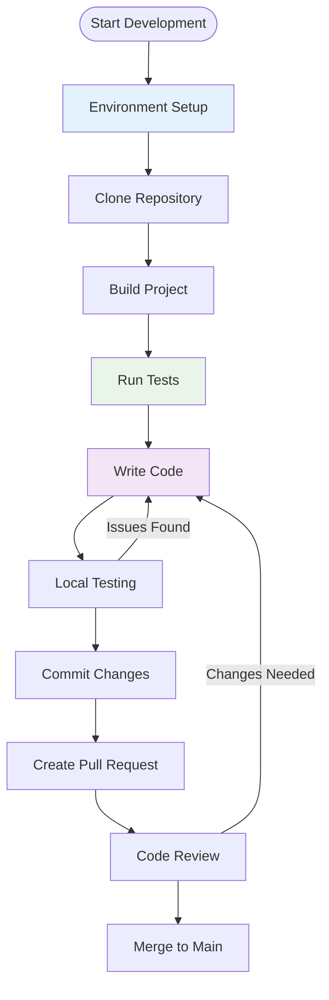

# Development Documentation

Welcome to the OpenFrame OSS Library development documentation. This section contains comprehensive guides for developers working on or contributing to the library.

## 📋 Quick Navigation

### Getting Started with Development
- **[Environment Setup](setup/environment.md)** - Configure your development environment
- **[Local Development](setup/local-development.md)** - Clone, build, and run locally

### Architecture & Design  
- **[Architecture Overview](architecture/overview.md)** - High-level system design and component relationships
- **Module Documentation**:
  - [module_1](../reference/architecture/module_1.md) - Audit & Device DTOs
  - [module_2](../reference/architecture/module_2.md) - Query Results & Filters

### Testing & Quality
- **[Testing Overview](testing/overview.md)** - Test structure, execution, and best practices
- Code Coverage Requirements
- Quality Gates and CI/CD Integration

### Contributing
- **[Contributing Guidelines](contributing/guidelines.md)** - Code style, PR process, and review standards
- Coding Conventions and Standards
- Branch Strategy and Release Process

## 🏗️ Development Workflow



## 🛠️ Development Environment

### Prerequisites
- **Java**: JDK 8+ (JDK 11 or 17 LTS recommended)
- **Build Tools**: Maven 3.6+ or Gradle 6.0+
- **IDE**: IntelliJ IDEA, Eclipse, or VS Code with Java extensions
- **Git**: Version 2.20+

### Required IDE Plugins
- **Lombok**: For annotation processing
- **Java Language Support**: For syntax highlighting and IntelliSense
- **Maven/Gradle Integration**: For dependency management

## 📁 Project Structure

```text
openframe-oss-lib/
├── src/
│   └── main/
│       └── java/
│           └── com/openframe/api/dto/
│               ├── audit/              # Audit-related DTOs
│               ├── device/             # Device-related DTOs  
│               ├── shared/             # Shared utilities
│               ├── GenericQueryResult.java
│               └── CountedGenericQueryResult.java
├── docs/
│   ├── getting-started/               # User onboarding docs
│   ├── development/                   # Development docs (this section)
│   └── reference/                     # API reference docs
├── pom.xml                           # Maven configuration
└── README.md                         # Project overview
```

## 🔧 Core Components Overview

| Component | Package | Purpose |
|-----------|---------|---------|
| **LogEvent** | `audit` | Basic audit event representation |
| **LogDetails** | `audit` | Extended audit event with details |
| **LogFilters** | `audit` | Audit log filtering criteria |
| **DeviceFilterOptions** | `device` | Device filtering capabilities |
| **GenericQueryResult** | `root` | Generic paginated query results |
| **CountedGenericQueryResult** | `root` | Query results with total counts |

## 🧪 Testing Strategy

### Test Categories
- **Unit Tests**: Component-level testing with JUnit
- **Integration Tests**: Multi-component interaction testing
- **JSON Serialization Tests**: Ensure proper JSON mapping
- **Builder Pattern Tests**: Validate Lombok-generated builders

### Coverage Requirements
- **Minimum Coverage**: 80% line coverage
- **Critical Paths**: 95% coverage for core DTOs
- **New Features**: 100% coverage requirement

## 📚 Documentation Standards

### Code Documentation
- **Javadoc**: All public classes and methods
- **Inline Comments**: Complex logic and business rules
- **README Updates**: For new features and breaking changes

### Architecture Documentation
- **Mermaid Diagrams**: For component relationships
- **Sequence Diagrams**: For data flow illustrations
- **Decision Records**: For significant architectural choices

## 🚀 Release Process

### Version Strategy
- **Semantic Versioning**: `MAJOR.MINOR.PATCH`
- **Release Branches**: `release/v1.2.0`
- **Hotfix Branches**: `hotfix/v1.1.1`

### Release Checklist
1. ✅ All tests passing
2. ✅ Documentation updated
3. ✅ Version numbers bumped
4. ✅ Changelog updated
5. ✅ Security review completed

## 🔍 Development Tools

### Code Quality
- **Checkstyle**: Code formatting and style enforcement
- **SpotBugs**: Static analysis for bug detection
- **Lombok**: Boilerplate code reduction
- **Maven/Gradle**: Dependency management and builds

### Development Utilities
- **IDE Formatters**: Consistent code formatting
- **Git Hooks**: Pre-commit validation
- **CI/CD Pipelines**: Automated testing and deployment

## 🤝 Community Guidelines

### Communication Channels
- **Issues**: Bug reports and feature requests
- **Discussions**: General questions and ideas
- **Pull Requests**: Code contributions and reviews

### Code of Conduct
- **Respectful Communication**: Professional and constructive feedback
- **Inclusive Environment**: Welcoming to all contributors
- **Collaborative Approach**: Working together towards common goals

## 📈 Performance Considerations

### DTO Design Principles
- **Immutable Objects**: Thread-safe and predictable behavior
- **Lightweight Structure**: Minimal memory footprint
- **Efficient Serialization**: Fast JSON marshaling/unmarshaling

### Best Practices
- **Builder Pattern**: Flexible object creation
- **Generic Types**: Type-safe collections
- **Null Safety**: Proper null handling strategies

## 🔒 Security Guidelines

### Data Handling
- **Sensitive Information**: Proper handling of PII and credentials
- **Input Validation**: Defensive programming practices
- **Audit Trail**: Comprehensive logging for security events

### Dependency Management
- **Regular Updates**: Keep dependencies current
- **Security Scanning**: Automated vulnerability detection
- **License Compliance**: Ensure compatible open-source licenses

---

## 📖 Quick Start for New Developers

1. **[Set up your environment](setup/environment.md)** - Get your development environment ready
2. **[Clone and build locally](setup/local-development.md)** - Get the code running on your machine  
3. **[Understand the architecture](architecture/overview.md)** - Learn how the components fit together
4. **[Run the tests](testing/overview.md)** - Ensure everything works correctly
5. **[Read contributing guidelines](contributing/guidelines.md)** - Understand our development process

Ready to contribute? Start with the [Contributing Guidelines](contributing/guidelines.md) to understand our development workflow and coding standards.

---

**Need Help?** Check the specific guides linked above, or reach out through our community channels for assistance with development questions.