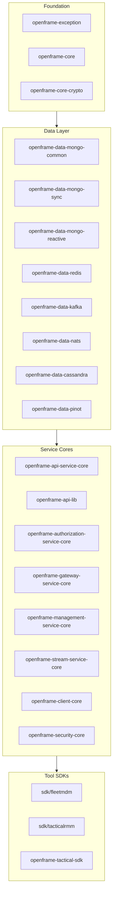

# Development Documentation

Welcome to the `openframe-oss-lib` development documentation. This section covers everything you need to contribute to and work with the OpenFrame OSS library modules.

---

## Quick Navigation

| Document | Description |
|----------|-------------|
| [Environment Setup](./setup/environment.md) | IDE, tools, and editor configuration |
| [Local Development](./setup/local-development.md) | Clone, build, run, and debug locally |
| [Architecture Overview](./architecture/README.md) | System design, module relationships, and data flows |
| [Security Guidelines](./security/README.md) | Authentication, authorization, and secrets management |
| [Testing Guide](./testing/README.md) | Test structure, running tests, and writing new tests |
| [Contributing Guidelines](./contributing/guidelines.md) | Code style, branching, commit messages, and PR process |

---

## Technology Stack

`openframe-oss-lib` is built on the following technology stack:

### Backend
| Technology | Version | Role |
|-----------|---------|------|
| **Java** | 21 | Primary language |
| **Spring Boot** | 3.3.0 | Application framework |
| **Spring Cloud** | 2023.0.3 | Cloud-native patterns |
| **Netflix DGS** | 9.0.3 | GraphQL framework |
| **MongoDB** | Reactive + Sync | Primary data store |
| **Apache Kafka** | 3.x | Event streaming |
| **NATS** | 0.6.2+3.5 | Lightweight messaging |
| **Redis** | Spring Data Redis | Caching + distributed locks |
| **Apache Cassandra** | – | Event log storage |
| **Apache Pinot** | 1.2.0 | Analytics |
| **gRPC** | 1.58.0 | Internal service communication |
| **Lombok** | 1.18.30 | Boilerplate reduction |
| **JWT (jjwt)** | 0.11.5 | Token handling |
| **Testcontainers** | 1.21.4 | Integration testing |

### Frontend (openframe-frontend-core)
| Technology | Role |
|-----------|------|
| **React** | UI component library |
| **TypeScript** | Type-safe UI development |
| **Tailwind CSS** | Utility-first styling |
| **NATS WebSocket** | Real-time chat transport |
| **SSE** | Guide mode AI chat transport |
| **Storybook** | Component development and documentation |
| **Vitest** | Unit testing |

---

## Module Organization

The repository follows a layered module structure:

```mermaid
graph TD
    subgraph foundation["Foundation"]
        exception["openframe-exception"]
        core["openframe-core"]
        crypto["openframe-core-crypto"]
    end

    subgraph data["Data Layer"]
        common["openframe-data-mongo-common"]
        sync["openframe-data-mongo-sync"]
        reactive["openframe-data-mongo-reactive"]
        redis["openframe-data-redis"]
        kafka["openframe-data-kafka"]
        nats["openframe-data-nats"]
        cassandra["openframe-data-cassandra"]
        pinot["openframe-data-pinot"]
    end

    subgraph services["Service Cores"]
        api["openframe-api-service-core"]
        apilib["openframe-api-lib"]
        auth["openframe-authorization-service-core"]
        gateway["openframe-gateway-service-core"]
        management["openframe-management-service-core"]
        stream["openframe-stream-service-core"]
        client["openframe-client-core"]
        security["openframe-security-core"]
    end

    subgraph tools["Tool SDKs"]
        fleet["sdk/fleetmdm"]
        tactical["sdk/tacticalrmm"]
        tacticalSdk["openframe-tactical-sdk"]
    end

    foundation --> data
    data --> services
    services --> tools
```

---

## Development Community

All development discussions happen on [OpenMSP Slack](https://www.openmsp.ai/).

- **Questions**: `#dev-questions` channel
- **Feature Requests**: `#roadmap` channel
- **Bug Reports**: `#bugs` channel

Join at: [OpenMSP Slack Invite](https://join.slack.com/t/openmsp/shared_invite/zt-36bl7mx0h-3~U2nFH6nqHqoTPXMaHEHA)
