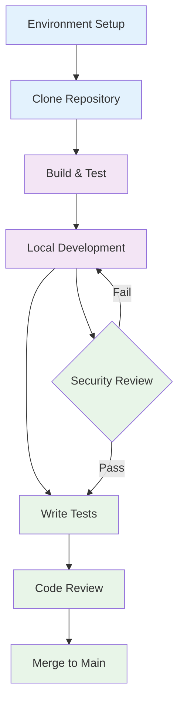

# Development Documentation

Welcome to the OpenFrame OSS Lib development section. This documentation covers everything you need to contribute to, extend, or integrate with the OpenFrame platform's core DTO library.

## Quick Navigation

### Setup & Environment
- [**Environment Setup**](setup/environment.md) - IDE configuration, tools, and development environment
- [**Local Development**](setup/local-development.md) - Clone, build, and run locally with hot reload

### Architecture & Design
- [**Architecture Overview**](architecture/README.md) - High-level design, components, and data flow
- **Reference Documentation** - Detailed module documentation:
  - [Architecture Overview](../reference/architecture/README.md) 
  - [Module 1: Core DTOs](../reference/architecture/module_1/module_1.md)
  - [Module 2: Filtering DTOs](../reference/architecture/module_2/module_2.md)

### Quality & Testing
- [**Security Best Practices**](security/README.md) - Authentication, authorization, and data protection
- [**Testing Overview**](testing/README.md) - Test structure, running tests, and writing new tests

### Contributing
- [**Contributing Guidelines**](contributing/guidelines.md) - Code style, PR process, and review checklist

## Development Workflow Overview

OpenFrame OSS Lib follows a streamlined development workflow designed for both internal team members and external contributors:


```mermaid
flowchart TD
    Setup[Environment Setup] --> Clone[Clone Repository]
    Clone --> Build[Build & Test]
    Build --> Develop[Local Development]
    Develop --> Test[Write Tests]
    Test --> Review[Code Review]
    Review --> Merge[Merge to Main]
    
    Develop --> Security{Security Review}
    Security -->|Pass| Test
    Security -->|Fail| Develop
    
    classDef setup fill:#e3f2fd
    classDef dev fill:#f3e5f5
    classDef quality fill:#e8f5e8
    
    class Setup,Clone setup
    class Build,Develop dev
    class Test,Security,Review,Merge quality
```

## Key Development Principles

### 1. Contract-First Design
All DTOs are designed as **API contracts first**, independent of specific implementations:

```java
// ✅ Good: Generic, reusable contract
public class CountedGenericQueryResult<T> extends GenericQueryResult<T> {
    private int filteredCount;
}

// ❌ Avoid: Implementation-specific details
public class MySQLCountedQueryResult extends GenericQueryResult<T> {
    private String sqlQuery; // Implementation detail
}
```

### 2. Lombok-Driven Development
Minimize boilerplate with consistent Lombok patterns:

```java
@Data
@Builder
@NoArgsConstructor  
@AllArgsConstructor
public class LogEvent {
    private String id;
    private String summary;
    // Lombok generates getters, setters, builder, constructors
}
```

### 3. Multi-Tenant Awareness
All filtering DTOs support organization-scoped queries:

```java
@Data
@Builder
public class LogFilterCriteria {
    private List<String> organizationIds;  // Multi-tenant filtering
    private String deviceId;               // Device-scoped queries
    // ... other criteria
}
```

## Project Structure

```text
openframe-oss-lib/
├── 📁 openframe-api-lib/          # Main library module
│   ├── 📁 src/main/java/
│   │   └── 📁 com/openframe/api/dto/
│   │       ├── 📄 GenericQueryResult.java
│   │       ├── 📄 CountedGenericQueryResult.java
│   │       ├── 📁 audit/           # Module 1: Audit DTOs
│   │       │   ├── 📄 LogEvent.java
│   │       │   ├── 📄 LogDetails.java
│   │       │   ├── 📄 LogFilterCriteria.java
│   │       │   ├── 📄 LogFilters.java          # Module 2
│   │       │   └── 📄 OrganizationFilterOption.java
│   │       └── 📁 device/          # Module 2: Device DTOs  
│   │           ├── 📄 DeviceFilterCriteria.java
│   │           ├── 📄 DeviceFilters.java
│   │           └── 📄 DeviceFilterOption.java
│   └── 📄 pom.xml                 # Module dependencies
├── 📄 pom.xml                     # Root project configuration
└── 📁 docs/                       # Documentation
    ├── 📁 getting-started/
    ├── 📁 development/
    └── 📁 reference/
```

## Common Development Tasks

### Adding a New DTO

```bash
# 1. Create the DTO class
touch openframe-api-lib/src/main/java/com/openframe/api/dto/MyNewDTO.java

# 2. Follow the standard pattern
cat > MyNewDTO.java << 'EOF'
package com.openframe.api.dto;

import lombok.AllArgsConstructor;
import lombok.Builder;
import lombok.Data;
import lombok.NoArgsConstructor;

@Data
@Builder
@NoArgsConstructor
@AllArgsConstructor  
public class MyNewDTO {
    private String id;
    private String name;
}
EOF

# 3. Build and test
mvn clean compile test
```

### Running Local Tests

```bash
# Run all tests
mvn test

# Run specific test class
mvn test -Dtest=MyDTOTest

# Run with verbose output
mvn test -X

# Generate test reports
mvn surefire-report:report
```

### Building for Distribution

```bash
# Clean build
mvn clean compile

# Package JAR
mvn package

# Install to local repository
mvn install

# Deploy to repository (maintainers only)
mvn deploy
```

## Integration Points

### With OpenFrame Platform Services

OpenFrame OSS Lib integrates with these platform components:

| Component | Integration Point | Documentation |
|-----------|-------------------|---------------|
| **API Gateway** | Standardized response formats | [Architecture Docs](../reference/architecture/README.md) |
| **Audit Service** | `LogEvent`, `LogDetails`, `LogFilters` | [Module 1](../reference/architecture/module_1/module_1.md) |
| **Device Service** | `DeviceFilterCriteria`, `DeviceFilters` | [Module 2](../reference/architecture/module_2/module_2.md) |
| **Frontend Apps** | JSON serialization of all DTOs | [First Steps](../getting-started/first-steps.md) |

### With External Systems

```java
// Example: External system integration
@RestController
public class ExternalAPIController {
    
    @PostMapping("/external/devices")
    public CountedGenericQueryResult<DeviceInfo> getDevices(
        @RequestBody DeviceFilterCriteria criteria) {
        
        // Convert to external system format
        ExternalDeviceQuery query = converter.toExternal(criteria);
        
        // Call external system
        ExternalDeviceResponse response = externalService.query(query);
        
        // Convert back to OpenFrame DTOs
        return converter.fromExternal(response);
    }
}
```

## Development Environment Variations

### For Core Team Members

```bash
# Full repository access
git clone git@github.com:openframe/openframe-oss-lib.git

# Direct push access to feature branches
git checkout -b feature/new-dto-type
git push origin feature/new-dto-type
```

### For External Contributors

```bash
# Fork-based workflow
gh repo fork openframe/openframe-oss-lib
git clone git@github.com:YOUR_USERNAME/openframe-oss-lib.git

# Create PR to main repository
git checkout -b feature/my-contribution
# ... make changes ...
gh pr create --title "Add new DTO for X" --body "Description"
```

### For API Consumers

```xml
<!-- Add dependency to your project -->
<dependency>
    <groupId>com.openframe.api</groupId>
    <artifactId>openframe-api-lib</artifactId>
    <version>1.0.0</version>
</dependency>
```

## Documentation Standards

All development contributions should include:

- **JavaDoc** for public APIs
- **Unit tests** for new DTOs
- **Integration examples** for complex patterns  
- **Architectural decision records** for design changes

Example JavaDoc:
```java
/**
 * Represents a paginated query result with filtered count information.
 * 
 * <p>This DTO extends {@link GenericQueryResult} to include the total number 
 * of records matching the applied filter criteria, enabling accurate pagination 
 * displays in client applications.
 * 
 * @param <T> the type of items in the result set
 * @since 1.0.0
 * @see GenericQueryResult
 * @see LogFilterCriteria
 */
@Data
public class CountedGenericQueryResult<T> extends GenericQueryResult<T> {
    // ...
}
```

## Getting Started

Ready to contribute? Start here:

1. [**Environment Setup**](setup/environment.md) - Configure your development environment
2. [**Local Development**](setup/local-development.md) - Get the code running locally
3. [**Architecture Overview**](architecture/README.md) - Understand the design principles
4. [**Contributing Guidelines**](contributing/guidelines.md) - Learn the contribution process

## Community

- **Slack**: [OpenMSP Community](https://join.slack.com/t/openmsp/shared_invite/zt-36bl7mx0h-3~U2nFH6nqHqoTPXMaHEHA) - Get help and discuss development
- **GitHub**: [Repository Issues](https://github.com/openframe/openframe-oss-lib/issues) - Report bugs and request features  
- **Platform**: [OpenFrame](https://openframe.ai) - See the DTOs in action
- **Company**: [Flamingo](https://flamingo.run) - Learn about the broader MSP platform

---

*This library powers the entire OpenFrame platform by providing consistent, type-safe data contracts. Your contributions help make AI-powered MSP solutions accessible to everyone.*