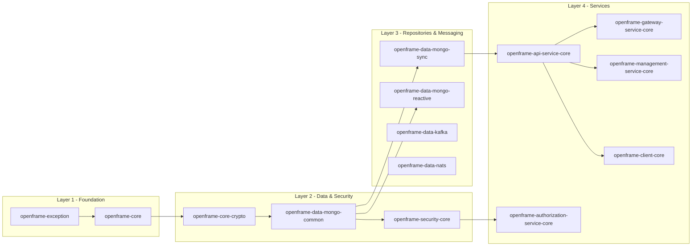

# Development Documentation

Welcome to the OpenFrame OSS Lib development documentation. This section covers everything you need to set up, build, test, and contribute to the library.

---

## Quick Navigation

| Document | Description |
|----------|-------------|
| [Environment Setup](setup/environment.md) | IDE configuration, editor plugins, and dev tools |
| [Local Development](setup/local-development.md) | Clone, build, run, and debug locally |
| [Architecture Overview](architecture/README.md) | High-level system design and module relationships |
| [Security Guide](security/README.md) | Authentication, JWT, secrets management |
| [Testing Guide](testing/README.md) | Unit tests, integration tests, test utilities |
| [Contributing Guidelines](contributing/guidelines.md) | Code style, branch naming, PR process |

---

## Technology Stack

`openframe-oss-lib` is built on:

| Technology | Version | Role |
|------------|---------|------|
| **Java** | 21 | Primary language (Virtual Threads, Records, Sealed Classes) |
| **Spring Boot** | 3.3.0 | Application framework |
| **Spring Cloud Gateway** | 2023.0.3 | Reactive API gateway |
| **Spring Authorization Server** | 1.3.1 | OAuth2/OIDC server |
| **Spring Data MongoDB** | 4.2.0 | MongoDB persistence |
| **Netflix DGS** | 9.0.3 | GraphQL framework |
| **Apache Kafka** | via Spring Cloud | Event streaming |
| **NATS** | 0.6.2+3.5 | Real-time messaging |
| **Apache Pinot** | 1.2.0 | Analytics query engine |
| **Lombok** | 1.18.30 | Code generation |
| **JJWT** | 0.11.5 | JWT utilities |
| **gRPC** | 1.58.0 | Internal service communication |
| **Testcontainers** | 1.21.4 | Integration test infrastructure |

---

## Repository Structure

```text
openframe-oss-lib/
├── pom.xml                              # Parent POM (BOM + shared config)
├── openframe-exception/                 # Exception hierarchy
├── openframe-core/                      # Core utilities
├── openframe-core-crypto/               # Encryption services
├── openframe-security-core/             # JWT infrastructure
├── openframe-security-oauth/            # OAuth BFF layer
├── openframe-api-lib/                   # Shared DTO contracts
├── openframe-api-service-core/          # REST + GraphQL API
├── openframe-authorization-service-core/# OAuth2/OIDC server
├── openframe-gateway-service-core/      # Reactive gateway
├── openframe-client-core/               # Agent ingress
├── openframe-management-service-core/   # Management + schedulers
├── openframe-data-mongo-common/         # Domain documents
├── openframe-data-mongo-sync/           # MongoDB repositories
├── openframe-data-mongo-reactive/       # Reactive repositories
├── openframe-data-redis/                # Redis support
├── openframe-data-kafka/                # Kafka support
├── openframe-data-nats/                 # NATS support
├── openframe-data-pinot/                # Pinot support
├── openframe-data-cassandra/            # Cassandra support
├── openframe-data-device-aspect/        # Device event aspects
├── openframe-stream-service-core/       # Stream processing
├── openframe-external-api-service-core/ # External REST API
├── openframe-debezium-initializer/      # Debezium CDC
├── openframe-pinot-initializer/         # Pinot schema init
├── openframe-notification-mail/         # Email notifications
├── openframe-config-core/               # Config server
├── openframe-fe-feature-flags/          # Feature flags
├── openframe-test-service-core/         # Test utilities
├── sdk/
│   ├── fleetmdm/                        # Fleet MDM SDK
│   └── tacticalrmm/                     # Tactical RMM SDK
└── openframe-frontend-core/             # Shared frontend components (React)
```

---

## Module Dependency Layers


```mermaid
graph LR
    subgraph Layer1["Layer 1 - Foundation"]
        E["openframe-exception"]
        C["openframe-core"]
    end

    subgraph Layer2["Layer 2 - Data & Security"]
        M["openframe-data-mongo-common"]
        SEC["openframe-security-core"]
        CRYPTO["openframe-core-crypto"]
    end

    subgraph Layer3["Layer 3 - Repositories & Messaging"]
        MS["openframe-data-mongo-sync"]
        MR["openframe-data-mongo-reactive"]
        KF["openframe-data-kafka"]
        NT["openframe-data-nats"]
    end

    subgraph Layer4["Layer 4 - Services"]
        API["openframe-api-service-core"]
        AUTH["openframe-authorization-service-core"]
        GW["openframe-gateway-service-core"]
        MGMT["openframe-management-service-core"]
        CLI["openframe-client-core"]
    end

    E --> C
    C --> CRYPTO
    CRYPTO --> M
    M --> SEC
    M --> MS
    M --> MR
    MS --> API
    SEC --> AUTH
    API --> GW
    API --> MGMT
    API --> CLI
```

---

## Getting Started

If you haven't already:

1. Review [Prerequisites](../getting-started/prerequisites.md)
2. Follow [Local Development](setup/local-development.md) to set up your environment
3. Read [Architecture Overview](architecture/README.md) before writing code

---

## Community Support

> All development discussions happen on **OpenMSP Slack** — no GitHub Issues or Discussions.
>
> 💬 [https://www.openmsp.ai/](https://www.openmsp.ai/)
