# Architecture Overview

OpenFrame OSS Libraries implements a sophisticated, multi-layered architecture designed for scalability, maintainability, and multi-tenancy. This guide provides a comprehensive understanding of the system design, core patterns, and architectural decisions.

## High-Level System Architecture

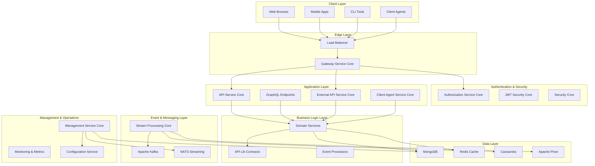

## Core Architectural Principles

### 1. Multi-Tenancy by Design

Every component is built with tenant isolation as a first-class concern:

- **Data Isolation**: MongoDB collections include `tenantId` fields
- **Security Context**: JWT tokens carry tenant information
- **Cache Separation**: Redis keys include tenant prefixes
- **Event Streaming**: Kafka topics are tenant-aware

```java
// Example of tenant-aware service
@Service
@RequiredArgsConstructor
public class OrganizationService {
    
    public List<Organization> findByTenant(String tenantId) {
        return repository.findByTenantId(tenantId);
    }
    
    @EventListener
    public void handleOrganizationEvent(OrganizationEvent event) {
        // Event processing is tenant-scoped
        processForTenant(event.getTenantId(), event);
    }
}
```

### 2. Event-Driven Architecture

The system embraces eventual consistency and asynchronous processing:

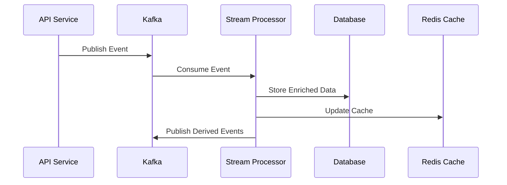

### 3. Domain-Driven Design (DDD)

The architecture follows DDD principles with clear bounded contexts:

| Bounded Context | Responsibility | Key Entities |
|-----------------|----------------|--------------|
| **Identity & Access** | Authentication, authorization | User, Tenant, Role |
| **Organization Management** | MSP organization data | Organization, Contact |
| **Device Management** | Endpoint devices | Machine, Device, Agent |
| **Tool Integration** | External tool connections | Tool, Connection, Credential |
| **Event Processing** | Audit logs, analytics | Event, Log, Metric |
| **Agent Management** | Client agent lifecycle | Agent, Registration, Heartbeat |

### 4. Layered Architecture

Each service follows a consistent layered approach:

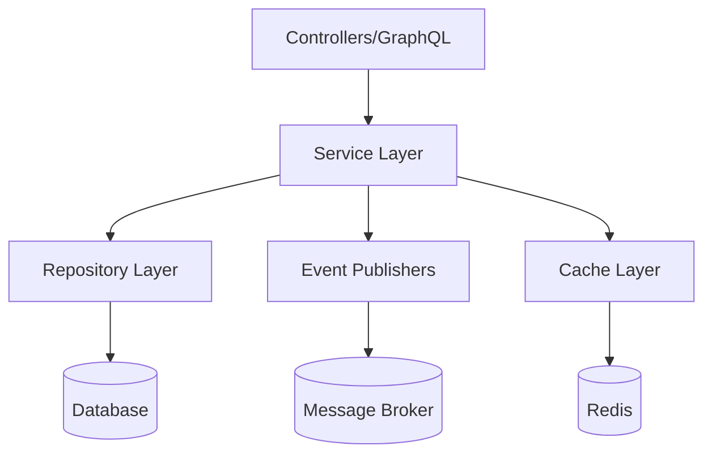

## Core Components Deep Dive

### API Service Core

**Purpose**: Main application orchestration layer

**Key Responsibilities**:
- REST controller endpoints
- GraphQL schema implementation
- Request validation and mapping
- Security context management

**Technology Stack**:
- Spring Boot 3.3.0
- Spring Security OAuth2 Resource Server
- Netflix DGS for GraphQL
- Spring Data MongoDB

**Example Controller Pattern**:
```java
@RestController
@RequestMapping("/api/organizations")
@RequiredArgsConstructor
@Validated
public class OrganizationController {
    
    private final OrganizationService service;
    
    @GetMapping
    public ResponseEntity<Page<Organization>> list(
        @AuthenticationPrincipal AuthPrincipal principal,
        @RequestParam(defaultValue = "0") int page
    ) {
        String tenantId = principal.getTenantId();
        Page<Organization> organizations = service.findByTenant(tenantId, page);
        return ResponseEntity.ok(organizations);
    }
}
```

### Authorization Service Core

**Purpose**: Multi-tenant OAuth2/OIDC authorization server

**Key Features**:
- Per-tenant RSA key pairs
- Dynamic client registration
- SSO provider integration (Google, Microsoft)
- Custom user flows and invitation handling

**Architecture Pattern**:
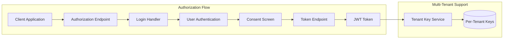

### Gateway Service Core

**Purpose**: Reactive edge gateway with authentication and routing

**Key Features**:
- JWT validation with multi-issuer support
- API key authentication
- Rate limiting per tenant
- WebSocket proxy support
- CORS handling

**Request Flow**:
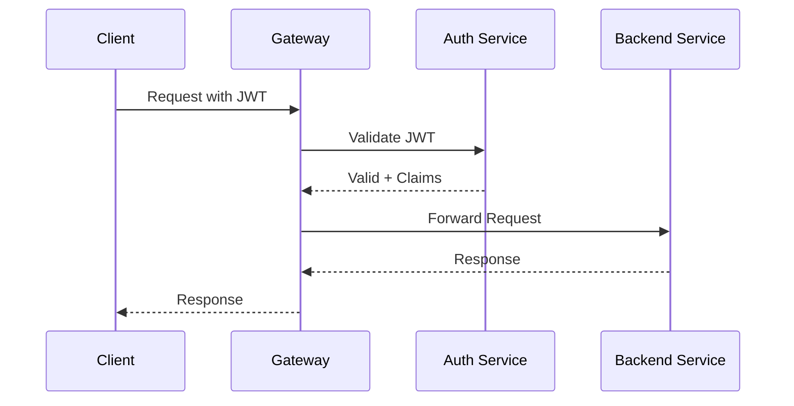

### Stream Processing Service Core

**Purpose**: Real-time event processing and data enrichment

**Processing Pipeline**:
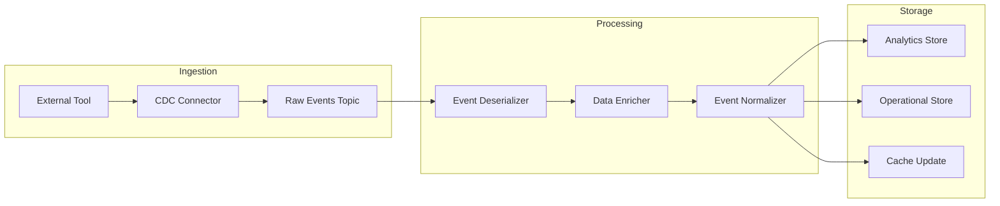

### Data Platform Core

**Purpose**: Multi-database coordination and analytics

**Data Architecture**:

| Database | Purpose | Data Types |
|----------|---------|------------|
| **MongoDB** | Operational data | Users, organizations, configurations |
| **Cassandra** | Time-series data | Audit logs, metrics, events |
| **Apache Pinot** | Real-time analytics | Aggregated metrics, dashboards |
| **Redis** | Caching & sessions | Cache entries, rate limits, locks |

### Client Agent Service Core

**Purpose**: Endpoint agent lifecycle and communication

**Agent Communication Flow**:
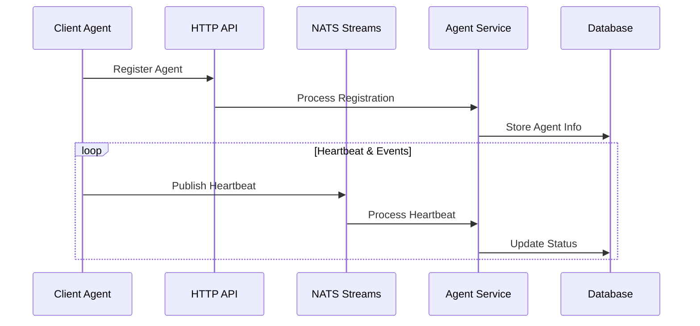

## Data Flow Patterns

### 1. Read Path (Query Operations)

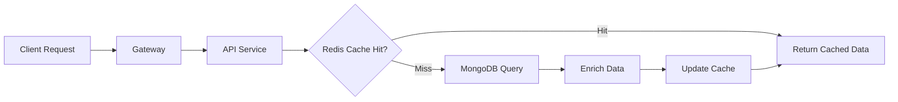

### 2. Write Path (Command Operations)

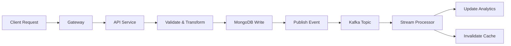

### 3. Event Processing Path

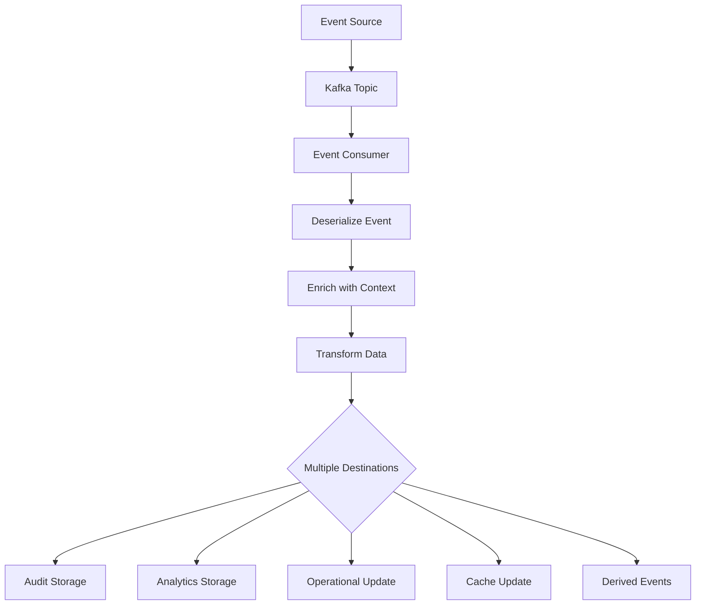

## Security Architecture

### Authentication & Authorization Flow

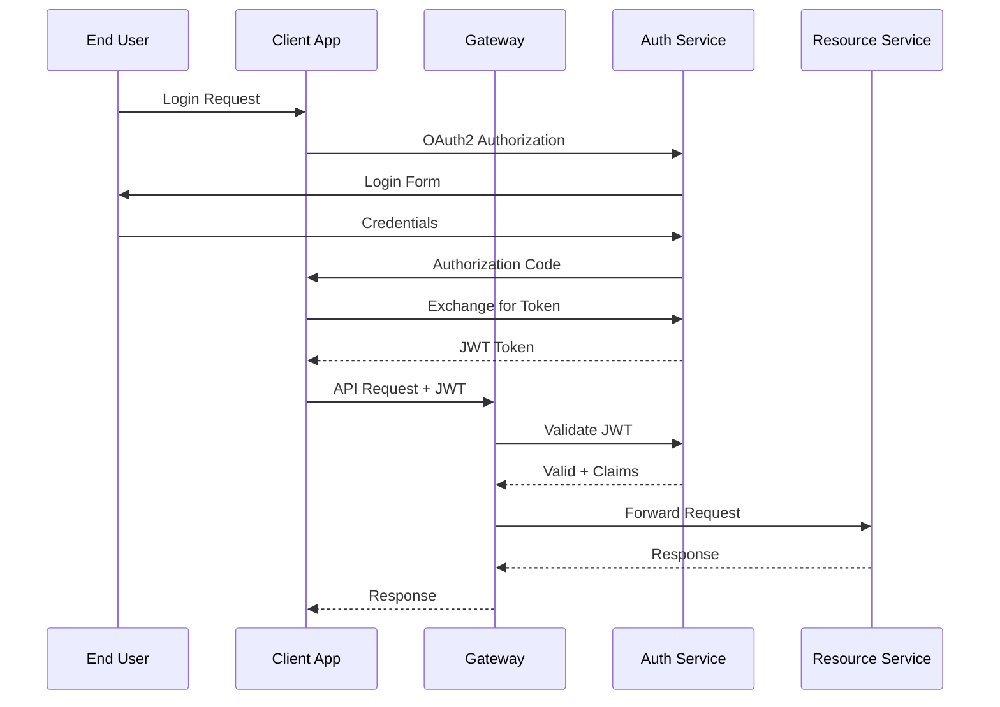

### Multi-Tenant Security Model

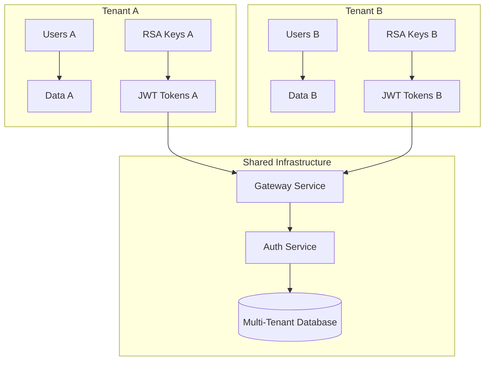

## Performance & Scalability Patterns

### 1. Caching Strategy

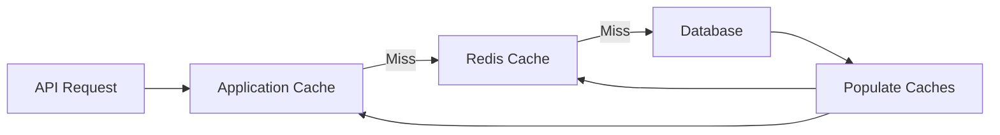

**Cache Levels**:
- **L1 (Application)**: In-memory cache for hot data
- **L2 (Redis)**: Distributed cache for shared data
- **CDN**: Static assets and public content

### 2. Database Sharding

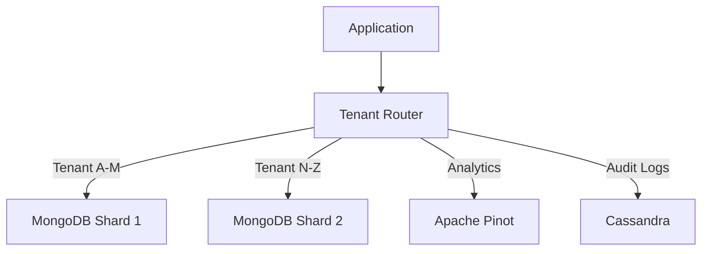

### 3. Event Stream Partitioning

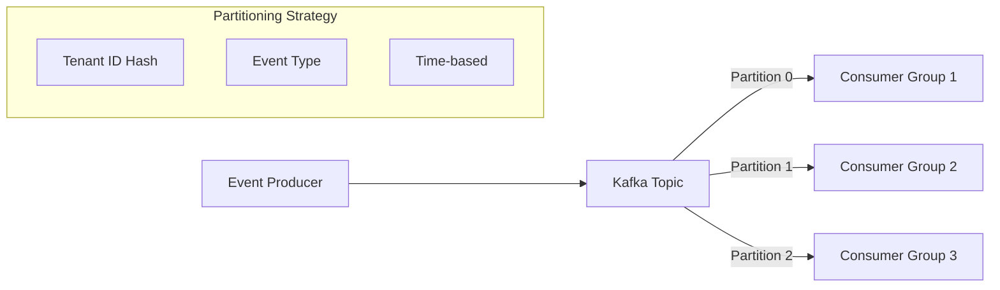

## Monitoring & Observability

### Metrics Collection

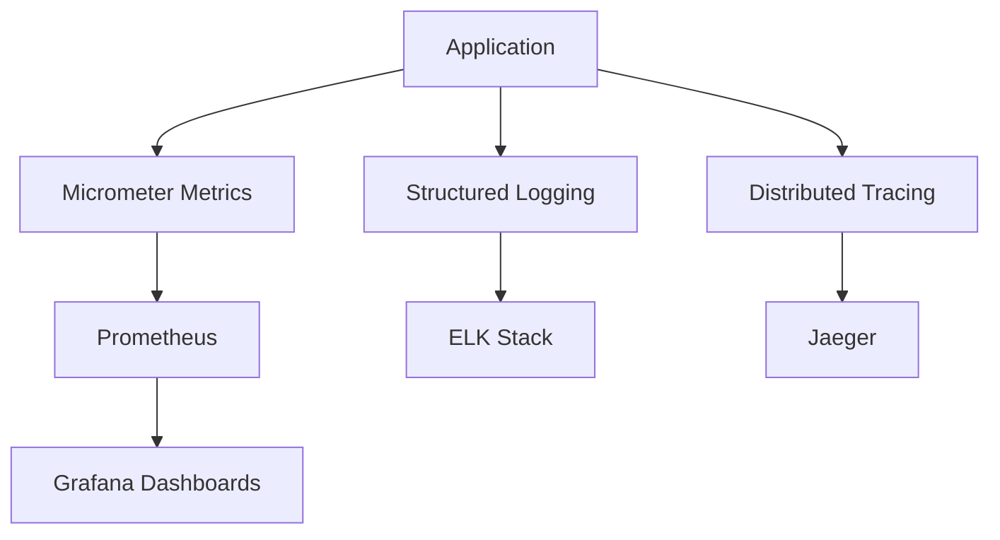

### Key Metrics

| Metric Type | Examples | Purpose |
|-------------|----------|---------|
| **Business** | Organizations created, Devices connected | Feature usage |
| **Application** | Request latency, Error rates | Performance |
| **Infrastructure** | CPU, Memory, Database connections | Resource utilization |
| **Security** | Failed logins, JWT validations | Security monitoring |

## Deployment Architecture

### Container Strategy

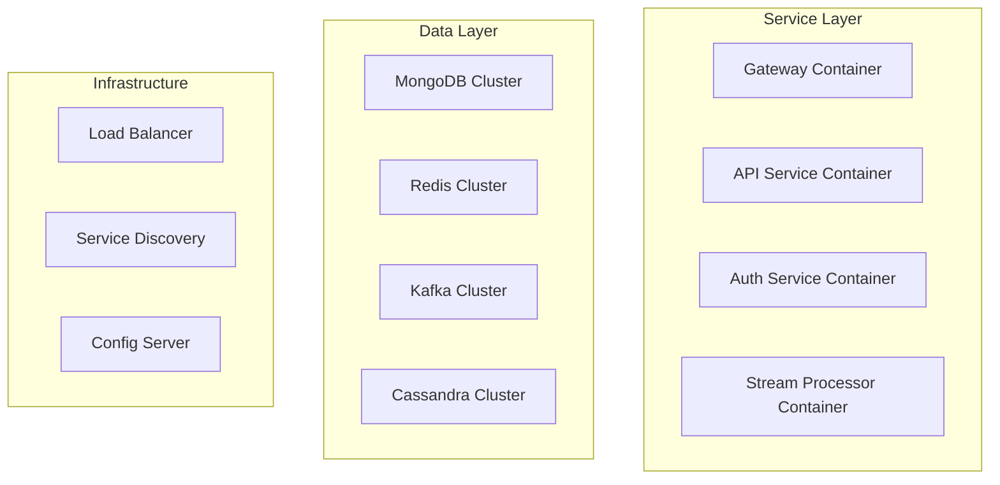

### Scaling Patterns

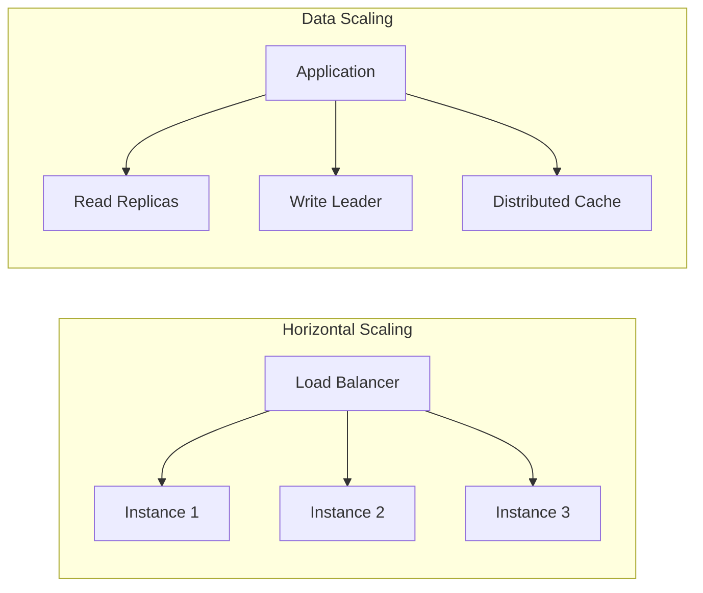

## Design Patterns & Best Practices

### 1. Command Query Responsibility Segregation (CQRS)

```java
// Command side - writes
@Component
public class OrganizationCommandService {
    public void createOrganization(CreateOrganizationCommand command) {
        // Validation and business logic
        Organization org = new Organization(command);
        repository.save(org);
        publisher.publishEvent(new OrganizationCreatedEvent(org));
    }
}

// Query side - reads
@Component 
public class OrganizationQueryService {
    public List<Organization> findByTenant(String tenantId) {
        return queryRepository.findByTenantId(tenantId);
    }
}
```

### 2. Event Sourcing Pattern

```java
@EventHandler
public class OrganizationEventHandler {
    
    @EventListener
    public void on(OrganizationCreatedEvent event) {
        // Update read models
        updateOrganizationView(event);
        updateTenantStatistics(event);
        sendWelcomeNotification(event);
    }
}
```

### 3. Saga Pattern for Distributed Transactions

```java
@Component
public class UserRegistrationSaga {
    
    @SagaOrchestrationStart
    public void startRegistration(UserRegistrationCommand command) {
        // Step 1: Create user
        send(new CreateUserCommand(command));
    }
    
    @SagaOrchestrationStep
    public void onUserCreated(UserCreatedEvent event) {
        // Step 2: Send invitation email
        send(new SendInvitationEmailCommand(event));
    }
    
    // Compensation logic for failures
    @SagaOrchestrationRollback
    public void rollbackUserCreation(UserCreationFailedEvent event) {
        send(new DeleteUserCommand(event.getUserId()));
    }
}
```

## Next Steps

Now that you understand the architecture:

1. **[Security Guidelines](../security/README.md)** - Implement secure, tenant-aware features
2. **[Testing Overview](../testing/README.md)** - Test architectural components effectively
3. **[Contributing Guidelines](../contributing/guidelines.md)** - Follow architectural patterns when contributing

## Additional Resources

- **[API Reference](../../reference/architecture/)** - Detailed module documentation
- **[Spring Boot Architecture Guide](https://spring.io/guides/gs/spring-boot/)**
- **[Microservices Patterns](https://microservices.io/patterns/)**
- **[Domain-Driven Design Reference](https://domainlanguage.com/ddd/reference/)**

---

*This architecture enables OpenFrame OSS Libraries to scale from single-tenant deployments to massive multi-tenant SaaS platforms while maintaining security, performance, and maintainability.*