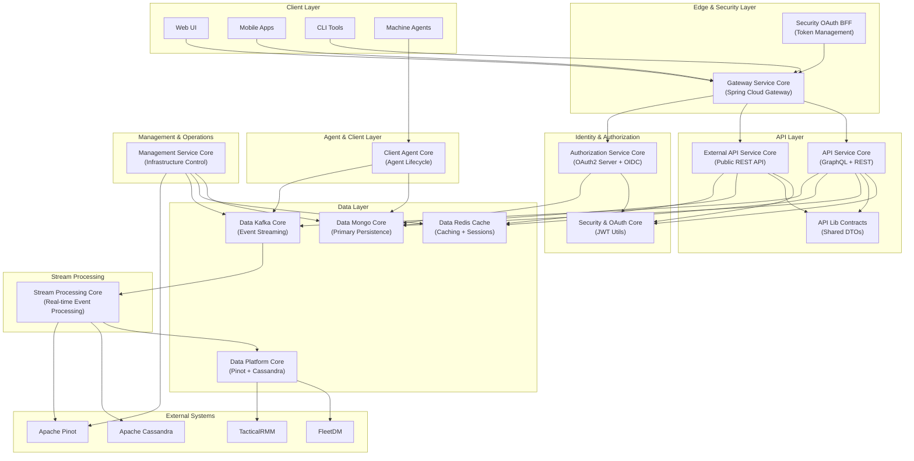
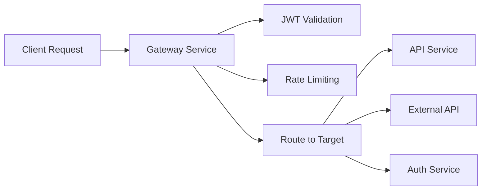
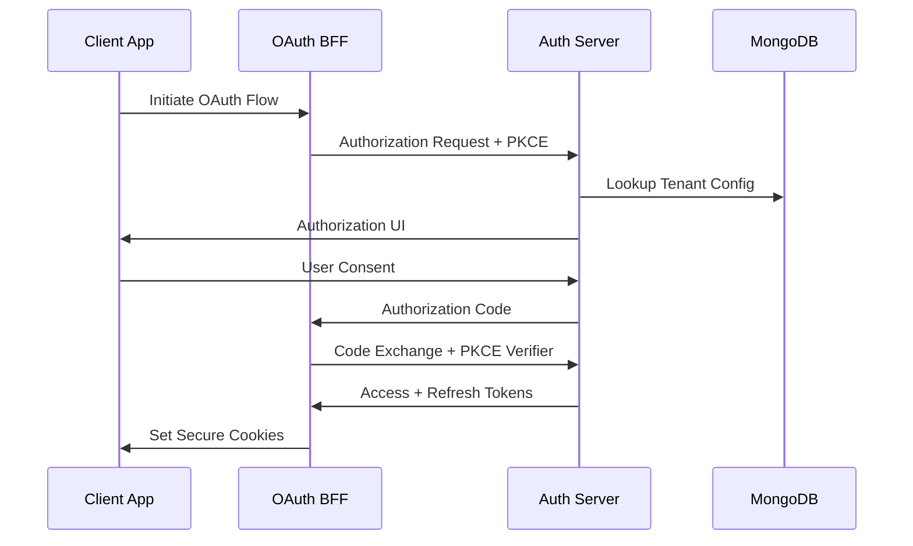
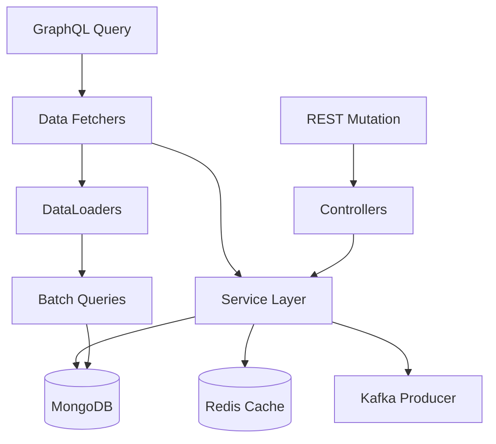
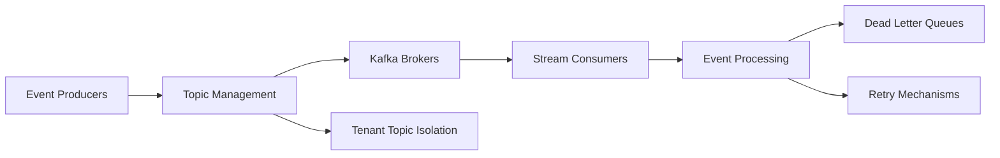
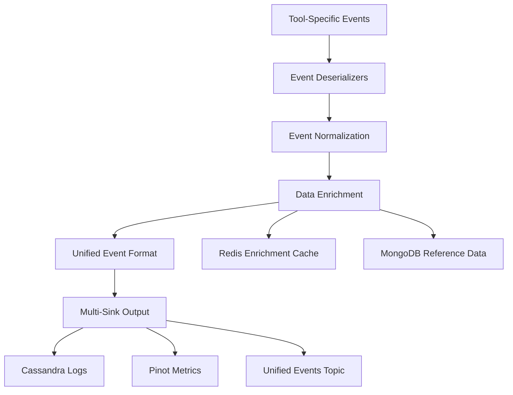
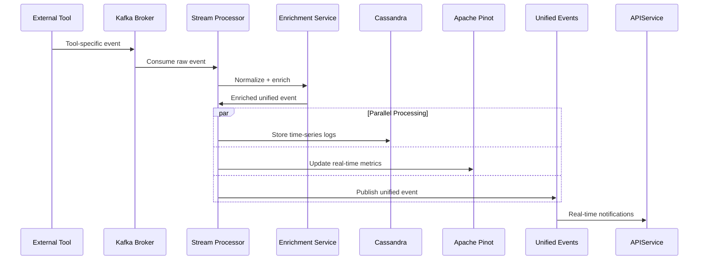
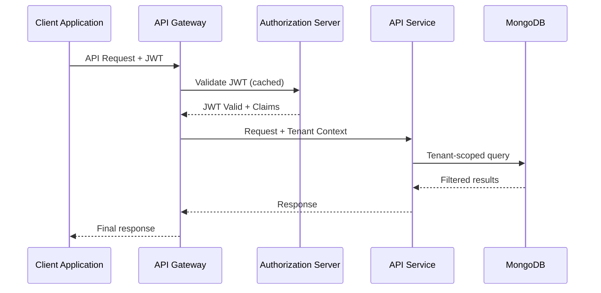
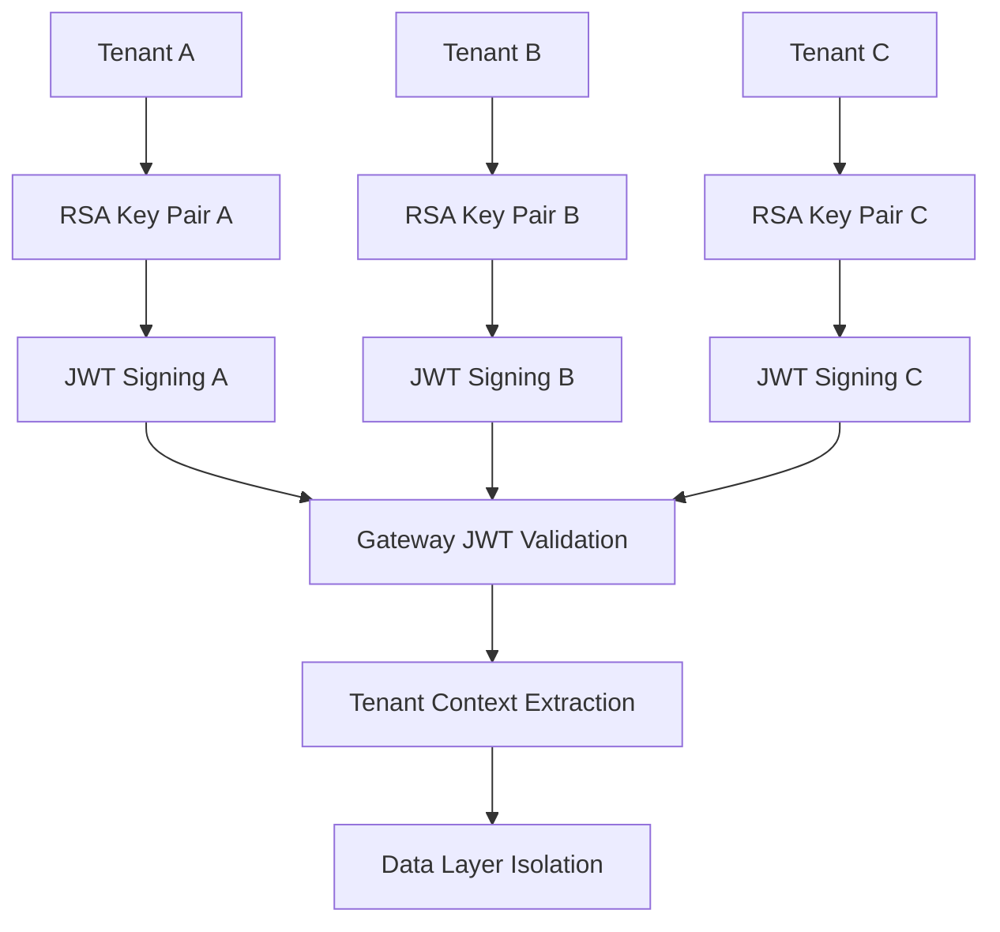

# Architecture Overview

OpenFrame OSS Lib implements a **microservice-ready, event-driven, multi-tenant architecture** optimized for scalable MSP (Managed Service Provider) environments. This document provides a comprehensive overview of the system design, architectural patterns, and component relationships.

## System Architecture

The platform is built on a layered architecture that separates concerns while enabling seamless integration between components:



## Core Design Principles

### 1. Multi-Tenancy by Design

Every component is built for multi-tenancy from the ground up:

- **Tenant-scoped data access** - All queries include tenant context
- **Isolated security contexts** - Per-tenant JWT signing keys  
- **Resource isolation** - Database collections and cache keys are tenant-prefixed
- **Configuration per tenant** - SSO, integrations, and settings are tenant-specific

### 2. Event-Driven Architecture

Components communicate through events rather than direct calls:

- **Apache Kafka** for inter-service messaging and event streams
- **NATS** for real-time agent communication  
- **Debezium** for database change data capture
- **Reactive programming** patterns throughout the stack

### 3. API-First Development

All functionality is exposed through well-defined APIs:

- **GraphQL** for complex queries with cursor-based pagination
- **REST** for command operations and external integrations
- **OpenAPI** documentation for all endpoints
- **SDK patterns** for tool integrations

### 4. Security as Foundation

Security is embedded at every architectural layer:

- **Asymmetric JWT (RS256)** for stateless token validation
- **OAuth2 Authorization Code + PKCE** for secure authentication flows
- **API key management** with rate limiting and usage tracking
- **Multi-tenant key isolation** with per-tenant RSA key pairs

## Architectural Layers Deep Dive

### Edge & Security Layer

#### Gateway Service Core
**Role**: Reactive API Gateway and traffic routing



**Key Capabilities:**
- Multi-tenant JWT validation with cached decoders
- API key enforcement with Redis-backed rate limiting
- WebSocket proxying for agent and tool connections
- Request/response transformation and header normalization
- Circuit breaker patterns for downstream service protection

#### Security OAuth BFF
**Role**: Backend-for-Frontend OAuth2 orchestration

- **PKCE-enabled OAuth2** flows for web and mobile clients
- **Cookie-based session management** with secure, HTTP-only cookies
- **Token refresh automation** with rotation policies
- **CSRF protection** through state parameter validation

### Identity & Authorization Layer

#### Authorization Service Core  
**Role**: Multi-tenant OAuth2 Authorization Server



**Key Features:**
- **OIDC-compliant** authorization server
- **Per-tenant RSA key management** for JWT signing
- **SSO provider integration** (Google, Microsoft, custom OIDC)
- **Dynamic client registration** for multi-tenant applications
- **Invitation-based user onboarding** with email verification

#### Security & OAuth Core
**Role**: Shared security utilities and JWT infrastructure

- **JWT encoding/decoding** with RS256 asymmetric cryptography
- **PKCE utility functions** for secure authorization code flows
- **Key management abstractions** for tenant-specific signing keys
- **Security constants** and shared configuration patterns

### API Layer

#### API Service Core
**Role**: Internal GraphQL + REST API for administrative operations



**Core Functionality:**
- **GraphQL API** with Netflix DGS framework
- **Cursor-based pagination** for efficient large dataset queries
- **DataLoader pattern** to prevent N+1 query problems
- **Multi-tenant data filtering** at the repository layer
- **Real-time subscriptions** for live data updates

#### External API Service Core
**Role**: Public REST API secured by API keys

- **OpenAPI-documented** REST endpoints for external integrations
- **API key authentication** with tenant-scoped access control
- **Rate limiting** based on API key tiers and usage quotas
- **Webhook support** for event notifications to external systems

#### API Lib Contracts
**Role**: Shared DTOs, filters, and data contracts

- **Consistent data models** across all API layers
- **Validation annotations** for request/response validation
- **Cursor pagination models** for efficient data access
- **Filter builders** for complex query construction

### Agent & Client Layer

#### Client Agent Core
**Role**: Machine agent lifecycle and tool integration management

```mermaid
flowchart LR
    Agent[Machine Agent] --> Register[Registration Service]
    Register --> Validate[Secret Validation]
    Validate --> Transform[ID Transformation]
    Transform --> OAuth[Token Issuance]
    OAuth --> Track[Installation Tracking]
    Track --> Heartbeat[Heartbeat Processing]
    Heartbeat --> NATS[NATS Events]
    NATS --> StreamProcessing[Stream Processing]
```



**Key Responsibilities:**
- **Agent registration** with tool-specific secret validation
- **OAuth2 client credentials** token issuance for agents
- **Tool ID transformation** between different MSP platforms
- **Installation orchestration** for tool agents on managed machines
- **Heartbeat processing** for agent health monitoring

### Data Layer

#### Data Mongo Core
**Role**: Primary operational data persistence

**Domain Models:**
- **Organizations** (multi-tenant isolation boundary)
- **Users** with role-based access control
- **Devices/Machines** with tool integration status
- **Events** for audit trails and operational history
- **OAuth2 clients and tokens** for authorization state
- **SSO configurations** per tenant

**Repository Patterns:**
- **Custom repository interfaces** extending Spring Data MongoDB
- **Tenant-scoped queries** using `@Query` annotations
- **Cursor-based pagination** implementations
- **Change stream listeners** for real-time data sync

#### Data Redis Cache
**Role**: Distributed caching and session management

- **Multi-tenant key prefixing** (`openframe:{tenantId}:{key}`)
- **JWT decoder caching** to reduce cryptographic overhead
- **API rate limiting** counters and sliding window algorithms
- **Session storage** for OAuth2 authorization flows

#### Data Kafka Core
**Role**: Event streaming infrastructure



**Event Categories:**
- **Integrated tool events** from FleetDM, TacticalRMM, etc.
- **Machine lifecycle events** (registration, status changes)
- **User activity events** (login, configuration changes)
- **System events** (errors, performance metrics)

#### Data Platform Core
**Role**: Analytics and time-series data orchestration

- **Apache Pinot** integration for real-time analytics queries
- **Cassandra** configuration for time-series event storage
- **Tool SDK coordination** for external system integrations
- **Data enrichment pipelines** with Redis-backed caching

### Stream Processing Layer

#### Stream Processing Core
**Role**: Real-time event transformation and enrichment



**Processing Capabilities:**
- **Tool-specific deserializers** for different event formats
- **Event type normalization** into unified schema
- **Real-time enrichment** with cached reference data
- **Multi-destination routing** based on event type and tenant
- **Error handling** with dead letter queues and retry policies

### Management & Operations Layer

#### Management Service Core
**Role**: Infrastructure orchestration and control plane

**Operational Responsibilities:**
- **Apache Pinot schema** deployment and table management
- **Debezium connector** initialization for change data capture
- **NATS stream management** for agent communication channels  
- **Distributed job scheduling** using ShedLock for coordination
- **API key usage statistics** synchronization between Redis and MongoDB

## Data Flow Patterns

### Event Processing Flow



### Authentication Flow



### Multi-Tenant Data Access Pattern

```java
// Repository pattern with tenant isolation
@Repository
public class DeviceRepository {
    
    @Query("{ 'tenantId': ?0, 'status': ?1 }")
    Page<Device> findByTenantAndStatus(
        String tenantId, 
        DeviceStatus status, 
        Pageable pageable
    );
    
    // Cursor-based pagination for large datasets
    @Query("{ 'tenantId': ?0, '_id': { '$gt': ?1 } }")
    List<Device> findByTenantAfterCursor(
        String tenantId, 
        String cursor, 
        Pageable pageable
    );
}
```

## Scalability Patterns

### Horizontal Scaling

- **Stateless services** with shared Redis session storage
- **Event-driven communication** eliminates direct service dependencies
- **Database sharding** by tenant ID for large-scale deployments
- **Kafka partition distribution** for parallel event processing

### Performance Optimization

- **Connection pooling** for MongoDB, Redis, and Kafka clients
- **Cursor-based pagination** to avoid offset limitations
- **DataLoader batching** to prevent N+1 database queries
- **Caching layers** at multiple levels (Redis, application-level, HTTP)

### Fault Tolerance

- **Circuit breaker patterns** in service-to-service communication
- **Retry mechanisms** with exponential backoff and jitter
- **Dead letter queues** for failed event processing
- **Health checks** and graceful degradation strategies

## Extension Points

### Adding New Tools

1. **Create SDK module** following `sdk/fleetmdm` pattern
2. **Implement event deserializer** in `stream-processing-core`
3. **Add enrichment logic** for tool-specific data normalization
4. **Register tool type** in `data-platform-core`
5. **Update API contracts** for tool-specific endpoints

### Adding New APIs

1. **Define DTOs** in `api-lib-contracts`
2. **Implement GraphQL datafetchers** or REST controllers
3. **Add service layer** with business logic
4. **Create repository methods** with tenant scoping
5. **Write integration tests** using test generators

### Adding New Event Types

1. **Define event schema** in `data-kafka-core`
2. **Implement deserializer** in `stream-processing-core`
3. **Add enrichment rules** for event normalization
4. **Configure routing** to appropriate storage systems
5. **Update analytics schema** in Apache Pinot

## Security Architecture

### Multi-Tenant Security Model



### API Security Layers

1. **Transport Layer** - TLS 1.3 for all communications
2. **Authentication Layer** - JWT or API key validation
3. **Authorization Layer** - Role-based access control (RBAC)
4. **Data Layer** - Tenant-scoped database queries
5. **Rate Limiting** - Per-tenant and per-API-key quotas

---

**Next Steps:**
- **[Security Deep Dive](../security/README.md)** - Detailed security implementation
- **[Local Development](../setup/local-development.md)** - Run the full architecture locally
- **[Contributing Guide](../contributing/guidelines.md)** - Extend the architecture

This architecture provides the foundation for building scalable, secure, multi-tenant MSP platforms. Each layer is designed for independent scaling while maintaining strong integration boundaries through well-defined APIs and event contracts.