# Architecture Overview

OpenFrame OSS Lib implements a sophisticated, modular architecture designed for enterprise-scale MSP platforms. This guide explores the architectural patterns, design decisions, and component relationships that make the system scalable, maintainable, and extensible.

[](https://www.youtube.com/watch?v=PexpoNdZtUk)

## High-Level System Architecture

OpenFrame OSS Lib follows a layered, event-driven architecture with clear separation of concerns:

```mermaid
flowchart TD
    subgraph "Client Layer"
        WebUI["`**Web UI**
        Admin Dashboard`"]
        Mobile["`**Mobile Apps**
        Technician Apps`"]
        Agents["`**Client Agents**
        Device Monitoring`"]
        ExtAPI["`**External APIs**
        Third-party Integration`"]
    end

    subgraph "Edge Layer"
        Gateway["`**Gateway Service**
        • Routing & Load Balancing
        • JWT Validation
        • Rate Limiting
        • WebSocket Proxy`"]
        CDN["`**CDN/Static Assets**
        Asset Distribution`"]
    end

    subgraph "Security & Identity"
        AuthZ["`**Authorization Server**
        • Multi-tenant OAuth2
        • SSO Integration
        • JWT Issuance
        • User Management`"]
        OAuth["`**OAuth BFF**
        • PKCE Flow
        • Cookie Management  
        • Dev Ticket Exchange`"]
    end

    subgraph "API Layer" 
        APICore["`**API Service Core**
        • Internal REST APIs
        • GraphQL (DGS)
        • Business Logic
        • DTO Mapping`"]
        ExtAPICore["`**External API Service**
        • Public REST APIs
        • API Key Auth
        • Rate Limited
        • Versioned`"]
        Contracts["`**API Lib Contracts**
        • Shared DTOs
        • Filter Models
        • Mappers`"]
    end

    subgraph "Business Services"
        Client["`**Client Service Core**
        • Agent Registration
        • Heartbeat Processing  
        • Tool Communication`"]
        Management["`**Management Service**
        • Platform Operations
        • Configuration
        • Monitoring`"]
        Stream["`**Stream Processing**
        • Event Processing
        • Real-time Analytics
        • Data Enrichment`"]
    end

    subgraph "Data Layer"
        MongoDB["`**MongoDB**
        • Operational Data
        • User/Tenant Info
        • Configuration`"]
        Redis["`**Redis Cache**
        • Session Storage
        • API Rate Limits
        • Temporary Data`"]
        Cassandra["`**Cassandra**
        • Time-series Data
        • Audit Logs
        • Event History`"]
        Pinot["`**Apache Pinot**
        • Real-time Analytics
        • OLAP Queries
        • Dashboards`"]
    end

    subgraph "Messaging & Events"
        Kafka["`**Apache Kafka**
        • Event Streaming
        • Service Integration
        • Data Pipeline`"]
        NATS["`**NATS JetStream**
        • Agent Communication
        • Real-time Updates
        • Pub/Sub`"]
    end

    subgraph "External Integrations"
        FleetMDM["`**Fleet MDM**
        Device Management`"]
        TacticalRMM["`**Tactical RMM**
        Remote Monitoring`"]
        MeshCentral["`**MeshCentral**
        Remote Access`"]
    end

    %% Client connections
    WebUI --> Gateway
    Mobile --> Gateway
    Agents --> Client
    ExtAPI --> Gateway

    %% Edge routing
    Gateway --> APICore
    Gateway --> ExtAPICore
    Gateway --> AuthZ

    %% Authentication flows
    WebUI --> OAuth
    OAuth --> AuthZ

    %% API relationships
    APICore --> Contracts
    ExtAPICore --> Contracts
    
    %% Service connections
    APICore --> MongoDB
    APICore --> Redis
    APICore --> Kafka
    
    Client --> MongoDB
    Client --> NATS
    Client --> FleetMDM
    Client --> TacticalRMM
    Client --> MeshCentral

    Management --> MongoDB
    Management --> Kafka
    Management --> Pinot

    Stream --> Kafka
    Stream --> Cassandra
    Stream --> Pinot
```

## Core Architectural Principles

### 1. Multi-Tenancy by Design

Every component is built with tenant isolation as a first-class concern:

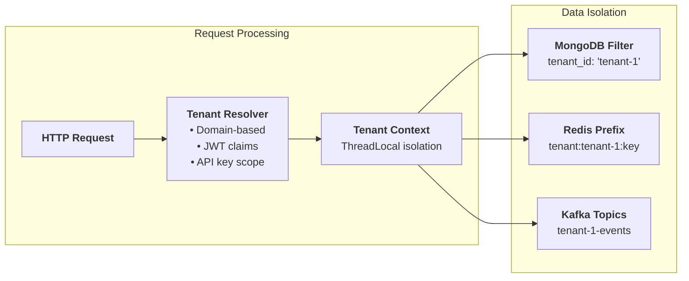

### 2. Event-Driven Architecture

Services communicate through events rather than direct coupling:

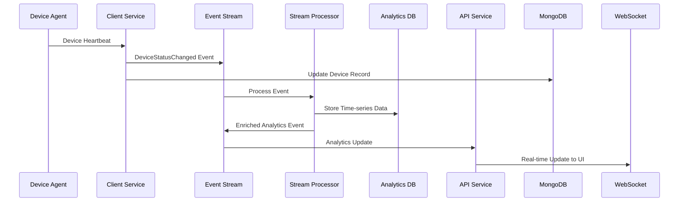

### 3. Clean Module Boundaries

Each module has a single responsibility and well-defined interfaces:

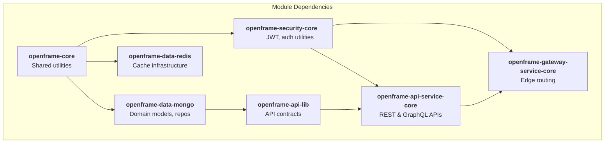

## Detailed Component Architecture

### Security & Authentication Layer

The security layer implements OAuth2 with multi-tenant support:

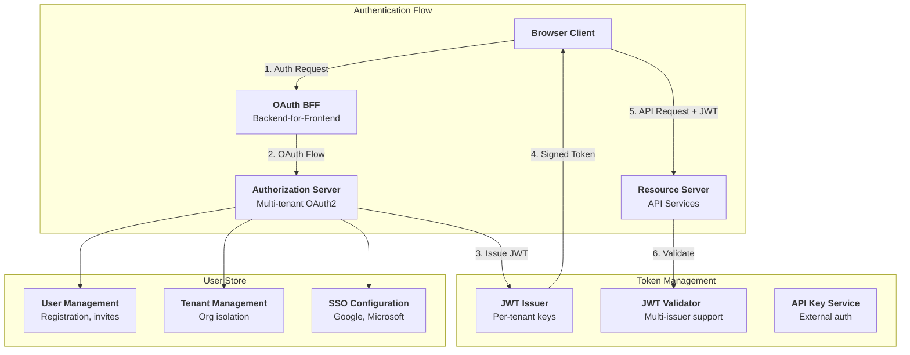

### API Layer Architecture

The API layer provides both internal and external interfaces:

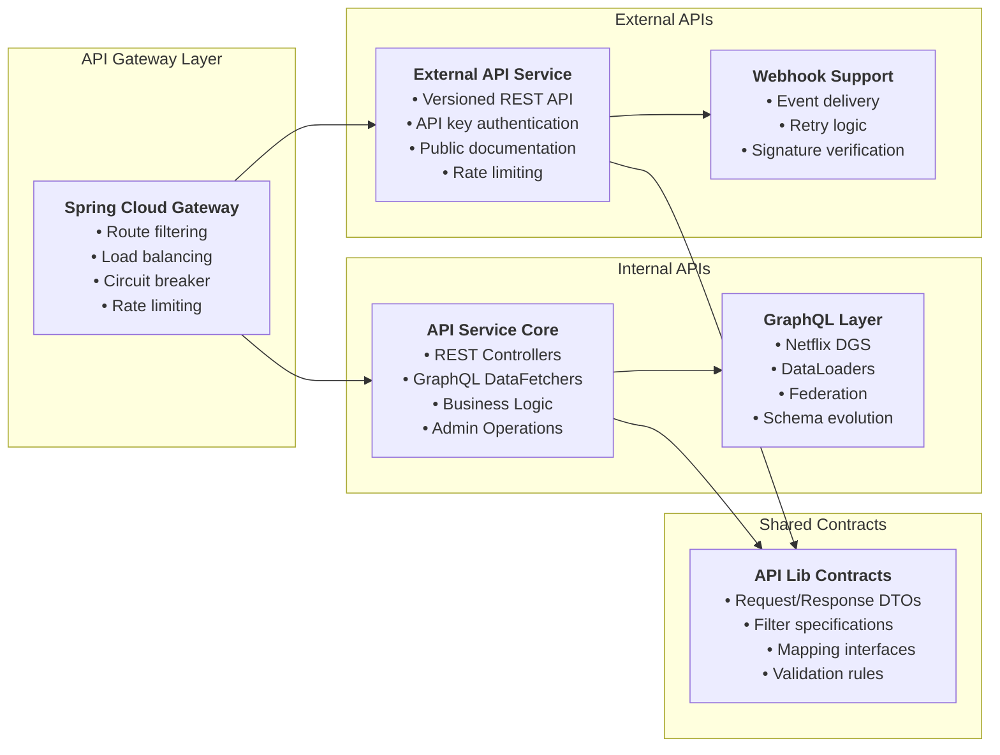

### Data Architecture

OpenFrame uses a polyglot persistence approach:

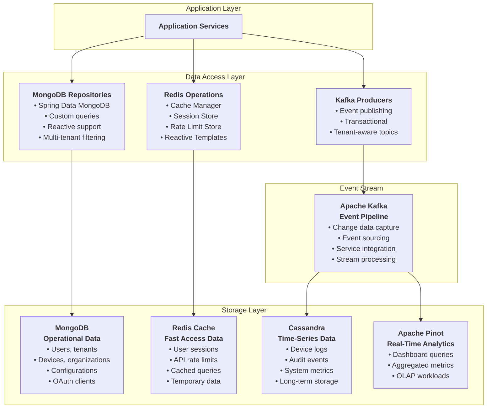

## Integration Patterns

### Agent Communication Architecture

Client agents communicate with the platform through multiple channels:

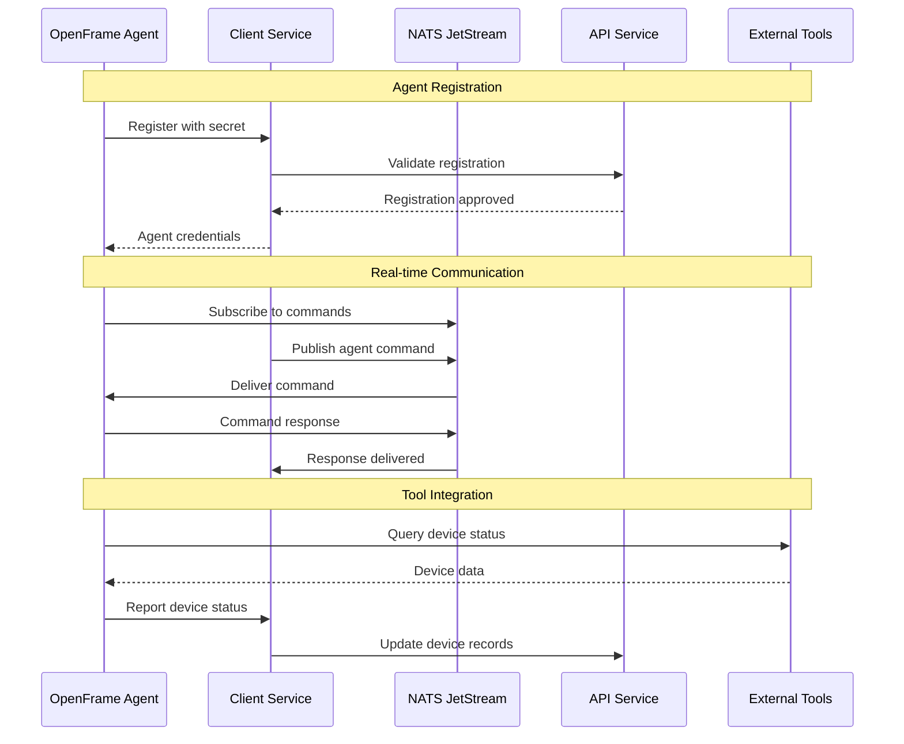

### External Tool Integration

OpenFrame connects with existing MSP tools through standardized SDKs:

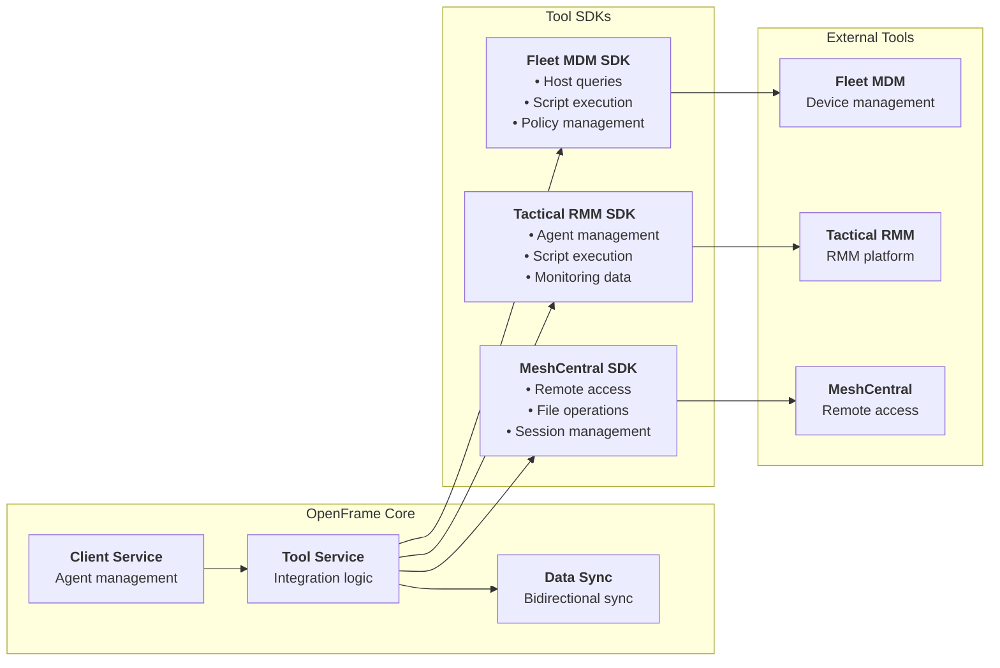

## Key Design Patterns

### 1. Repository Pattern with Multi-Tenancy

```java
// Example: Tenant-aware repository
@Repository
public interface DeviceRepository extends MongoRepository<Device, String> {
    
    // Automatic tenant filtering through custom implementation
    List<Device> findByOrganizationId(String organizationId);
    
    // Custom query with tenant context
    @Query("{ 'tenantId': ?#{principal.tenantId}, 'status': ?0 }")
    List<Device> findByStatus(DeviceStatus status);
    
    // Reactive support for high-throughput operations  
    Flux<Device> findByTenantIdAndLastSeenAfter(String tenantId, Instant since);
}
```

### 2. Event Publishing Pattern

```java
// Example: Domain event publishing
@Service  
@RequiredArgsConstructor
public class DeviceService {
    
    private final DeviceRepository deviceRepository;
    private final ApplicationEventPublisher eventPublisher;
    
    public Device updateDeviceStatus(String deviceId, DeviceStatus status) {
        Device device = deviceRepository.findById(deviceId)
            .orElseThrow(() -> new DeviceNotFoundException(deviceId));
            
        DeviceStatus oldStatus = device.getStatus();
        device.setStatus(status);
        device = deviceRepository.save(device);
        
        // Publish domain event
        eventPublisher.publishEvent(new DeviceStatusChangedEvent(
            device.getId(), oldStatus, status, device.getTenantId()));
            
        return device;
    }
}
```

### 3. GraphQL DataLoader Pattern

```java
// Example: Efficient batch loading
@DgsDataLoader(name = "organizationLoader")
public class OrganizationDataLoader implements BatchLoader<String, Organization> {
    
    private final OrganizationService organizationService;
    
    @Override
    public CompletionStage<List<Organization>> load(List<String> organizationIds) {
        return CompletableFuture.supplyAsync(() -> 
            organizationService.findByIds(organizationIds));
    }
}
```

## Performance & Scalability Patterns

### 1. Caching Strategy

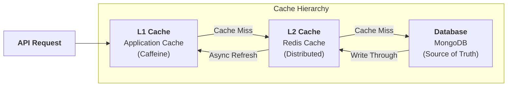

### 2. Event Stream Processing

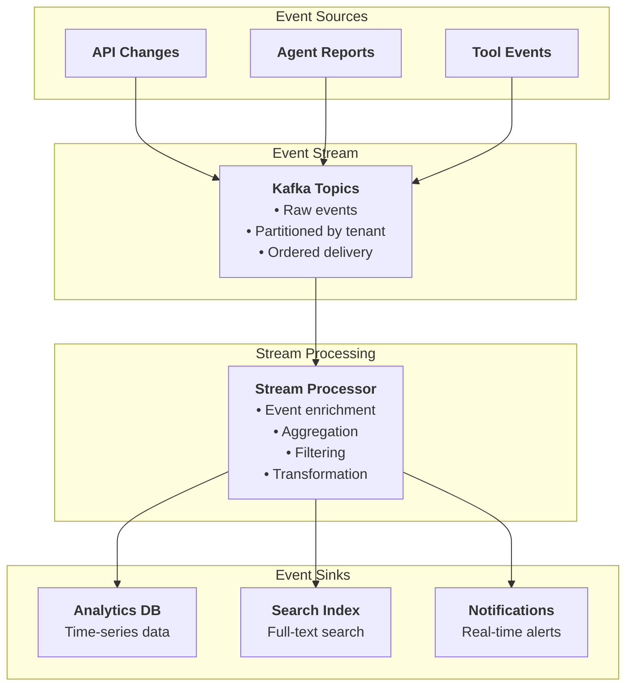

## Security Architecture Deep Dive

### Multi-Tenant JWT Validation

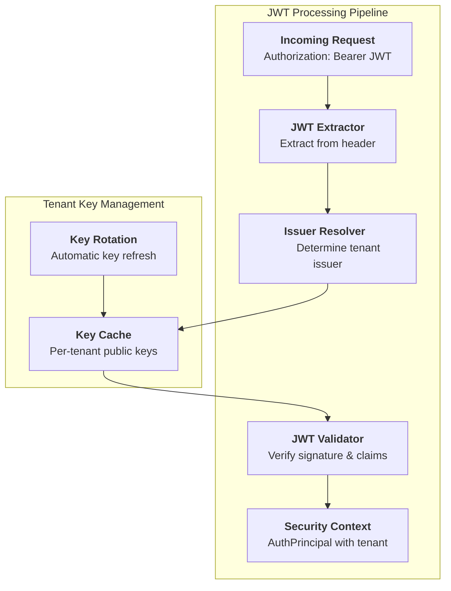

## Testing Architecture

OpenFrame implements comprehensive testing at multiple levels:

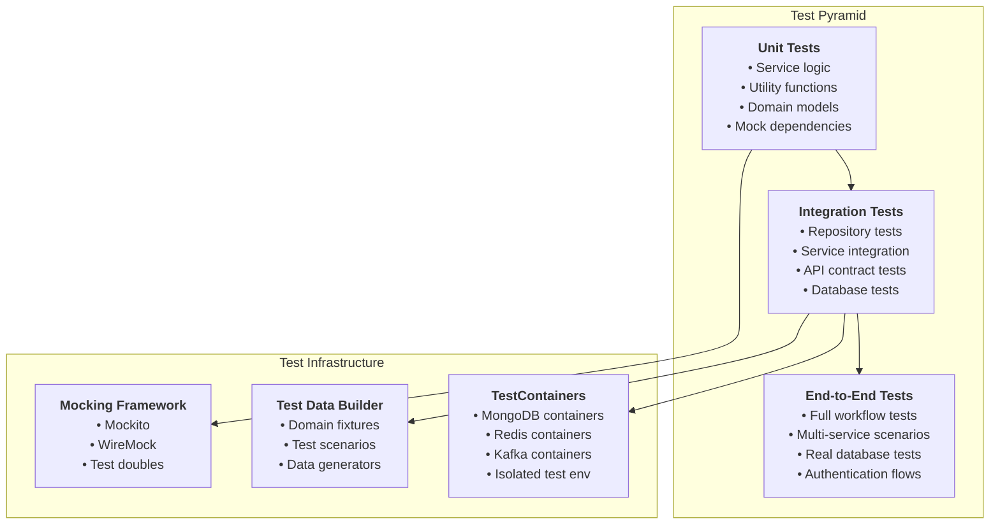

## Deployment Architecture

While OpenFrame OSS Lib is a library collection, understanding deployment patterns helps with integration:

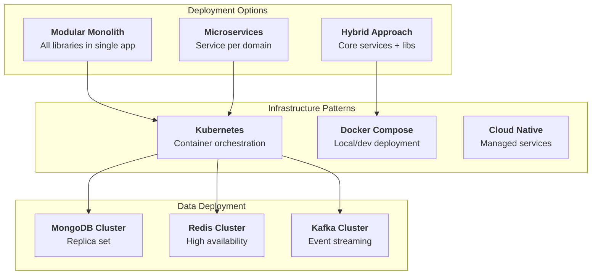

## Next Steps

Now that you understand the architecture:

1. **[Security Best Practices](../security/README.md)** - Dive into security implementation
2. **[Testing Guide](../testing/README.md)** - Learn testing strategies  
3. **[Local Development](../setup/local-development.md)** - Set up development environment
4. **[Contributing Guidelines](../contributing/guidelines.md)** - Start contributing

## Architecture Decision Records

For detailed architectural decisions and trade-offs, refer to:
- Multi-database strategy rationale
- Event-driven vs request-response patterns
- Multi-tenancy implementation approaches
- Security model decisions
- API design philosophy

These decisions are documented in the codebase and community discussions.

---

*The OpenFrame OSS Lib architecture evolves continuously. Join the [OpenMSP Community](https://join.slack.com/t/openmsp/shared_invite/zt-36bl7mx0h-3~U2nFH6nqHqoTPXMaHEHA) to participate in architectural discussions.*