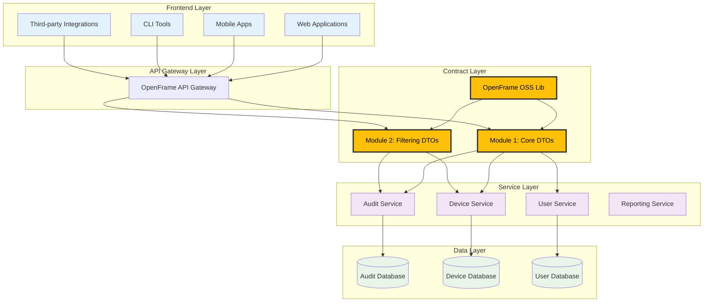
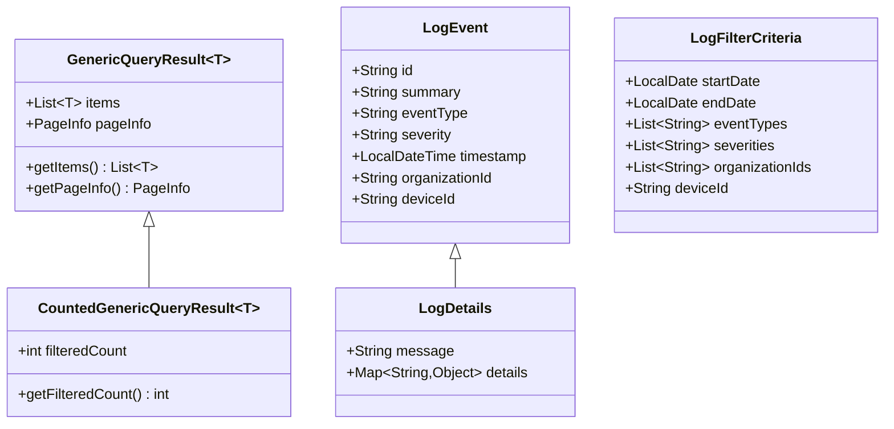
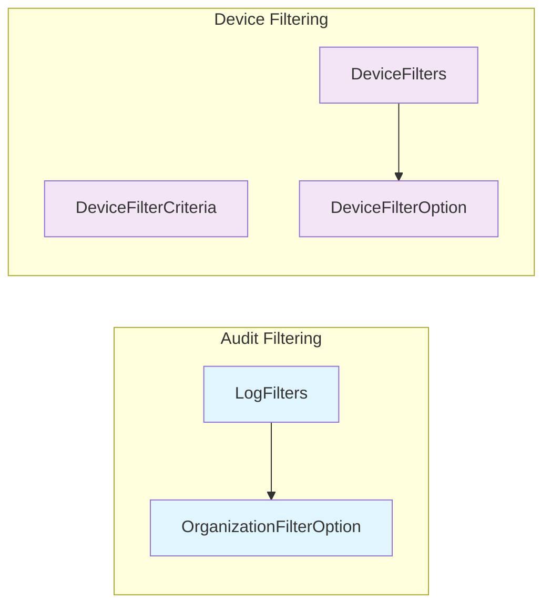
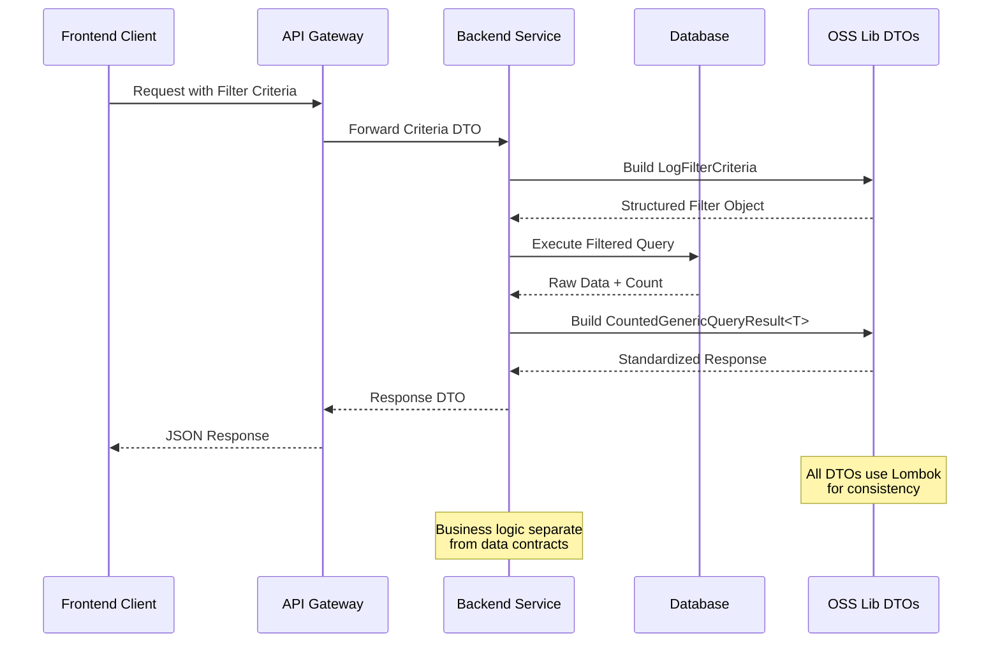
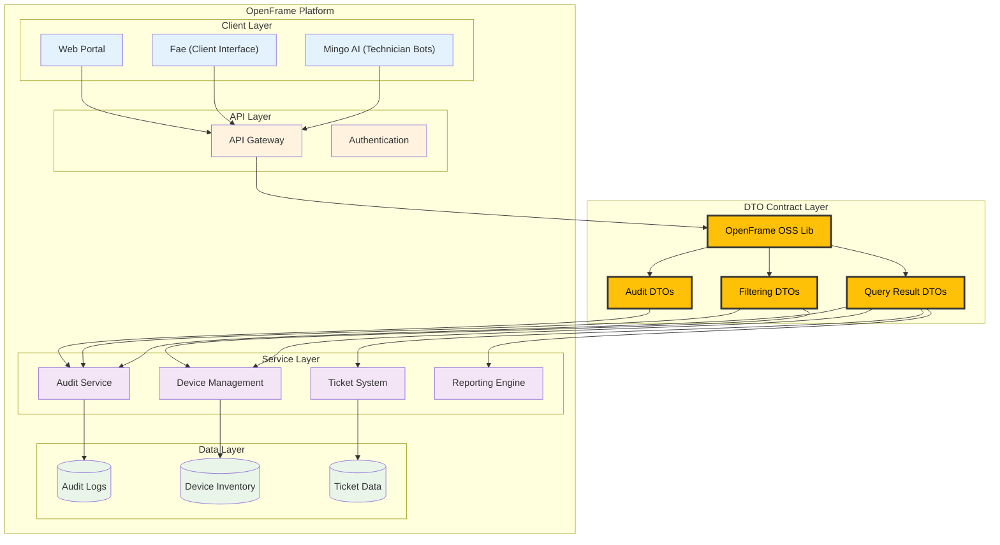

# Architecture Overview

OpenFrame OSS Lib is designed as a foundational **contract-first DTO library** that standardizes data exchange across the entire OpenFrame platform. This document provides a high-level architectural overview of how the library is structured and how it integrates with the broader ecosystem.

## High-Level Architecture

OpenFrame OSS Lib sits at the **contract boundary** between clients and backend services, ensuring consistent data structures across all platform interactions:


```mermaid
flowchart TD
    subgraph "Frontend Layer"
        WebApp["Web Applications"]
        MobileApp["Mobile Apps"]
        CLITools["CLI Tools"]
        ThirdParty["Third-party Integrations"]
    end
    
    subgraph "API Gateway Layer"
        Gateway["OpenFrame API Gateway"]
    end
    
    subgraph "Contract Layer"
        OSS["OpenFrame OSS Lib"]
        Module1["Module 1: Core DTOs"]
        Module2["Module 2: Filtering DTOs"]
        
        OSS --> Module1
        OSS --> Module2
    end
    
    subgraph "Service Layer"
        AuditService["Audit Service"]
        DeviceService["Device Service"]
        UserService["User Service"]
        ReportingService["Reporting Service"]
    end
    
    subgraph "Data Layer"
        AuditDB[(Audit Database)]
        DeviceDB[(Device Database)]
        UserDB[(User Database)]
    end
    
    WebApp --> Gateway
    MobileApp --> Gateway
    CLITools --> Gateway
    ThirdParty --> Gateway
    
    Gateway --> Module1
    Gateway --> Module2
    
    Module1 --> AuditService
    Module1 --> DeviceService
    Module1 --> UserService
    
    Module2 --> AuditService
    Module2 --> DeviceService
    
    AuditService --> AuditDB
    DeviceService --> DeviceDB
    UserService --> UserDB
    
    classDef frontend fill:#e3f2fd
    classDef contract fill:#FFC008,stroke:#333,stroke-width:3px,color:#000
    classDef service fill:#f3e5f5
    classDef data fill:#e8f5e8
    
    class WebApp,MobileApp,CLITools,ThirdParty frontend
    class OSS,Module1,Module2 contract
    class AuditService,DeviceService,UserService,ReportingService service
    class AuditDB,DeviceDB,UserDB data
```

## Core Components

The library is organized into two main modules that serve distinct architectural purposes:

### Module 1: Core DTOs & Query Results

**Purpose**: Provides foundational data structures for pagination, counting, and audit operations.


```mermaid
classDiagram
    class GenericQueryResult~T~ {
        +List~T~ items
        +PageInfo pageInfo
        +getItems() List~T~
        +getPageInfo() PageInfo
    }
    
    class CountedGenericQueryResult~T~ {
        +int filteredCount
        +getFilteredCount() int
    }
    
    class LogEvent {
        +String id
        +String summary  
        +String eventType
        +String severity
        +LocalDateTime timestamp
        +String organizationId
        +String deviceId
    }
    
    class LogDetails {
        +String message
        +Map~String,Object~ details
    }
    
    class LogFilterCriteria {
        +LocalDate startDate
        +LocalDate endDate
        +List~String~ eventTypes
        +List~String~ severities
        +List~String~ organizationIds
        +String deviceId
    }
    
    GenericQueryResult <|-- CountedGenericQueryResult
    LogEvent <|-- LogDetails
```

**Key Responsibilities:**
- **Pagination Abstraction**: `GenericQueryResult<T>` provides consistent pagination for all endpoints
- **Filtered Counting**: `CountedGenericQueryResult<T>` adds total filtered count for advanced UI features
- **Audit Modeling**: `LogEvent` and `LogDetails` represent different granularity levels of audit data
- **Query Structure**: `LogFilterCriteria` standardizes how clients request filtered data

### Module 2: Advanced Filtering DTOs

**Purpose**: Enables sophisticated filtering capabilities with faceted search and multi-tenant isolation.


```mermaid
flowchart LR
    subgraph "Audit Filtering"
        LogFilters["LogFilters"]
        OrgFilterOption["OrganizationFilterOption"]
    end
    
    subgraph "Device Filtering"  
        DeviceFilterCriteria["DeviceFilterCriteria"]
        DeviceFilters["DeviceFilters"]
        DeviceFilterOption["DeviceFilterOption"]
    end
    
    LogFilters --> OrgFilterOption
    DeviceFilters --> DeviceFilterOption
    
    classDef audit fill:#e1f5fe
    classDef device fill:#f3e5f5
    
    class LogFilters,OrgFilterOption audit
    class DeviceFilterCriteria,DeviceFilters,DeviceFilterOption device
```

**Key Responsibilities:**
- **Faceted Search**: Provides filter options with counts for dynamic UI generation
- **Multi-tenant Support**: Organization-scoped filtering ensures data isolation
- **Criteria Standardization**: Consistent input formats across audit and device domains
- **UI-Driven Filtering**: Backend-generated filter options enable rich client experiences

## Data Flow Architecture

The typical data flow through OpenFrame OSS Lib follows this pattern:


```mermaid
sequenceDiagram
    participant Client as Frontend Client
    participant Gateway as API Gateway
    participant Service as Backend Service
    participant DB as Database
    participant DTO as OSS Lib DTOs
    
    Client->>Gateway: Request with Filter Criteria
    Gateway->>Service: Forward Criteria DTO
    Service->>DTO: Build LogFilterCriteria
    DTO-->>Service: Structured Filter Object
    Service->>DB: Execute Filtered Query
    DB-->>Service: Raw Data + Count
    Service->>DTO: Build CountedGenericQueryResult<T>
    DTO-->>Service: Standardized Response
    Service-->>Gateway: Response DTO
    Gateway-->>Client: JSON Response
    
    Note over DTO: All DTOs use Lombok<br/>for consistency
    Note over Service: Business logic separate<br/>from data contracts
```

### Request-Response Cycle

1. **Request Processing**:
   - Client sends filter criteria using standardized DTO structure
   - API Gateway validates request against DTO schema
   - Service layer receives strongly-typed criteria objects

2. **Business Logic Execution**:
   - Service applies business rules to filter criteria
   - Database queries are executed with proper tenant isolation
   - Results are aggregated with count information

3. **Response Generation**:
   - Raw data is wrapped in `GenericQueryResult<T>` or `CountedGenericQueryResult<T>`
   - Filter options are generated using Module 2 DTOs
   - Consistent JSON structure is returned to clients

## Design Principles

### 1. Contract-First Design

OpenFrame OSS Lib prioritizes **API contracts over implementation details**:

```java
// ✅ Good: Implementation-agnostic contract
public class CountedGenericQueryResult<T> extends GenericQueryResult<T> {
    private int filteredCount;  // What clients need to know
}

// ❌ Avoid: Implementation-specific details  
public class DatabaseQueryResult<T> extends GenericQueryResult<T> {
    private String sqlQuery;    // Implementation detail
    private long queryTimeMs;   // Internal metric
}
```

### 2. Separation of Concerns

The library maintains clear boundaries:

| Responsibility | Handled By | NOT Handled By |
|----------------|------------|----------------|
| **Data Structure** | OSS Lib DTOs | Business Logic |
| **Type Safety** | Lombok + Generics | Validation Rules |
| **Serialization** | Jackson Annotations | Persistence Logic |
| **Multi-tenancy** | Organization IDs | Access Control |

### 3. Generic Reusability

DTOs are designed for maximum reusability across domains:

```java
// Same pagination structure works for any data type
CountedGenericQueryResult<LogEvent> auditResults = // ...
CountedGenericQueryResult<DeviceInfo> deviceResults = // ...
CountedGenericQueryResult<UserAccount> userResults = // ...
```

### 4. Lombok-Driven Consistency

All DTOs follow consistent Lombok patterns:

```java
@Data                    // Getters, setters, toString, equals, hashCode
@Builder                 // Fluent builder pattern
@NoArgsConstructor       // Default constructor for frameworks
@AllArgsConstructor      // Full constructor for testing
public class StandardDTO {
    // Field definitions
}
```

## Integration Architecture

### With OpenFrame Platform Services

OpenFrame OSS Lib integrates with the broader platform ecosystem:


```mermaid
flowchart TB
    subgraph "OpenFrame Platform"
        subgraph "Client Layer"
            MingoBots["Mingo AI (Technician Bots)"]
            FaeClient["Fae (Client Interface)"]
            WebPortal["Web Portal"]
        end
        
        subgraph "API Layer"
            APIGateway["API Gateway"]
            AuthService["Authentication"]
        end
        
        subgraph "Service Layer"
            AuditSvc["Audit Service"]
            DeviceSvc["Device Management"]
            TicketSvc["Ticket System"]
            ReportSvc["Reporting Engine"]
        end
        
        subgraph "Data Layer"
            AuditStore[(Audit Logs)]
            DeviceStore[(Device Inventory)]
            TicketStore[(Ticket Data)]
        end
    end
    
    subgraph "DTO Contract Layer"
        OSSLib["OpenFrame OSS Lib"]
        QueryDTOs["Query Result DTOs"]
        FilterDTOs["Filtering DTOs"]
        AuditDTOs["Audit DTOs"]
    end
    
    MingoBots --> APIGateway
    FaeClient --> APIGateway
    WebPortal --> APIGateway
    
    APIGateway --> OSSLib
    
    OSSLib --> QueryDTOs
    OSSLib --> FilterDTOs  
    OSSLib --> AuditDTOs
    
    QueryDTOs --> AuditSvc
    QueryDTOs --> DeviceSvc
    QueryDTOs --> TicketSvc
    QueryDTOs --> ReportSvc
    
    FilterDTOs --> AuditSvc
    FilterDTOs --> DeviceSvc
    
    AuditDTOs --> AuditSvc
    
    AuditSvc --> AuditStore
    DeviceSvc --> DeviceStore
    TicketSvc --> TicketStore
    
    classDef client fill:#e3f2fd
    classDef api fill:#fff3e0
    classDef service fill:#f3e5f5
    classDef data fill:#e8f5e8
    classDef dto fill:#FFC008,stroke:#333,stroke-width:3px,color:#000
    
    class MingoBots,FaeClient,WebPortal client
    class APIGateway,AuthService api
    class AuditSvc,DeviceSvc,TicketSvc,ReportSvc service
    class AuditStore,DeviceStore,TicketStore data
    class OSSLib,QueryDTOs,FilterDTOs,AuditDTOs dto
```

### Multi-Tenant Architecture Support

The library provides built-in support for OpenFrame's multi-tenant architecture:

```java
// Organization-scoped filtering
LogFilterCriteria criteria = LogFilterCriteria.builder()
    .organizationIds(Arrays.asList("org_123", "org_456"))  // Tenant isolation
    .eventTypes(Arrays.asList("AUTHENTICATION"))
    .build();

// Organization filter options for UI
OrganizationFilterOption orgOption = OrganizationFilterOption.builder()
    .organizationId("org_123")
    .organizationName("Acme Corp")
    .count(45)  // Number of records for this tenant
    .build();
```

## Performance Considerations

### Memory Efficiency

```java
// Lazy loading through pagination
GenericQueryResult<LogEvent> result = GenericQueryResult.<LogEvent>builder()
    .items(pagedResults)        // Only current page in memory
    .pageInfo(pageMetadata)     // Lightweight pagination info
    .build();

// Efficient counting
CountedGenericQueryResult<LogEvent> countedResult = 
    CountedGenericQueryResult.<LogEvent>builder()
        .items(pagedResults)    // Small result set
        .filteredCount(total)   // Just a number, not all records
        .build();
```

### Serialization Optimization

The library is optimized for JSON serialization performance:

- **Jackson Integration**: Native support for efficient JSON processing
- **Minimal Object Graph**: Flat DTO structures avoid deep serialization
- **Field Ordering**: Predictable serialization for caching and compression

## Extensibility Points

### Adding New DTOs

Follow the established pattern:

```java
@Data
@Builder  
@NoArgsConstructor
@AllArgsConstructor
public class NewDomainDTO {
    private String id;
    private String name;
    // Follow existing patterns
}
```

### Custom Filtering

Extend filtering patterns:

```java
@Data
@Builder
public class CustomFilterCriteria {
    private LocalDate startDate;
    private LocalDate endDate;
    private List<String> customTypes;
    private List<String> organizationIds;  // Always include for multi-tenancy
}
```

## Security Architecture

The library supports OpenFrame's security model:

- **Stateless DTOs**: No sensitive data stored in DTO objects
- **Organization Isolation**: Built-in tenant scoping
- **Input Validation**: Structure validation through type safety
- **Audit Trail**: Comprehensive audit log DTOs for security monitoring

## Key Design Decisions

| Decision | Rationale | Trade-off |
|----------|-----------|-----------|
| **Lombok Usage** | Reduce boilerplate, ensure consistency | IDE setup complexity |
| **Generic Types** | Type safety, reusability | Learning curve for some developers |
| **Builder Pattern** | Immutable-style construction | More verbose object creation |
| **Module Separation** | Clear separation of concerns | Additional complexity |
| **Contract-First** | API stability, loose coupling | Cannot optimize for specific implementations |

## Documentation References

For deeper architectural understanding:

- **[Module 1 Architecture](../../reference/architecture/module_1/module_1.md)** - Detailed core DTO design
- **[Module 2 Architecture](../../reference/architecture/module_2/module_2.md)** - Advanced filtering patterns
- **[Device Filtering](../../reference/architecture/module_2/device_filtering.md)** - Device-specific patterns
- **[Audit Filtering](../../reference/architecture/module_2/audit_filtering.md)** - Audit-specific patterns

## Summary

OpenFrame OSS Lib provides a robust, extensible foundation for the OpenFrame platform's data contracts. By maintaining clear architectural boundaries and consistent patterns, it enables:

- **Type Safety** across the entire platform
- **Consistent APIs** for all client interactions
- **Multi-tenant Support** with organization-scoped filtering
- **Performance** through efficient pagination and counting
- **Extensibility** via established patterns and conventions

The architecture balances simplicity for everyday usage with sophistication for advanced filtering and multi-tenant scenarios, making it suitable for both internal platform development and external integrations.

---

*Understanding this architecture is key to effectively using and contributing to OpenFrame OSS Lib. The contract-first approach ensures that your DTOs will integrate seamlessly with the broader OpenFrame ecosystem.*