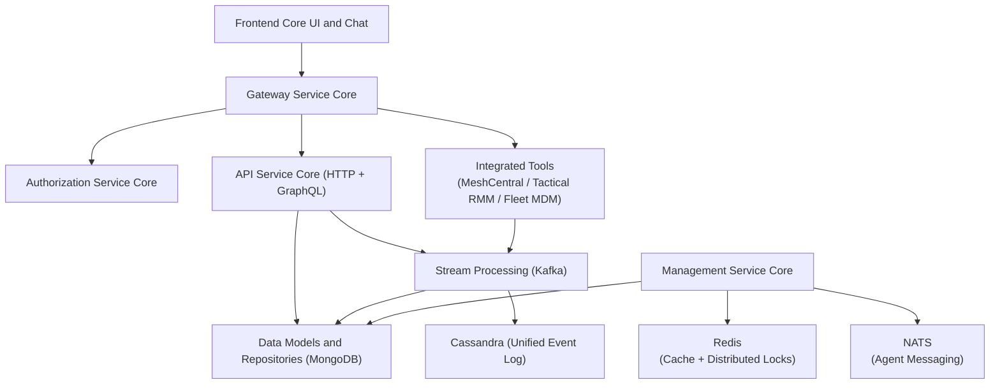
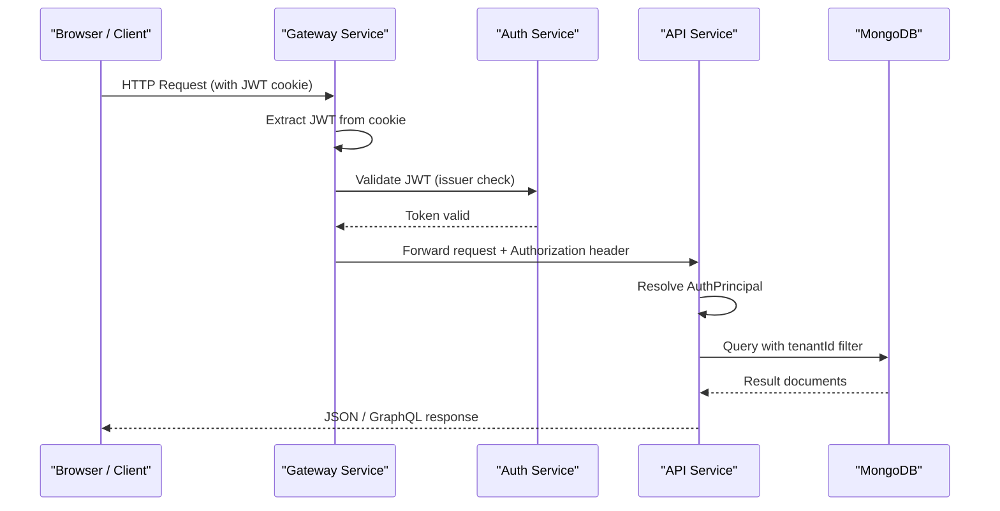
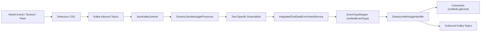
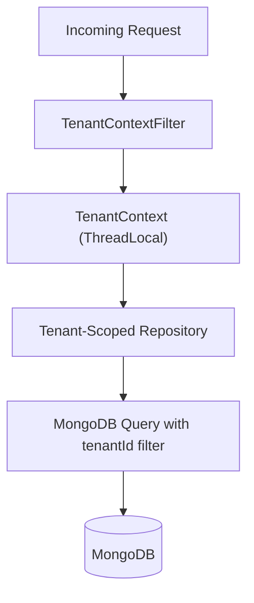
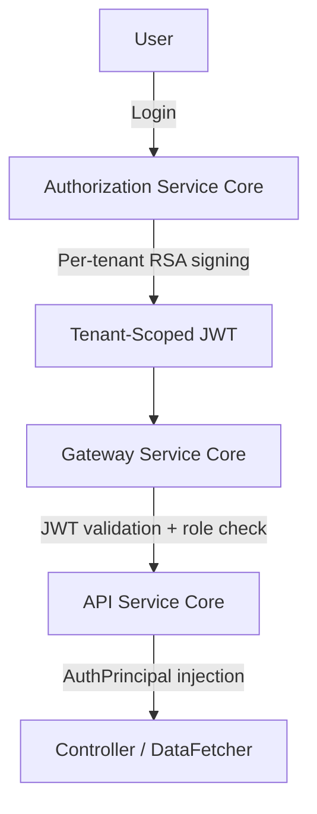

# Architecture Overview

`openframe-oss-lib` is the modular backbone of the OpenFrame platform. This document provides a high-level architectural overview, core component relationships, data flow patterns, and key design decisions.

For detailed per-module documentation, see the [Reference Architecture docs](./reference/architecture/README.md).

---

## High-Level Architecture

The system is organized as a layered, event-driven microservice platform:

```mermaid
flowchart TD
    Frontend["Frontend Core UI and Chat"]
    Gateway["Gateway Service Core"]
    Auth["Authorization Service Core"]
    API["API Service Core (HTTP + GraphQL)"]
    Management["Management Service Core"]
    Data["Data Models and Repositories (MongoDB)"]
    Stream["Stream Processing (Kafka)"]
    Cassandra["Cassandra (Unified Event Log)"]
    Tools["Integrated Tools\n(MeshCentral / Tactical RMM / Fleet MDM)"]
    Redis["Redis\n(Cache + Distributed Locks)"]
    NATS["NATS\n(Agent Messaging)"]

    Frontend --> Gateway
    Gateway --> Auth
    Gateway --> API
    Gateway --> Tools
    API --> Data
    API --> Stream
    Stream --> Cassandra
    Stream --> Data
    Management --> Data
    Management --> Redis
    Management --> NATS
    Tools --> Stream
```

---

## Core Components Table

| Module | Type | Key Responsibility |
|--------|------|--------------------|
| `openframe-gateway-service-core` | Edge | JWT validation, rate limiting, WebSocket proxying, tool routing |
| `openframe-authorization-service-core` | Auth | Multi-tenant OAuth2/OIDC, JWT issuance, SSO (Google/Microsoft) |
| `openframe-api-service-core` | API | REST + GraphQL (Netflix DGS), DataLoader batching, Relay pagination |
| `openframe-api-lib` | Contracts | Shared DTOs, filter criteria, pagination primitives |
| `openframe-data-mongo-common` | Data Models | Document definitions, base repositories |
| `openframe-data-mongo-sync` | Persistence | Synchronous MongoDB repositories with custom queries |
| `openframe-data-mongo-reactive` | Persistence | Reactive MongoDB repositories for auth flows |
| `openframe-data-redis` | Cache | API key stats, rate limiting, ShedLock distributed locking |
| `openframe-data-kafka` | Messaging | Kafka producers with retry and recovery |
| `openframe-data-nats` | Messaging | NATS pub/sub, agent notifications, command dispatch |
| `openframe-stream-service-core` | Events | Debezium CDC ingestion, event normalization, Kafka Streams |
| `openframe-management-service-core` | Ops | Cluster coordination, tool lifecycle, schedulers, migrations |
| `openframe-client-core` | Agents | Device registration, authentication, tool installation |
| `openframe-security-core` | Security | JWT primitives, `AuthPrincipal`, cookie service |
| `openframe-frontend-core` | UI | React component library, AI chat engine (Guide + Mingo modes) |

---

## Request Flow: Frontend to Data

```mermaid
sequenceDiagram
    participant Browser as "Browser / Client"
    participant Gateway as "Gateway Service"
    participant Auth as "Auth Service"
    participant API as "API Service"
    participant Mongo as "MongoDB"

    Browser->>Gateway: HTTP Request (with JWT cookie)
    Gateway->>Gateway: Extract JWT from cookie
    Gateway->>Auth: Validate JWT (issuer check)
    Auth-->>Gateway: Token valid
    Gateway->>API: Forward request + Authorization header
    API->>API: Resolve AuthPrincipal
    API->>Mongo: Query with tenantId filter
    Mongo-->>API: Result documents
    API-->>Browser: JSON / GraphQL response
```

---

## Event Ingestion Flow (Kafka / Debezium)

```mermaid
flowchart LR
    ToolA["MeshCentral / Tactical / Fleet"] --> Debezium["Debezium CDC"]
    Debezium --> KafkaIn["Kafka Inbound Topics"]
    KafkaIn --> Listener["JsonKafkaListener"]
    Listener --> Processor["GenericJsonMessageProcessor"]
    Processor --> Deserializer["Tool-Specific Deserializer"]
    Deserializer --> Enrichment["IntegratedToolDataEnrichmentService"]
    Enrichment --> Mapper["EventTypeMapper (UnifiedEventType)"]
    Mapper --> Handler["DebeziumMessageHandler"]
    Handler --> Cassandra["Cassandra (UnifiedLogEvent)"]
    Handler --> KafkaOut["Outbound Kafka Topics"]
```

---

## Multi-Tenancy Model

Multi-tenancy is enforced at the data layer through `TenantScoped`:

```mermaid
flowchart TD
    Request["Incoming Request"] --> TenantCtx["TenantContextFilter"]
    TenantCtx --> TenantId["TenantContext (ThreadLocal)"]
    TenantId --> Repo["Tenant-Scoped Repository"]
    Repo --> Query["MongoDB Query with tenantId filter"]
    Query --> MongoDB[("MongoDB")]
```

**Key principles:**
- Every domain document implements `TenantScoped` (has `tenantId` field)
- OSS deployments default `TENANT_ID` to `oss`
- SaaS deployments use per-request tenant resolution
- Each tenant has independent RSA key pairs for JWT signing

---

## Security Architecture

```mermaid
flowchart TD
    User["User"] -->|"Login"| AuthServer["Authorization Service Core"]
    AuthServer -->|"Per-tenant RSA signing"| JWT["Tenant-Scoped JWT"]
    JWT --> Gateway["Gateway Service Core"]
    Gateway -->|"JWT validation + role check"| API["API Service Core"]
    API -->|"AuthPrincipal injection"| Handler["Controller / DataFetcher"]
```

**Authentication layers:**
1. **Gateway**: validates JWT, extracts from cookie/header/query param
2. **Authorization Service**: issues tenant-scoped JWTs with custom claims (`tenant_id`, `userId`, `roles`)
3. **API Service**: OAuth2 Resource Server — verifies signatures, resolves `AuthPrincipal`
4. **External API**: API key authentication with per-minute/hour/day rate limiting

---

## Key Design Decisions

### 1. Module Composability
Each module is independently buildable and testable. Services consume only the modules they need rather than a monolithic dependency.

### 2. Relay-Style Pagination
The API layer uses cursor-based pagination (`ConnectionArgs`, `CursorCodec`, `GenericEdge`) following the Relay GraphQL specification for consistent, stable pagination across all list endpoints.

### 3. DataLoader Pattern (N+1 Prevention)
All GraphQL resolvers that load related entities use DataLoaders (`OrganizationDataLoader`, `MachineDataLoader`, etc.) to batch database calls and prevent N+1 query problems.

### 4. Repository Abstraction
Base repository interfaces (`BaseUserRepository`, `BaseTenantRepository`) provide technology-agnostic contracts, with separate reactive (`openframe-data-mongo-reactive`) and synchronous (`openframe-data-mongo-sync`) implementations.

### 5. Tool-Agnostic Event Model
All tool events (MeshCentral, Tactical RMM, Fleet MDM) are normalized to `UnifiedEventType` through the stream processing pipeline, giving a consistent event vocabulary across all integrations.

### 6. Extensibility via Processor Hooks
Key lifecycle operations (agent registration, SSO configuration, user processing) expose processor interfaces (`AgentRegistrationProcessor`, `UserProcessor`) that can be replaced without modifying core logic.

---

## Reference Documentation

For deeper dives into each module, see the generated reference documentation:

- [API Service Core (HTTP + GraphQL)](./reference/architecture/api-service-core-http-and-graphql/api-service-core-http-and-graphql.md)
- [Authorization Service Core](./reference/architecture/authorization-service-core/authorization-service-core.md)
- [Gateway Service Core](./reference/architecture/gateway-service-core/gateway-service-core.md)
- [Data Models and Repositories (Mongo)](./reference/architecture/data-models-and-repositories-mongo/data-models-and-repositories-mongo.md)
- [Stream Processing (Kafka)](./reference/architecture/stream-processing-kafka/stream-processing-kafka.md)
- [Management Service Core](./reference/architecture/management-service-core/management-service-core.md)
- [Frontend Core (UI and Chat)](./reference/architecture/frontend-core-ui-and-chat/frontend-core-ui-and-chat.md)
- [API Lib Contracts](./reference/architecture/api-lib-contracts/api-lib-contracts.md)
