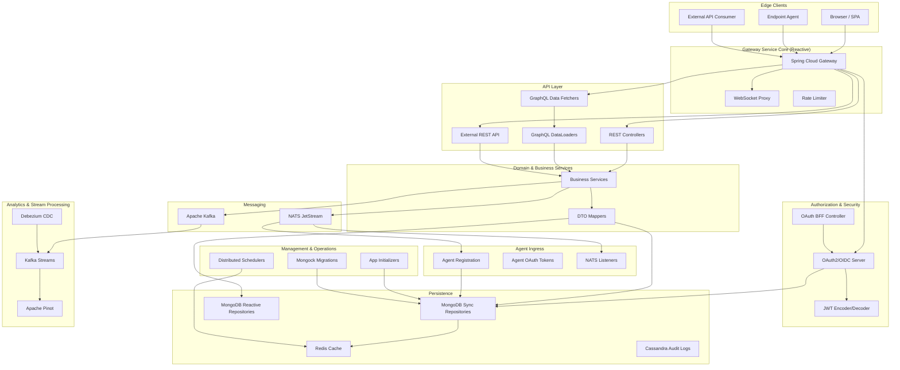
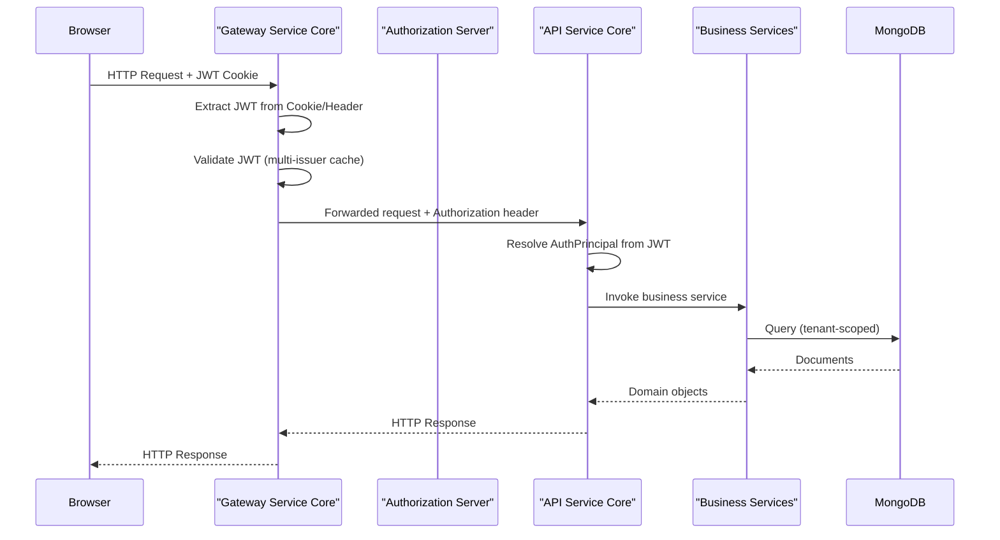
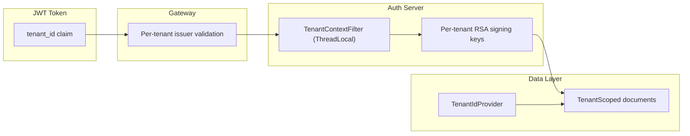

# Architecture Overview

`openframe-oss-lib` implements a **layered, multi-tenant, event-driven architecture** built on Spring Boot 3 and Java 21. This document provides a high-level overview of how all components interact.

---

## High-Level Architecture

```mermaid
flowchart TD
    subgraph Edge["Edge Clients"]
        Browser["Browser / SPA"]
        Agent["Endpoint Agent"]
        External["External API Consumer"]
    end

    subgraph GatewayLayer["Gateway Service Core (Reactive)"]
        Gateway["Spring Cloud Gateway"]
        WsProxy["WebSocket Proxy"]
        RateLimit["Rate Limiter"]
    end

    subgraph AuthLayer["Authorization & Security"]
        AuthServer["OAuth2/OIDC Server"]
        SecurityOAuth["OAuth BFF Controller"]
        JwtCore["JWT Encoder/Decoder"]
    end

    subgraph ApiLayer["API Layer"]
        RestAPI["REST Controllers"]
        GraphQL["GraphQL Data Fetchers"]
        DataLoaders["GraphQL DataLoaders"]
        ExtAPI["External REST API"]
    end

    subgraph DomainLayer["Domain & Business Services"]
        BizServices["Business Services"]
        Mapping["DTO Mappers"]
    end

    subgraph PersistenceLayer["Persistence"]
        MongoSync["MongoDB Sync Repositories"]
        MongoReactive["MongoDB Reactive Repositories"]
        Redis["Redis Cache"]
        Cassandra["Cassandra Audit Logs"]
    end

    subgraph MessagingLayer["Messaging"]
        Kafka["Apache Kafka"]
        NATS["NATS JetStream"]
    end

    subgraph StreamLayer["Analytics & Stream Processing"]
        KafkaStreams["Kafka Streams"]
        Debezium["Debezium CDC"]
        Pinot["Apache Pinot"]
    end

    subgraph AgentIngress["Agent Ingress"]
        AgentReg["Agent Registration"]
        AgentAuth["Agent OAuth Tokens"]
        NatsListeners["NATS Listeners"]
    end

    subgraph Management["Management & Operations"]
        Initializers["App Initializers"]
        Schedulers["Distributed Schedulers"]
        Migrations["Mongock Migrations"]
    end

    Browser --> Gateway
    Agent --> Gateway
    External --> Gateway

    Gateway --> AuthServer
    Gateway --> RestAPI
    Gateway --> GraphQL
    Gateway --> ExtAPI
    Gateway --> WsProxy

    AuthServer --> JwtCore
    AuthServer --> MongoSync
    SecurityOAuth --> AuthServer

    RestAPI --> BizServices
    GraphQL --> DataLoaders
    DataLoaders --> BizServices
    ExtAPI --> BizServices

    BizServices --> Mapping
    Mapping --> MongoSync
    Mapping --> MongoReactive

    BizServices --> Kafka
    BizServices --> NATS

    NATS --> AgentReg
    NATS --> NatsListeners
    AgentReg --> MongoSync

    Kafka --> KafkaStreams
    Debezium --> KafkaStreams
    KafkaStreams --> Pinot

    MongoSync --> Redis
    Schedulers --> Redis

    Initializers --> MongoSync
    Migrations --> MongoSync
```

---

## Core Components

| Component | Module | Description |
|-----------|--------|-------------|
| **API Gateway** | `openframe-gateway-service-core` | Reactive edge layer: JWT validation, API key auth, WebSocket proxy, rate limiting |
| **Authorization Server** | `openframe-authorization-service-core` | Full OAuth2/OIDC server with multi-tenant JWT issuers and SSO |
| **Security OAuth/JWT** | `openframe-security-core`, `openframe-security-oauth` | RSA JWT infrastructure and OAuth BFF layer |
| **REST API** | `openframe-api-service-core` | REST controllers for devices, organizations, users, invitations |
| **GraphQL API** | `openframe-api-service-core` | Netflix DGS-based GraphQL with Relay cursor pagination |
| **External API** | `openframe-external-api-service-core` | OpenAPI-documented REST API for external consumers |
| **Business Services** | `openframe-api-lib` | Domain service interfaces (Device, Ticket, Org, Script, etc.) |
| **Domain Documents** | `openframe-data-mongo-common` | Canonical MongoDB documents for all aggregates |
| **Repositories** | `openframe-data-mongo-sync` | Spring Data MongoDB implementation with custom queries |
| **Agent Ingress** | `openframe-client-core` | Agent registration, authentication, and NATS event handling |
| **Management** | `openframe-management-service-core` | System bootstrapping, schedulers, and data migrations |
| **Kafka** | `openframe-data-kafka` | Kafka producers, topic config, retry producers |
| **NATS** | `openframe-data-nats` | NATS publishers for notifications, tool installation, commands |
| **Stream Processing** | `openframe-stream-service-core` | Kafka Streams topology with Debezium CDC enrichment |
| **Analytics** | `openframe-data-pinot` | Apache Pinot query client for logs and device data |
| **Tool SDKs** | `sdk/tacticalrmm`, `sdk/fleetmdm` | Type-safe SDK wrappers for external RMM and MDM tools |

---

## Data Flow: User Request → Response

The following sequence shows a typical API request from a browser to a data response:

```mermaid
sequenceDiagram
    participant Browser
    participant Gateway as "Gateway Service Core"
    participant AuthServer as "Authorization Server"
    participant API as "API Service Core"
    participant Services as "Business Services"
    participant MongoDB

    Browser->>Gateway: HTTP Request + JWT Cookie
    Gateway->>Gateway: Extract JWT from Cookie/Header
    Gateway->>Gateway: Validate JWT (multi-issuer cache)
    Gateway->>API: Forwarded request + Authorization header
    API->>API: Resolve AuthPrincipal from JWT
    API->>Services: Invoke business service
    Services->>MongoDB: Query (tenant-scoped)
    MongoDB-->>Services: Documents
    Services-->>API: Domain objects
    API-->>Gateway: HTTP Response
    Gateway-->>Browser: HTTP Response
```

---

## Multi-Tenancy Model

Multi-tenancy is a first-class concern at every layer:

```mermaid
flowchart LR
    subgraph JWTLayer["JWT Token"]
        TenantClaim["tenant_id claim"]
    end

    subgraph GatewayLayer["Gateway"]
        IssuerValidation["Per-tenant issuer validation"]
    end

    subgraph AuthLayer["Auth Server"]
        TenantKeys["Per-tenant RSA signing keys"]
        TenantContext["TenantContextFilter (ThreadLocal)"]
    end

    subgraph DataLayer["Data Layer"]
        TenantScoped["TenantScoped documents"]
        TenantProvider["TenantIdProvider"]
    end

    TenantClaim --> IssuerValidation
    IssuerValidation --> TenantContext
    TenantContext --> TenantKeys
    TenantKeys --> TenantScoped
    TenantProvider --> TenantScoped
```

**Key rules:**
- Every MongoDB document has a `tenantId` field with an index
- JWTs include `tenant_id`, `roles`, and `userId` claims
- The `TenantIdProvider` resolves the current tenant from the security context
- In OSS (single-tenant) mode, `TENANT_ID=oss` is used as the default

---

## Key Design Decisions

### 1. Gateway-Enforced Security
The **Gateway Service Core** handles all authentication and authorization. Downstream API services operate as OAuth2 resource servers only for principal resolution — actual enforcement is at the gateway.

### 2. Processor Pattern for Extensibility
Every lifecycle event has a corresponding `*Processor` interface (e.g., `AgentRegistrationProcessor`, `InvitationProcessor`). This allows downstream services to inject custom behavior without modifying the core library.

### 3. Hybrid Messaging Model
- **Kafka** is used for durable, ordered, high-throughput event streaming (Debezium CDC, device telemetry)
- **NATS** is used for low-latency, real-time agent communication (heartbeats, command dispatch, tool installation)

### 4. Relay-Compliant GraphQL
The GraphQL layer implements the Relay pagination specification with cursor-based pagination, `edges/nodes` pattern, and `PageInfo`. This ensures frontend compatibility with Relay or Apollo Client.

### 5. ShedLock for Distributed Scheduling
All scheduled jobs use **ShedLock with Redis** to prevent duplicate execution in clustered environments. Lock keys are namespaced per tenant and environment.

---

## Reference Documentation

For detailed documentation on each module, see the reference docs:

- [API Service Core (Config & Security)](../../reference/architecture/api-service-core-config-and-security/api-service-core-config-and-security.md)
- [Authorization Service Core](../../reference/architecture/authorization-service-core/authorization-service-core.md)
- [Gateway Service Core](../../reference/architecture/gateway-service-core/gateway-service-core.md)
- [Data Model & Repositories (Mongo)](../../reference/architecture/data-model-and-repositories-mongo/data-model-and-repositories-mongo.md)
- [Security OAuth & JWT](../../reference/architecture/security-oauth-and-jwt/security-oauth-and-jwt.md)
- [Management Service Core](../../reference/architecture/management-service-core/management-service-core.md)
- [Integrations SDKs](../../reference/architecture/integrations-sdks/integrations-sdks.md)
