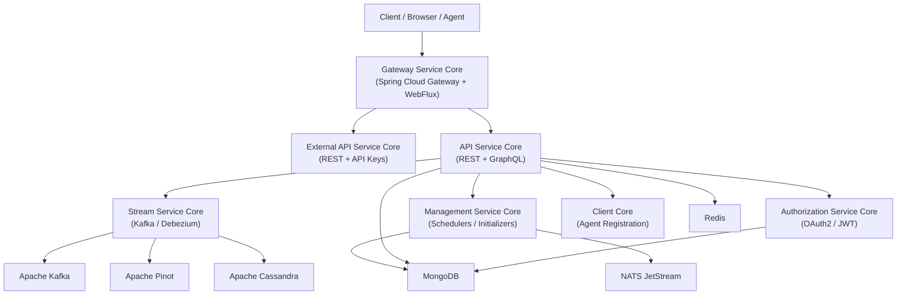
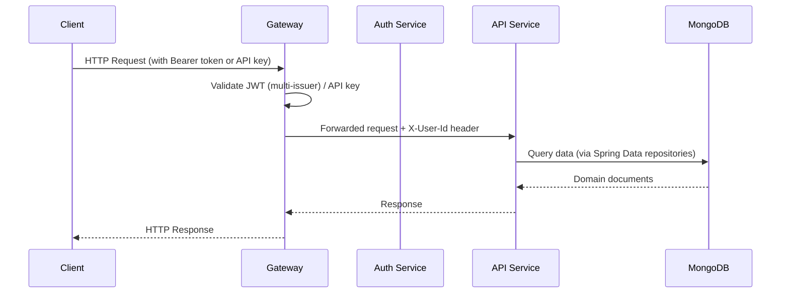
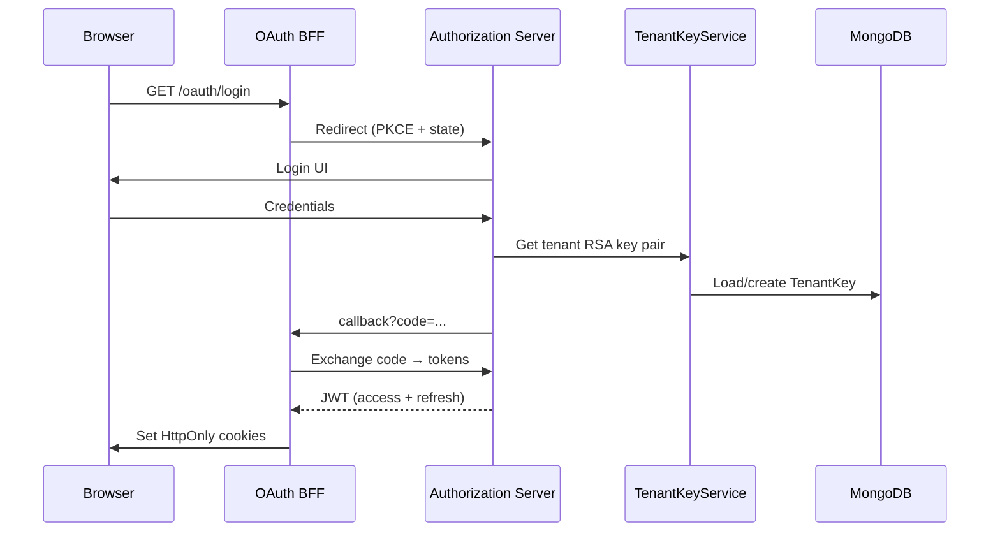
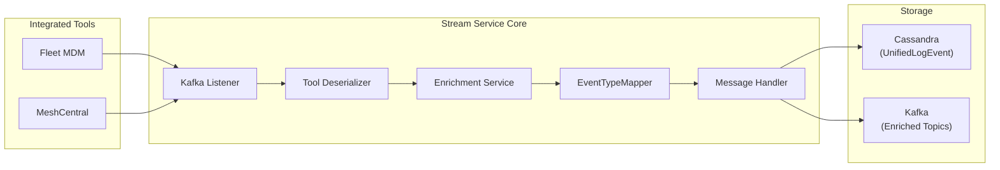
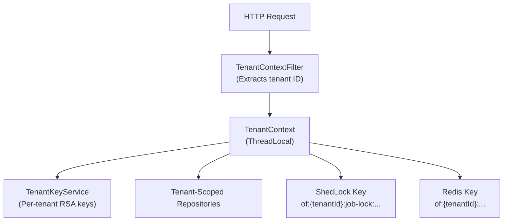

# Architecture Overview

**openframe-oss-lib** implements a layered, multi-tenant service-oriented architecture. This document provides a high-level overview of the system design, component relationships, and key data flows.

---

## High-Level Architecture

```mermaid
flowchart TD
    Client["Client / Browser / Agent"] --> Gateway["Gateway Service Core\n(Spring Cloud Gateway + WebFlux)"]
    Gateway --> ExternalAPI["External API Service Core\n(REST + API Keys)"]
    Gateway --> ApiCore["API Service Core\n(REST + GraphQL)"]

    ApiCore --> Authz["Authorization Service Core\n(OAuth2 / JWT)"]
    ApiCore --> Stream["Stream Service Core\n(Kafka / Debezium)"]
    ApiCore --> Management["Management Service Core\n(Schedulers / Initializers)"]
    ApiCore --> ClientSvc["Client Core\n(Agent Registration)"]

    Authz --> Mongo["MongoDB"]
    ApiCore --> Mongo
    ApiCore --> Redis["Redis"]
    Stream --> Kafka["Apache Kafka"]
    Stream --> Pinot["Apache Pinot"]
    Stream --> Cassandra["Apache Cassandra"]
    Management --> NATS["NATS JetStream"]
    Management --> Mongo
```

---

## Core Modules

| Module | Responsibility | Key Technologies |
|--------|---------------|-----------------|
| `openframe-gateway-service-core` | Edge layer: JWT auth, API key rate limiting, WebSocket proxying, tool routing | Spring Cloud Gateway, WebFlux, Netty |
| `openframe-authorization-service-core` | Multi-tenant OAuth2 auth server: JWT issuance, SSO, per-tenant keys | Spring Authorization Server, Spring Security |
| `openframe-security-core` | JWT encoding/decoding, PKCE, cookie management | Nimbus JOSE, Spring Security |
| `openframe-security-oauth` | OAuth2 BFF: browser-facing login/callback/refresh/logout endpoints | Spring Security OAuth2 |
| `openframe-api-service-core` | Internal API: GraphQL (Relay) + REST controllers | Netflix DGS, Spring MVC |
| `openframe-api-lib` | API contracts: filter DTOs, cursor pagination, mutation types | Spring, Jackson |
| `openframe-external-api-service-core` | External API: API key–authenticated REST endpoints for integrations | Spring MVC, OpenAPI |
| `openframe-client-core` | Agent/device registration, tool agent endpoints | Spring MVC, NATS |
| `openframe-stream-service-core` | Kafka/Debezium CDC: event ingestion, normalization, enrichment | Kafka Streams, Spring Kafka |
| `openframe-management-service-core` | Startup initializers, distributed schedulers, tool orchestration | ShedLock, Spring Retry |
| `openframe-data-mongo-common` | MongoDB domain documents: canonical persistence model | Spring Data MongoDB |
| `openframe-data-mongo-sync` | Synchronous MongoDB repositories + index configuration | Spring Data MongoDB |
| `openframe-data-mongo-reactive` | Reactive MongoDB repositories | Spring Data MongoDB Reactive |
| `openframe-data-redis` | Tenant-aware Redis cache, reactive repositories | Spring Data Redis |
| `openframe-data-kafka` | Multi-tenant Kafka configuration, topic provisioning, retry | Spring Kafka |
| `openframe-data-nats` | NATS JetStream publishers, notification broadcasting | NATS Spring Cloud Stream |
| `openframe-data-cassandra` | Tenant-scoped Cassandra log storage | Spring Data Cassandra |
| `openframe-data-pinot` | Apache Pinot analytics queries | Pinot Java Client |
| `sdk/fleetmdm` | Fleet MDM Java client | Spring WebClient |

---

## Data Flow: Request Processing

```mermaid
sequenceDiagram
    participant C as Client
    participant GW as Gateway
    participant Auth as Auth Service
    participant API as API Service
    participant DB as MongoDB

    C->>GW: HTTP Request (with Bearer token or API key)
    GW->>GW: Validate JWT (multi-issuer) / API key
    GW->>API: Forwarded request + X-User-Id header
    API->>DB: Query data (via Spring Data repositories)
    DB-->>API: Domain documents
    API-->>GW: Response
    GW-->>C: HTTP Response
```

---

## Data Flow: Authentication (OAuth2)

```mermaid
sequenceDiagram
    participant B as Browser
    participant BFF as OAuth BFF
    participant AuthSrv as Authorization Server
    participant KS as TenantKeyService
    participant DB as MongoDB

    B->>BFF: GET /oauth/login
    BFF->>AuthSrv: Redirect (PKCE + state)
    AuthSrv->>B: Login UI
    B->>AuthSrv: Credentials
    AuthSrv->>KS: Get tenant RSA key pair
    KS->>DB: Load/create TenantKey
    AuthSrv->>BFF: callback?code=...
    BFF->>AuthSrv: Exchange code → tokens
    AuthSrv-->>BFF: JWT (access + refresh)
    BFF->>B: Set HttpOnly cookies
```

---

## Data Flow: Event Streaming (Kafka / Debezium)

```mermaid
flowchart LR
    subgraph Tools["Integrated Tools"]
        T2["Fleet MDM"]
        T3["MeshCentral"]
    end
    subgraph Processing["Stream Service Core"]
        L["Kafka Listener"]
        D["Tool Deserializer"]
        E["Enrichment Service"]
        M["EventTypeMapper"]
        H["Message Handler"]
    end
    subgraph Storage["Storage"]
        C["Cassandra\n(UnifiedLogEvent)"]
        K["Kafka\n(Enriched Topics)"]
    end

    T2 --> L
    T3 --> L
    L --> D
    D --> E
    E --> M
    M --> H
    H --> C
    H --> K
```

---

## Multi-Tenancy Design

Every module implements strict tenant isolation:

```mermaid
flowchart TD
    Request["HTTP Request"] --> TenantFilter["TenantContextFilter\n(Extracts tenant ID)"]
    TenantFilter --> ThreadLocal["TenantContext\n(ThreadLocal)"]
    ThreadLocal --> KeyService["TenantKeyService\n(Per-tenant RSA keys)"]
    ThreadLocal --> Repo["Tenant-Scoped Repositories"]
    ThreadLocal --> LockKey["ShedLock Key\nof:{tenantId}:job-lock:..."]
    ThreadLocal --> CacheKey["Redis Key\nof:{tenantId}:..."]
```

Key multi-tenancy patterns:

| Pattern | Implementation |
|---------|---------------|
| Tenant context propagation | `TenantContext` ThreadLocal, set by `TenantContextFilter` |
| Per-tenant JWT signing keys | `TenantKeyService` with RSA key pairs stored in MongoDB |
| Tenant-scoped cache keys | `OpenframeRedisKeyBuilder` prefixes every key with tenant ID |
| Tenant-scoped scheduler locks | ShedLock keys include `tenantId` and `environment` |
| JWT claim injection | `tenant_id`, `userId`, `roles` are embedded in every access token |

---

## Key Design Decisions

### 1. Reactive Gateway, Blocking Services

The gateway (`openframe-gateway-service-core`) is fully reactive (WebFlux + Netty). Internal services use Spring MVC (blocking), keeping service-level logic simple while the gateway handles high concurrency.

### 2. GraphQL + REST Coexistence

- **Internal API:** Relay-compliant GraphQL (Netflix DGS) with DataLoaders for N+1 prevention
- **External API:** REST with OpenAPI documentation and API key authentication
- Both APIs share the same domain services and repositories

### 3. Event-Driven Normalization

Integrated tools (Fleet MDM, MeshCentral) emit raw Debezium CDC events into Kafka. The Stream Service normalizes these into a unified `UnifiedEventType` before persisting to Cassandra or re-publishing.

### 4. Startup Orchestration

All bootstrapping logic is centralized in `openframe-management-service-core` using Spring `ApplicationRunner`. This ensures consistent initialization order across deployments.

---

## Reference Documentation

Detailed architecture documentation is available for each module:

- [Gateway Service Core](./reference/architecture/gateway-service-core-security-and-routing/gateway-service-core-security-and-routing.md)
- [Authorization Service Core](./reference/architecture/authorization-service-core-server-and-tenant/authorization-service-core-server-and-tenant.md)
- [Stream Service Core](./reference/architecture/stream-service-core-kafka-and-handlers/stream-service-core-kafka-and-handlers.md)
- [Management Service Core](./reference/architecture/management-service-core-initializers-and-schedulers/management-service-core-initializers-and-schedulers.md)
- [External API Service Core](./reference/architecture/external-api-service-core/external-api-service-core.md)
- [Data Mongo Domain Model](./reference/architecture/data-mongo-domain-model/data-mongo-domain-model.md)
- [Data Kafka Configuration](./reference/architecture/data-kafka-configuration-and-retry/data-kafka-configuration-and-retry.md)
- [Security Core and OAuth BFF](./reference/architecture/security-core-and-oauth-bff/security-core-and-oauth-bff.md)

