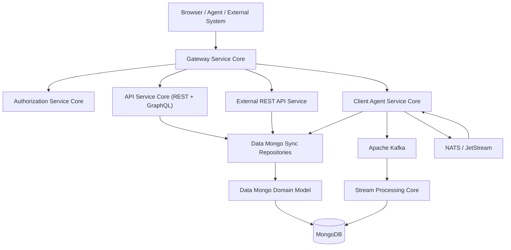
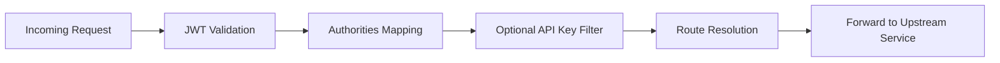
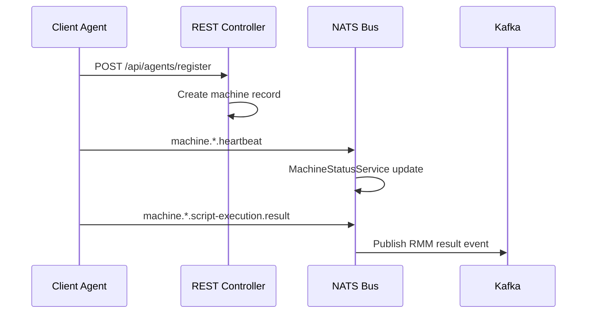
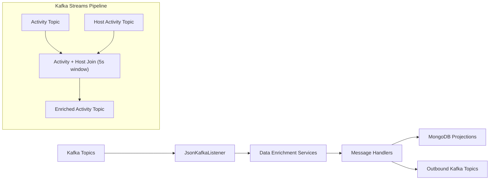

# Architecture Overview

OpenFrame OSS Lib implements a **layered, multi-tenant, event-driven** architecture. This document provides a high-level view of the system's structure, key components, data flow, and design decisions.

---

## High-Level Architecture


```mermaid
flowchart TD
    Client["Browser / Agent / External System"] --> Gateway["Gateway Service Core"]

    Gateway --> Authz["Authorization Service Core"]
    Gateway --> Api["API Service Core (REST + GraphQL)"]
    Gateway --> ExternalApi["External REST API Service"]
    Gateway --> ClientAgent["Client Agent Service Core"]

    Api --> Repos["Data Mongo Sync Repositories"]
    ExternalApi --> Repos
    ClientAgent --> Repos

    Repos --> Domain["Data Mongo Domain Model"]
    Domain --> Mongo[("MongoDB")]

    ClientAgent --> Kafka["Apache Kafka"]
    Kafka --> Stream["Stream Processing Core"]
    Stream --> Mongo

    ClientAgent --> NATS["NATS / JetStream"]
    NATS --> ClientAgent
```

---

## Core Components

| Component | Module | Description |
|---|---|---|
| **Gateway Service Core** | `openframe-gateway-service-core` | Reactive entry point: JWT auth, API keys, rate limiting, WebSocket proxying |
| **Authorization Service Core** | `openframe-authorization-service-core` | Multi-tenant OAuth2/OIDC server with Mongo persistence |
| **API Service Core** | `openframe-api-service-core` | Internal GraphQL (Netflix DGS) + REST API layer |
| **External REST API** | `openframe-external-api-service-core` | Public versioned REST surface for third-party integrations |
| **Client Agent Service Core** | `openframe-client-core` | Agent lifecycle: registration, heartbeat, RMM execution |
| **Data Mongo Domain Model** | `openframe-data-mongo-common` | MongoDB document definitions (no business logic) |
| **Data Mongo Sync Repos** | `openframe-data-mongo-sync` | Synchronous repositories and tenant-aware templates |
| **Stream Processing Core** | `openframe-stream-service-core` | Kafka event ingestion, enrichment, and state projection |
| **Security Core** | `openframe-security-core` | JWT utilities, `AuthPrincipal`, cookie service |

---

## Layer Breakdown

### Edge Layer — Gateway

The **Gateway Service Core** is the single entry point for all traffic. Built with Spring Cloud Gateway (WebFlux + Netty), it:

- Validates JWT tokens using a multi-issuer `JwtIssuerReactiveAuthenticationManagerResolver`
- Authenticates external API requests using `X-API-Key` header validation
- Enforces rate limits per API key (minute/hour/day windows) using Redis
- Rewrites tenant namespace routing headers
- Proxies WebSocket connections to integrated tools (Fleet MDM, MeshCentral, NATS)


```mermaid
flowchart LR
    Request["Incoming Request"] --> JWT["JWT Validation"]
    JWT --> Roles["Authorities Mapping"]
    Roles --> ApiKey["Optional API Key Filter"]
    ApiKey --> Route["Route Resolution"]
    Route --> Upstream["Forward to Upstream Service"]
```

---

### Identity Layer — Authorization Service

The **Authorization Service Core** is the platform's identity anchor:

- Implements Spring Authorization Server 1.3.1
- Issues OAuth2 authorization codes, access tokens, and refresh tokens
- Stores OAuth2 state in MongoDB (`MongoRegisteredClientRepository`, `MongoAuthorizationService`)
- Supports OIDC SSO flows (Google, Microsoft)
- Resolves tenant context from request path or session

**JWT Token Claims:**

```text
{
  "sub": "user@example.com",
  "tenant_id": "tenant-123",
  "userId": "mongo-object-id",
  "roles": ["ADMIN"]
}
```

---

### API Layer — GraphQL + REST

The **API Service Core** exposes two surfaces:

1. **Internal GraphQL API** (Netflix DGS, Relay-compliant)
   - Cursor-based pagination
   - DataLoaders for N+1 elimination
   - Polymorphic type resolution
   - DGS components per domain (devices, scripts, organizations, notifications...)

2. **Internal REST Controllers**
   - Agent registration secrets management
   - API key CRUD
   - User/invitation management
   - Device status updates

The **External REST API Service Core** exposes:
- Versioned endpoints: `/api/v1/devices`, `/api/v1/events`, `/api/v1/organizations`, `/api/v1/logs`, `/api/v1/tools`
- API key authentication (`X-API-Key` header)
- Cursor pagination + filtering + sorting
- Tool proxying via `RestProxyService`
- OpenAPI / Swagger documentation

---

### Agent Layer — Client Service Core

The **Client Agent Service Core** manages the agent lifecycle:


```mermaid
sequenceDiagram
    participant Agent as Client Agent
    participant REST as REST Controller
    participant NATS as NATS Bus
    participant Kafka as Kafka

    Agent->>REST: POST /api/agents/register
    REST->>REST: Create machine record
    Agent->>NATS: machine.*.heartbeat
    NATS->>NATS: MachineStatusService update
    Agent->>NATS: machine.*.script-execution.result
    NATS->>Kafka: Publish RMM result event
```

Distributed safety is enforced via **ShedLock** to prevent duplicate schedule dispatch across replicas.

---

### Data Layer — Domain Model + Repositories

**MongoDB Documents** (from `openframe-data-mongo-common`):

| Domain | Key Documents |
|---|---|
| Devices | `Machine`, `Device`, `DeviceStatus`, `InstalledAgent` |
| Organizations | `Organization`, `ContactInformation` |
| RMM | `Script`, `ScriptExecution`, `ScriptSchedule`, `CommandExecution` |
| Users | `User`, `Invitation`, `UserRole` |
| Tenants | `Tenant`, `TenantKey` |
| Notifications | `Notification`, `NotificationContext` |
| Tools | `IntegratedTool`, `ToolConnection` |
| Tickets | `Ticket`, `TicketStatus`, `TicketNote` |
| Auth | `AuthUser`, `MongoRegisteredClient`, `MongoOAuth2Authorization` |

All documents implement `TenantScoped` for strict tenant isolation.

**Repositories** (`openframe-data-mongo-sync`) use `TenantAwareMongoTemplate` which automatically injects the current tenant into all queries.

---

### Streaming Layer — Event Processing


```mermaid
flowchart LR
    KafkaTopics["Kafka Topics"] --> Listener["JsonKafkaListener"]
    Listener --> Enrich["Data Enrichment Services"]
    Enrich --> Handlers["Message Handlers"]
    Handlers --> Mongo["MongoDB Projections"]
    Handlers --> OutTopics["Outbound Kafka Topics"]

    subgraph streams["Kafka Streams Pipeline"]
        ActivityTopic["Activity Topic"] --> Join["Activity + Host Join (5s window)"]
        HostTopic["Host Activity Topic"] --> Join
        Join --> EnrichedOutput["Enriched Activity Topic"]
    end
```

Kafka Streams are used for stateful windowed joins of activity events from integrated tools (Fleet MDM, MeshCentral).

---

## Key Design Decisions

| Decision | Choice | Rationale |
|---|---|---|
| **Pagination** | Cursor-based (keyset) | Stable for real-time data; avoids offset drift |
| **Multi-tenancy** | ThreadLocal `TenantContext` | Zero-overhead tenant isolation per request |
| **Auth persistence** | MongoDB | Avoids separate PostgreSQL; consistent with domain data store |
| **Event streaming** | Kafka + Debezium | CDC-based change capture from integrated tools |
| **Agent messaging** | NATS / JetStream | Low-latency, at-most-once heartbeats + at-least-once results |
| **GraphQL framework** | Netflix DGS | Production-grade Spring Boot integration with DataLoader support |
| **Gateway** | Spring Cloud Gateway (WebFlux) | Non-blocking, reactive; compatible with WebSocket proxying |
| **Scheduling safety** | ShedLock | Prevents duplicate execution in multi-replica deployments |

---

## Reference Documentation

For deeper per-module documentation, see:

- [Authorization Service Core](../../reference/architecture/authorization-service-core/authorization-service-core.md)
- [Gateway Service Core](../../reference/architecture/gateway-service-core/gateway-service-core.md)
- [API Service Core — GraphQL](../../reference/architecture/api-service-core-graphql/api-service-core-graphql.md)
- [Client Agent Service Core](../../reference/architecture/client-agent-service-core/client-agent-service-core.md)
- [Stream Processing Core](../../reference/architecture/stream-processing-core/stream-processing-core.md)
- [Data Mongo Domain Model](../../reference/architecture/data-mongo-domain-model/data-mongo-domain-model.md)
