# Architecture Overview

OpenFrame OSS Library is built with a modern, microservices-oriented architecture designed for scalability, maintainability, and extensibility. This guide provides a comprehensive overview of the system architecture, design patterns, and component relationships.

## High-Level System Architecture

OpenFrame follows a layered, domain-driven design with clear separation of concerns across multiple services and modules.

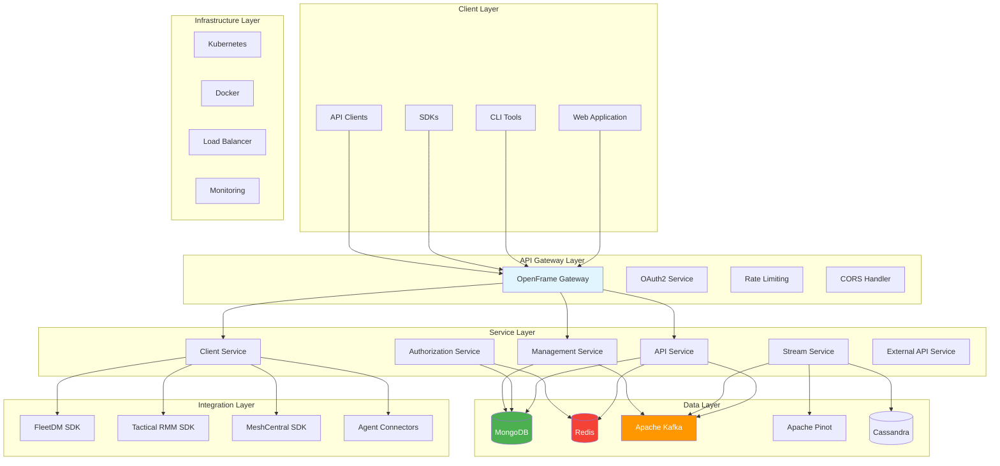

## Core Design Principles

### 1. Domain-Driven Design (DDD)

OpenFrame is organized around business domains:

- **Device Management** - Physical and virtual asset tracking
- **Organization Management** - Multi-tenant MSP customer management  
- **Event Processing** - Real-time activity monitoring and alerting
- **Tool Integration** - External MSP tool connectivity
- **User Management** - Authentication, authorization, and access control

### 2. Microservices Architecture

Each service has a specific responsibility and can be deployed independently:

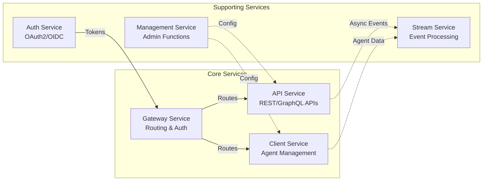

### 3. Event-Driven Architecture

Services communicate through events, ensuring loose coupling:

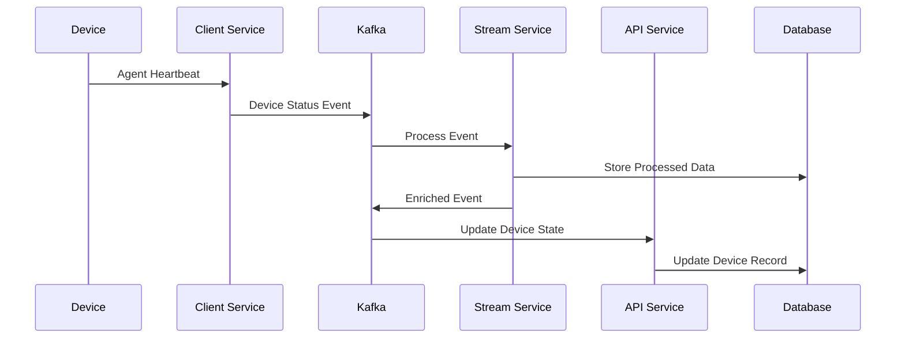

## Module Architecture

### Core Modules

#### openframe-core
Foundation module with shared utilities and common functionality.

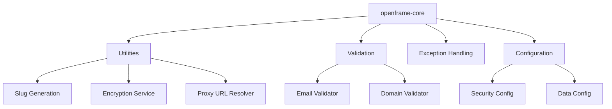

**Key Components:**
- `SlugUtil` - Consistent slug generation
- `EncryptionService` - Data encryption/decryption
- `ValidEmailValidator` - Email format validation
- `TenantDomainValidator` - Multi-tenant domain validation

#### openframe-data-mongo
MongoDB data layer with document models and repositories.

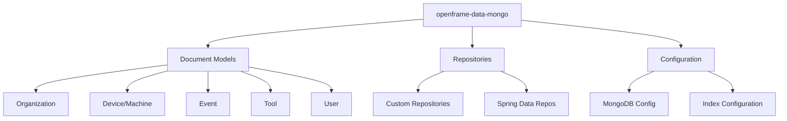

**Key Components:**
- **Documents**: `Organization`, `Device`, `Event`, `Tool`, `User`
- **Repositories**: Custom queries and aggregations
- **Configuration**: Connection management and indexing

#### openframe-security-core  
Security infrastructure with JWT and OAuth2 support.

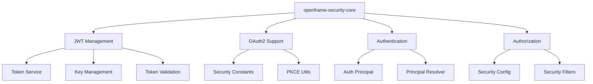

**Key Components:**
- `JwtService` - Token creation and validation
- `AuthPrincipal` - User context and claims
- `PKCEUtils` - OAuth2 PKCE flow support
- `JwtSecurityConfig` - Spring Security integration

### Service Modules

#### openframe-api-service-core
Main API service with REST and GraphQL endpoints.

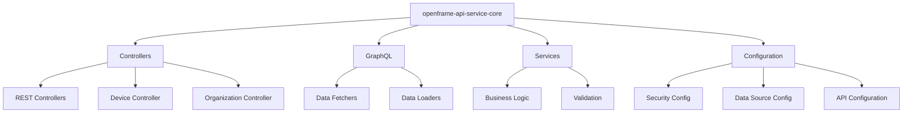

**Key Features:**
- RESTful APIs for all major entities
- GraphQL endpoint with efficient data loading
- Multi-tenant request handling
- Comprehensive input validation

#### openframe-client-core
Agent management and device connectivity.

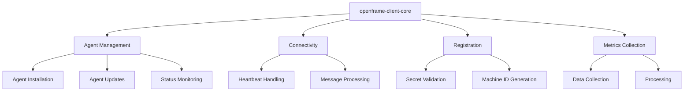

**Key Features:**
- Agent registration and authentication
- Heartbeat monitoring and status tracking
- Tool-specific agent management (FleetDM, Tactical RMM)
- Metrics collection and forwarding

#### openframe-gateway-service-core
API gateway with routing, authentication, and rate limiting.

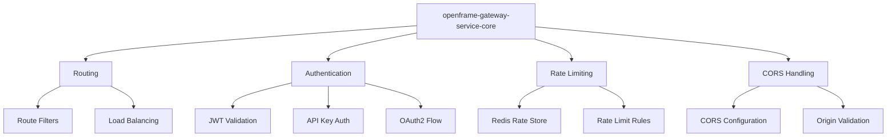

**Key Features:**
- Centralized request routing
- Multiple authentication methods
- Redis-backed rate limiting
- CORS policy enforcement
- WebSocket proxying for real-time features

### Integration Modules

#### SDK Modules (FleetDM, Tactical RMM)
Tool-specific integration SDKs.

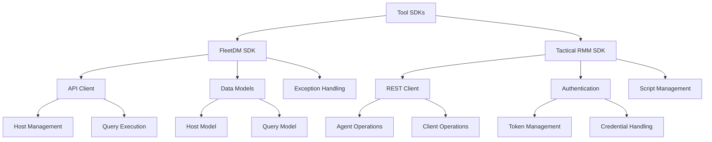

**FleetDM SDK Features:**
- Host search and management
- Query execution and results
- Comprehensive error handling

**Tactical RMM SDK Features:**
- Agent registration and management  
- Script execution and monitoring
- Client organization mapping

## Data Flow Architecture

### Request Processing Flow

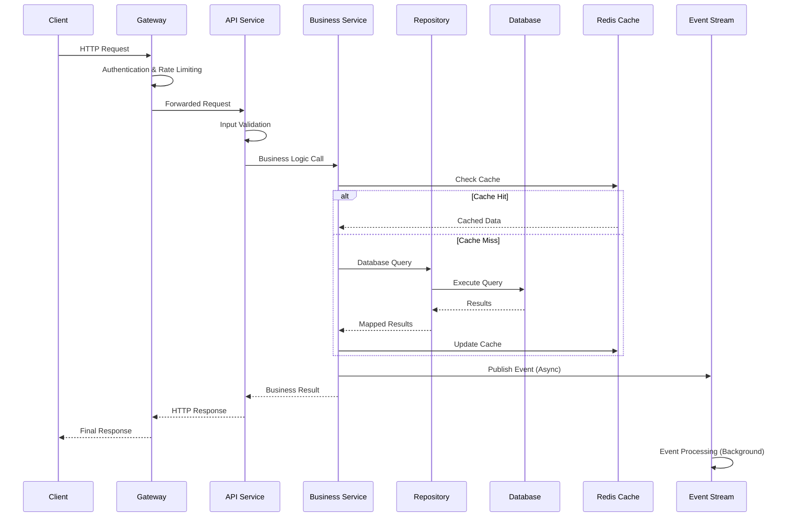

### Event Processing Flow

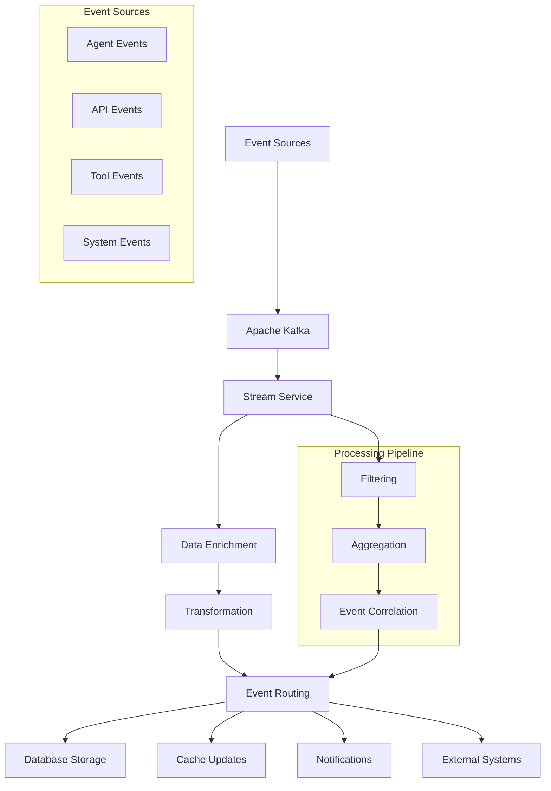

## Security Architecture

### Multi-Tenant Security

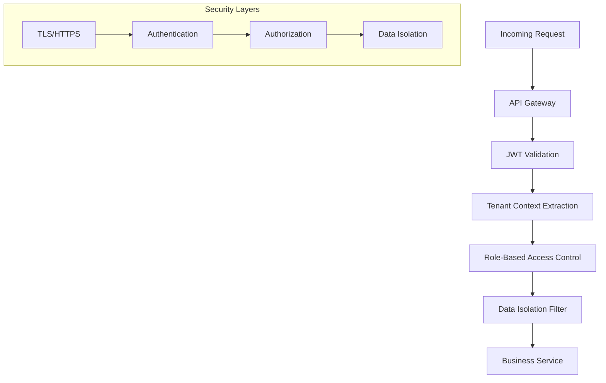

### Authentication Flow

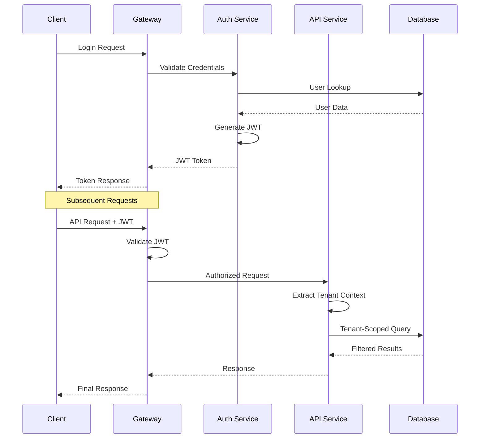

## Performance & Scalability

### Horizontal Scaling Strategy

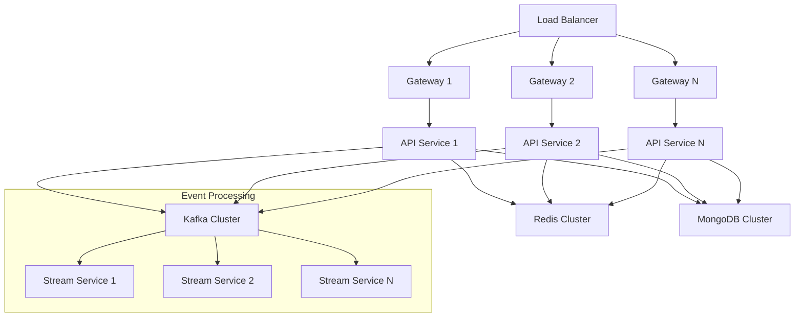

### Caching Strategy

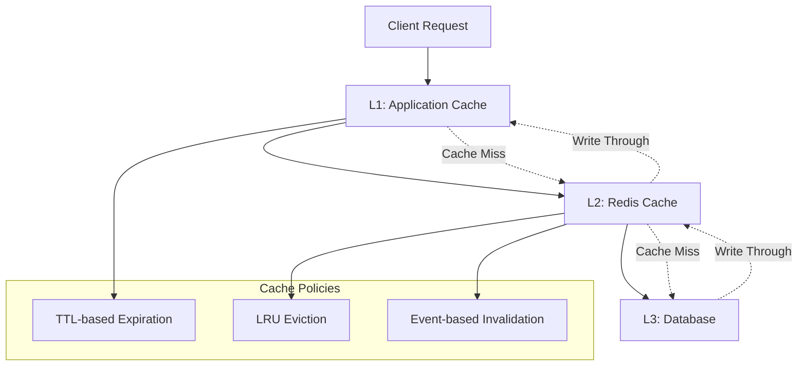

## Development Patterns

### Repository Pattern

```java
// Abstract repository interface
public interface BaseRepository<T, ID> {
    Optional<T> findById(ID id);
    List<T> findAll();
    T save(T entity);
    void deleteById(ID id);
}

// Custom repository with business-specific queries
public interface OrganizationRepository extends BaseRepository<Organization, String> {
    Optional<Organization> findByDomain(String domain);
    List<Organization> findByStatusAndPlan(OrganizationStatus status, TenantPlan plan);
}
```

### Service Layer Pattern

```java
@Service
@Transactional
public class OrganizationService {
    
    @Autowired
    private OrganizationRepository repository;
    
    @Autowired
    private EventPublisher eventPublisher;
    
    public Organization createOrganization(CreateOrganizationRequest request) {
        // Business validation
        validateOrganizationRequest(request);
        
        // Create entity
        Organization org = mapToEntity(request);
        
        // Persist
        Organization saved = repository.save(org);
        
        // Publish event
        eventPublisher.publish(new OrganizationCreatedEvent(saved));
        
        return saved;
    }
}
```

### Event Publishing Pattern

```java
@Component
public class EventPublisher {
    
    @Autowired
    private KafkaTemplate<String, Object> kafkaTemplate;
    
    public void publish(DomainEvent event) {
        kafkaTemplate.send(
            event.getTopicName(),
            event.getPartitionKey(),
            event
        );
    }
}
```

## Error Handling & Resilience

### Circuit Breaker Pattern

```java
@Component
public class ExternalServiceClient {
    
    @CircuitBreaker(name = "fleetdm", fallbackMethod = "fallbackMethod")
    @Retry(name = "fleetdm")
    @TimeLimiter(name = "fleetdm")
    public CompletableFuture<List<Host>> getHosts() {
        return CompletableFuture.supplyAsync(() -> 
            fleetdmClient.searchHosts(new HostSearchRequest()));
    }
    
    public CompletableFuture<List<Host>> fallbackMethod(Exception ex) {
        return CompletableFuture.completedFuture(getCachedHosts());
    }
}
```

### Global Exception Handling

```java
@ControllerAdvice
public class GlobalExceptionHandler {
    
    @ExceptionHandler(ValidationException.class)
    public ResponseEntity<ErrorResponse> handleValidation(ValidationException ex) {
        return ResponseEntity.badRequest()
            .body(new ErrorResponse("VALIDATION_ERROR", ex.getMessage()));
    }
    
    @ExceptionHandler(EntityNotFoundException.class)
    public ResponseEntity<ErrorResponse> handleNotFound(EntityNotFoundException ex) {
        return ResponseEntity.notFound().build();
    }
}
```

## Deployment Architecture

### Container Orchestration

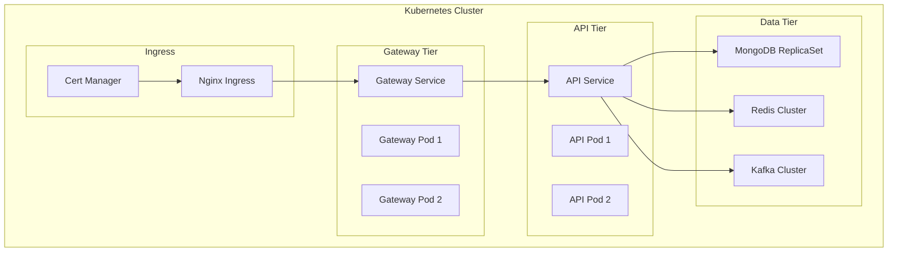

## Monitoring & Observability

### Observability Stack

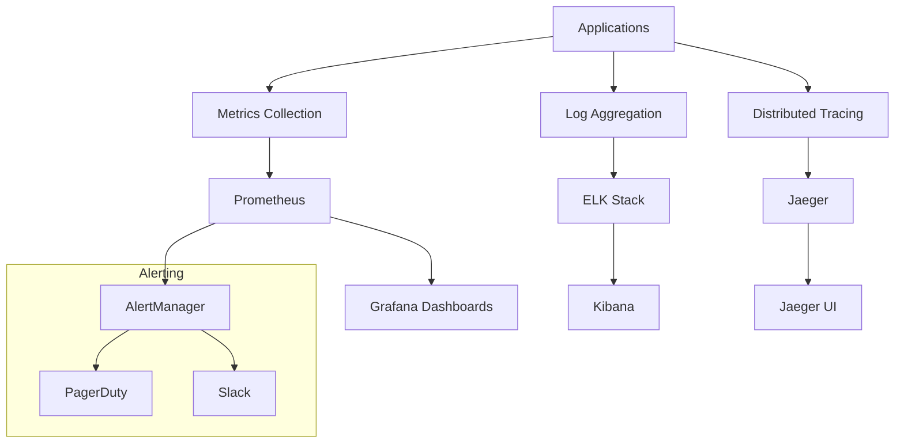

## Next Steps

This architecture overview provides the foundation for understanding OpenFrame's design. For hands-on implementation:

1. **[Testing Overview](../testing/overview.md)** - Learn testing strategies for this architecture
2. **[Contributing Guidelines](../contributing/guidelines.md)** - Understand how to contribute effectively
3. **[Reference Documentation](../../reference/)** - Dive deep into specific modules

## Key Takeaways

✅ **Microservices**: Each service has a single responsibility  
✅ **Event-Driven**: Services communicate through events for loose coupling  
✅ **Multi-Tenant**: Built-in isolation and security from the ground up  
✅ **Scalable**: Horizontal scaling across all tiers  
✅ **Observable**: Comprehensive monitoring and tracing  
✅ **Resilient**: Circuit breakers, retries, and graceful degradation  

---

Understanding this architecture will help you navigate the codebase, make effective contributions, and build robust MSP solutions with OpenFrame! 🏗️