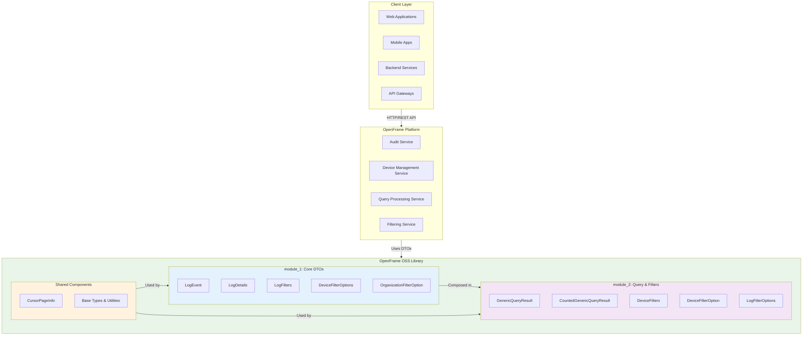
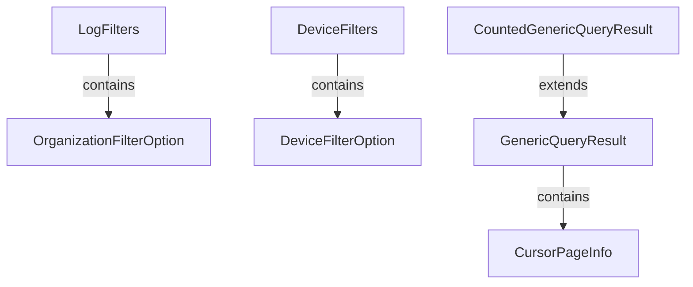
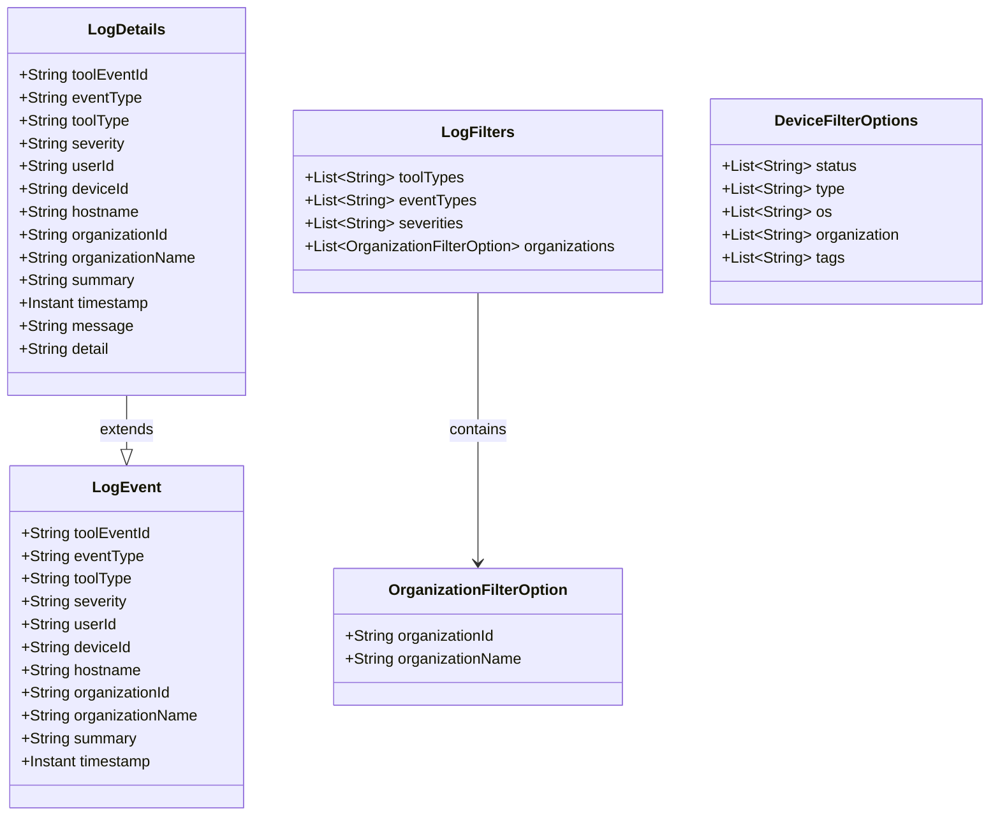
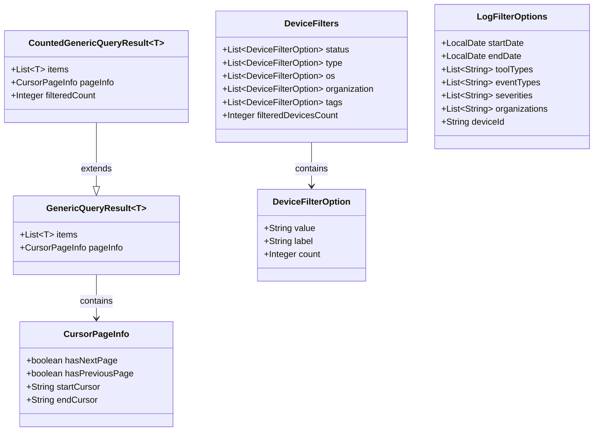
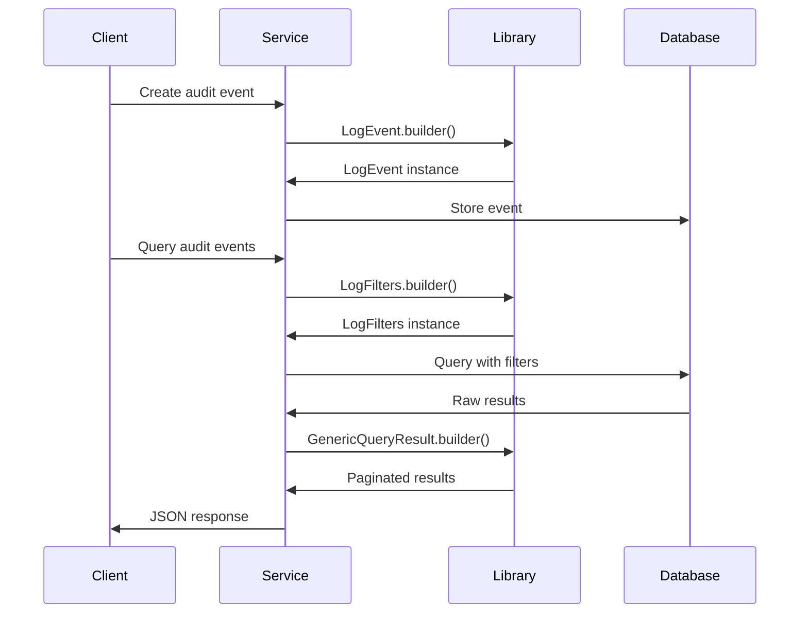
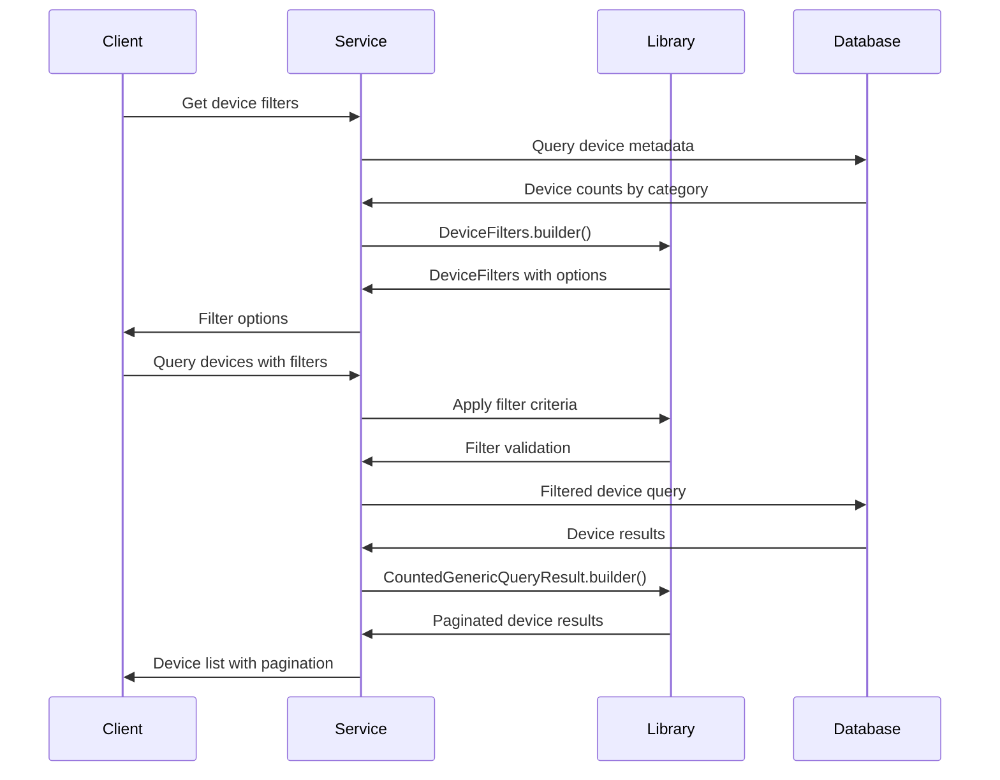
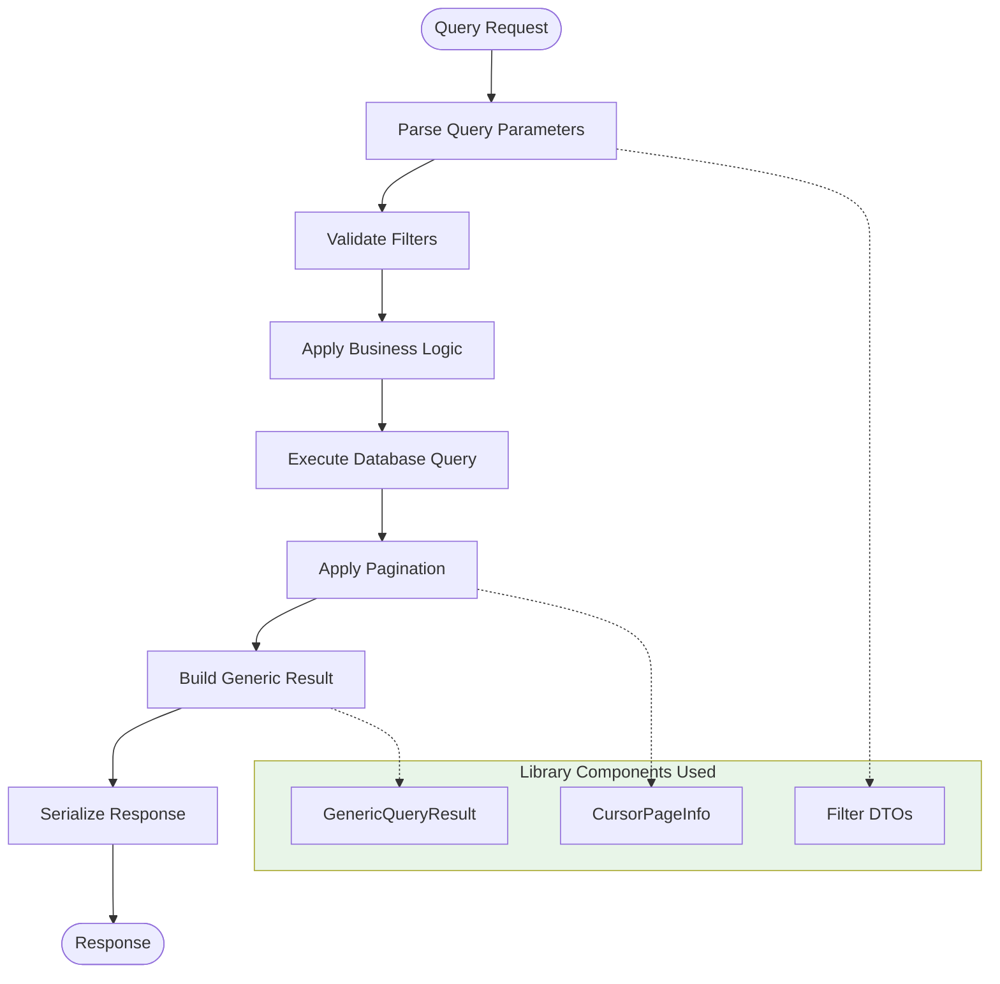
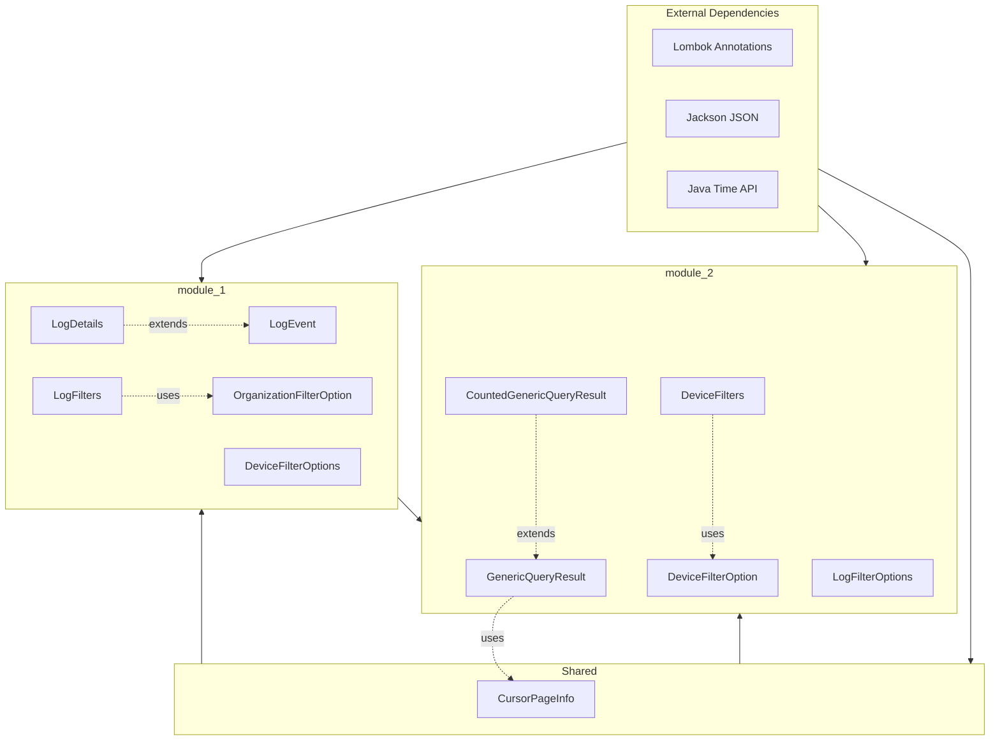
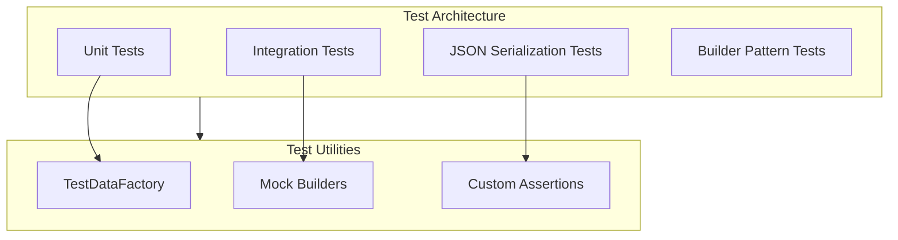

# Architecture Overview

This document provides a comprehensive technical overview of the OpenFrame OSS Library architecture, focusing on the design principles, component relationships, and data flow patterns that developers need to understand when working with or contributing to the library.

## High-Level Architecture

The OpenFrame OSS Library is designed with a modular, layered architecture that promotes reusability, type safety, and clear separation of concerns.



## Core Design Principles

### 1. **Immutability and Thread Safety**

All DTOs are designed to be immutable after construction, ensuring thread safety and predictable behavior:

```java
@Data
@Builder
@NoArgsConstructor
@AllArgsConstructor
public class LogEvent {
    private final String toolEventId;
    private final String eventType;
    // ... other immutable fields
}
```

**Benefits:**
- Thread-safe by default
- Predictable state management
- Safe to share across service boundaries
- Easier to reason about in concurrent environments

### 2. **Type Safety with Generics**

Generic types ensure compile-time type safety while maintaining flexibility:

```java
public class GenericQueryResult<T> {
    private List<T> items;
    private CursorPageInfo pageInfo;
}

// Usage examples:
GenericQueryResult<LogEvent> auditResults;
GenericQueryResult<DeviceInfo> deviceResults;
CountedGenericQueryResult<User> userResults;
```

### 3. **Builder Pattern with Lombok**

Consistent object creation using the builder pattern reduces boilerplate and improves readability:

```java
LogEvent event = LogEvent.builder()
    .toolEventId("evt_123")
    .eventType("USER_LOGIN")
    .severity("INFO")
    .timestamp(Instant.now())
    .build();
```

### 4. **Composition Over Inheritance**

Components are designed to be composed rather than extended, promoting flexibility:



## Module Architecture

### Module 1: Core DTOs and Domain Objects

**Purpose**: Fundamental data structures for audit logging and device management.



**Key Characteristics:**
- **Domain-focused**: Each class represents a specific business concept
- **Rich metadata**: Comprehensive field coverage for audit and device contexts
- **Extensible**: LogDetails extends LogEvent with additional information
- **Filter-ready**: Built-in support for complex filtering scenarios

### Module 2: Query Results and Filter Aggregations

**Purpose**: Generic query processing, pagination, and filter management.



**Key Characteristics:**
- **Generic flexibility**: Works with any data type through generics
- **Pagination support**: Cursor-based pagination for efficient large dataset handling
- **Count information**: Optional total count for UI requirements
- **Filter aggregation**: Structured filter options with counts and labels

## Data Flow Patterns

### 1. Audit Event Flow



### 2. Device Management Flow



### 3. Generic Query Processing



## Component Relationships

### Dependency Graph



### Inter-Module Communication

| Source Module | Target Module | Relationship Type | Example |
|---------------|---------------|-------------------|---------|
| module_1 | module_2 | Composition | `DeviceFilterOptions` used in `DeviceFilters` |
| module_1 | module_2 | Data flow | `LogEvent` instances in `GenericQueryResult<LogEvent>` |
| shared | module_1 | Utility | `CursorPageInfo` used for pagination |
| shared | module_2 | Utility | Generic types and common interfaces |

## Extension Points and Customization

### 1. Adding New Filter Types

To add new filter capabilities:

```java
// 1. Create new filter option DTO
@Data
@Builder
@NoArgsConstructor
@AllArgsConstructor
public class LocationFilterOption {
    private String region;
    private String country;
    private String city;
    private Integer count;
}

// 2. Extend existing filter aggregator
@Data
@Builder
@NoArgsConstructor
@AllArgsConstructor
public class EnhancedDeviceFilters {
    private List<DeviceFilterOption> status;
    private List<DeviceFilterOption> type;
    private List<LocationFilterOption> locations; // New filter type
    private Integer filteredDevicesCount;
}
```

### 2. Custom Query Result Types

For specialized query results:

```java
@Data
@SuperBuilder
@NoArgsConstructor
@AllArgsConstructor
public class AnalyticsQueryResult<T> extends GenericQueryResult<T> {
    private Map<String, Object> aggregations;
    private List<String> warnings;
    private Long executionTimeMs;
}
```

### 3. Domain-Specific Extensions

For new business domains:

```java
@Data
@Builder
@NoArgsConstructor
@AllArgsConstructor
public class SecurityEvent {
    private String eventId;
    private String threatLevel;
    private String sourceIp;
    private String targetResource;
    private Instant detectedAt;
    // ... security-specific fields
}
```

## Performance Considerations

### Memory Efficiency

**Immutable Collections:**
```java
// Use immutable collections for better memory management
@Singular
private List<String> toolTypes; // Lombok @Singular creates efficient collections
```

**Lazy Loading Patterns:**
```java
// For expensive computations, use lazy evaluation
public class DeviceFilters {
    private List<DeviceFilterOption> status;
    
    @JsonIgnore
    private transient Integer cachedCount; // Cached computation
    
    public Integer getTotalCount() {
        if (cachedCount == null) {
            cachedCount = status.stream()
                .mapToInt(DeviceFilterOption::getCount)
                .sum();
        }
        return cachedCount;
    }
}
```

### Serialization Optimization

**JSON Serialization:**
```java
@JsonInclude(JsonInclude.Include.NON_NULL) // Exclude null values
@JsonPropertyOrder({"id", "type", "timestamp"}) // Consistent ordering
public class OptimizedLogEvent {
    // Fields ordered by frequency of access
}
```

**Custom Serializers:**
```java
@JsonSerialize(using = InstantSerializer.class)
@JsonDeserialize(using = InstantDeserializer.class)
private Instant timestamp;
```

## Testing Architecture

### Test Structure



### Test Patterns

**Builder Testing:**
```java
@Test
void testLogEventBuilder() {
    LogEvent event = LogEvent.builder()
        .toolEventId("test_id")
        .eventType("TEST")
        .build();
        
    assertThat(event.getToolEventId()).isEqualTo("test_id");
    assertThat(event.getEventType()).isEqualTo("TEST");
}
```

**Serialization Testing:**
```java
@Test
void testJsonSerialization() throws Exception {
    LogEvent event = TestDataFactory.defaultLogEvent().build();
    
    String json = objectMapper.writeValueAsString(event);
    LogEvent deserialized = objectMapper.readValue(json, LogEvent.class);
    
    assertThat(deserialized).isEqualTo(event);
}
```

## Security Considerations

### Data Privacy

**PII Handling:**
```java
public class LogEvent {
    @JsonIgnore // Exclude from JSON serialization
    private String sensitiveUserData;
    
    // Use hashed or tokenized identifiers instead of raw PII
    private String hashedUserId; // Instead of raw user email
}
```

**Audit Trail Integrity:**
```java
public class SecureLogEvent extends LogEvent {
    @JsonProperty(access = JsonProperty.Access.READ_ONLY)
    private String eventHash; // Tamper detection
    
    @JsonProperty(access = JsonProperty.Access.READ_ONLY)
    private Instant createdAt; // Immutable timestamp
}
```

### Input Validation

**Builder Validation:**
```java
public class ValidatedLogEvent {
    public static class ValidatedLogEventBuilder {
        public ValidatedLogEvent build() {
            Objects.requireNonNull(toolEventId, "toolEventId is required");
            Objects.requireNonNull(eventType, "eventType is required");
            
            if (severity != null && !VALID_SEVERITIES.contains(severity)) {
                throw new IllegalArgumentException("Invalid severity: " + severity);
            }
            
            return new ValidatedLogEvent(this);
        }
    }
}
```

## Deployment and Integration Patterns

### Service Integration

**Spring Boot Integration:**
```java
@Configuration
public class OpenFrameLibraryConfig {
    
    @Bean
    public ObjectMapper openFrameObjectMapper() {
        return new ObjectMapper()
            .registerModule(new JavaTimeModule())
            .configure(SerializationFeature.WRITE_DATES_AS_TIMESTAMPS, false);
    }
}
```

**Microservices Communication:**
```java
@RestController
public class AuditController {
    
    @PostMapping("/audit/events")
    public ResponseEntity<GenericQueryResult<LogEvent>> createAuditEvents(
            @RequestBody List<LogEvent> events) {
        
        // Business logic using library DTOs
        GenericQueryResult<LogEvent> result = auditService.processEvents(events);
        return ResponseEntity.ok(result);
    }
}
```

---

## Summary

The OpenFrame OSS Library architecture emphasizes:

1. **Modularity**: Clear separation between core DTOs and query processing
2. **Type Safety**: Compile-time guarantees through generics
3. **Immutability**: Thread-safe, predictable objects
4. **Extensibility**: Easy to extend for new use cases
5. **Performance**: Efficient memory usage and serialization
6. **Testing**: Comprehensive test coverage and utilities

Understanding this architecture enables developers to effectively use the library, contribute new features, and integrate it into larger systems while maintaining consistency and performance.

**Next Steps**: Explore the [Testing Overview](../testing/overview.md) to understand how to test code that uses these architectural patterns.