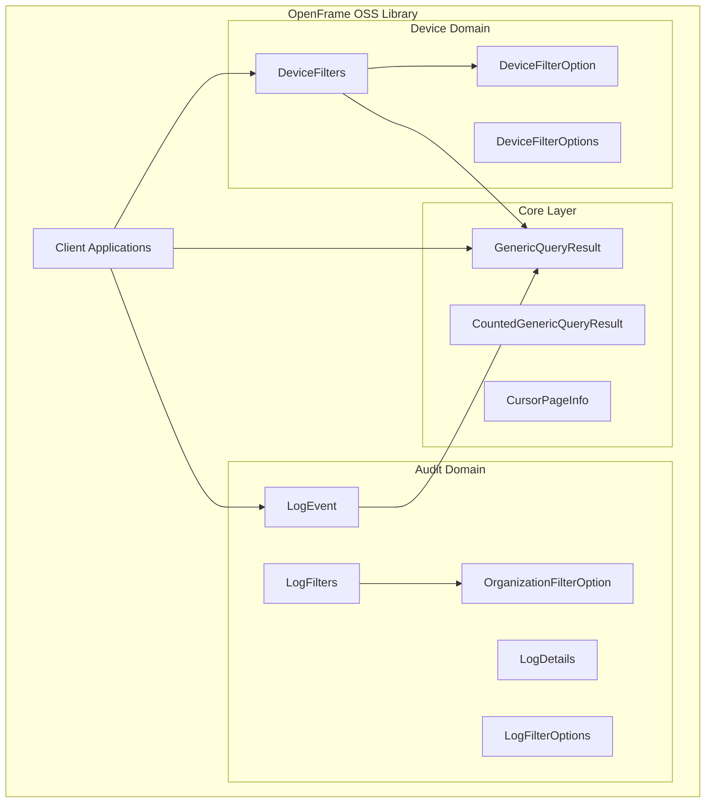
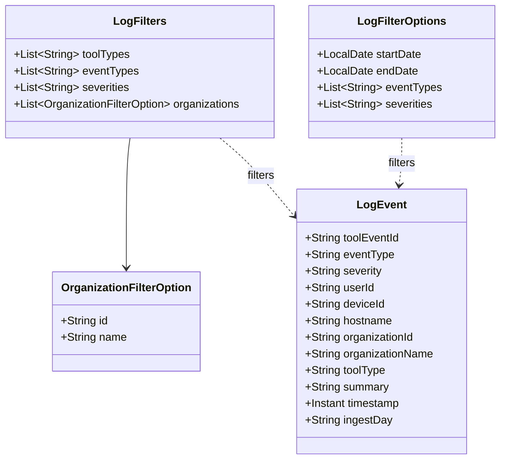
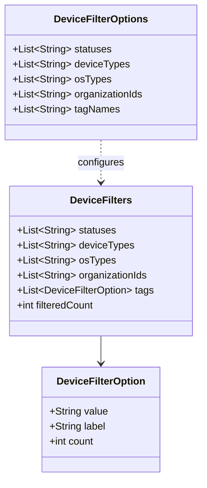
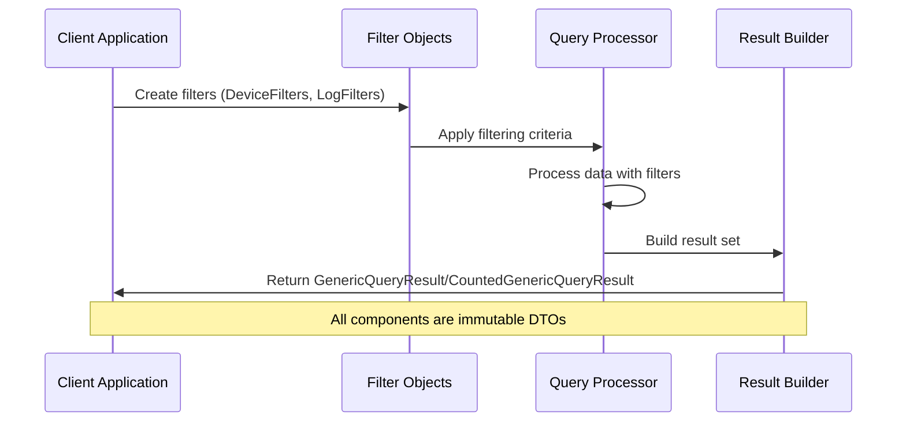
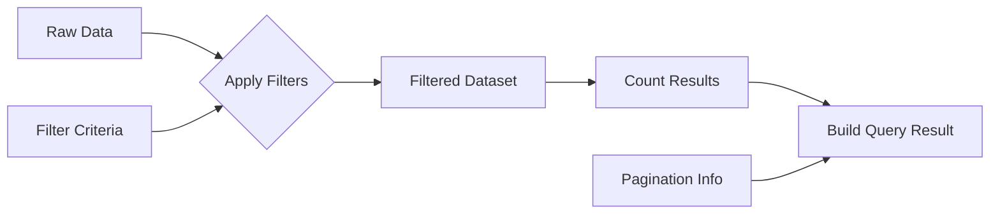

# Architecture Overview

This document provides a comprehensive overview of the OpenFrame OSS Library's architecture, design principles, and core components. Understanding this architecture is essential for effective contribution and extension of the library.

## 🎯 Design Philosophy

The OpenFrame OSS Library is built around several key principles:

- **DTO-First Design**: Clean data transfer objects without business logic
- **Immutability by Default**: Thread-safe, predictable data structures
- **Builder Pattern**: Fluent, safe object construction
- **Type Safety**: Strong typing to prevent runtime errors
- **Lombok Integration**: Minimal boilerplate code
- **Extensibility**: Easy to extend and customize

## 🏗️ High-Level Architecture

The library follows a modular architecture organized around functional domains:



## 📦 Package Structure

The library is organized into logical packages:

```
com.openframe.api.dto/
├── audit/                          # Audit logging domain
│   ├── LogEvent.java              # Main audit log entry
│   ├── LogDetails.java            # Detailed log information  
│   ├── LogFilters.java            # Log filtering criteria
│   ├── LogFilterOptions.java      # Available filter options
│   └── OrganizationFilterOption.java # Organization filters
├── device/                         # Device management domain
│   ├── DeviceFilters.java         # Device filtering criteria
│   ├── DeviceFilterOptions.java   # Available device filters
│   └── DeviceFilterOption.java    # Single device filter option
├── shared/                         # Shared components
│   └── CursorPageInfo.java       # Pagination information
├── CountedGenericQueryResult.java # Query result with count
└── GenericQueryResult.java       # Generic paginated result
```

## 🧩 Core Components

### 1. Generic Query Infrastructure

The foundation for all data queries and results.

#### GenericQueryResult<T>

```java
@Data
@SuperBuilder
@NoArgsConstructor
@AllArgsConstructor
public class GenericQueryResult<T> {
    private List<T> items;           // Query result items
    private CursorPageInfo pageInfo; // Pagination metadata
}
```

**Purpose**: Provides a consistent structure for paginated query results across all domains.

**Usage Pattern**:
```java
// Creating a result set
GenericQueryResult<LogEvent> results = GenericQueryResult.<LogEvent>builder()
    .items(logEvents)
    .pageInfo(paginationInfo)
    .build();
```

#### CountedGenericQueryResult<T>

```java
@EqualsAndHashCode(callSuper = true)
@Data
@SuperBuilder
@NoArgsConstructor
@AllArgsConstructor
public class CountedGenericQueryResult<T> extends GenericQueryResult<T> {
    private int filteredCount;       // Number of items after filtering
}
```

**Purpose**: Extends basic query results with filtering statistics, useful for UI pagination and metrics.

**Key Design Decisions**:
- Inherits from `GenericQueryResult` for consistency
- Adds filtering count for better user experience
- Uses `@SuperBuilder` for inheritance-friendly builder pattern

### 2. Audit Domain Architecture

Handles all audit logging and security event data.

#### Component Relationships



#### LogEvent - Core Audit Entity

The central audit log representation:

```java
@Data
@Builder
@NoArgsConstructor
@AllArgsConstructor
public class LogEvent {
    // Event identification
    private String toolEventId;      // Unique event identifier
    private String eventType;        // Type of event (LOGIN, LOGOUT, etc.)
    
    // Temporal data
    private Instant timestamp;       // When event occurred
    private String ingestDay;        // Day of ingestion (for partitioning)
    
    // Context information
    private String userId;           // User associated with event
    private String deviceId;         // Device where event occurred
    private String hostname;         // Host machine identifier
    private String organizationId;   // Organization identifier
    private String organizationName; // Human-readable org name
    
    // Event classification
    private String toolType;         // Tool/system that generated event
    private String severity;         // Event severity level
    private String summary;          // Human-readable event description
}
```

**Design Rationale**:
- **Immutable by default**: Thread-safe and predictable
- **Rich metadata**: Comprehensive context for audit trails
- **Flexible severity**: Supports various severity models
- **Partition-friendly**: `ingestDay` enables efficient data partitioning

### 3. Device Domain Architecture

Manages device filtering and query capabilities.

#### Component Structure



#### DeviceFilters - Primary Filtering Interface

```java
@Data
@Builder
@NoArgsConstructor
@AllArgsConstructor
public class DeviceFilters {
    private List<String> statuses;        // Device status filters
    private List<String> deviceTypes;     // Device type filters
    private List<String> osTypes;         // Operating system filters
    private List<String> organizationIds; // Organization scope
    private List<DeviceFilterOption> tags; // Tag-based filtering
    private int filteredCount;            // Result count after filtering
}
```

**Key Features**:
- **Multi-dimensional filtering**: Status, type, OS, organization, tags
- **Count tracking**: Provides filtering statistics
- **Flexible tags**: Custom tag-based filtering with counts
- **Organization scoping**: Multi-tenant support

## 🔄 Data Flow Architecture

Understanding how data flows through the system:

### Query Processing Flow



### Filter Application Pattern



## 🔧 Design Patterns

### 1. Builder Pattern with Lombok

**Implementation**:
```java
@Data
@Builder
@NoArgsConstructor
@AllArgsConstructor
public class ExampleDTO {
    private String field1;
    private String field2;
}
```

**Benefits**:
- Fluent API for object creation
- Immutable objects by default
- Optional field handling
- Type-safe construction

### 2. Inheritance with SuperBuilder

**Implementation**:
```java
@Data
@SuperBuilder
@NoArgsConstructor  
@AllArgsConstructor
public class BaseResult<T> {
    private List<T> items;
}

@EqualsAndHashCode(callSuper = true)
@Data
@SuperBuilder
@NoArgsConstructor
@AllArgsConstructor  
public class ExtendedResult<T> extends BaseResult<T> {
    private int count;
}
```

**Benefits**:
- Clean inheritance hierarchies
- Builder pattern works with inheritance
- Consistent API across class hierarchy

### 3. Generic Type Safety

**Implementation**:
```java
public class GenericQueryResult<T> {
    private List<T> items;
    
    // Type-safe methods
    public Optional<T> first() {
        return items.isEmpty() ? Optional.empty() : Optional.of(items.get(0));
    }
}
```

**Benefits**:
- Compile-time type checking
- Reusable across different data types
- IDE auto-completion support

## 🚀 Performance Considerations

### Memory Efficiency

| Design Choice | Impact | Rationale |
|---------------|--------|-----------|
| **Immutable objects** | Higher memory usage | Thread safety, predictability |
| **Generic collections** | Type safety overhead | Prevents ClassCastException |
| **Lombok annotations** | Reduced bytecode | Cleaner source code |
| **Builder pattern** | Object creation overhead | Improved API usability |

### Scalability Patterns

```java
// Efficient large result handling
CountedGenericQueryResult<LogEvent> result = CountedGenericQueryResult.<LogEvent>builder()
    .items(pagedItems)          // Only current page items
    .filteredCount(totalCount)  // Total available (for UI)
    .pageInfo(cursorInfo)       // Pagination state
    .build();
```

## 🧪 Testing Architecture

The testing strategy follows the architectural patterns:

### Test Structure Mirrors Code Structure

```
src/test/java/com/openframe/api/dto/
├── audit/
│   ├── LogEventTest.java
│   ├── LogFiltersTest.java
│   └── OrganizationFilterOptionTest.java
├── device/
│   ├── DeviceFiltersTest.java
│   └── DeviceFilterOptionTest.java
└── GenericQueryResultTest.java
```

### Testing Patterns

```java
class LogEventTest {
    
    @Test
    void builderShouldCreateValidLogEvent() {
        // Given
        String eventId = "test-001";
        String eventType = "LOGIN";
        
        // When
        LogEvent event = LogEvent.builder()
            .toolEventId(eventId)
            .eventType(eventType)
            .build();
            
        // Then
        assertThat(event.getToolEventId()).isEqualTo(eventId);
        assertThat(event.getEventType()).isEqualTo(eventType);
    }
}
```

## 🔮 Extension Points

The architecture supports extension in several areas:

### 1. New DTO Types

```java
// Following established patterns
@Data
@Builder
@NoArgsConstructor
@AllArgsConstructor
public class NewDomainObject {
    // Fields following naming conventions
}
```

### 2. Additional Filter Types

```java
// Extending filter capabilities
@Data
@Builder
@NoArgsConstructor
@AllArgsConstructor
public class AdvancedFilters {
    private List<String> categories;
    private DateRange dateRange;
    private CustomFilterOption customOptions;
}
```

### 3. Specialized Query Results

```java
// Domain-specific result types
@EqualsAndHashCode(callSuper = true)
@Data
@SuperBuilder
@NoArgsConstructor
@AllArgsConstructor
public class AggregatedQueryResult<T> extends CountedGenericQueryResult<T> {
    private Map<String, Long> aggregations;
}
```

## 📊 Architecture Metrics

| Metric | Target | Current | Notes |
|--------|--------|---------|-------|
| **Package Coupling** | Low | Good | Clear domain boundaries |
| **Cyclomatic Complexity** | < 10 | Excellent | Simple DTOs |
| **Test Coverage** | > 90% | TBD | Comprehensive testing |
| **API Consistency** | High | Good | Consistent patterns |

## 🚀 Next Steps

To deepen your architecture understanding:

1. **[Module 1 Deep Dive](../../reference/architecture/module_1.md)** - Detailed component analysis
2. **[Module 2 Deep Dive](../../reference/architecture/module_2.md)** - Extended features
3. **[Testing Guide](../testing/overview.md)** - Architecture testing patterns

---

> **🏗️ Architecture Summary**: The OpenFrame OSS Library uses a clean, layered architecture with strong separation of concerns, type safety, and consistent patterns throughout. This foundation enables reliable, maintainable, and extensible audit logging and device management capabilities.