# Architecture Overview

OpenFrame OSS Library is designed as a comprehensive, modular foundation for building secure, scalable device and organization management platforms. This guide provides a deep dive into the system architecture, design patterns, and key architectural decisions.

## High-Level Architecture

### System Overview

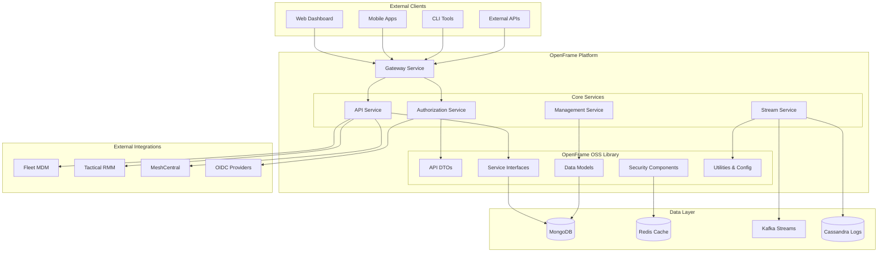

### Architectural Principles

| Principle | Description | Implementation |
|-----------|-------------|----------------|
| **Modularity** | Loosely coupled, highly cohesive components | Separate modules for DTOs, services, data models |
| **Multi-Tenancy** | Secure tenant isolation | Tenant-scoped data access and security contexts |
| **Scalability** | Horizontal scaling capabilities | Stateless services, cursor pagination, caching |
| **Security** | Security by design | JWT authentication, role-based access, audit trails |
| **Extensibility** | Plugin architecture for integrations | Interface-based design, dependency injection |
| **Observability** | Comprehensive monitoring and logging | Structured logging, metrics, health checks |

## Core Components Architecture

### 1. API Layer Architecture

The API layer provides standardized interfaces and data transfer objects.

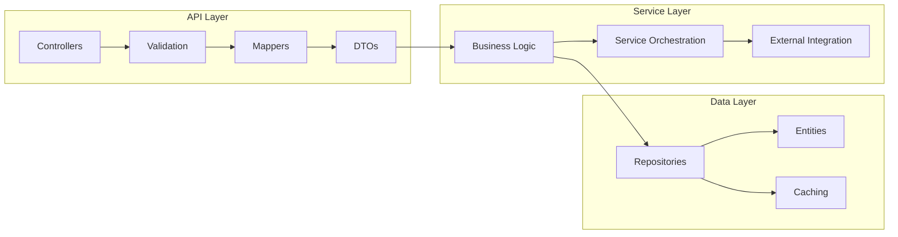

#### Key API Components

**Controllers** (`openframe-api-service-core`)
```java
@RestController
@RequestMapping("/api/devices")
public class DeviceController {
    
    @PostMapping("/search")
    public ResponseEntity<GenericQueryResult<DeviceResponse>> searchDevices(
        @Valid @RequestBody DeviceFilterInput filter) {
        
        GenericQueryResult<DeviceResponse> result = deviceService.searchDevices(filter);
        return ResponseEntity.ok(result);
    }
}
```

**DTOs** (`openframe-api-lib`)
```java
// Input DTO for API requests
public class DeviceFilterInput {
    @Valid
    private List<String> types;
    
    @Valid
    private CursorPaginationInput pagination;
    
    private String organizationId;
}

// Response DTO for API responses
public class DeviceResponse {
    private String id;
    private String serialNumber;
    private String model;
    private DeviceType type;
    private String status;
    private Instant lastCheckin;
}
```

### 2. Service Layer Architecture

The service layer contains business logic and orchestrates operations.

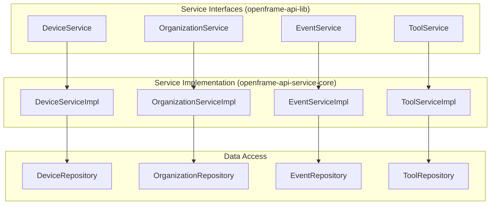

#### Service Implementation Pattern

```java
@Service
@Transactional
public class DeviceServiceImpl implements DeviceService {
    
    private final DeviceRepository deviceRepository;
    private final DeviceMapper deviceMapper;
    private final EventService eventService;
    
    @Override
    public GenericQueryResult<DeviceResponse> searchDevices(DeviceFilterInput filter) {
        // 1. Convert DTO to query criteria
        DeviceQueryFilter queryFilter = deviceMapper.toQueryFilter(filter);
        
        // 2. Execute repository query
        GenericQueryResult<Device> devices = deviceRepository.findWithFilter(queryFilter);
        
        // 3. Map entities to response DTOs
        List<DeviceResponse> responses = deviceMapper.toResponseDTOs(devices.getItems());
        
        // 4. Create audit event
        eventService.logDeviceQuery(filter, responses.size());
        
        // 5. Return paginated result
        return GenericQueryResult.<DeviceResponse>builder()
            .items(responses)
            .pageInfo(devices.getPageInfo())
            .build();
    }
}
```

### 3. Data Layer Architecture

The data layer manages persistence and caching with MongoDB as primary storage.

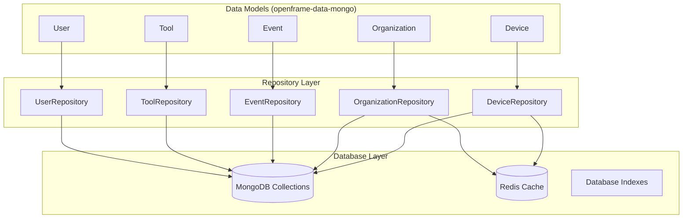

#### Data Model Example

```java
@Document(collection = "devices")
@Data
@Builder
@NoArgsConstructor
@AllArgsConstructor
public class Device {
    
    @Id
    private String id;
    
    @Indexed
    private String machineId;
    
    @Indexed(unique = true)
    private String serialNumber;
    
    private String model;
    private String osVersion;
    
    @Indexed
    private String status;
    
    @Indexed
    private DeviceType type;
    
    @Indexed
    private String organizationId;
    
    private Instant lastCheckin;
    private DeviceConfiguration configuration;
    private DeviceHealth health;
    
    @CreatedDate
    private Instant createdAt;
    
    @LastModifiedDate
    private Instant updatedAt;
}
```

## Multi-Tenant Architecture

### Tenant Isolation Strategy

OpenFrame implements **shared database, shared schema** multi-tenancy with data isolation.

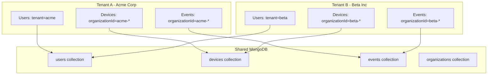

### Tenant Context Management

```java
@Component
public class TenantContextFilter implements Filter {
    
    @Override
    public void doFilter(ServletRequest request, ServletResponse response, 
                        FilterChain chain) throws IOException, ServletException {
        
        HttpServletRequest httpRequest = (HttpServletRequest) request;
        
        // Extract tenant from JWT token or subdomain
        String tenantId = extractTenantId(httpRequest);
        
        try {
            // Set tenant context for current thread
            TenantContext.setCurrentTenant(tenantId);
            chain.doFilter(request, response);
        } finally {
            // Clear tenant context
            TenantContext.clear();
        }
    }
}

@Repository
public class DeviceRepository {
    
    public List<Device> findAllDevices() {
        String tenantId = TenantContext.getCurrentTenant();
        
        // Automatically add tenant filter to all queries
        return mongoTemplate.find(
            Query.query(Criteria.where("organizationId").regex("^" + tenantId + "-")),
            Device.class
        );
    }
}
```

## Security Architecture

### Authentication and Authorization Flow

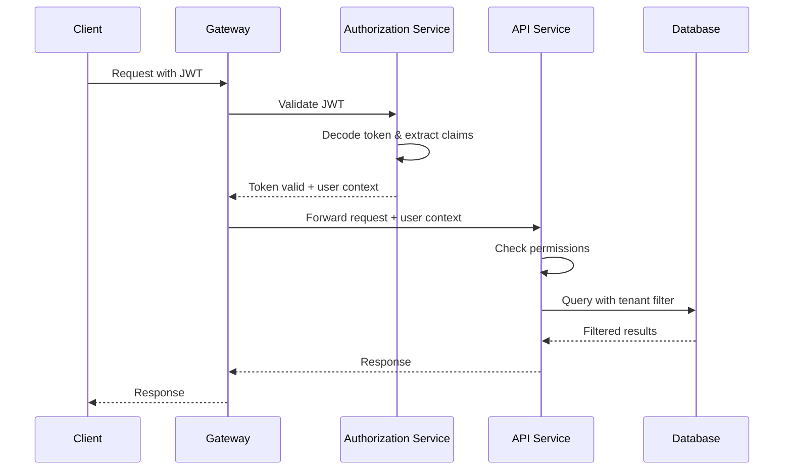

### Security Components

**JWT Token Structure:**
```json
{
  "sub": "user-123",
  "email": "john@acme.com",
  "tenantId": "acme",
  "organizationIds": ["acme-org-1", "acme-org-2"],
  "roles": ["DEVICE_ADMIN", "USER_READER"],
  "iat": 1640995200,
  "exp": 1641081600
}
```

**Role-Based Access Control:**
```java
@PreAuthorize("hasRole('DEVICE_ADMIN') and @tenantChecker.canAccess(#deviceId)")
public DeviceResponse updateDevice(String deviceId, UpdateDeviceRequest request) {
    // Implementation
}

@Component
public class TenantChecker {
    
    public boolean canAccess(String resourceId) {
        String currentTenant = TenantContext.getCurrentTenant();
        String resourceTenant = extractTenantFromResourceId(resourceId);
        return currentTenant.equals(resourceTenant);
    }
}
```

## Data Flow Architecture

### Query Data Flow

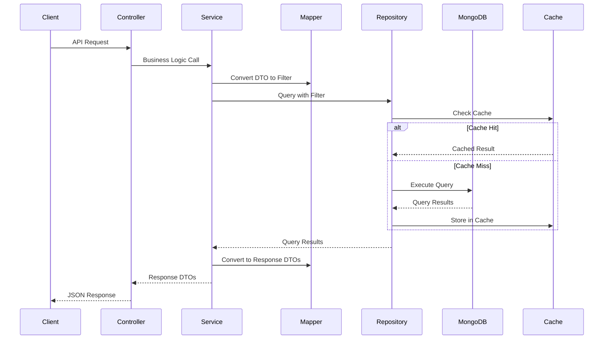

### Event Processing Flow

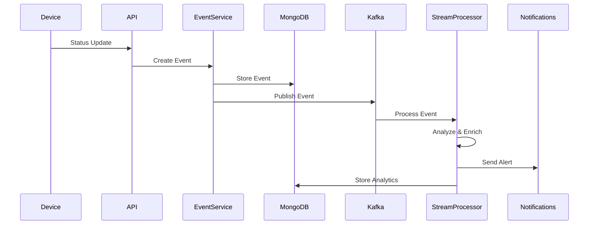

## Pagination Architecture

### Cursor-Based Pagination Design

OpenFrame uses cursor-based pagination for consistent performance and real-time data handling.

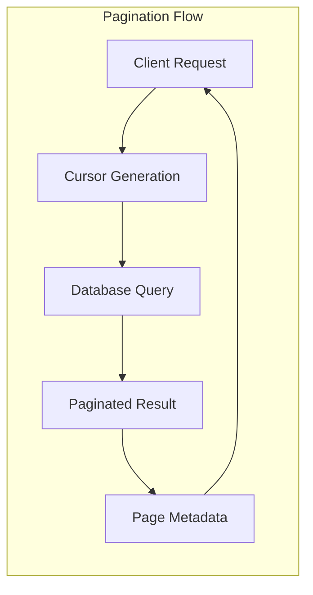

#### Pagination Implementation

```java
public class CursorPaginationInput {
    private Integer first;      // Page size (forward pagination)
    private Integer last;       // Page size (backward pagination)
    private String after;       // Cursor for next page
    private String before;      // Cursor for previous page
}

public class CursorPageInfo {
    private boolean hasNextPage;
    private boolean hasPreviousPage;
    private String startCursor;
    private String endCursor;
}

// Repository implementation
public GenericQueryResult<Device> findWithPagination(CursorPaginationInput pagination) {
    Query query = new Query();
    
    // Add cursor-based filtering
    if (pagination.getAfter() != null) {
        String afterId = decodeCursor(pagination.getAfter());
        query.addCriteria(Criteria.where("id").gt(afterId));
    }
    
    // Set page size
    query.limit(pagination.getFirst() + 1); // +1 to check hasNextPage
    query.with(Sort.by(Sort.Direction.ASC, "id"));
    
    List<Device> devices = mongoTemplate.find(query, Device.class);
    
    // Build page info
    boolean hasNextPage = devices.size() > pagination.getFirst();
    if (hasNextPage) {
        devices.remove(devices.size() - 1); // Remove extra item
    }
    
    CursorPageInfo pageInfo = CursorPageInfo.builder()
        .hasNextPage(hasNextPage)
        .hasPreviousPage(pagination.getAfter() != null)
        .startCursor(encodeCursor(devices.get(0).getId()))
        .endCursor(encodeCursor(devices.get(devices.size() - 1).getId()))
        .build();
    
    return GenericQueryResult.<Device>builder()
        .items(devices)
        .pageInfo(pageInfo)
        .build();
}
```

## Integration Architecture

### External Tool Integration Pattern

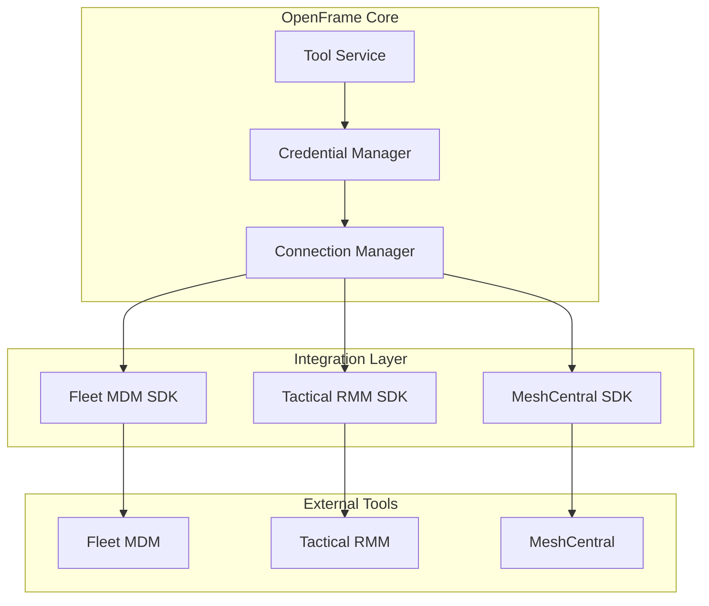

#### Tool Integration Interface

```java
public interface ToolService {
    
    // Connection management
    ToolConnection createConnection(ToolConnectionRequest request);
    ToolConnection updateConnection(String connectionId, ToolConnectionRequest request);
    void deleteConnection(String connectionId);
    
    // Device synchronization
    List<Device> syncDevices(String connectionId);
    Device syncDevice(String connectionId, String deviceId);
    
    // Remote operations
    CommandResult executeCommand(String connectionId, String deviceId, String command);
    FileUploadResult uploadFile(String connectionId, String deviceId, String filePath, byte[] content);
}

@Service
public class FleetMdmToolService implements ToolService {
    
    private final FleetMdmClient fleetClient;
    private final EncryptionService encryptionService;
    
    @Override
    public List<Device> syncDevices(String connectionId) {
        ToolConnection connection = getConnection(connectionId);
        FleetCredentials credentials = decryptCredentials(connection);
        
        // Use Fleet MDM SDK
        HostSearchResponse response = fleetClient.searchHosts(credentials, HostSearchRequest.all());
        
        return response.getHosts().stream()
            .map(this::mapFleetHostToDevice)
            .collect(Collectors.toList());
    }
}
```

## Performance and Scalability

### Caching Strategy

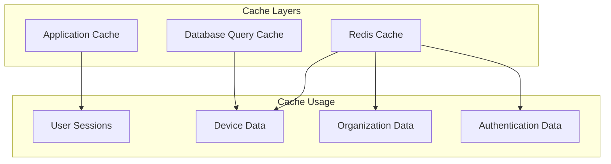

#### Caching Implementation

```java
@Service
@CacheConfig(cacheNames = "devices")
public class DeviceService {
    
    @Cacheable(key = "#deviceId")
    public DeviceResponse getDevice(String deviceId) {
        // Database query only if not in cache
    }
    
    @CacheEvict(key = "#deviceId")
    public DeviceResponse updateDevice(String deviceId, UpdateDeviceRequest request) {
        // Evict cache after update
    }
    
    @CachePut(key = "#result.id")
    public DeviceResponse createDevice(CreateDeviceRequest request) {
        // Put new device in cache
    }
}
```

### Database Optimization

**MongoDB Indexing Strategy:**

```java
@Document(collection = "devices")
public class Device {
    
    @Id
    private String id;
    
    @Indexed  // Single field index
    private String organizationId;
    
    @CompoundIndex(def = "{'organizationId': 1, 'status': 1}")  // Compound index
    @CompoundIndex(def = "{'organizationId': 1, 'type': 1, 'lastCheckin': -1}")
    @CompoundIndex(def = "{'serialNumber': 1}", unique = true)
    private String serialNumber;
}
```

## Error Handling and Resilience

### Exception Handling Strategy

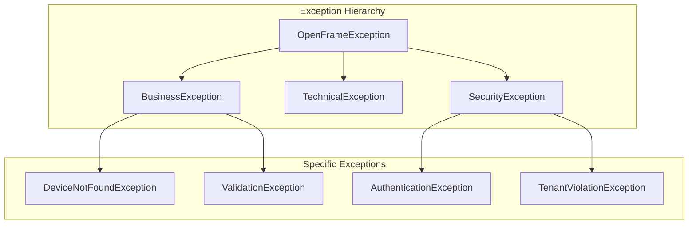

#### Global Exception Handler

```java
@RestControllerAdvice
public class GlobalExceptionHandler {
    
    @ExceptionHandler(DeviceNotFoundException.class)
    public ResponseEntity<ErrorResponse> handleDeviceNotFound(DeviceNotFoundException ex) {
        ErrorResponse error = ErrorResponse.builder()
            .code("DEVICE_NOT_FOUND")
            .message("Device not found: " + ex.getDeviceId())
            .timestamp(Instant.now())
            .build();
        
        return ResponseEntity.status(HttpStatus.NOT_FOUND).body(error);
    }
    
    @ExceptionHandler(ValidationException.class)
    public ResponseEntity<ErrorResponse> handleValidation(ValidationException ex) {
        ErrorResponse error = ErrorResponse.builder()
            .code("VALIDATION_ERROR")
            .message("Validation failed")
            .details(ex.getFieldErrors())
            .timestamp(Instant.now())
            .build();
        
        return ResponseEntity.status(HttpStatus.BAD_REQUEST).body(error);
    }
}
```

## Key Design Decisions

### 1. Cursor vs Offset Pagination

**Why Cursor-Based:**
- ✅ Consistent performance with large datasets
- ✅ Real-time data stability (no duplicates during concurrent updates)
- ✅ Suitable for infinite scrolling UIs
- ❌ More complex implementation
- ❌ Cannot jump to arbitrary pages

### 2. Shared Database Multi-Tenancy

**Why Shared Database:**
- ✅ Cost-effective for large number of tenants
- ✅ Easier maintenance and upgrades
- ✅ Better resource utilization
- ❌ Requires careful query filtering
- ❌ Risk of data leakage if not implemented correctly

### 3. MongoDB as Primary Database

**Why MongoDB:**
- ✅ Flexible schema for device metadata
- ✅ Excellent aggregation capabilities
- ✅ Horizontal scaling support
- ✅ JSON-native for API responses
- ❌ Eventual consistency in some scenarios
- ❌ Complex transactions across documents

### 4. Event Sourcing for Audit Logs

**Why Event Sourcing:**
- ✅ Complete audit trail
- ✅ Replay capability for debugging
- ✅ Scalable event processing
- ❌ More complex than simple logging
- ❌ Storage overhead

## Best Practices and Patterns

### Service Design Patterns

1. **Repository Pattern** - Clean separation of data access logic
2. **DTO Pattern** - Controlled data transfer between layers
3. **Builder Pattern** - Fluent object construction
4. **Strategy Pattern** - Pluggable tool integrations
5. **Observer Pattern** - Event-driven architecture

### Code Quality Standards

- **Test Coverage** - Minimum 80% line coverage
- **Documentation** - Comprehensive Javadoc
- **Code Review** - All changes peer-reviewed
- **Static Analysis** - Automated code quality checks
- **Security Scanning** - Automated vulnerability detection

## Future Architecture Considerations

### Planned Enhancements

1. **GraphQL API** - Flexible query capabilities
2. **Microservices Decomposition** - Service-specific databases
3. **Event Store** - Dedicated event sourcing database
4. **Message Queues** - Reliable async processing
5. **Service Mesh** - Advanced service communication

### Scalability Roadmap

1. **Horizontal Scaling** - Multiple service instances
2. **Database Sharding** - Tenant-based data partitioning
3. **Caching Layer** - Distributed caching with Redis Cluster
4. **CDN Integration** - Static asset delivery
5. **Auto-Scaling** - Kubernetes-based scaling

This architecture provides a solid foundation for building enterprise-grade device management solutions while maintaining flexibility for future growth and feature additions.