# Architecture Overview

OpenFrame OSS Library is built with a modular, microservice-ready architecture that supports multi-tenant SaaS applications. This guide provides a comprehensive overview of the system architecture, design patterns, and core components.

## High-Level Architecture

### System Overview

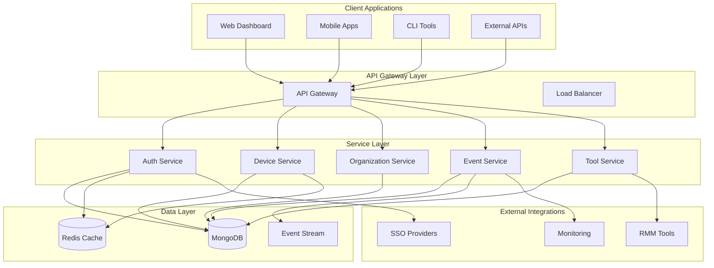

### Core Design Principles

1. **Multi-Tenant by Design** - Complete tenant isolation at all levels
2. **Event-Driven Architecture** - Asynchronous communication via events
3. **Domain-Driven Design** - Clear domain boundaries and models
4. **CQRS Pattern** - Separate read/write operations for scalability
5. **API-First** - All functionality exposed through well-defined APIs

## Module Architecture

### Core Modules Structure

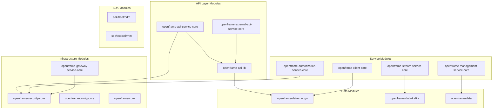

### Module Responsibilities

| Module | Purpose | Key Components |
|--------|---------|----------------|
| **api-lib** | Shared DTOs and interfaces | Device, Organization, Event DTOs |
| **api-service-core** | Main API implementation | Controllers, Services, GraphQL |
| **authorization-service-core** | Authentication & OAuth | JWT, SSO, User management |
| **client-core** | Client device management | Agent registration, Tool installation |
| **data-mongo** | MongoDB entities and repos | Documents, Repositories, Services |
| **security-core** | Security framework | JWT handling, OAuth, RBAC |
| **gateway-service-core** | API gateway functions | Rate limiting, Routing, Auth |
| **stream-service-core** | Event processing | Kafka consumers, Stream processing |

## Data Architecture

### Domain Model Overview

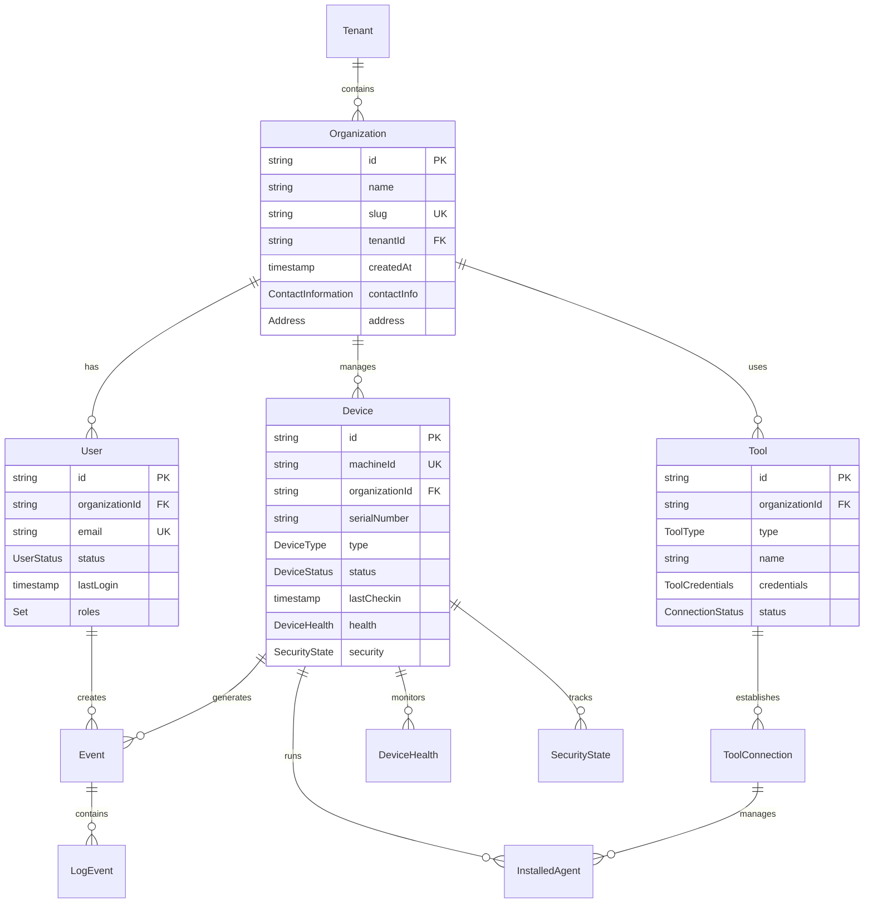

### Database Design Patterns

#### 1. Multi-Tenant Data Isolation

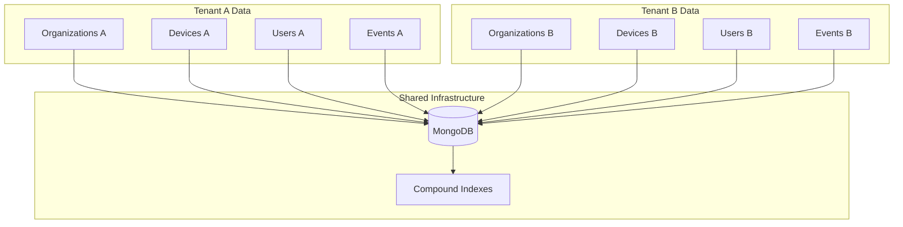

**Tenant Isolation Strategy:**
- All documents include `organizationId` field
- Compound indexes: `(organizationId, field1, field2)`
- Automatic tenant filtering in queries
- No cross-tenant data access possible

#### 2. Event Sourcing for Audit Trail

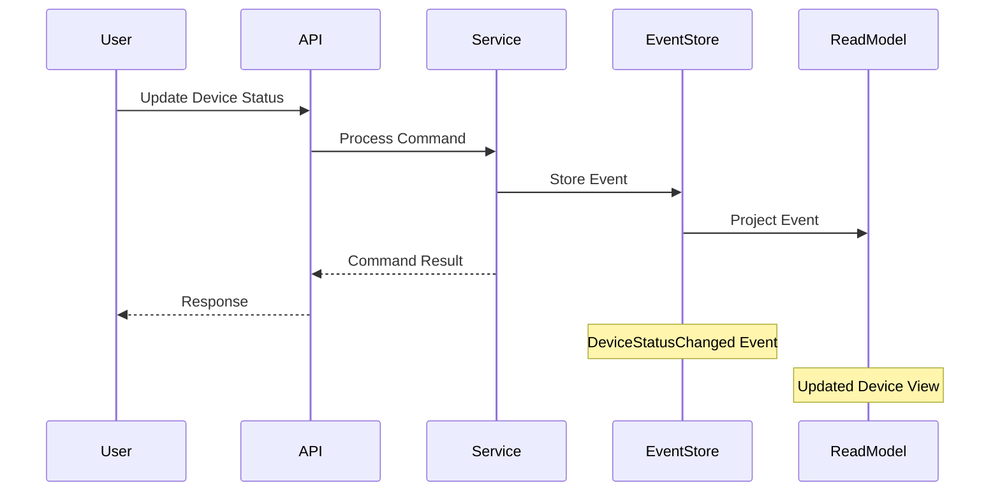

### Caching Strategy

#### Redis Cache Architecture

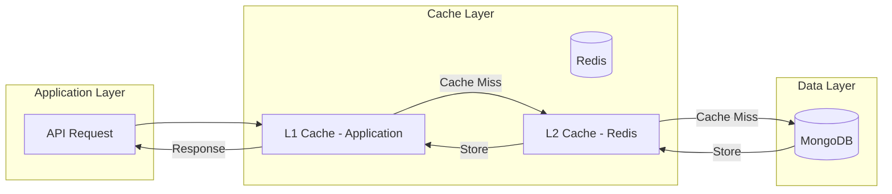

**Cache Patterns:**
- **User Sessions** - JWT token validation cache
- **Organization Data** - Frequently accessed org info
- **Device Status** - Real-time device state cache
- **API Rate Limits** - Request counting and throttling

## Security Architecture

### Authentication & Authorization Flow

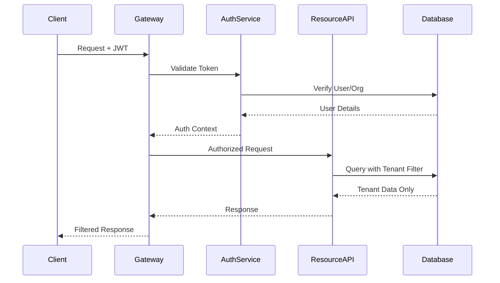

### Security Layers

#### 1. API Gateway Security

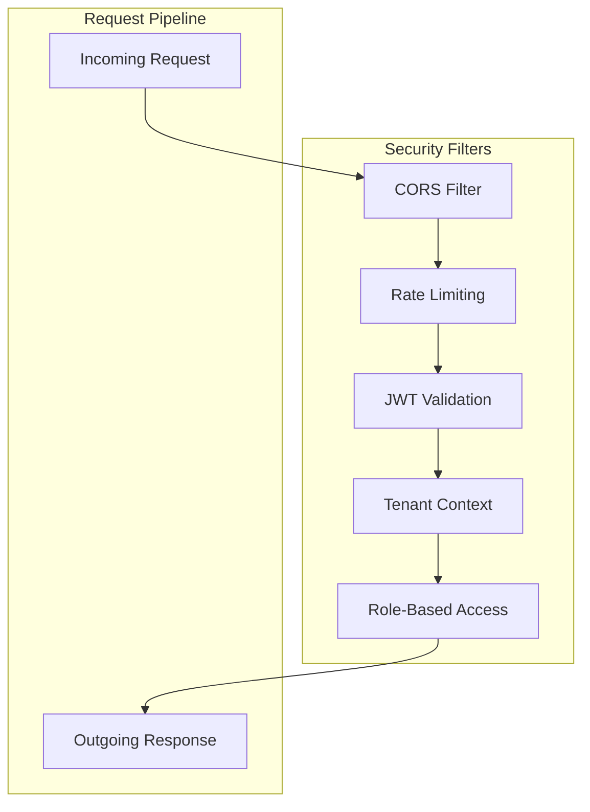

#### 2. Multi-Tenant Security Model

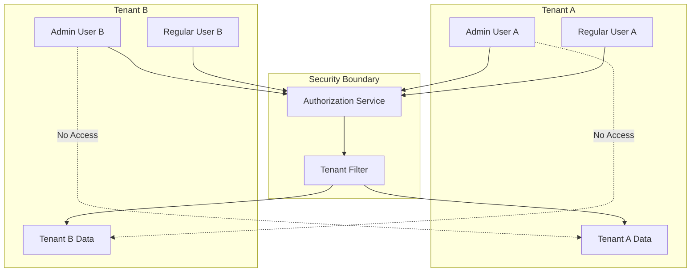

## Event-Driven Architecture

### Event Processing Pipeline

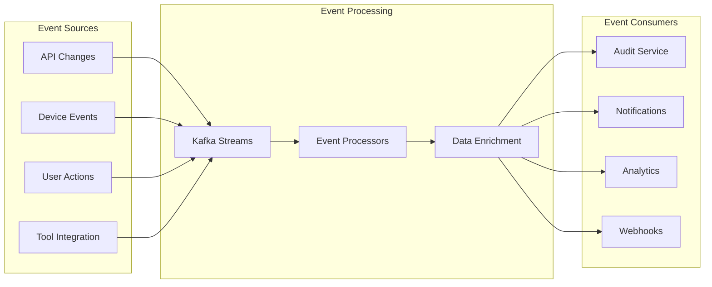

### Event Types & Schema

#### Core Event Schema

```java
public class EventBase {
    private String id;
    private String tenantId;
    private String organizationId;
    private String userId;
    private EventType type;
    private Instant timestamp;
    private String source;
    private Map<String, Object> payload;
    private Map<String, String> metadata;
}
```

#### Event Categories

| Category | Examples | Purpose |
|----------|----------|---------|
| **Device Events** | `DEVICE_REGISTERED`, `DEVICE_STATUS_CHANGED` | Device lifecycle tracking |
| **User Events** | `USER_LOGIN`, `USER_PERMISSION_CHANGED` | User activity auditing |
| **Organization Events** | `ORG_CREATED`, `ORG_SETTINGS_UPDATED` | Tenant management |
| **Tool Events** | `TOOL_CONNECTED`, `TOOL_SYNC_COMPLETED` | Integration monitoring |
| **Security Events** | `AUTHENTICATION_FAILED`, `PERMISSION_DENIED` | Security auditing |

## API Design Patterns

### RESTful API Design

#### Resource Naming Conventions

```text
# Organizations
GET    /api/organizations                    # List organizations
POST   /api/organizations                    # Create organization
GET    /api/organizations/{id}               # Get organization
PUT    /api/organizations/{id}               # Update organization
DELETE /api/organizations/{id}               # Delete organization

# Nested Resources
GET    /api/organizations/{id}/devices       # List org devices
GET    /api/organizations/{id}/users         # List org users
POST   /api/organizations/{id}/users         # Add user to org

# Device Management
GET    /api/devices                          # List all devices
GET    /api/devices/{id}                     # Get device details
POST   /api/devices                          # Register device
PATCH  /api/devices/{id}/status              # Update device status
GET    /api/devices/{id}/health              # Get device health
```

#### Response Format Standards

**Success Response:**
```json
{
  "success": true,
  "data": {
    "id": "device-123",
    "name": "Production Server",
    "status": "ACTIVE",
    "lastCheckin": "2024-01-15T10:30:00Z"
  },
  "pagination": {
    "hasNext": true,
    "cursor": "eyJpZCI6ImRldmljZS0xMjMifQ==",
    "limit": 20
  },
  "meta": {
    "total": 150,
    "took": 45,
    "timestamp": "2024-01-15T10:30:00Z"
  }
}
```

**Error Response:**
```json
{
  "success": false,
  "error": {
    "code": "VALIDATION_ERROR",
    "message": "Invalid device configuration",
    "details": [
      {
        "field": "serialNumber",
        "message": "Serial number is required",
        "rejectedValue": null
      }
    ]
  },
  "meta": {
    "timestamp": "2024-01-15T10:30:00Z",
    "requestId": "req-abc-123"
  }
}
```

### GraphQL API Design

#### Schema Structure

```graphql
type Query {
  # Organizations
  organization(id: ID!): Organization
  organizations(filter: OrganizationFilter, pagination: CursorInput): OrganizationConnection
  
  # Devices
  device(id: ID!): Device
  devices(filter: DeviceFilter, pagination: CursorInput): DeviceConnection
  
  # Events
  events(filter: EventFilter, pagination: CursorInput): EventConnection
}

type Mutation {
  # Device Management
  createDevice(input: CreateDeviceInput!): DevicePayload
  updateDevice(id: ID!, input: UpdateDeviceInput!): DevicePayload
  updateDeviceStatus(id: ID!, status: DeviceStatus!): DevicePayload
  
  # Organization Management
  createOrganization(input: CreateOrganizationInput!): OrganizationPayload
  updateOrganization(id: ID!, input: UpdateOrganizationInput!): OrganizationPayload
}

type Subscription {
  # Real-time updates
  deviceStatusUpdated(organizationId: ID): Device
  eventCreated(organizationId: ID, types: [EventType!]): Event
}
```

## Integration Architecture

### External Tool Integration

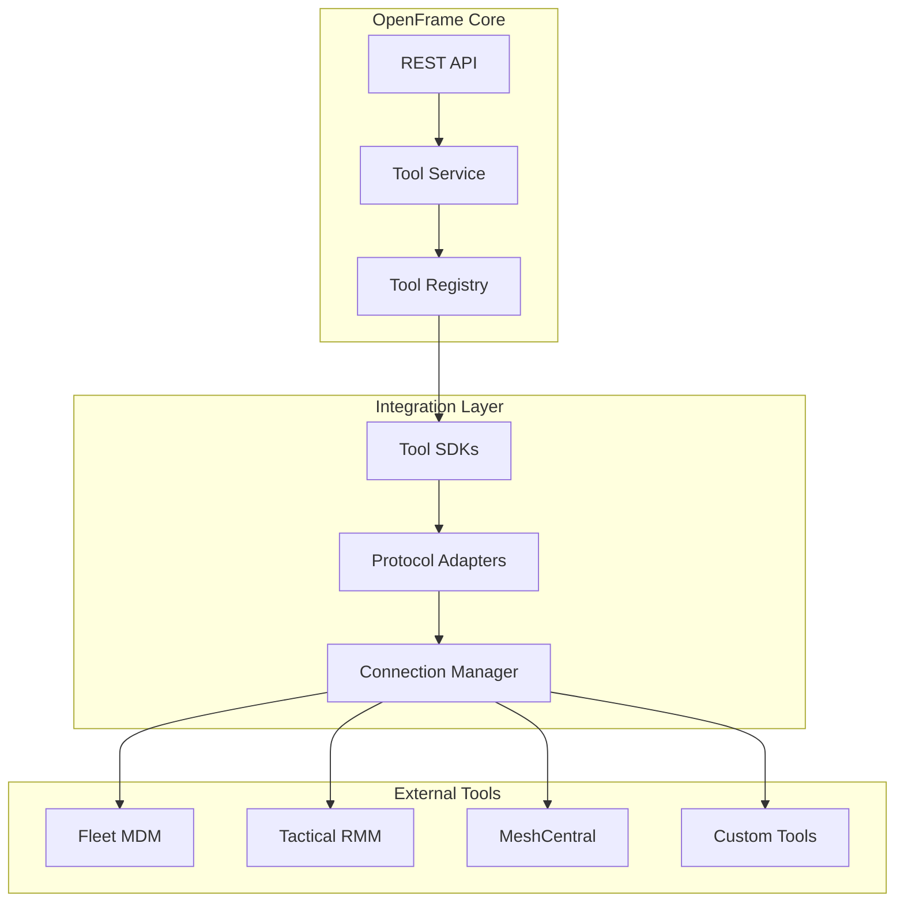

### Integration Patterns

#### 1. SDK-Based Integration

```java
@Component
public class FleetMdmIntegration {
    
    private final FleetMdmClient client;
    
    public List<Device> syncDevices(String organizationId) {
        FleetCredentials creds = getCredentials(organizationId);
        return client.getHosts(creds).stream()
                    .map(this::mapToDevice)
                    .collect(Collectors.toList());
    }
}
```

#### 2. Event-Based Integration

```java
@EventListener
public void handleToolEvent(IntegratedToolEvent event) {
    switch (event.getType()) {
        case DEVICE_UPDATED:
            syncDeviceFromTool(event);
            break;
        case AGENT_INSTALLED:
            registerNewAgent(event);
            break;
    }
}
```

## Performance Architecture

### Scalability Patterns

#### Horizontal Scaling

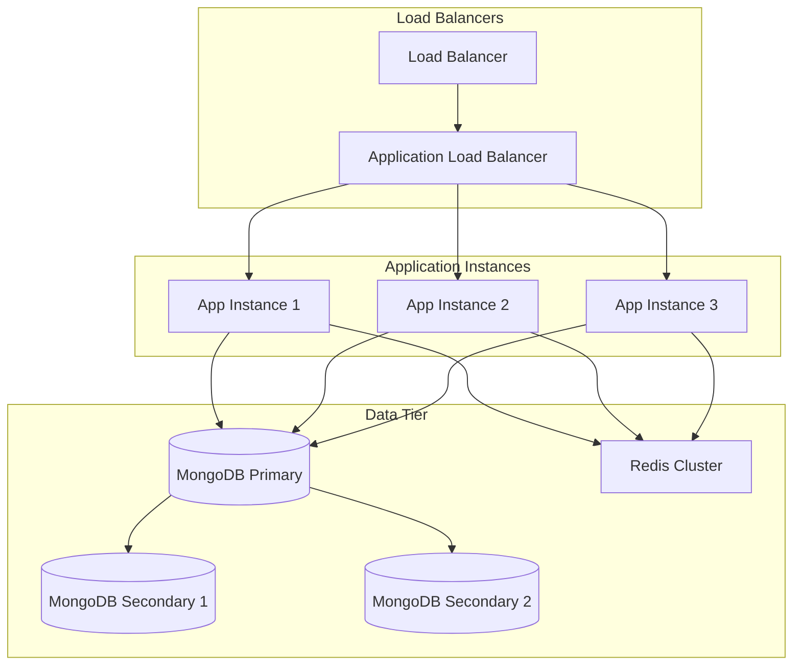

#### Database Optimization

**Index Strategy:**
```javascript
// Compound indexes for multi-tenant queries
db.devices.createIndex({ 
  "organizationId": 1, 
  "status": 1, 
  "lastCheckin": -1 
});

// Text search index
db.devices.createIndex({ 
  "name": "text", 
  "model": "text", 
  "serialNumber": "text" 
});

// Geospatial index for location-based queries
db.devices.createIndex({ "location": "2dsphere" });
```

**Query Optimization:**
```java
// Efficient pagination with cursor
public PageResponse<Device> getDevices(CursorPaginationInput pagination) {
    Criteria criteria = Criteria.where("organizationId").is(orgId);
    
    if (pagination.getCursor() != null) {
        criteria.and("id").gt(decodeCursor(pagination.getCursor()));
    }
    
    Query query = Query.query(criteria)
                      .limit(pagination.getLimit() + 1)
                      .with(Sort.by("id"));
    
    List<Device> devices = mongoTemplate.find(query, Device.class);
    return buildPageResponse(devices, pagination.getLimit());
}
```

## Monitoring & Observability

### Observability Stack

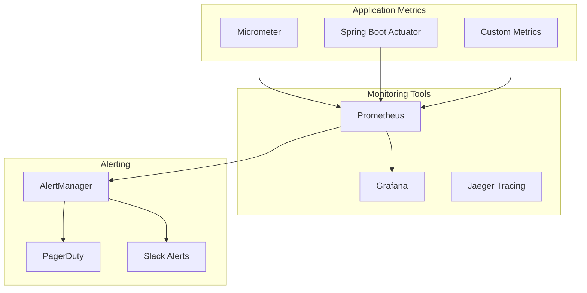

### Key Metrics

| Metric Category | Examples | Purpose |
|----------------|----------|---------|
| **Application** | Request rate, Response time, Error rate | Performance monitoring |
| **Business** | Active devices, Organizations, Events/hour | Business insights |
| **Infrastructure** | CPU, Memory, Disk, Network | Resource monitoring |
| **Database** | Query time, Connection pool, Index usage | Database performance |
| **Security** | Failed logins, Permission denials, API abuse | Security monitoring |

## Key Design Decisions

### 1. **MongoDB for Primary Storage**
- **Why**: Document-based model fits domain objects well
- **Trade-offs**: No ACID transactions across collections
- **Mitigation**: Event sourcing for consistency

### 2. **JWT for Authentication**
- **Why**: Stateless, scalable, standard
- **Trade-offs**: Token revocation complexity
- **Mitigation**: Short expiration + refresh tokens

### 3. **Cursor-based Pagination**
- **Why**: Consistent performance, no offset issues
- **Trade-offs**: No random page access
- **Mitigation**: Search functionality for discovery

### 4. **Event-Driven Architecture**
- **Why**: Loose coupling, scalability, audit trail
- **Trade-offs**: Eventual consistency, complexity
- **Mitigation**: Careful event design, monitoring

## Next Steps

Now that you understand the architecture, explore specific areas:

1. **[API Design Patterns](../api/design-patterns.md)** - Learn API conventions
2. **[Testing Architecture](../testing/overview.md)** - Understand testing strategy  
3. **[Security Implementation](../../reference/architecture/security_core_config.md)** - Dive into security details
4. **[Performance Optimization](../performance/optimization.md)** - Learn performance best practices

## Resources

- 📚 **API Reference**: [Complete API Documentation](../../reference/architecture/overview.md)
- 💬 **Community**: [OpenMSP Slack](https://join.slack.com/t/openmsp/shared_invite/zt-36bl7mx0h-3~U2nFH6nqHqoTPXMaHEHA)
- 🚀 **Platform**: [OpenFrame.ai](https://openframe.ai)

This architecture provides the foundation for building scalable, secure, and maintainable device management platforms with OpenFrame OSS Library! 🏗️