# Architecture Overview

Understanding OpenFrame OSS Library's architecture is essential for effective development. This comprehensive guide covers the high-level system design, data flow patterns, module relationships, and key architectural decisions that shape the platform.

## 🏗️ High-Level System Architecture

OpenFrame OSS Library follows a modular, microservices-ready architecture with clear separation of concerns and well-defined boundaries between layers.

### System Components

```mermaid
graph TB
    subgraph "Client Layer"
        WebApp["Web Application"]
        MobileApp["Mobile App"]  
        SDK["Integration SDKs"]
        CLI["CLI Tools"]
    end
    
    subgraph "API Gateway Layer"
        Gateway["openframe-gateway-service-core<br/>• Request routing<br/>• Rate limiting<br/>• Authentication"]
    end
    
    subgraph "Service Layer"
        API["openframe-api-service-core<br/>• Business logic<br/>• Data validation<br/>• Service orchestration"]
        Auth["openframe-authorization-service-core<br/>• OAuth2/OIDC<br/>• SSO integration<br/>• User management"]
        Client["openframe-client-core<br/>• Agent communication<br/>• Device registration<br/>• Tool management"]
        Stream["openframe-stream-service-core<br/>• Event processing<br/>• Real-time data<br/>• Integration events"]
    end
    
    subgraph "Core Libraries"
        ApiLib["openframe-api-lib<br/>• DTOs<br/>• Service interfaces<br/>• Validation rules"]
        DataMongo["openframe-data-mongo<br/>• Entity models<br/>• Repository interfaces<br/>• Database operations"]
        Core["openframe-core<br/>• Utilities<br/>• Common patterns<br/>• Shared logic"]
        Security["openframe-security-core<br/>• JWT handling<br/>• Auth patterns<br/>• Security utilities"]
    end
    
    subgraph "Data Layer"
        MongoDB["MongoDB<br/>• Primary data store<br/>• Multi-tenant<br/>• ACID transactions"]
        Redis["Redis<br/>• Caching<br/>• Session storage<br/>• Rate limiting"]
        Kafka["Apache Kafka<br/>• Event streaming<br/>• Message processing<br/>• Integration events"]
    end
    
    subgraph "External Integrations"
        TacticalRMM["TacticalRMM"]
        FleetMDM["Fleet MDM"]
        MeshCentral["MeshCentral"]
        Monitoring["Monitoring Tools"]
    end
    
    WebApp --> Gateway
    MobileApp --> Gateway
    SDK --> Gateway
    CLI --> Gateway
    
    Gateway --> API
    Gateway --> Auth
    Gateway --> Client
    
    API --> ApiLib
    Auth --> ApiLib
    Client --> ApiLib
    Stream --> ApiLib
    
    ApiLib --> DataMongo
    DataMongo --> Core
    DataMongo --> Security
    
    API --> MongoDB
    Auth --> MongoDB
    Client --> MongoDB
    Stream --> Kafka
    
    API --> Redis
    Gateway --> Redis
    
    Client --> TacticalRMM
    Client --> FleetMDM
    Client --> MeshCentral
    Stream --> Monitoring
    
    style Gateway fill:#e1f5fe
    style API fill:#f3e5f5
    style ApiLib fill:#e8f5e8
    style MongoDB fill:#fff3e0
```



## 🔄 Data Flow Architecture

Understanding how data flows through the system is crucial for effective development and debugging.

### Request/Response Flow


### Event Processing Flow


## 📦 Module Architecture

OpenFrame is organized into focused modules with clear responsibilities and minimal coupling.

### Core Modules Overview

| Module | Purpose | Dependencies | Artifacts |
|--------|---------|--------------|-----------|
| **openframe-core** | Shared utilities and patterns | None | Validation, utilities, constants |
| **openframe-api-lib** | DTOs and service contracts | openframe-core | DTOs, interfaces, validation |
| **openframe-data-mongo** | Data layer implementation | openframe-api-lib | Entities, repositories, queries |
| **openframe-security-core** | Security patterns | openframe-core | JWT, OAuth, encryption |

### Service Modules Overview

| Module | Purpose | Dependencies | Port |
|--------|---------|--------------|------|
| **openframe-api-service-core** | Main business logic API | All core modules | 8080 |
| **openframe-gateway-service-core** | API gateway and routing | Security modules | 8081 |
| **openframe-authorization-service-core** | Authentication/authorization | Security, data modules | 8082 |
| **openframe-client-core** | Agent and tool communication | API lib, data modules | 8083 |

### Module Dependency Graph


## 🏛️ Architectural Patterns

OpenFrame employs several well-established patterns to ensure maintainability, testability, and scalability.

### Domain-Driven Design

The system is organized around clear business domains:


### Layered Architecture Pattern

Each domain follows a consistent layered approach:


### Repository Pattern Implementation

```java
// Example: Device repository pattern
public interface DeviceRepository extends MongoRepository<Device, String> {
    // Standard CRUD operations inherited
    
    // Custom query methods
    Page<Device> findByOrganizationId(String organizationId, Pageable pageable);
    List<Device> findByStatusAndDeviceType(DeviceStatus status, DeviceType type);
    
    // Complex queries with @Query annotation
    @Query("{'tags': {'$in': ?0}, 'status': ?1}")
    Page<Device> findByTagsInAndStatus(List<String> tags, DeviceStatus status, Pageable pageable);
}

// Custom repository for complex operations
public interface CustomDeviceRepository {
    CountedGenericQueryResult<Device> findDevicesWithFilters(DeviceQueryFilter filter);
    List<Device> findDevicesRequiringCompliance();
    Map<String, Long> getDeviceCountsByOrganization();
}

@Repository
public class CustomDeviceRepositoryImpl implements CustomDeviceRepository {
    
    private final MongoTemplate mongoTemplate;
    
    @Override
    public CountedGenericQueryResult<Device> findDevicesWithFilters(DeviceQueryFilter filter) {
        // Implementation using MongoTemplate for complex queries
        Query query = buildQueryFromFilter(filter);
        
        // Get total count for pagination
        long totalCount = mongoTemplate.count(query, Device.class);
        
        // Apply pagination
        query.with(buildPageable(filter.getPagination()));
        
        // Execute query
        List<Device> devices = mongoTemplate.find(query, Device.class);
        
        return CountedGenericQueryResult.<Device>builder()
            .items(devices)
            .totalCount(totalCount)
            .pageInfo(buildPageInfo(filter.getPagination(), totalCount))
            .build();
    }
}
```

## 🗄️ Data Architecture

OpenFrame uses a sophisticated data architecture designed for multi-tenancy, scalability, and consistency.

### MongoDB Schema Design


### Multi-Tenant Data Isolation


### Pagination Strategy

OpenFrame uses cursor-based pagination for optimal performance:

```java
// Cursor pagination implementation
@Data
@Builder
public class CursorPaginationInput {
    @Min(1) @Max(100)
    private Integer limit;
    private String cursor; // Base64 encoded last item identifier
}

// Service implementation
public CountedGenericQueryResult<Device> findDevices(DeviceFilterInput input) {
    Query query = buildBaseQuery(input.getFilters());
    
    // Apply cursor if provided
    if (input.getPagination().getCursor() != null) {
        String decodedCursor = decodeCursor(input.getPagination().getCursor());
        query.addCriteria(Criteria.where("_id").gt(new ObjectId(decodedCursor)));
    }
    
    // Apply limit + 1 to check if there are more results
    query.limit(input.getPagination().getLimit() + 1);
    
    List<Device> devices = mongoTemplate.find(query, Device.class);
    
    boolean hasNext = devices.size() > input.getPagination().getLimit();
    if (hasNext) {
        devices.remove(devices.size() - 1); // Remove the extra item
    }
    
    String nextCursor = hasNext ? encodeCursor(devices.get(devices.size() - 1).getId()) : null;
    
    return CountedGenericQueryResult.<Device>builder()
        .items(devices)
        .totalCount(getTotalCount(input.getFilters()))
        .pageInfo(CursorPageInfo.builder()
            .hasNextPage(hasNext)
            .nextCursor(nextCursor)
            .build())
        .build();
}
```

## 🔐 Security Architecture

Security is built into every layer of the OpenFrame architecture.

### Authentication & Authorization Flow


### JWT Token Structure

```javascript
// JWT Payload Example
{
  "sub": "user123",                    // User ID
  "email": "user@example.com",         // User email
  "org_id": "org456",                  // Organization ID (tenant)
  "roles": ["admin", "device_manager"], // User roles
  "permissions": [                     // Specific permissions
    "devices:read",
    "devices:write", 
    "organizations:read"
  ],
  "iat": 1640995200,                   // Issued at
  "exp": 1641081600,                   // Expires at
  "iss": "openframe-auth",             // Issuer
  "aud": "openframe-api"               // Audience
}
```

## ⚡ Performance Considerations

### Caching Strategy


### Database Optimization

- **Indexes**: Strategic indexing on query patterns
- **Aggregation**: MongoDB aggregation pipelines for complex operations
- **Connection Pooling**: Optimized connection management
- **Read Replicas**: Separate read/write operations for scaling

### Key Performance Metrics

| Metric | Target | Monitoring |
|--------|--------|------------|
| **API Response Time** | < 200ms (95th percentile) | Application metrics |
| **Database Query Time** | < 50ms (average) | MongoDB profiling |
| **Cache Hit Rate** | > 90% | Redis monitoring |
| **Memory Usage** | < 80% of available | JVM metrics |

## 🔄 Integration Architecture

OpenFrame integrates with various MSP tools through a unified integration framework.

### Tool Integration Pattern


## 📊 Monitoring & Observability

### Application Metrics


## 🚀 Deployment Architecture

### Microservices Deployment


## 🎯 Key Architectural Decisions

### Decision 1: Cursor-Based Pagination
**Why**: Better performance for large datasets, consistent results during real-time updates
**Trade-offs**: More complex implementation vs. better scalability

### Decision 2: MongoDB as Primary Database  
**Why**: Document model fits MSP data, built-in multi-tenancy support, ACID transactions
**Trade-offs**: NoSQL learning curve vs. flexible schema evolution

### Decision 3: Microservices Architecture
**Why**: Independent scaling, technology flexibility, clear service boundaries
**Trade-offs**: Operational complexity vs. development velocity

### Decision 4: JWT for Authentication
**Why**: Stateless, scalable, standard-compliant
**Trade-offs**: Token size vs. no server-side session storage

### Decision 5: Event-Driven Integration
**Why**: Loose coupling, scalability, real-time processing
**Trade-offs**: Eventual consistency vs. system resilience

## 📚 Further Reading

- **[Local Development Setup](../setup/local-development.md)** - Get the architecture running locally
- **[Testing Overview](../testing/overview.md)** - Test architectural patterns
- **[Contributing Guidelines](../contributing/guidelines.md)** - Architectural contribution standards

---

Understanding this architecture will enable you to:
- **Navigate the codebase** efficiently
- **Make architectural decisions** consistent with the system design
- **Implement new features** following established patterns
- **Debug issues** by understanding data flow
- **Scale components** based on architectural constraints

Ready to dive deeper? Start with the [Testing Overview](../testing/overview.md) to see these patterns in action!