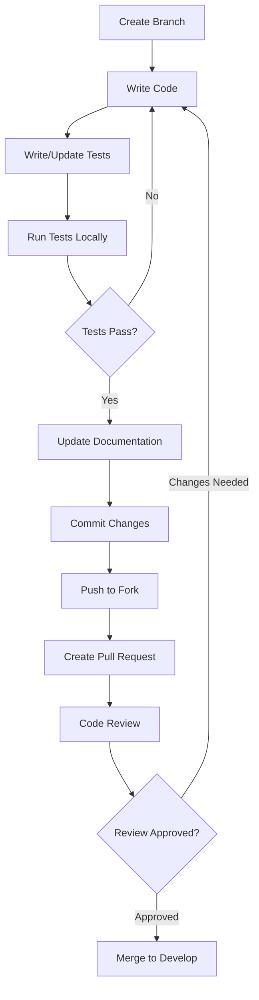
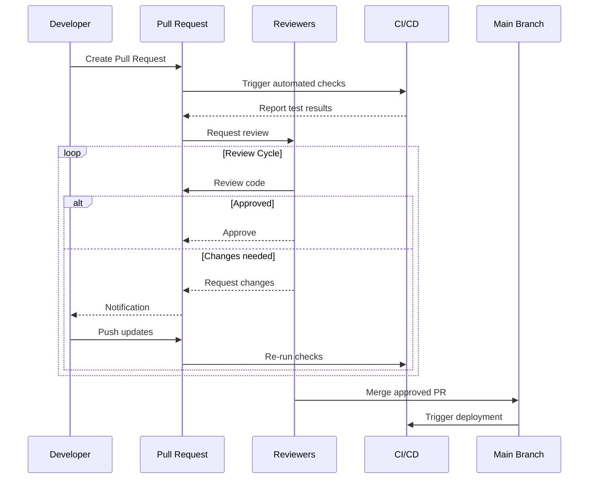
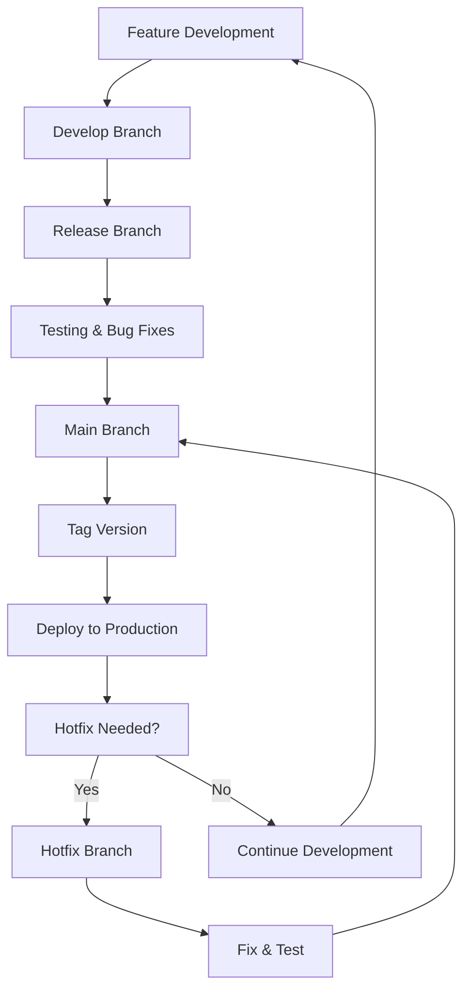

# Contributing Guidelines

Welcome to the OpenFrame OSS Library contributor community! This guide covers everything you need to know to make effective contributions, from code style to the review process.

## Getting Started

### Before You Contribute

1. **Read the Documentation** - Familiarize yourself with the [Architecture Overview](../architecture/overview.md)
2. **Set Up Development Environment** - Follow the [Environment Setup](../setup/environment.md) guide
3. **Understand the Testing Approach** - Review [Testing Overview](../testing/overview.md)
4. **Check Existing Issues** - Look for [good first issues](https://github.com/flamingo-stack/openframe-oss-lib/labels/good%20first%20issue)

### Types of Contributions

We welcome various types of contributions:

| Type | Description | Examples |
|------|-------------|----------|
| **🐛 Bug Fixes** | Fix existing issues or problems | Null pointer exceptions, logic errors, performance issues |
| **✨ Features** | Add new functionality | New API endpoints, tool integrations, improvements |
| **📚 Documentation** | Improve docs and examples | README updates, tutorial improvements, API documentation |
| **🧪 Testing** | Add or improve tests | Unit tests, integration tests, test data |
| **🔧 Refactoring** | Code improvements without changing behavior | Code cleanup, performance optimization, architecture improvements |
| **🎨 UI/UX** | Frontend improvements | Better user experience, visual improvements |

## Development Workflow

### 1. Fork and Clone

```bash
# Fork the repository on GitHub, then clone your fork
git clone https://github.com/YOUR-USERNAME/openframe-oss-lib.git
cd openframe-oss-lib

# Add upstream remote
git remote add upstream https://github.com/flamingo-stack/openframe-oss-lib.git

# Verify remotes
git remote -v
```

### 2. Branch Strategy

We use a Git Flow inspired branching strategy:

```mermaid
gitgraph:
    options:
    {
        "mainBranchName": "main",
        "theme": "base"
    }
    commit
    commit
    branch develop
    checkout develop
    commit
    commit
    branch feature/new-feature
    checkout feature/new-feature
    commit
    commit
    checkout develop
    merge feature/new-feature
    commit
    checkout main
    merge develop
    commit
```

**Branch Types:**

- `main` - Production-ready code
- `develop` - Integration branch for features
- `feature/feature-name` - New features
- `bugfix/issue-description` - Bug fixes
- `hotfix/critical-issue` - Emergency fixes for production

**Create a feature branch:**

```bash
# Update develop branch
git checkout develop
git pull upstream develop

# Create feature branch
git checkout -b feature/add-device-tagging

# Or for bug fixes
git checkout -b bugfix/fix-null-pointer-in-device-service
```

### 3. Development Process



### 4. Making Changes

**Write clean, tested code:**

```java
// ✅ Good: Clear, well-documented, tested
@Service
@Slf4j
public class DeviceTaggingService {
    
    private final DeviceRepository deviceRepository;
    private final EventPublisher eventPublisher;
    
    public DeviceTaggingService(DeviceRepository deviceRepository, 
                               EventPublisher eventPublisher) {
        this.deviceRepository = deviceRepository;
        this.eventPublisher = eventPublisher;
    }
    
    /**
     * Adds tags to a device and publishes a tagging event.
     * 
     * @param deviceId The ID of the device to tag
     * @param tags Set of tags to add (will be merged with existing tags)
     * @return Updated device with new tags
     * @throws DeviceNotFoundException if device doesn't exist
     * @throws IllegalArgumentException if tags are invalid
     */
    @Transactional
    public Device addTags(String deviceId, Set<String> tags) {
        validateTags(tags);
        
        Device device = deviceRepository.findById(deviceId)
            .orElseThrow(() -> new DeviceNotFoundException(deviceId));
            
        Set<String> existingTags = device.getTags();
        Set<String> newTags = new HashSet<>(existingTags);
        newTags.addAll(tags);
        
        device.setTags(newTags);
        device.setUpdatedAt(Instant.now());
        
        Device savedDevice = deviceRepository.save(device);
        
        eventPublisher.publish(new DeviceTaggedEvent(deviceId, tags));
        
        log.info("Added {} tags to device {}: {}", tags.size(), deviceId, tags);
        
        return savedDevice;
    }
    
    private void validateTags(Set<String> tags) {
        if (tags == null || tags.isEmpty()) {
            throw new IllegalArgumentException("Tags cannot be null or empty");
        }
        
        tags.forEach(tag -> {
            if (StringUtils.isBlank(tag)) {
                throw new IllegalArgumentException("Tag cannot be blank");
            }
            if (tag.length() > 50) {
                throw new IllegalArgumentException("Tag cannot exceed 50 characters");
            }
        });
    }
}
```

**Corresponding test:**

```java
@ExtendWith(MockitoExtension.class)
class DeviceTaggingServiceTest {
    
    @Mock
    private DeviceRepository deviceRepository;
    
    @Mock
    private EventPublisher eventPublisher;
    
    @InjectMocks
    private DeviceTaggingService deviceTaggingService;
    
    @Test
    void shouldAddTagsToDevice() {
        // Given
        String deviceId = "device-123";
        Set<String> existingTags = Set.of("production", "web-server");
        Set<String> newTags = Set.of("nginx", "ssl-enabled");
        
        Device device = Device.builder()
            .id(deviceId)
            .tags(new HashSet<>(existingTags))
            .build();
            
        Device expectedDevice = Device.builder()
            .id(deviceId)
            .tags(Set.of("production", "web-server", "nginx", "ssl-enabled"))
            .updatedAt(any(Instant.class))
            .build();
        
        when(deviceRepository.findById(deviceId)).thenReturn(Optional.of(device));
        when(deviceRepository.save(any(Device.class))).thenReturn(expectedDevice);
        
        // When
        Device result = deviceTaggingService.addTags(deviceId, newTags);
        
        // Then
        assertThat(result.getTags())
            .hasSize(4)
            .containsAll(existingTags)
            .containsAll(newTags);
            
        verify(eventPublisher).publish(any(DeviceTaggedEvent.class));
        verify(deviceRepository).save(argThat(d -> 
            d.getUpdatedAt() != null && 
            d.getTags().containsAll(newTags)
        ));
    }
    
    @Test
    void shouldThrowExceptionWhenDeviceNotFound() {
        // Given
        String deviceId = "nonexistent";
        Set<String> tags = Set.of("test-tag");
        
        when(deviceRepository.findById(deviceId)).thenReturn(Optional.empty());
        
        // When & Then
        assertThatThrownBy(() -> deviceTaggingService.addTags(deviceId, tags))
            .isInstanceOf(DeviceNotFoundException.class)
            .hasMessage("Device not found: " + deviceId);
            
        verify(deviceRepository, never()).save(any());
        verify(eventPublisher, never()).publish(any());
    }
}
```

## Code Style and Standards

### Java Code Style

We follow Google Java Style Guide with some OpenFrame-specific conventions.

#### Class and Method Structure

```java
// ✅ Good structure
@Service
@Slf4j
public class OrganizationService {
    
    // Fields - dependency injection
    private final OrganizationRepository repository;
    private final EventPublisher eventPublisher;
    private final ValidationService validationService;
    
    // Constructor
    public OrganizationService(OrganizationRepository repository,
                              EventPublisher eventPublisher,
                              ValidationService validationService) {
        this.repository = repository;
        this.eventPublisher = eventPublisher;
        this.validationService = validationService;
    }
    
    // Public methods - business operations
    public Organization create(CreateOrganizationRequest request) {
        // Implementation
    }
    
    public Optional<Organization> findById(String id) {
        // Implementation  
    }
    
    // Private methods - implementation details
    private void validateRequest(CreateOrganizationRequest request) {
        // Implementation
    }
}
```

#### Naming Conventions

| Element | Convention | Example |
|---------|------------|---------|
| **Classes** | PascalCase | `OrganizationService`, `DeviceRepository` |
| **Methods** | camelCase | `createOrganization()`, `findByDomain()` |
| **Variables** | camelCase | `organizationId`, `deviceList` |
| **Constants** | UPPER_SNAKE_CASE | `MAX_RETRY_ATTEMPTS`, `DEFAULT_TIMEOUT` |
| **Packages** | lowercase.separated | `com.openframe.api.service` |

#### Documentation Standards

```java
/**
 * Service for managing MSP client organizations.
 * 
 * <p>This service handles the full lifecycle of organizations including:
 * <ul>
 *   <li>Registration and onboarding</li>
 *   <li>Status management (active, suspended, etc.)</li>
 *   <li>Multi-tenant data isolation</li>
 *   <li>Integration with external billing systems</li>
 * </ul>
 * 
 * <p>All operations are audited and events are published for external
 * systems to react to changes.
 * 
 * @author OpenFrame Team
 * @since 5.10.0
 */
@Service
public class OrganizationService {
    
    /**
     * Creates a new organization with the specified details.
     * 
     * <p>This method performs the following operations:
     * <ol>
     *   <li>Validates the request data</li>
     *   <li>Checks domain uniqueness</li>
     *   <li>Creates the organization entity</li>
     *   <li>Publishes creation event</li>
     * </ol>
     * 
     * @param request the organization creation request containing name, domain, and contact info
     * @return the created organization with generated ID and timestamps
     * @throws ValidationException if request data is invalid
     * @throws DomainAlreadyExistsException if domain is already registered
     * @throws ServiceException if creation fails due to system error
     */
    public Organization createOrganization(CreateOrganizationRequest request) {
        // Implementation
    }
}
```

### Error Handling

#### Exception Hierarchy

```java
// Base exception for all OpenFrame exceptions
public abstract class OpenFrameException extends RuntimeException {
    protected OpenFrameException(String message) {
        super(message);
    }
    
    protected OpenFrameException(String message, Throwable cause) {
        super(message, cause);
    }
}

// Domain-specific exceptions
public class OrganizationException extends OpenFrameException {
    public OrganizationException(String message) {
        super(message);
    }
}

public class DomainAlreadyExistsException extends OrganizationException {
    public DomainAlreadyExistsException(String domain) {
        super("Organization with domain '" + domain + "' already exists");
    }
}
```

#### Error Handling Patterns

```java
@Service
public class OrganizationService {
    
    public Organization createOrganization(CreateOrganizationRequest request) {
        try {
            // Validate request
            validationService.validate(request);
            
            // Check domain uniqueness
            if (repository.existsByDomain(request.getDomain())) {
                throw new DomainAlreadyExistsException(request.getDomain());
            }
            
            // Create organization
            Organization org = buildOrganization(request);
            Organization saved = repository.save(org);
            
            // Publish event
            eventPublisher.publish(new OrganizationCreatedEvent(saved));
            
            return saved;
            
        } catch (DataAccessException e) {
            log.error("Database error while creating organization: {}", request.getDomain(), e);
            throw new ServiceException("Failed to create organization", e);
        } catch (ValidationException e) {
            log.warn("Validation failed for organization creation: {}", e.getMessage());
            throw e; // Re-throw validation exceptions as-is
        } catch (Exception e) {
            log.error("Unexpected error while creating organization: {}", request.getDomain(), e);
            throw new ServiceException("Unexpected error during organization creation", e);
        }
    }
}
```

### API Design Standards

#### REST Endpoints

```java
@RestController
@RequestMapping("/api/v1/organizations")
@Validated
public class OrganizationController {
    
    @PostMapping
    @ResponseStatus(HttpStatus.CREATED)
    public OrganizationResponse createOrganization(
            @Valid @RequestBody CreateOrganizationRequest request,
            @AuthenticationPrincipal AuthPrincipal principal) {
        
        Organization org = organizationService.createOrganization(request);
        return mapper.toResponse(org);
    }
    
    @GetMapping("/{id}")
    public OrganizationResponse getOrganization(
            @PathVariable @UUID String id,
            @AuthenticationPrincipal AuthPrincipal principal) {
        
        Organization org = organizationService.findById(id)
            .orElseThrow(() -> new OrganizationNotFoundException(id));
            
        return mapper.toResponse(org);
    }
    
    @GetMapping
    public PageResponse<OrganizationResponse> getOrganizations(
            @Valid OrganizationFilterRequest filter,
            @Valid CursorPaginationInput pagination,
            @AuthenticationPrincipal AuthPrincipal principal) {
        
        Page<Organization> page = organizationService.findAll(filter, pagination);
        return PageResponse.of(
            page.getContent().stream()
                .map(mapper::toResponse)
                .collect(Collectors.toList()),
            page.getCursor(),
            page.hasNext()
        );
    }
}
```

### Database Patterns

#### Repository Implementation

```java
@Repository
public interface OrganizationRepository extends MongoRepository<Organization, String> {
    
    // Simple query methods
    Optional<Organization> findByDomain(String domain);
    
    boolean existsByDomain(String domain);
    
    List<Organization> findByStatus(OrganizationStatus status);
    
    // Custom query methods
    @Query("{ 'status': ?0, 'plan': ?1 }")
    List<Organization> findByStatusAndPlan(OrganizationStatus status, TenantPlan plan);
    
    // Aggregation queries
    @Aggregation(pipeline = {
        "{ '$match': { 'createdAt': { '$gte': ?0 } } }",
        "{ '$group': { '_id': '$status', 'count': { '$sum': 1 } } }"
    })
    List<StatusCount> countByStatusSince(Instant since);
}

// Custom repository for complex queries
@Repository
public class CustomOrganizationRepositoryImpl implements CustomOrganizationRepository {
    
    @Autowired
    private MongoTemplate mongoTemplate;
    
    @Override
    public List<Organization> findWithFilters(OrganizationFilter filter) {
        Criteria criteria = new Criteria();
        
        if (StringUtils.hasText(filter.getName())) {
            criteria.and("name").regex(filter.getName(), "i");
        }
        
        if (filter.getStatus() != null) {
            criteria.and("status").is(filter.getStatus());
        }
        
        if (filter.getCreatedAfter() != null) {
            criteria.and("createdAt").gte(filter.getCreatedAfter());
        }
        
        Query query = new Query(criteria);
        
        if (filter.getSort() != null) {
            query.with(Sort.by(Sort.Direction.fromString(filter.getSort().getDirection()), 
                              filter.getSort().getProperty()));
        }
        
        return mongoTemplate.find(query, Organization.class);
    }
}
```

## Commit Guidelines

### Commit Message Format

We follow the [Conventional Commits](https://www.conventionalcommits.org/) specification:

```text
<type>[optional scope]: <description>

[optional body]

[optional footer(s)]
```

**Types:**
- `feat:` - New feature
- `fix:` - Bug fix
- `docs:` - Documentation changes
- `style:` - Code style changes (formatting, etc.)
- `refactor:` - Code changes that neither fix bugs nor add features
- `test:` - Adding or updating tests
- `chore:` - Maintenance tasks, dependency updates

**Examples:**

```bash
# Feature addition
git commit -m "feat(api): add device tagging endpoint"

# Bug fix
git commit -m "fix(auth): resolve JWT token expiration issue"

# Documentation
git commit -m "docs(setup): update environment setup guide"

# Breaking change
git commit -m "feat(api)!: change organization API response format

BREAKING CHANGE: Organization API now returns ISO 8601 dates instead of Unix timestamps"
```

### Commit Best Practices

1. **Atomic Commits** - One logical change per commit
2. **Clear Messages** - Explain what and why, not how
3. **Reference Issues** - Include issue numbers when applicable

```bash
# Good commit messages
git commit -m "feat(device): add support for IoT device types

- Add DeviceType.IOT enum value
- Update device registration validation
- Add integration tests for IoT devices

Closes #123"

git commit -m "fix(security): prevent SQL injection in device search

The previous implementation was vulnerable to SQL injection
when using user-provided search terms. This fix uses
parameterized queries and input validation.

Fixes #456"
```

## Pull Request Process

### 1. Before Creating PR

```bash
# Ensure your branch is up to date
git checkout develop
git pull upstream develop
git checkout feature/your-feature
git rebase develop

# Run tests locally
mvn clean test

# Check code style
mvn spotless:check

# Run integration tests
mvn verify
```

### 2. PR Title and Description

**Title Format:**
```text
feat(scope): brief description of changes
```

**Description Template:**
```markdown
## Description
Brief description of what this PR does.

## Type of Change
- [ ] Bug fix (non-breaking change which fixes an issue)
- [ ] New feature (non-breaking change which adds functionality)  
- [ ] Breaking change (fix or feature that would cause existing functionality to not work as expected)
- [ ] Documentation update

## Changes Made
- List of specific changes
- Another change
- And another

## Testing
- [ ] Unit tests pass
- [ ] Integration tests pass
- [ ] Manual testing completed
- [ ] Added new tests for new functionality

## Screenshots (if applicable)
<!-- Add screenshots for UI changes -->

## Checklist
- [ ] My code follows the code style of this project
- [ ] I have performed a self-review of my own code
- [ ] I have commented my code, particularly in hard-to-understand areas
- [ ] I have made corresponding changes to the documentation
- [ ] My changes generate no new warnings
- [ ] I have added tests that prove my fix is effective or that my feature works
- [ ] New and existing unit tests pass locally with my changes

## Related Issues
Closes #123
```

### 3. Code Review Process



**Review Criteria:**

1. **Functionality** - Does the code work as intended?
2. **Quality** - Is the code clean, readable, and maintainable?
3. **Tests** - Are there adequate tests covering the changes?
4. **Documentation** - Is documentation updated appropriately?
5. **Performance** - Are there any performance implications?
6. **Security** - Are there any security concerns?

### 4. Addressing Review Comments

```bash
# Make requested changes
git add .
git commit -m "fix: address review comments

- Fix null check in device validation
- Add missing error handling
- Update tests for edge cases"

# Push updates
git push origin feature/your-feature

# The PR will automatically update
```

## Release Process

### Version Management

We use [Semantic Versioning](https://semver.org/):

- `MAJOR.MINOR.PATCH`
- `MAJOR` - Breaking changes
- `MINOR` - New features (backward compatible)
- `PATCH` - Bug fixes (backward compatible)

### Release Workflow



## Community Guidelines

### Code of Conduct

- **Be Respectful** - Treat all contributors with respect
- **Be Inclusive** - Welcome contributors from all backgrounds
- **Be Collaborative** - Work together toward common goals
- **Be Patient** - Help newcomers learn and grow

### Communication

- **Issues** - Use GitHub issues for bug reports and feature requests
- **Discussions** - Use GitHub discussions for questions and ideas
- **Discord/Slack** - Join our community chat for real-time discussions

### Getting Help

1. **Documentation First** - Check existing documentation
2. **Search Issues** - Look for existing solutions
3. **Ask Questions** - Don't hesitate to ask for help
4. **Provide Context** - Include relevant details when asking for help

## Recognition

### Contributors

We recognize contributors in multiple ways:

- **GitHub Contributors** - Listed on repository
- **Changelog Credits** - Mentioned in release notes
- **Community Highlights** - Featured in community updates
- **Maintainer Path** - Outstanding contributors may become maintainers

### Contribution Types

All contributions are valued:

- Code contributions
- Documentation improvements
- Bug reports and testing
- Community support and mentoring
- Design and UX feedback

## Quick Reference

### Essential Commands

```bash
# Setup
git clone https://github.com/YOUR-USERNAME/openframe-oss-lib.git
cd openframe-oss-lib
git remote add upstream https://github.com/flamingo-stack/openframe-oss-lib.git

# Development
git checkout develop
git pull upstream develop
git checkout -b feature/my-feature
# Make changes...
mvn clean test
git add .
git commit -m "feat: add my feature"
git push origin feature/my-feature
# Create PR on GitHub

# Code Quality  
mvn spotless:apply    # Fix formatting
mvn spotless:check    # Check formatting
mvn test              # Run tests
mvn jacoco:report     # Generate coverage
```

### Resources

- **Style Guide**: [Google Java Style Guide](https://google.github.io/styleguide/javaguide.html)
- **Commit Format**: [Conventional Commits](https://www.conventionalcommits.org/)
- **Testing**: [JUnit 5 User Guide](https://junit.org/junit5/docs/current/user-guide/)
- **Spring Boot**: [Spring Boot Reference](https://docs.spring.io/spring-boot/docs/current/reference/html/)

---

Thank you for contributing to OpenFrame OSS Library! Your contributions help build the future of open-source MSP platforms. 🚀

**Questions?** Don't hesitate to reach out:
- GitHub Discussions
- Community Discord/Slack  
- Email: contributors@openframe.ai

Welcome to the team! 🎉