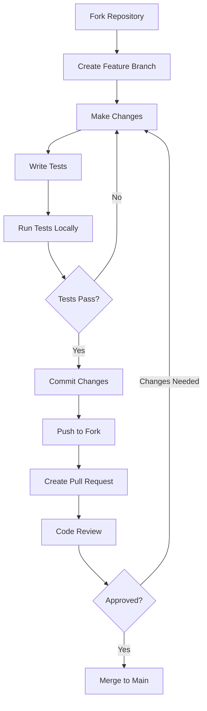

# Contributing Guidelines

Welcome to the OpenFrame OSS Library contributor community! This guide provides everything you need to know about contributing to the project, from code standards to the pull request process.

## 🌟 Getting Started

### Prerequisites for Contributors

Before contributing, ensure you have:

- [ ] Completed the [Environment Setup](../setup/environment.md)
- [ ] Successfully run [Local Development Setup](../setup/local-development.md)  
- [ ] Read the [Architecture Overview](../architecture/overview.md)
- [ ] Reviewed the [Testing Overview](../testing/overview.md)

### First-Time Contributors

New to open source? Start here:

1. **🔍 Find a Good First Issue**
   - Look for issues labeled `good-first-issue`
   - Check the `help-wanted` label for guidance needed
   - Start with documentation improvements

2. **🍴 Fork and Clone**
   ```bash
   # Fork the repository on GitHub, then:
   git clone https://github.com/YOUR_USERNAME/openframe-oss-lib.git
   cd openframe-oss-lib
   git remote add upstream https://github.com/openframe/openframe-oss-lib.git
   ```

3. **🌱 Create a Branch**
   ```bash
   git checkout -b feature/your-contribution-name
   ```

## 📋 Code Standards

### Java Code Style

We follow Google Java Style Guide with some modifications:

#### Formatting Rules

| Rule | Standard | Example |
|------|----------|---------|
| **Indentation** | 4 spaces | `public class Example {` |
| **Line Length** | 120 characters | Reasonable for modern screens |
| **Braces** | Required for all blocks | `if (condition) { ... }` |
| **Naming** | camelCase for variables/methods | `getUserById()` |
| **Constants** | UPPER_SNAKE_CASE | `MAX_RETRY_COUNT` |

#### Class Structure Order

```java
public class ExampleClass {
    // 1. Static fields (constants first)
    private static final String CONSTANT_VALUE = "value";
    private static String staticField;
    
    // 2. Instance fields
    private final String requiredField;
    private String optionalField;
    
    // 3. Constructors
    public ExampleClass(String requiredField) {
        this.requiredField = requiredField;
    }
    
    // 4. Static methods
    public static ExampleClass create() {
        return new ExampleClass("default");
    }
    
    // 5. Instance methods (public first, then private)
    public String getRequiredField() {
        return requiredField;
    }
    
    private void internalMethod() {
        // implementation
    }
}
```

### Lombok Usage Standards

#### ✅ Recommended Annotations

```java
@Data                    // For DTOs with all fields
@Builder                 // For complex object creation
@NoArgsConstructor      // Required for frameworks
@AllArgsConstructor     // For builder compatibility
@EqualsAndHashCode      // When extending classes
@ToString               // For debugging (exclude sensitive data)
```

#### ❌ Avoid These Patterns

```java
@Getter @Setter         // Use @Data instead
@Value                  // Use @Data @Builder for DTOs
@RequiredArgsConstructor // Use explicit constructors
```

#### Proper Lombok Usage

```java
// ✅ Good: Clean DTO with standard annotations
@Data
@Builder
@NoArgsConstructor
@AllArgsConstructor
public class LogEvent {
    private String toolEventId;
    private String eventType;
    private Instant timestamp;
}

// ✅ Good: Inheritance with SuperBuilder
@EqualsAndHashCode(callSuper = true)
@Data
@SuperBuilder
@NoArgsConstructor
@AllArgsConstructor
public class CountedResult<T> extends GenericResult<T> {
    private int filteredCount;
}

// ❌ Avoid: Mixing Lombok with manual code
@Data
public class BadExample {
    private String name;
    
    // Don't manually write getters when using @Data
    public String getName() {
        return this.name;
    }
}
```

## 🔧 Development Workflow

### Branch Naming Convention

Use descriptive branch names with prefixes:

| Prefix | Purpose | Example |
|--------|---------|---------|
| `feature/` | New features | `feature/device-tagging-support` |
| `bugfix/` | Bug fixes | `bugfix/null-pointer-in-filters` |
| `docs/` | Documentation | `docs/update-api-reference` |
| `refactor/` | Code refactoring | `refactor/simplify-builder-pattern` |
| `test/` | Test improvements | `test/increase-coverage-device-dto` |

### Commit Message Format

Follow the Conventional Commits specification:

```
<type>(<scope>): <description>

[optional body]

[optional footer(s)]
```

#### Commit Types

| Type | Usage | Example |
|------|--------|---------|
| `feat` | New features | `feat(audit): add support for event severity levels` |
| `fix` | Bug fixes | `fix(device): resolve null pointer in filter options` |
| `docs` | Documentation | `docs(readme): update installation instructions` |
| `test` | Testing | `test(audit): add unit tests for LogEvent builder` |
| `refactor` | Refactoring | `refactor(dto): simplify inheritance hierarchy` |
| `style` | Code style | `style(format): apply consistent indentation` |
| `chore` | Maintenance | `chore(deps): update lombok to 1.18.24` |

#### Examples

```bash
# ✅ Good commit messages
git commit -m "feat(audit): add organization filter support"
git commit -m "fix(device): handle null device types in filters"
git commit -m "docs(api): update LogEvent javadoc examples"
git commit -m "test(filters): add edge cases for device filtering"

# ❌ Avoid vague messages
git commit -m "fix bug"
git commit -m "update code"
git commit -m "changes"
```

### Development Process



### Pre-Commit Checklist

Before committing changes:

- [ ] Code follows style guidelines
- [ ] New code has comprehensive tests
- [ ] All existing tests pass
- [ ] Code coverage targets met
- [ ] Documentation updated (if needed)
- [ ] Commit message follows convention
- [ ] No debugging code or TODO comments
- [ ] Lombok annotations used correctly

## 🧪 Testing Requirements

### Test Coverage Standards

| Component Type | Minimum Coverage | Target Coverage |
|----------------|------------------|-----------------|
| **DTO Classes** | 85% | 95% |
| **Builder Patterns** | 90% | 100% |
| **Filter Logic** | 95% | 100% |
| **Validation** | 100% | 100% |

### Test Categories Required

For new features, provide:

1. **Unit Tests**: Test individual components
2. **Integration Tests**: Test component interactions  
3. **Edge Case Tests**: Handle boundary conditions
4. **Validation Tests**: Verify input handling

### Test Example Template

```java
@DisplayName("YourFeature")
class YourFeatureTest {
    
    @Nested
    @DisplayName("Happy Path")
    class HappyPathTests {
        
        @Test
        @DisplayName("should perform expected behavior with valid input")
        void shouldPerformExpectedBehaviorWithValidInput() {
            // Given
            YourClass instance = YourClass.builder()
                .field("valid-value")
                .build();
            
            // When
            String result = instance.someMethod();
            
            // Then
            assertThat(result).isEqualTo("expected-result");
        }
    }
    
    @Nested
    @DisplayName("Edge Cases")
    class EdgeCaseTests {
        
        @Test
        @DisplayName("should handle null input gracefully")
        void shouldHandleNullInputGracefully() {
            // Given & When & Then
            assertThatThrownBy(() -> YourClass.builder().field(null).build())
                .isInstanceOf(IllegalArgumentException.class)
                .hasMessage("Field cannot be null");
        }
    }
}
```

## 📝 Documentation Requirements

### Code Documentation

#### Javadoc Standards

```java
/**
 * Represents an audit log event in the OpenFrame system.
 * 
 * <p>This DTO captures comprehensive information about security events,
 * user actions, and system activities for audit trail purposes.</p>
 * 
 * @author OpenFrame Development Team
 * @since 1.0.0
 */
@Data
@Builder
@NoArgsConstructor
@AllArgsConstructor
public class LogEvent {
    
    /**
     * Unique identifier for this audit event.
     * 
     * <p>Format: "evt-{timestamp}-{sequence}" for guaranteed uniqueness
     * across distributed systems.</p>
     */
    private String toolEventId;
    
    /**
     * Type of event that occurred (e.g., LOGIN, LOGOUT, SECURITY_ALERT).
     * 
     * @see EventTypes for standard event type constants
     */
    private String eventType;
    
    /**
     * Severity level of the event.
     * 
     * <p>Valid values: INFO, WARN, HIGH, CRITICAL</p>
     */
    private String severity;
}
```

#### Class-Level Documentation

Include:
- Purpose and responsibility
- Usage examples
- Important notes or constraints
- Relationships to other classes

#### Method Documentation

Document:
- Purpose and behavior
- Parameter constraints
- Return value meaning
- Exceptions thrown
- Usage examples for complex methods

### README and Guide Updates

When adding features:

1. **Update relevant getting-started docs**
2. **Add examples to tutorials** 
3. **Update API reference**
4. **Include migration notes** (for breaking changes)

## 🔍 Code Review Process

### Creating Pull Requests

#### PR Title Format

```
<type>(<scope>): <description>

Examples:
feat(audit): add support for custom event types
fix(device): resolve filtering edge case with null values
docs(getting-started): improve quick start guide
```

#### PR Description Template

```markdown
## Description
Brief description of the changes and why they're needed.

## Type of Change
- [ ] Bug fix (non-breaking change that fixes an issue)
- [ ] New feature (non-breaking change that adds functionality)  
- [ ] Breaking change (fix or feature that would cause existing functionality to not work as expected)
- [ ] Documentation update

## Testing
- [ ] Unit tests added/updated
- [ ] Integration tests added/updated  
- [ ] Manual testing completed
- [ ] All tests pass

## Documentation
- [ ] Code comments updated
- [ ] README/guides updated
- [ ] API documentation updated

## Checklist
- [ ] Code follows style guidelines
- [ ] Self-review completed
- [ ] Changes generate no new warnings
- [ ] New tests prove fix is effective or feature works
- [ ] New and existing unit tests pass locally

## Related Issues
Closes #issue_number
```

### Review Criteria

Reviewers will check for:

| Area | Criteria |
|------|----------|
| **Functionality** | Code works as intended |
| **Design** | Follows architectural patterns |
| **Testing** | Comprehensive test coverage |
| **Performance** | No unnecessary performance impact |
| **Documentation** | Clear and up-to-date |
| **Style** | Follows coding standards |
| **Security** | No security vulnerabilities |

### Addressing Review Feedback

1. **Respond Promptly**: Acknowledge feedback within 24-48 hours
2. **Ask Questions**: If feedback is unclear, ask for clarification
3. **Make Changes**: Update code based on feedback
4. **Explain Decisions**: If you disagree, explain your reasoning
5. **Test Changes**: Ensure new changes don't break anything
6. **Request Re-review**: Mark as ready for re-review when done

## 🚀 Advanced Contribution Areas

### High-Impact Contributions

- **Performance Optimizations**: Improve library efficiency
- **New DTO Types**: Add support for additional data types
- **Enhanced Filtering**: Expand filtering capabilities
- **Documentation**: Improve guides and examples
- **Testing**: Increase coverage and test quality
- **Tooling**: Improve development experience

### Architecture Contributions

When proposing architectural changes:

1. **Create an RFC** (Request for Comments)
2. **Discuss in issues** before implementation
3. **Consider backward compatibility**
4. **Plan migration strategy**
5. **Update documentation**

## 💡 Best Practices

### Code Quality

```java
// ✅ Good: Clear, testable, well-documented
/**
 * Creates a device filter for active devices in specific organizations.
 */
public static DeviceFilters createActiveDeviceFilter(List<String> organizationIds) {
    if (organizationIds == null || organizationIds.isEmpty()) {
        throw new IllegalArgumentException("Organization IDs cannot be null or empty");
    }
    
    return DeviceFilters.builder()
        .statuses(List.of("ACTIVE"))
        .organizationIds(organizationIds)
        .build();
}

// ❌ Avoid: Unclear purpose, no validation
public static DeviceFilters create(List<String> orgs) {
    return DeviceFilters.builder().statuses(List.of("ACTIVE")).organizationIds(orgs).build();
}
```

### Error Handling

```java
// ✅ Good: Specific exceptions with clear messages
public LogEvent validateAndBuild() {
    if (toolEventId == null || toolEventId.trim().isEmpty()) {
        throw new IllegalArgumentException("Tool event ID is required and cannot be empty");
    }
    
    if (eventType == null) {
        throw new IllegalArgumentException("Event type is required");
    }
    
    return LogEvent.builder()
        .toolEventId(toolEventId.trim())
        .eventType(eventType)
        .build();
}
```

## 🎯 Contribution Goals

We aim to:

- **Maintain High Quality**: Keep code clean, tested, and documented
- **Foster Learning**: Help contributors grow their skills
- **Build Community**: Create a welcoming, inclusive environment
- **Deliver Value**: Focus on features that benefit users
- **Ensure Stability**: Maintain backward compatibility when possible

## 📞 Getting Help

### Communication Channels

- **GitHub Issues**: Bug reports and feature requests
- **GitHub Discussions**: Questions and general discussion
- **Pull Request Comments**: Code-specific feedback
- **Documentation**: Comprehensive guides and references

### Mentorship Program

For new contributors:
- **Good First Issues**: Curated beginner-friendly tasks
- **Mentorship**: Senior contributors available for guidance
- **Code Reviews**: Learning-focused feedback
- **Pair Programming**: Available for complex features

## 📊 Recognition

Contributors are recognized through:
- **Contributors Page**: Listed in project documentation
- **Changelogs**: Credited in release notes
- **GitHub Stats**: Contribution graphs and statistics
- **Community Highlights**: Featured in project updates

---

> **🤝 Thank You**: Every contribution, no matter how small, makes the OpenFrame OSS Library better. We appreciate your time and effort in making this project successful!

Ready to contribute? Start by finding a `good-first-issue` and following this guide. Welcome to the team! 🚀