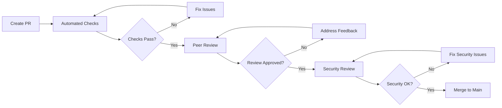

# Contributing Guidelines

Welcome to the OpenFrame OSS Library community! This guide will help you contribute effectively to the project, whether you're fixing bugs, adding features, or improving documentation.

## Getting Started

### 1. Fork and Clone

```bash
# Fork the repository on GitHub, then clone your fork
git clone https://github.com/YOUR_USERNAME/openframe-oss-lib.git
cd openframe-oss-lib

# Add upstream remote
git remote add upstream https://github.com/flamingo-stack/openframe-oss-lib.git

# Verify remotes
git remote -v
```

### 2. Set Up Development Environment

Follow our [Environment Setup Guide](../setup/environment.md) to configure your development environment.

### 3. Create Feature Branch

```bash
# Update main branch
git checkout main
git pull upstream main

# Create feature branch with descriptive name
git checkout -b feature/device-filtering-enhancement
# or
git checkout -b bugfix/device-status-update-issue
# or  
git checkout -b docs/api-documentation-improvements
```

## Code Standards and Style Guide

### Java Code Style

We follow **Google Java Style** with minor customizations:

#### 1. **Formatting Rules**

```java
// ✅ Good: Proper indentation and spacing
public class DeviceService {
    
    private final DeviceRepository deviceRepository;
    private final EventService eventService;
    
    public DeviceService(DeviceRepository deviceRepository, EventService eventService) {
        this.deviceRepository = deviceRepository;
        this.eventService = eventService;
    }
    
    public Device createDevice(CreateDeviceRequest request) {
        Device device = mapToDevice(request);
        Device savedDevice = deviceRepository.save(device);
        
        eventService.publishEvent(
            EventType.DEVICE_CREATED,
            savedDevice.getId(),
            Map.of("deviceType", savedDevice.getType())
        );
        
        return savedDevice;
    }
}
```

#### 2. **Naming Conventions**

| Element | Convention | Examples |
|---------|------------|----------|
| **Classes** | PascalCase | `DeviceService`, `OrganizationMapper` |
| **Methods** | camelCase | `createDevice()`, `findByOrganizationId()` |
| **Variables** | camelCase | `deviceRepository`, `organizationId` |
| **Constants** | UPPER_SNAKE_CASE | `DEFAULT_PAGE_SIZE`, `MAX_RETRY_ATTEMPTS` |
| **Packages** | lowercase | `com.openframe.api.service` |

#### 3. **Documentation Standards**

```java
/**
 * Service for managing device lifecycle and operations.
 * 
 * <p>This service provides comprehensive device management capabilities including
 * device registration, status updates, and integration with external tools.
 * 
 * @author OpenFrame Team
 * @since 1.0.0
 */
@Service
@Transactional
public class DeviceService {
    
    /**
     * Creates a new device in the system.
     * 
     * @param request the device creation request containing device details
     * @return the created device with generated ID and metadata
     * @throws ValidationException if the request contains invalid data
     * @throws DuplicateDeviceException if a device with the same machine ID exists
     */
    public Device createDevice(CreateDeviceRequest request) {
        // Implementation
    }
}
```

### Spring Boot Conventions

#### 1. **Component Annotations**

```java
// ✅ Good: Specific component annotations
@RestController
@RequestMapping("/api/devices")
public class DeviceController { }

@Service
@Transactional
public class DeviceService { }

@Repository
public interface DeviceRepository extends MongoRepository<Device, String> { }

@Configuration
@EnableConfigurationProperties(OpenFrameProperties.class)
public class OpenFrameConfig { }
```

#### 2. **Dependency Injection**

```java
// ✅ Good: Constructor injection
@Service
public class DeviceService {
    
    private final DeviceRepository deviceRepository;
    private final EventService eventService;
    
    // Constructor injection (preferred)
    public DeviceService(DeviceRepository deviceRepository, EventService eventService) {
        this.deviceRepository = deviceRepository;
        this.eventService = eventService;
    }
}

// ❌ Avoid: Field injection
@Service
public class DeviceService {
    @Autowired
    private DeviceRepository deviceRepository; // Not recommended
}
```

#### 3. **Error Handling**

```java
// ✅ Good: Specific exception handling
@RestControllerAdvice
public class GlobalExceptionHandler {
    
    @ExceptionHandler(DeviceNotFoundException.class)
    public ResponseEntity<ErrorResponse> handleDeviceNotFound(DeviceNotFoundException ex) {
        ErrorResponse error = ErrorResponse.builder()
            .code("DEVICE_NOT_FOUND")
            .message(ex.getMessage())
            .timestamp(Instant.now())
            .build();
        
        return ResponseEntity.status(HttpStatus.NOT_FOUND).body(error);
    }
    
    @ExceptionHandler(ValidationException.class)
    public ResponseEntity<ErrorResponse> handleValidation(ValidationException ex) {
        ErrorResponse error = ErrorResponse.builder()
            .code("VALIDATION_ERROR")
            .message("Request validation failed")
            .details(ex.getValidationErrors())
            .timestamp(Instant.now())
            .build();
        
        return ResponseEntity.status(HttpStatus.BAD_REQUEST).body(error);
    }
}
```

### API Design Standards

#### 1. **RESTful Endpoints**

```java
// ✅ Good: RESTful design
@RestController
@RequestMapping("/api/devices")
public class DeviceController {
    
    @GetMapping
    public ResponseEntity<PageResponse<DeviceResponse>> getDevices(
        @RequestParam(defaultValue = "20") int limit,
        @RequestParam(required = false) String cursor,
        @RequestParam(required = false) String status,
        @RequestParam(required = false) String type
    ) {
        // Implementation
    }
    
    @GetMapping("/{id}")
    public ResponseEntity<DeviceResponse> getDevice(@PathVariable String id) {
        // Implementation
    }
    
    @PostMapping
    public ResponseEntity<DeviceResponse> createDevice(
        @Valid @RequestBody CreateDeviceRequest request
    ) {
        // Implementation
    }
    
    @PatchMapping("/{id}/status")
    public ResponseEntity<DeviceResponse> updateDeviceStatus(
        @PathVariable String id,
        @Valid @RequestBody UpdateDeviceStatusRequest request
    ) {
        // Implementation
    }
}
```

#### 2. **DTO Design**

```java
// ✅ Good: Well-structured DTOs
@JsonInclude(JsonInclude.Include.NON_NULL)
public class DeviceResponse {
    
    @JsonProperty("id")
    private String id;
    
    @JsonProperty("machineId")
    private String machineId;
    
    @JsonProperty("serialNumber")
    private String serialNumber;
    
    @JsonProperty("status")
    private String status;
    
    @JsonProperty("type")
    private String type;
    
    @JsonProperty("lastCheckin")
    @JsonFormat(shape = JsonFormat.Shape.STRING, pattern = "yyyy-MM-dd'T'HH:mm:ss.SSSXXX")
    private Instant lastCheckin;
    
    @JsonProperty("health")
    private DeviceHealthResponse health;
    
    // Constructors, getters, setters
}
```

## Branch Naming and PR Process

### Branch Naming Convention

Use descriptive branch names that indicate the type and scope of work:

```bash
# Feature branches
feature/device-filtering-api
feature/organization-sso-integration
feature/event-stream-processing

# Bug fix branches
bugfix/device-status-sync-issue
bugfix/pagination-cursor-encoding
bugfix/jwt-token-expiration

# Documentation branches
docs/api-reference-update
docs/setup-guide-improvements
docs/architecture-diagrams

# Maintenance branches
chore/dependency-updates
chore/code-style-cleanup
refactor/service-layer-restructure
```

### Pull Request Process

#### 1. **Pre-PR Checklist**

Before creating a PR, ensure:

- [ ] **Code compiles** without warnings
- [ ] **All tests pass** locally
- [ ] **Code style** follows project conventions
- [ ] **Documentation** is updated where needed
- [ ] **CHANGELOG** entry added (if applicable)

```bash
# Run pre-PR checks
./mvnw clean compile
./mvnw test
./mvnw checkstyle:check
./mvnw spotbugs:check
```

#### 2. **PR Template**

Use this template for your pull requests:

```markdown
## Description
Brief description of the changes and their purpose.

## Type of Change
- [ ] Bug fix (non-breaking change that fixes an issue)
- [ ] New feature (non-breaking change that adds functionality)  
- [ ] Breaking change (fix or feature that would cause existing functionality to not work as expected)
- [ ] Documentation update

## Changes Made
- List specific changes made
- Include any new endpoints, methods, or classes
- Mention any configuration changes required

## Testing
- [ ] Unit tests added/updated
- [ ] Integration tests added/updated
- [ ] Manual testing completed
- [ ] Performance impact assessed

## Documentation
- [ ] Code comments added/updated
- [ ] API documentation updated
- [ ] User guides updated (if applicable)

## Breaking Changes
List any breaking changes and migration path (if applicable).

## Screenshots
Include screenshots for UI changes (if applicable).

## Additional Notes
Any additional information, context, or considerations.
```

#### 3. **PR Review Process**



**Review Criteria:**
- **Functionality** - Does the code work as intended?
- **Code Quality** - Is the code clean, readable, and maintainable?
- **Testing** - Are there adequate tests with good coverage?
- **Security** - Are there any security implications?
- **Performance** - Will this impact system performance?
- **Documentation** - Is the documentation clear and complete?

### Commit Message Format

We use [Conventional Commits](https://www.conventionalcommits.org/) specification:

```bash
# Format: type(scope): description
# 
# Types: feat, fix, docs, style, refactor, test, chore
# Scope: api, service, repository, config, security, etc.

# Examples:
feat(api): add device filtering endpoint with pagination support

fix(security): resolve JWT token validation issue in multi-tenant context

docs(setup): update environment setup guide with Docker instructions

test(service): add comprehensive unit tests for DeviceService

refactor(repository): optimize device query performance with compound indexes

chore(deps): update Spring Boot to version 3.2.1
```

**Detailed Format:**

```bash
feat(api): add comprehensive device filtering capabilities

- Add DeviceFilterOptions with status, type, and date range filters
- Implement cursor-based pagination for consistent performance  
- Add search functionality across device name, model, and serial number
- Include proper validation and error handling for filter parameters

Closes #123
```

## Code Review Checklist

### For Contributors

Before requesting review:

- [ ] **Self-review** - Review your own code first
- [ ] **Test coverage** - Ensure adequate test coverage (>80%)
- [ ] **Documentation** - Update relevant documentation
- [ ] **Breaking changes** - Document any breaking changes
- [ ] **Performance** - Consider performance implications
- [ ] **Security** - Review for security vulnerabilities

### For Reviewers

When reviewing PRs:

#### **Code Quality**
- [ ] Code follows style guidelines
- [ ] Naming is clear and descriptive
- [ ] Methods are focused and single-purpose
- [ ] Error handling is comprehensive
- [ ] No code duplication

#### **Architecture & Design**
- [ ] Changes align with project architecture
- [ ] Proper separation of concerns
- [ ] Dependencies are minimal and justified
- [ ] APIs are consistent with existing patterns

#### **Testing**
- [ ] Unit tests cover new functionality
- [ ] Integration tests verify behavior
- [ ] Edge cases are tested
- [ ] Tests are clear and maintainable

#### **Security**
- [ ] Input validation is thorough
- [ ] No sensitive data exposure
- [ ] Proper authentication/authorization
- [ ] SQL injection prevention
- [ ] XSS protection measures

#### **Performance**
- [ ] Database queries are optimized
- [ ] No N+1 query problems
- [ ] Appropriate caching strategy
- [ ] Resource usage is reasonable

## Testing Requirements

### Minimum Coverage Requirements

| Test Type | Coverage Target | Required |
|-----------|-----------------|----------|
| **Unit Tests** | 80% line coverage | ✅ Mandatory |
| **Integration Tests** | 70% service paths | ✅ Mandatory |  
| **API Tests** | 90% endpoints | ✅ Mandatory |
| **End-to-End** | Critical flows | ⚠️ As needed |

### Writing Quality Tests

#### 1. **Unit Test Example**

```java
@ExtendWith(MockitoExtension.class)
class DeviceServiceTest {
    
    @Mock private DeviceRepository deviceRepository;
    @Mock private EventService eventService;
    @InjectMocks private DeviceService deviceService;
    
    @Test
    @DisplayName("Should create device and publish creation event")
    void shouldCreateDeviceAndPublishCreationEvent() {
        // Given
        CreateDeviceRequest request = createValidDeviceRequest();
        Device savedDevice = createTestDevice();
        savedDevice.setId("device-123");
        
        when(deviceRepository.save(any(Device.class))).thenReturn(savedDevice);
        
        // When
        Device result = deviceService.createDevice(request);
        
        // Then
        assertThat(result).isNotNull();
        assertThat(result.getId()).isEqualTo("device-123");
        
        verify(deviceRepository).save(any(Device.class));
        verify(eventService).publishEvent(
            eq(EventType.DEVICE_CREATED),
            eq("device-123"),
            any(Map.class)
        );
    }
}
```

#### 2. **Integration Test Example**

```java
@SpringBootTest
@Testcontainers
class DeviceIntegrationTest {
    
    @Container
    static MongoDBContainer mongodb = new MongoDBContainer("mongo:7.0");
    
    @Autowired private DeviceService deviceService;
    @Autowired private DeviceRepository deviceRepository;
    
    @DynamicPropertySource
    static void configureProperties(DynamicPropertyRegistry registry) {
        registry.add("spring.data.mongodb.uri", mongodb::getReplicaSetUrl);
    }
    
    @Test
    void shouldPersistDeviceToDatabase() {
        // Given
        CreateDeviceRequest request = createValidDeviceRequest();
        
        // When
        Device createdDevice = deviceService.createDevice(request);
        
        // Then
        Optional<Device> foundDevice = deviceRepository.findById(createdDevice.getId());
        assertThat(foundDevice).isPresent();
        assertThat(foundDevice.get().getMachineId()).isEqualTo(request.getMachineId());
    }
}
```

## Documentation Standards

### API Documentation

All API endpoints must be documented with OpenAPI/Swagger:

```java
@RestController
@RequestMapping("/api/devices")
@Tag(name = "Device Management", description = "APIs for managing devices in the system")
public class DeviceController {
    
    @GetMapping
    @Operation(
        summary = "List devices",
        description = "Retrieve a paginated list of devices with optional filtering",
        responses = {
            @ApiResponse(responseCode = "200", description = "Devices retrieved successfully"),
            @ApiResponse(responseCode = "400", description = "Invalid request parameters"),
            @ApiResponse(responseCode = "401", description = "Unauthorized access")
        }
    )
    public ResponseEntity<PageResponse<DeviceResponse>> getDevices(
        @Parameter(description = "Maximum number of devices to return", example = "20")
        @RequestParam(defaultValue = "20") int limit,
        
        @Parameter(description = "Cursor for pagination", example = "eyJpZCI6ImRldmljZS0xMjMifQ==")  
        @RequestParam(required = false) String cursor,
        
        @Parameter(description = "Filter by device status", example = "ACTIVE")
        @RequestParam(required = false) String status
    ) {
        // Implementation
    }
}
```

### Code Comments

```java
/**
 * Processes device status updates from external tools.
 * 
 * <p>This method handles status updates received from integrated RMM tools,
 * validates the update against current device state, and publishes appropriate
 * events for downstream processing.
 * 
 * <p><strong>Threading:</strong> This method is thread-safe and can handle
 * concurrent status updates for different devices.
 * 
 * @param deviceId the unique identifier of the device being updated
 * @param newStatus the new status to set for the device
 * @param source the source tool that reported the status change
 * @param metadata additional metadata about the status change
 * @return the updated device with new status
 * @throws DeviceNotFoundException if no device exists with the given ID
 * @throws InvalidStatusTransitionException if the status change is not allowed
 * @throws SecurityException if the source tool lacks permission to update this device
 */
public Device updateDeviceStatus(String deviceId, DeviceStatus newStatus, 
                               String source, Map<String, Object> metadata) {
    // Implementation with detailed comments for complex logic
}
```

## Security Guidelines

### Input Validation

```java
// ✅ Good: Comprehensive validation
@PostMapping
public ResponseEntity<DeviceResponse> createDevice(
    @Valid @RequestBody CreateDeviceRequest request
) {
    validateDeviceRequest(request);
    Device device = deviceService.createDevice(request);
    return ResponseEntity.status(HttpStatus.CREATED).body(mapToResponse(device));
}

private void validateDeviceRequest(CreateDeviceRequest request) {
    if (StringUtils.isBlank(request.getMachineId())) {
        throw new ValidationException("Machine ID is required");
    }
    
    if (!isValidMachineId(request.getMachineId())) {
        throw new ValidationException("Invalid machine ID format");
    }
    
    // Additional validation logic
}
```

### Multi-Tenant Security

```java
// ✅ Good: Proper tenant isolation
@PreAuthorize("hasPermission(#organizationId, 'DEVICE_READ')")
public List<Device> getDevicesByOrganization(String organizationId) {
    // Method automatically filtered by tenant context
    return deviceRepository.findByOrganizationId(organizationId);
}
```

### Secret Management

```java
// ✅ Good: Externalized configuration
@ConfigurationProperties(prefix = "openframe.integration.fleet")
public class FleetIntegrationConfig {
    private String apiKey; // Set via environment variable
    private String baseUrl;
    
    // Getters/setters - never log sensitive values
}

// ❌ Bad: Hardcoded secrets
public class FleetClient {
    private static final String API_KEY = "hardcoded-api-key"; // Never do this!
}
```

## Performance Guidelines

### Database Optimization

```java
// ✅ Good: Optimized queries with proper indexing
@Repository
public class DeviceRepositoryImpl implements CustomDeviceRepository {
    
    @Override
    public Page<Device> findDevicesWithFilter(DeviceFilter filter, Pageable pageable) {
        Criteria criteria = new Criteria();
        
        // Always filter by organization first (indexed field)
        criteria.and("organizationId").is(filter.getOrganizationId());
        
        if (filter.getStatus() != null) {
            criteria.and("status").is(filter.getStatus());
        }
        
        if (filter.getLastCheckinAfter() != null) {
            criteria.and("lastCheckin").gte(filter.getLastCheckinAfter());
        }
        
        Query query = Query.query(criteria).with(pageable);
        
        List<Device> devices = mongoTemplate.find(query, Device.class);
        long total = mongoTemplate.count(Query.query(criteria), Device.class);
        
        return new PageImpl<>(devices, pageable, total);
    }
}
```

### Caching Strategy

```java
// ✅ Good: Strategic caching
@Service
@CacheConfig(cacheNames = "devices")
public class DeviceService {
    
    @Cacheable(key = "#id", unless = "#result == null")
    public Device getDevice(String id) {
        return deviceRepository.findById(id)
            .orElseThrow(() -> new DeviceNotFoundException(id));
    }
    
    @CacheEvict(key = "#device.id")
    public Device updateDevice(Device device) {
        return deviceRepository.save(device);
    }
    
    @CacheEvict(allEntries = true)
    public void clearDeviceCache() {
        // Clear all cached devices
    }
}
```

## Release Process

### Version Numbering

We follow [Semantic Versioning](https://semver.org/):

- **MAJOR** version: Incompatible API changes
- **MINOR** version: Backward-compatible functionality additions  
- **PATCH** version: Backward-compatible bug fixes

```bash
# Examples:
1.0.0 -> 1.0.1  # Bug fix
1.0.1 -> 1.1.0  # New feature
1.1.0 -> 2.0.0  # Breaking change
```

### Changelog Updates

Update `CHANGELOG.md` with your changes:

```markdown
## [Unreleased]

### Added
- Device filtering API with status, type, and date range filters
- Cursor-based pagination for consistent performance across large datasets

### Changed  
- Improved JWT token validation performance by 40%
- Updated MongoDB connection pooling configuration

### Fixed
- Device status synchronization issue with Tactical RMM integration
- Memory leak in event processing pipeline

### Security
- Enhanced input validation for device creation endpoints
- Added rate limiting to authentication endpoints

### Deprecated
- Legacy device search API (will be removed in v2.0.0)

### Removed
- Unused device configuration endpoints

## [1.2.0] - 2024-01-15

### Added
- Organization SSO integration with OIDC providers
```

## Community Guidelines

### Communication

- **Be respectful** - Treat all community members with respect
- **Be constructive** - Provide helpful, actionable feedback
- **Be patient** - Remember that contributors have varying experience levels
- **Ask questions** - Don't hesitate to ask for clarification or help

### Getting Help

1. **Read the docs** - Check existing documentation first
2. **Search issues** - Look for existing discussions on your topic
3. **Ask in community** - Use [OpenMSP Slack](https://join.slack.com/t/openmsp/shared_invite/zt-36bl7mx0h-3~U2nFH6nqHqoTPXMaHEHA) for questions
4. **Create an issue** - For bugs or feature requests (via Slack discussion first)

### Recognition

We recognize contributors through:

- **Commit attribution** - All commits are properly attributed
- **Release notes** - Major contributions highlighted in releases  
- **Community highlights** - Featured contributors in community updates
- **Maintainer status** - Active contributors may be invited as maintainers

## Tools and Resources

### Development Tools

- **IDE**: IntelliJ IDEA or VS Code with Java extensions
- **Code Style**: Google Java Style with project customizations
- **Testing**: JUnit 5, Mockito, TestContainers
- **Quality**: SonarQube, Checkstyle, SpotBugs
- **Documentation**: JavaDoc, OpenAPI/Swagger

### Useful Commands

```bash
# Development workflow
./mvnw clean compile                    # Compile code
./mvnw test                            # Run all tests
./mvnw test -Dtest=DeviceServiceTest   # Run specific test
./mvnw spring-boot:run -Dspring-boot.run.profiles=dev  # Run locally

# Code quality
./mvnw checkstyle:check               # Check code style
./mvnw spotbugs:check                 # Static analysis
./mvnw jacoco:report                  # Coverage report

# Documentation  
./mvnw javadoc:javadoc               # Generate API docs
./mvnw spring-boot:run -Dspring-boot.run.arguments="--spring.profiles.active=docs"  # API docs server
```

## Getting Started Checklist

For new contributors:

- [ ] Read this contributing guide completely
- [ ] Set up [development environment](../setup/environment.md)
- [ ] Read [architecture overview](../architecture/overview.md)
- [ ] Join [OpenMSP Slack community](https://join.slack.com/t/openmsp/shared_invite/zt-36bl7mx0h-3~U2nFH6nqHqoTPXMaHEHA)
- [ ] Look for "good first issue" labels
- [ ] Introduce yourself in the community
- [ ] Make your first contribution!

## Questions?

- 💬 **Community**: [OpenMSP Slack](https://join.slack.com/t/openmsp/shared_invite/zt-36bl7mx0h-3~U2nFH6nqHqoTPXMaHEHA)
- 📚 **Documentation**: [Development Guide](../README.md)
- 🚀 **Platform**: [OpenFrame.ai](https://openframe.ai)
- 🏢 **Company**: [Flamingo.run](https://flamingo.run)

Thank you for contributing to OpenFrame OSS Library! 🚀