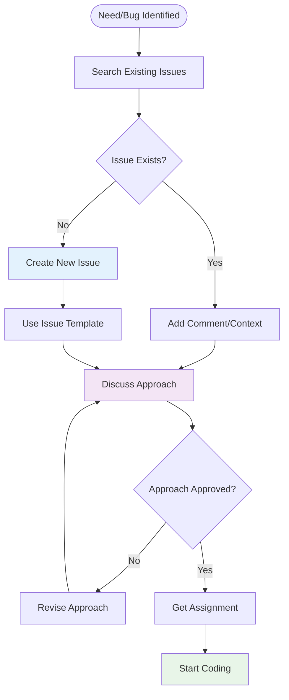
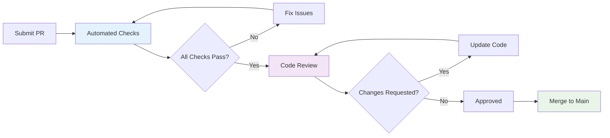

# Contributing Guidelines

Welcome to the OpenFrame OSS Library contributor community! This guide outlines our development standards, processes, and expectations for contributing to the project.

## Code of Conduct

We are committed to fostering an open and welcoming environment. By participating in this project, you agree to:

- **Be Respectful**: Treat all community members with respect and professionalism
- **Be Inclusive**: Welcome newcomers and help them become productive contributors
- **Be Collaborative**: Work together constructively and share knowledge
- **Be Patient**: Understand that everyone has different experience levels
- **Be Constructive**: Provide helpful feedback and suggestions for improvement

## Getting Started

### Prerequisites

Before contributing, ensure you have:

1. ✅ **Development Environment**: Follow the [Environment Setup](../setup/environment.md) guide
2. ✅ **Local Development**: Complete the [Local Development Setup](../setup/local-development.md)
3. ✅ **Architecture Understanding**: Read the [Architecture Overview](../architecture/overview.md)
4. ✅ **Testing Knowledge**: Understand our [Testing Strategy](../testing/overview.md)

### First-Time Contributors

If you're new to the project:

1. **Browse Open Issues**: Look for issues tagged with `good-first-issue` or `help-wanted`
2. **Start Small**: Begin with documentation improvements or simple bug fixes
3. **Ask Questions**: Don't hesitate to ask for clarification in issue comments
4. **Join Discussions**: Participate in design discussions and planning

## Contribution Workflow

### 1. Issue Creation and Discussion

Before writing code, create or find an issue:



#### Issue Templates

**Bug Report Template:**
```markdown
## Bug Description
Brief description of the bug

## Steps to Reproduce
1. Step one
2. Step two
3. Step three

## Expected Behavior
What should happen

## Actual Behavior
What actually happens

## Environment
- Java Version: 
- Library Version:
- OS: 

## Additional Context
Any other relevant information
```

**Feature Request Template:**
```markdown
## Feature Description
Clear description of the proposed feature

## Use Case
Why is this feature needed?

## Proposed Implementation
High-level approach (if you have ideas)

## Acceptance Criteria
- [ ] Criterion 1
- [ ] Criterion 2

## Additional Context
Related issues, external references, etc.
```

### 2. Branch Strategy

We follow a Git flow-inspired branching model:

```text
main                 ●─────●─────●─────●─────●
                      \     \     \     \     \
develop               ●─────●─────●─────●─────●
                       \     \           \
feature/add-filter      ●─────●─────●     \
                                     \     \
hotfix/critical-bug                   ●─────●
```

#### Branch Naming Convention

| Branch Type | Pattern | Example | Purpose |
|-------------|---------|---------|---------|
| **Feature** | `feature/short-description` | `feature/add-location-filter` | New features |
| **Bugfix** | `bugfix/short-description` | `bugfix/null-pointer-exception` | Bug fixes |
| **Hotfix** | `hotfix/short-description` | `hotfix/critical-security-fix` | Critical production fixes |
| **Documentation** | `docs/short-description` | `docs/update-getting-started` | Documentation updates |
| **Refactor** | `refactor/short-description` | `refactor/optimize-query-builder` | Code improvements |

#### Branch Creation Process

```bash
# 1. Start from latest main
git checkout main
git pull origin main

# 2. Create feature branch
git checkout -b feature/add-device-location-filter

# 3. Work on your changes
# ... make changes ...

# 4. Commit frequently with good messages
git add .
git commit -m "feat: add LocationFilterOption DTO"

# 5. Keep branch up to date
git checkout main
git pull origin main
git checkout feature/add-device-location-filter
git rebase main

# 6. Push when ready for review
git push -u origin feature/add-device-location-filter
```

### 3. Coding Standards

#### Java Code Style

**Class Structure:**
```java
package com.openframe.api.dto.device;

import lombok.AllArgsConstructor;
import lombok.Builder;
import lombok.Data;
import lombok.NoArgsConstructor;

import java.time.Instant;
import java.util.List;

/**
 * Represents location-based filtering options for devices.
 * 
 * <p>This DTO enables filtering devices by geographical location,
 * including region, country, and city levels.</p>
 * 
 * @since 1.1.0
 * @author Your Name
 */
@Data
@Builder
@NoArgsConstructor
@AllArgsConstructor
public class LocationFilterOption {
    
    /** The region identifier (e.g., "us-west", "eu-central") */
    private String region;
    
    /** The country code (ISO 3166-1 alpha-2) */
    private String country;
    
    /** The city name */
    private String city;
    
    /** Number of devices in this location */
    private Integer deviceCount;
    
    /** Last updated timestamp */
    private Instant lastUpdated;
}
```

#### Code Formatting Rules

**Indentation and Spacing:**
```java
// ✅ Correct formatting
public class ExampleClass {
    
    private static final String CONSTANT_VALUE = "example";
    
    public void methodName(String parameter, Integer count) {
        if (parameter != null && count > 0) {
            // Method body with 4-space indentation
            List<String> items = Arrays.asList(
                "item1",
                "item2",
                "item3"
            );
        }
    }
}

// ❌ Incorrect formatting
public class ExampleClass{
private static final String CONSTANT_VALUE="example";
public void methodName(String parameter,Integer count){
if(parameter!=null&&count>0){
List<String> items=Arrays.asList("item1","item2","item3");
}}}
```

**Naming Conventions:**
```java
// ✅ Good naming
public class DeviceLocationFilter {
    private String regionCode;
    private List<String> supportedCountries;
    
    public boolean isValidCountryCode(String countryCode) { }
    private void validateRegionConfiguration() { }
}

// ❌ Poor naming  
public class DLF {
    private String rc;
    private List<String> countries;
    
    public boolean valid(String cc) { }
    private void validate() { }
}
```

#### Documentation Standards

**Javadoc Requirements:**
```java
/**
 * Creates a new device filter for the specified location criteria.
 * 
 * <p>This method validates the location parameters and constructs
 * an appropriate filter instance for device queries.</p>
 * 
 * @param region the geographical region (must not be null)
 * @param country the country code in ISO 3166-1 alpha-2 format
 * @param city the city name (optional, can be null for country-level filtering)
 * @return a configured {@link LocationFilterOption} instance
 * @throws IllegalArgumentException if region is null or empty
 * @throws IllegalStateException if the location combination is invalid
 * 
 * @since 1.1.0
 * @see DeviceFilters#withLocation(LocationFilterOption)
 */
public static LocationFilterOption createLocationFilter(
        String region, 
        String country, 
        String city) {
    // Implementation
}
```

### 4. Commit Message Format

We follow the [Conventional Commits](https://www.conventionalcommits.org/) specification:

#### Commit Message Structure
```text
<type>[optional scope]: <description>

[optional body]

[optional footer(s)]
```

#### Commit Types

| Type | Purpose | Example |
|------|---------|---------|
| **feat** | New features | `feat: add location-based device filtering` |
| **fix** | Bug fixes | `fix: resolve null pointer in filter builder` |
| **docs** | Documentation changes | `docs: update API reference for new filters` |
| **style** | Code style changes | `style: fix indentation in DeviceFilters` |
| **refactor** | Code refactoring | `refactor: simplify filter composition logic` |
| **test** | Test additions/changes | `test: add coverage for filter edge cases` |
| **chore** | Maintenance tasks | `chore: update dependency versions` |

#### Good Commit Examples

```bash
# ✅ Good commits
git commit -m "feat(device): add LocationFilterOption DTO

- Add region, country, city fields
- Include device count and timestamp
- Add builder pattern with Lombok
- Include comprehensive Javadoc

Closes #123"

git commit -m "fix(audit): handle null timestamp in LogEvent

Previously caused NullPointerException when timestamp
was not provided. Now defaults to current time.

Fixes #456"

git commit -m "test: add serialization tests for new DTOs

- Test JSON round-trip for LocationFilterOption
- Verify field mapping and null handling
- Add test fixtures for complex scenarios"
```

#### Poor Commit Examples

```bash
# ❌ Poor commits
git commit -m "fix stuff"
git commit -m "WIP"
git commit -m "added new feature"
git commit -m "Update DeviceFilters.java"
```

### 5. Pull Request Process

#### Creating a Pull Request

**PR Title Format:**
```text
<type>(scope): brief description

Examples:
feat(device): add location-based filtering support
fix(audit): resolve timezone handling in LogEvent
docs(api): update filter usage examples
```

**PR Description Template:**
```markdown
## Description
Brief description of changes made

## Type of Change
- [ ] Bug fix (non-breaking change that fixes an issue)
- [ ] New feature (non-breaking change that adds functionality)
- [ ] Breaking change (fix or feature that causes existing functionality to change)
- [ ] Documentation update

## Changes Made
- Specific change 1
- Specific change 2
- Specific change 3

## Testing
- [ ] Unit tests pass locally
- [ ] Integration tests pass
- [ ] New tests added for new functionality
- [ ] Manual testing completed

## Documentation
- [ ] Code is self-documenting with clear naming
- [ ] Public APIs have Javadoc comments
- [ ] README updated if needed
- [ ] API documentation updated

## Breaking Changes
List any breaking changes and migration path

## Related Issues
- Closes #issue_number
- Related to #other_issue

## Checklist
- [ ] Code follows project style guidelines
- [ ] Self-review completed
- [ ] Code is well-commented
- [ ] Tests added/updated
- [ ] Documentation updated
- [ ] No merge conflicts
```

#### Review Process



**Automated Checks:**
- ✅ All tests pass
- ✅ Code coverage meets requirements (80%+)
- ✅ Code style compliance (Checkstyle)
- ✅ No security vulnerabilities (SpotBugs)
- ✅ Build succeeds on all supported Java versions

**Review Criteria:**
- **Functionality**: Does it work as intended?
- **Code Quality**: Is it readable, maintainable, and efficient?
- **Testing**: Are there adequate tests?
- **Documentation**: Is it properly documented?
- **Breaking Changes**: Are they necessary and well-documented?

#### Addressing Review Feedback

```bash
# 1. Address feedback in your branch
git checkout feature/add-location-filter

# 2. Make requested changes
# ... edit files ...

# 3. Commit changes
git add .
git commit -m "fix: address PR review feedback

- Rename ambiguous variable names
- Add input validation
- Improve error messages"

# 4. Push updates
git push origin feature/add-location-filter

# 5. Request re-review
# Comment on PR: "Ready for re-review"
```

### 6. Code Review Guidelines

#### For Review Authors

**Before Submitting:**
- [ ] Self-review your code
- [ ] Run full test suite locally
- [ ] Check for console errors/warnings
- [ ] Verify documentation is accurate
- [ ] Ensure commit messages follow conventions

**During Review:**
- Respond promptly to feedback
- Ask questions if feedback is unclear
- Make requested changes thoroughly
- Test changes before pushing updates

#### For Reviewers

**Review Focus Areas:**
1. **Correctness**: Does the code do what it's supposed to do?
2. **Security**: Are there any security implications?
3. **Performance**: Will this impact performance?
4. **Maintainability**: Is the code easy to understand and modify?
5. **Standards Compliance**: Does it follow project conventions?

**Providing Feedback:**
```markdown
# ✅ Good feedback
## Suggestion
Consider using `Optional<String>` for the `region` field to make the nullable intent clearer:

```java
private Optional<String> region;
```

This would eliminate null checks and make the API more explicit.

## Issue  
The validation logic in line 45 doesn't handle empty strings. This could cause issues downstream.

```java
// Current
if (region != null) { ... }

// Suggested
if (region != null && !region.trim().isEmpty()) { ... }
```

# ❌ Poor feedback
"This is wrong"
"Fix this"
"Doesn't work"
```

### 7. Release Process

#### Version Numbering

We follow [Semantic Versioning](https://semver.org/):

```text
MAJOR.MINOR.PATCH

Examples:
1.0.0 - Initial release
1.1.0 - New features, backward compatible
1.1.1 - Bug fixes, backward compatible
2.0.0 - Breaking changes
```

#### Release Checklist

```markdown
## Pre-Release
- [ ] All features complete and tested
- [ ] Documentation updated
- [ ] CHANGELOG.md updated
- [ ] Version numbers bumped
- [ ] Security review completed
- [ ] Performance testing completed

## Release
- [ ] Create release branch
- [ ] Final testing on release branch
- [ ] Tag release
- [ ] Build and publish artifacts
- [ ] Update main branch
- [ ] Create GitHub release

## Post-Release
- [ ] Announce release
- [ ] Update documentation sites
- [ ] Monitor for issues
- [ ] Plan next iteration
```

## Quality Assurance

### Definition of Done

A contribution is complete when:

- [ ] **Functionality**: Feature works as specified
- [ ] **Tests**: Adequate test coverage (>80%)
- [ ] **Documentation**: Public APIs documented
- [ ] **Review**: Code reviewed and approved
- [ ] **Integration**: Builds and tests pass
- [ ] **Standards**: Follows project conventions

### Continuous Improvement

We regularly review and update our processes:

- **Monthly**: Review contribution metrics and feedback
- **Quarterly**: Update tooling and dependencies  
- **Annually**: Major process improvements

## Getting Help

### Where to Ask Questions

| Type of Question | Where to Ask |
|------------------|--------------|
| **General Usage** | GitHub Discussions |
| **Bug Reports** | GitHub Issues |
| **Feature Requests** | GitHub Issues |
| **Contributing Help** | GitHub Discussions |
| **Security Issues** | security@openframe.com |

### Mentorship Program

New contributors can request mentorship:

1. Comment on a `good-first-issue` 
2. Mention you'd like guidance
3. A maintainer will provide support
4. Regular check-ins during development

## Recognition

We value all contributions and recognize contributors through:

- **Contributor Credits**: Listed in release notes
- **GitHub Achievements**: Badges for various contributions
- **Community Highlights**: Featured contributions in updates
- **Maintainer Path**: Outstanding contributors may be invited as maintainers

---

## Summary

Contributing to OpenFrame OSS Library involves:

1. **Understanding**: Learn the codebase and standards
2. **Planning**: Discuss changes before implementation  
3. **Development**: Follow coding standards and test thoroughly
4. **Review**: Participate constructively in code review
5. **Maintenance**: Support your contributions post-merge

**Ready to Contribute?** Start by exploring `good-first-issue` labels in our GitHub repository and join our contributor community!

---

**Questions?** Reach out in GitHub Discussions or comment on issues for guidance. We're here to help you succeed as a contributor.