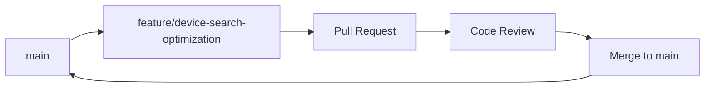
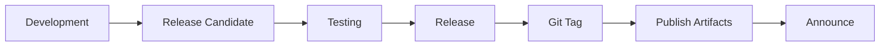

# Contributing Guidelines

Welcome to the OpenFrame OSS Library contributing guide! We're excited to have you contribute to making device management better for everyone. This guide covers everything you need to know about contributing to the project.

## Table of Contents

- [Code of Conduct](#code-of-conduct)
- [Getting Started](#getting-started)
- [Development Workflow](#development-workflow)
- [Coding Standards](#coding-standards)
- [Testing Requirements](#testing-requirements)
- [Documentation Standards](#documentation-standards)
- [Pull Request Process](#pull-request-process)
- [Issue Guidelines](#issue-guidelines)
- [Release Process](#release-process)

## Code of Conduct

### Our Commitment

We are committed to providing a welcoming, inclusive environment for all contributors, regardless of background, experience level, gender, gender identity and expression, sexual orientation, disability, personal appearance, body size, race, ethnicity, age, religion, or nationality.

### Expected Behavior

- **Be Respectful** - Treat everyone with respect and courtesy
- **Be Inclusive** - Welcome newcomers and help them succeed
- **Be Collaborative** - Share knowledge and work together
- **Be Professional** - Focus on constructive feedback and solutions
- **Be Patient** - Everyone is learning and growing

### Unacceptable Behavior

- Harassment, discrimination, or hate speech
- Personal attacks or inflammatory comments  
- Trolling, spamming, or disruptive behavior
- Sharing private information without consent
- Any behavior that would be inappropriate in a professional setting

## Getting Started

### Prerequisites for Contributors

Before contributing, ensure you have:

1. ✅ **Development Environment** - Set up per [Environment Setup Guide](../setup/environment.md)
2. ✅ **GitHub Account** - With 2FA enabled
3. ✅ **Git Configuration** - Proper name and email
4. ✅ **Code Editor** - With OpenFrame-specific configurations

### First-Time Contributor Setup

```bash
# 1. Fork the repository on GitHub
# Click "Fork" button on https://github.com/openframe/openframe-oss-lib

# 2. Clone your fork
git clone https://github.com/YOUR_USERNAME/openframe-oss-lib.git
cd openframe-oss-lib

# 3. Add upstream remote
git remote add upstream https://github.com/openframe/openframe-oss-lib.git

# 4. Verify remotes
git remote -v
# origin    https://github.com/YOUR_USERNAME/openframe-oss-lib.git (fetch)
# origin    https://github.com/YOUR_USERNAME/openframe-oss-lib.git (push)  
# upstream  https://github.com/openframe/openframe-oss-lib.git (fetch)
# upstream  https://github.com/openframe/openframe-oss-lib.git (push)

# 5. Install dependencies and verify build
./gradlew build
```

### Finding Issues to Work On

Great first contributions:

| Label | Description | Good For |
|-------|-------------|----------|
| `good first issue` | Well-scoped issues for new contributors | First-time contributors |
| `help wanted` | Issues that need community help | All levels |
| `bug` | Bug fixes needed | Developers familiar with codebase |
| `enhancement` | Feature requests | Experienced contributors |
| `documentation` | Documentation improvements | Technical writers |

**Find issues:** [GitHub Issues](https://github.com/openframe/openframe-oss-lib/issues?q=is%3Aissue+is%3Aopen+label%3A%22good+first+issue%22)

## Development Workflow

### Branch Strategy

We use **GitHub Flow** with feature branches:



### Creating Feature Branches

```bash
# 1. Start from latest main
git checkout main
git pull upstream main

# 2. Create feature branch
git checkout -b feature/your-feature-name

# Examples of good branch names:
git checkout -b feature/device-search-optimization
git checkout -b bugfix/pagination-cursor-encoding  
git checkout -b docs/contributing-guidelines
git checkout -b refactor/service-layer-cleanup
```

### Branch Naming Convention

| Type | Format | Example |
|------|--------|---------|
| **Features** | `feature/description` | `feature/device-health-monitoring` |
| **Bug Fixes** | `bugfix/description` | `bugfix/device-status-update-error` |
| **Documentation** | `docs/description` | `docs/api-documentation-update` |
| **Refactoring** | `refactor/description` | `refactor/repository-layer-cleanup` |
| **Testing** | `test/description` | `test/integration-test-coverage` |

### Making Changes

#### Development Process

1. **Write Tests First** (TDD approach)
   ```bash
   # Create failing test
   ./gradlew test --tests "DeviceServiceTest.shouldUpdateDeviceStatus"
   ```

2. **Implement Feature**
   ```bash
   # Make changes to make test pass
   # Run tests continuously
   ./gradlew --continuous test
   ```

3. **Verify All Tests Pass**
   ```bash
   # Run full test suite
   ./gradlew clean build
   ```

4. **Update Documentation**
   ```bash
   # Update relevant documentation
   # Add JavaDoc for public APIs
   ```

#### Commit Guidelines

**Commit Message Format:**

```text
type(scope): short description

Longer description explaining what changed and why.

Fixes #123
Closes #456
```

**Commit Types:**

| Type | Description | Example |
|------|-------------|---------|
| `feat` | New feature | `feat(device): add device health monitoring` |
| `fix` | Bug fix | `fix(pagination): correct cursor encoding issue` |
| `docs` | Documentation | `docs(api): add device search examples` |
| `test` | Adding tests | `test(device): add integration tests for search` |
| `refactor` | Code refactoring | `refactor(service): simplify device service layer` |
| `perf` | Performance improvement | `perf(query): optimize device search query` |
| `style` | Code style changes | `style(format): fix code formatting` |

**Good Commit Examples:**

```bash
git commit -m "feat(device): add device health monitoring

- Add DeviceHealth entity and DTOs
- Implement health check service
- Add REST endpoints for health monitoring
- Include comprehensive test coverage

Closes #234"

git commit -m "fix(pagination): correct cursor encoding for special characters

The cursor encoding was failing when device IDs contained special
characters like + or /. Updated to use URL-safe base64 encoding.

Fixes #345"
```

### Keeping Your Branch Updated

```bash
# Regularly sync with upstream
git fetch upstream
git checkout main
git merge upstream/main
git push origin main

# Rebase your feature branch
git checkout feature/your-feature-name
git rebase main

# Force push if needed (only on your branch!)
git push --force-with-lease origin feature/your-feature-name
```

## Coding Standards

### Java Code Style

We follow **Google Java Style** with OpenFrame-specific customizations.

#### Code Formatting

**IntelliJ IDEA Setup:**
```text
Settings → Editor → Code Style → Java
Import Scheme → Eclipse XML Profile → config/codestyle/openframe-java-style.xml
```

**Key Style Rules:**

| Rule | Example |
|------|---------|
| **Indentation** | 4 spaces, no tabs |
| **Line Length** | 120 characters maximum |
| **Braces** | Opening brace on same line |
| **Imports** | No wildcard imports, organized groups |
| **Naming** | camelCase for variables, PascalCase for classes |

#### Code Example

```java
@Service
@Transactional
@Slf4j
public class DeviceServiceImpl implements DeviceService {
    
    private final DeviceRepository deviceRepository;
    private final DeviceMapper deviceMapper;
    private final EventService eventService;
    
    public DeviceServiceImpl(DeviceRepository deviceRepository,
                           DeviceMapper deviceMapper,
                           EventService eventService) {
        this.deviceRepository = deviceRepository;
        this.deviceMapper = deviceMapper;
        this.eventService = eventService;
    }
    
    @Override
    public GenericQueryResult<DeviceResponse> searchDevices(DeviceFilterInput filter) {
        log.debug("Searching devices with filter: {}", filter);
        
        // Validate input
        validateSearchFilter(filter);
        
        // Convert to query filter
        DeviceQueryFilter queryFilter = deviceMapper.toQueryFilter(filter);
        
        // Execute search
        GenericQueryResult<Device> result = deviceRepository.findWithFilter(queryFilter);
        
        // Map to DTOs
        List<DeviceResponse> responses = result.getItems().stream()
            .map(deviceMapper::toResponseDTO)
            .collect(Collectors.toList());
        
        // Log event
        eventService.logDeviceSearch(filter, responses.size());
        
        return GenericQueryResult.<DeviceResponse>builder()
            .items(responses)
            .pageInfo(result.getPageInfo())
            .build();
    }
    
    private void validateSearchFilter(DeviceFilterInput filter) {
        if (filter.getPagination() == null) {
            throw new ValidationException("Pagination is required");
        }
        
        if (filter.getPagination().getFirst() != null 
            && filter.getPagination().getFirst() > 100) {
            throw new ValidationException("Page size cannot exceed 100");
        }
    }
}
```

### API Design Standards

#### REST Endpoint Design

**URL Patterns:**
```text
✅ Good:
POST /api/devices/search           # Search devices
GET  /api/devices/{id}            # Get specific device
PUT  /api/devices/{id}            # Update device
DELETE /api/devices/{id}          # Delete device

❌ Avoid:
GET /api/searchDevices            # Non-RESTful
POST /api/device/create           # Redundant 'create'
GET /api/devices/get/{id}         # Redundant 'get'
```

**Request/Response DTOs:**
```java
// Request DTOs - Input validation
@Data
@Builder
@NoArgsConstructor
@AllArgsConstructor
public class CreateDeviceRequest {
    
    @NotBlank(message = "Machine ID is required")
    private String machineId;
    
    @NotBlank(message = "Serial number is required")  
    @Size(max = 50, message = "Serial number cannot exceed 50 characters")
    private String serialNumber;
    
    @NotNull(message = "Device type is required")
    private DeviceType type;
    
    @Valid
    private DeviceConfiguration configuration;
}

// Response DTOs - Clean data transfer
@Data
@Builder
@NoArgsConstructor
@AllArgsConstructor
public class DeviceResponse {
    
    private String id;
    private String machineId;
    private String serialNumber;
    private String model;
    private String osVersion;
    private DeviceType type;
    private String status;
    private Instant lastCheckin;
    private Instant createdAt;
    private Instant updatedAt;
}
```

### Database Design Standards

#### Entity Design

```java
@Document(collection = "devices")
@Data
@Builder
@NoArgsConstructor
@AllArgsConstructor
@CompoundIndex(name = "org_status_idx", def = "{'organizationId': 1, 'status': 1}")
@CompoundIndex(name = "org_type_checkin_idx", def = "{'organizationId': 1, 'type': 1, 'lastCheckin': -1}")
public class Device {
    
    @Id
    private String id;
    
    @Indexed
    @NotNull
    private String organizationId;  // Tenant isolation
    
    @Indexed
    @NotNull
    private String machineId;
    
    @Indexed(unique = true)
    @NotBlank
    private String serialNumber;
    
    @NotBlank
    private String model;
    
    private String osVersion;
    
    @NotNull
    private DeviceType type;
    
    @Indexed
    private String status;
    
    private Instant lastCheckin;
    
    @Embedded
    private DeviceConfiguration configuration;
    
    @Embedded
    private DeviceHealth health;
    
    @CreatedDate
    private Instant createdAt;
    
    @LastModifiedDate
    private Instant updatedAt;
}
```

#### Index Strategy

```java
// Compound indexes for common queries
@CompoundIndex(def = "{'organizationId': 1, 'status': 1}")          // Filter by org + status
@CompoundIndex(def = "{'organizationId': 1, 'type': 1}")            // Filter by org + type  
@CompoundIndex(def = "{'organizationId': 1, 'lastCheckin': -1}")    // Sort by checkin time
@CompoundIndex(def = "{'serialNumber': 1}", unique = true)          // Unique constraint
```

## Testing Requirements

### Test Coverage Standards

- **Minimum Coverage**: 80% line coverage
- **Critical Path Coverage**: 100% for business logic
- **Integration Tests**: All repository and service layers
- **Unit Tests**: All public methods

### Test Categories

#### Unit Tests

```java
@ExtendWith(MockitoExtension.class)
@DisplayName("Device Service Tests")
class DeviceServiceImplTest {
    
    @Mock
    private DeviceRepository deviceRepository;
    
    @Mock
    private EventService eventService;
    
    @InjectMocks
    private DeviceServiceImpl deviceService;
    
    @Test
    @DisplayName("Should create device successfully")
    void shouldCreateDeviceSuccessfully() {
        // Given
        CreateDeviceRequest request = CreateDeviceRequest.builder()
            .machineId("machine-001")
            .serialNumber("SN123456789")
            .type(DeviceType.DESKTOP)
            .build();
        
        Device savedDevice = Device.builder()
            .id("device-001")
            .machineId("machine-001")
            .serialNumber("SN123456789")
            .type(DeviceType.DESKTOP)
            .build();
        
        when(deviceRepository.save(any(Device.class))).thenReturn(savedDevice);
        
        // When
        DeviceResponse response = deviceService.createDevice(request);
        
        // Then
        assertThat(response.getId()).isEqualTo("device-001");
        assertThat(response.getSerialNumber()).isEqualTo("SN123456789");
        
        verify(eventService).logDeviceCreated(any(Device.class));
    }
}
```

#### Integration Tests

```java
@SpringBootTest
@Testcontainers
@ActiveProfiles("test")
@DisplayName("Device Repository Integration Tests")
class DeviceRepositoryIntegrationTest {
    
    @Container
    static MongoDBContainer mongoDBContainer = new MongoDBContainer("mongo:7.0");
    
    @Autowired
    private DeviceRepository deviceRepository;
    
    @Test
    @DisplayName("Should support cursor-based pagination")
    void shouldSupportCursorBasedPagination() {
        // Given - Create test devices
        List<Device> devices = createTestDevices(20);
        deviceRepository.saveAll(devices);
        
        // When - Get first page
        CursorPaginationInput pagination = CursorPaginationInput.builder()
            .first(5)
            .build();
        
        GenericQueryResult<Device> firstPage = deviceRepository.findWithPagination(pagination);
        
        // Then
        assertThat(firstPage.getItems()).hasSize(5);
        assertThat(firstPage.getPageInfo().isHasNextPage()).isTrue();
        
        // When - Get second page
        CursorPaginationInput nextPagination = CursorPaginationInput.builder()
            .first(5)  
            .after(firstPage.getPageInfo().getEndCursor())
            .build();
        
        GenericQueryResult<Device> secondPage = deviceRepository.findWithPagination(nextPagination);
        
        // Then
        assertThat(secondPage.getItems()).hasSize(5);
        assertThat(secondPage.getPageInfo().isHasPreviousPage()).isTrue();
    }
}
```

### Test Data Management

```java
public class DeviceTestDataBuilder {
    
    public static Device.DeviceBuilder aDevice() {
        return Device.builder()
            .id(UUID.randomUUID().toString())
            .organizationId("test-org-" + System.currentTimeMillis())
            .machineId("machine-" + System.currentTimeMillis())
            .serialNumber("SN" + System.currentTimeMillis())
            .model("Test Device Model")
            .osVersion("Test OS 1.0")
            .type(DeviceType.DESKTOP)
            .status("ACTIVE")
            .lastCheckin(Instant.now())
            .createdAt(Instant.now())
            .updatedAt(Instant.now());
    }
    
    public static Device activeDesktop() {
        return aDevice()
            .type(DeviceType.DESKTOP)
            .status("ACTIVE")
            .build();
    }
    
    public static Device offlineLaptop() {
        return aDevice()
            .type(DeviceType.LAPTOP)
            .status("OFFLINE")
            .lastCheckin(Instant.now().minus(1, ChronoUnit.HOURS))
            .build();
    }
}
```

## Documentation Standards

### JavaDoc Requirements

All public APIs must have comprehensive JavaDoc:

```java
/**
 * Service for managing device operations including creation, updates, and search functionality.
 * 
 * <p>This service provides a high-level interface for device management operations,
 * including validation, business logic, and integration with external systems.</p>
 * 
 * <h3>Usage Example:</h3>
 * <pre>{@code
 * DeviceFilterInput filter = DeviceFilterInput.builder()
 *     .types(List.of("DESKTOP", "LAPTOP"))
 *     .organizationId("org-123")
 *     .pagination(CursorPaginationInput.builder().first(20).build())
 *     .build();
 * 
 * GenericQueryResult<DeviceResponse> result = deviceService.searchDevices(filter);
 * }</pre>
 *
 * @author OpenFrame Team
 * @since 1.0.0
 * @see DeviceRepository
 * @see DeviceMapper
 */
public interface DeviceService {
    
    /**
     * Searches for devices based on the provided filter criteria.
     *
     * <p>This method supports filtering by device type, status, organization,
     * and includes cursor-based pagination for efficient large dataset handling.</p>
     *
     * @param filter the search criteria including type filters, organization scope,
     *               and pagination parameters
     * @return a paginated result containing matching devices and pagination metadata
     * @throws ValidationException if the filter criteria are invalid
     * @throws TenantViolationException if attempting to access devices outside
     *                                  the current tenant scope
     * @since 1.0.0
     */
    GenericQueryResult<DeviceResponse> searchDevices(DeviceFilterInput filter);
}
```

### Code Comments

```java
public class DeviceServiceImpl implements DeviceService {
    
    @Override
    public GenericQueryResult<DeviceResponse> searchDevices(DeviceFilterInput filter) {
        // Validate input parameters to ensure data integrity
        validateSearchFilter(filter);
        
        // Convert API DTO to internal query format for repository layer
        DeviceQueryFilter queryFilter = deviceMapper.toQueryFilter(filter);
        
        // Execute database query with tenant-scoped filtering
        GenericQueryResult<Device> result = deviceRepository.findWithFilter(queryFilter);
        
        // Transform internal entities to API response DTOs
        List<DeviceResponse> responses = result.getItems().stream()
            .map(deviceMapper::toResponseDTO)
            .collect(Collectors.toList());
        
        // Create audit trail for compliance and debugging
        eventService.logDeviceSearch(filter, responses.size());
        
        // Return paginated result with metadata for client-side pagination
        return GenericQueryResult.<DeviceResponse>builder()
            .items(responses)
            .pageInfo(result.getPageInfo())
            .build();
    }
}
```

### README and Documentation Updates

When adding new features, update relevant documentation:

1. **API Documentation** - Update OpenAPI specs
2. **README Files** - Update module-specific READMEs  
3. **User Guides** - Update getting started guides
4. **Examples** - Add usage examples
5. **Migration Guides** - For breaking changes

## Pull Request Process

### Before Submitting

**Pre-submission Checklist:**

- [ ] ✅ Code follows style guidelines
- [ ] ✅ All tests pass locally
- [ ] ✅ New tests added for new functionality
- [ ] ✅ Documentation updated
- [ ] ✅ No merge conflicts with main
- [ ] ✅ Commit messages follow convention
- [ ] ✅ Changes are focused and atomic

### Creating Pull Request

```bash
# 1. Push your branch
git push origin feature/your-feature-name

# 2. Create pull request on GitHub
# Use the GitHub web interface or CLI:
gh pr create --title "feat(device): add health monitoring" \
             --body "Adds comprehensive device health monitoring with real-time status updates"
```

### PR Template

```markdown
## Description
Brief description of changes made.

## Type of Change
- [ ] 🐛 Bug fix (non-breaking change that fixes an issue)
- [ ] ✨ New feature (non-breaking change that adds functionality)
- [ ] 💥 Breaking change (fix or feature that would cause existing functionality to not work as expected)
- [ ] 📚 Documentation update

## Testing
- [ ] Unit tests pass
- [ ] Integration tests pass
- [ ] Manual testing completed

## Documentation
- [ ] Code comments updated
- [ ] JavaDoc updated for public APIs
- [ ] User documentation updated
- [ ] Examples added/updated

## Checklist
- [ ] My code follows the style guidelines
- [ ] I have performed a self-review
- [ ] I have commented my code, particularly in hard-to-understand areas
- [ ] I have made corresponding changes to the documentation
- [ ] My changes generate no new warnings
- [ ] I have added tests that prove my fix is effective or that my feature works

## Related Issues
Fixes #123
Closes #456
```

### Review Process

#### For Contributors

1. **Address Feedback** - Respond to all review comments
2. **Make Changes** - Update code based on feedback
3. **Request Re-review** - When ready for another review
4. **Stay Engaged** - Respond promptly to reviewer questions

#### For Reviewers

**Review Checklist:**

- [ ] ✅ Code quality and style
- [ ] ✅ Test coverage and quality  
- [ ] ✅ Documentation completeness
- [ ] ✅ API design consistency
- [ ] ✅ Performance considerations
- [ ] ✅ Security implications

**Review Feedback Examples:**

```markdown
# ✅ Good feedback - Specific and actionable
"Consider using Optional.ofNullable() here to handle potential null values more elegantly. This would make the code more robust and follow our null-safety guidelines."

# ✅ Good feedback - Explains reasoning  
"This method is getting quite long. Consider extracting the validation logic into a separate private method for better readability and testability."

# ❌ Avoid vague feedback
"This looks wrong"

# ❌ Avoid unconstructive criticism
"This is terrible code"
```

## Issue Guidelines

### Creating Quality Issues

#### Bug Reports

**Bug Report Template:**

```markdown
## Bug Description
Clear description of the issue.

## Steps to Reproduce
1. Step 1
2. Step 2  
3. Step 3

## Expected Behavior
What should happen.

## Actual Behavior
What actually happens.

## Environment
- OpenFrame Version: 1.2.0
- Java Version: 17.0.7
- OS: Ubuntu 22.04
- Database: MongoDB 7.0

## Additional Context
Screenshots, logs, or other relevant information.
```

#### Feature Requests

**Feature Request Template:**

```markdown
## Feature Description
Clear description of the proposed feature.

## Problem Statement
What problem does this solve?

## Proposed Solution
How should this feature work?

## Alternatives Considered
Other solutions you've considered.

## Additional Context
Use cases, mockups, or other relevant information.
```

### Issue Labels

| Label | Description | Usage |
|-------|-------------|--------|
| `bug` | Something isn't working | Bug reports |
| `enhancement` | New feature or request | Feature requests |
| `good first issue` | Good for newcomers | Beginner-friendly issues |
| `help wanted` | Extra attention needed | Community help needed |
| `question` | Further information requested | Q&A and support |
| `documentation` | Documentation improvements | Doc updates |
| `duplicate` | This issue already exists | Duplicate issues |
| `wontfix` | This will not be worked on | Rejected issues |

## Release Process

### Semantic Versioning

We follow [Semantic Versioning (SemVer)](https://semver.org/):

```text
MAJOR.MINOR.PATCH

MAJOR: Breaking changes
MINOR: New features (backward compatible)  
PATCH: Bug fixes (backward compatible)

Examples:
1.0.0 → 1.0.1 (bug fix)
1.0.1 → 1.1.0 (new feature)
1.1.0 → 2.0.0 (breaking change)
```

### Release Workflow



### Release Checklist

**Pre-Release:**
- [ ] All tests passing
- [ ] Documentation updated  
- [ ] Changelog updated
- [ ] Version numbers updated
- [ ] Breaking changes documented

**Release:**
- [ ] Create release branch
- [ ] Final testing
- [ ] Create Git tag
- [ ] Publish artifacts
- [ ] Update documentation site

**Post-Release:**
- [ ] Announce release
- [ ] Update examples
- [ ] Plan next release

## Getting Help

### Community Channels

- 💬 **[GitHub Discussions](https://github.com/openframe/openframe-oss-lib/discussions)** - Q&A and general discussion
- 🐛 **[GitHub Issues](https://github.com/openframe/openframe-oss-lib/issues)** - Bug reports and feature requests
- 📧 **[Mailing List](mailto:dev@openframe.io)** - Developer discussions
- 💡 **[Feature Requests](https://github.com/openframe/openframe-oss-lib/discussions/categories/ideas)** - Propose new features

### Mentorship Program

New contributors can request a mentor:

1. **Comment on Issue** - "@openframe/mentors please assign a mentor"
2. **Get Matched** - Mentor will reach out within 48 hours
3. **One-on-One Support** - Regular check-ins and guidance
4. **Gradual Independence** - Learn to contribute independently

### Office Hours

**Weekly Office Hours:**
- **When**: Thursdays 2:00 PM UTC
- **Where**: GitHub Discussions Live Chat
- **Format**: Open Q&A and code reviews
- **Who**: Core team and experienced contributors

## Recognition

### Contributor Recognition

We recognize contributions in multiple ways:

- 🏆 **Hall of Fame** - Top contributors featured on website
- 🎖️ **Badges** - GitHub profile badges for contributors  
- 📰 **Blog Posts** - Feature contributor stories
- 🎁 **Swag** - OpenFrame swag for regular contributors
- 🎤 **Speaking Opportunities** - Conference speaking invitations

### Types of Contributions

We value all types of contributions:

| Contribution Type | Examples | Recognition |
|-------------------|----------|-------------|
| **Code** | Features, bug fixes, optimizations | Commit attribution, changelog |
| **Documentation** | Guides, examples, API docs | Author bylines |
| **Testing** | Test coverage, test automation | Quality champion badge |
| **Design** | UI/UX, architecture | Design contributor badge |
| **Community** | Mentoring, support, advocacy | Community leader badge |

## Thank You!

Contributing to open source is about more than just code - it's about building something amazing together. Every contribution, whether it's a bug fix, documentation improvement, or helping other contributors, makes OpenFrame better for everyone.

We're grateful for your time and effort, and we're here to help you succeed. Welcome to the OpenFrame community! 🚀

---

## Quick Links

- 📖 **[Development Setup](../setup/environment.md)** - Get your environment ready
- 🧪 **[Testing Guide](../testing/overview.md)** - Write great tests
- 🏗️ **[Architecture Guide](../architecture/overview.md)** - Understand the system
- 🚀 **[Getting Started](../../getting-started/introduction.md)** - Start using OpenFrame

**Questions?** Don't hesitate to ask in [GitHub Discussions](https://github.com/openframe/openframe-oss-lib/discussions) - we're here to help!